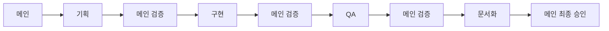

# 워크플로우 관리

이 Skill은 메인 에이전트가 선택한 워크플로우를 실행하고 관리하는 방법을 제공합니다.

## 워크플로우 패턴 5가지

### 패턴 1: Feature (새 기능)



**단계별 행동**:

#### 1. 기획 에이전트 호출
```markdown
작업: 사용자 인증 API 설계

요구사항:
- 엔드포인트: POST /api/auth/login, POST /api/auth/logout
- 인증 방식: JWT
- 응답 형식: JSON
- 에러 처리: 401, 403 구분

참고 문서:
- AGENTS.md의 API 설계 섹션
- .agents/skills/planner/references/api-design.md

완료 조건:
- [ ] 요구사항 문서 작성
- [ ] API 스펙 정의
- [ ] 데이터 모델 설계
```

#### 2. 메인 검증 (기획 후)
```markdown
체크:
- [ ] 요구사항 명확
- [ ] API 설계 RESTful 준수
- [ ] 기존 시스템과 일관성

→ 통과 시: 구현 단계로
→ 실패 시: 기획 에이전트에게 수정 요청
```

#### 3. 구현 에이전트 호출
```markdown
작업: [기획 문서]에 따라 코드 구현

입력:
- 기획 문서
- 기존 코드베이스 정보

참고 문서:
- AGENTS.md
- .agents/skills/developer/references/code-implementation.md

완료 조건:
- [ ] Linter 오류 0개
- [ ] 변수명 snake_case
- [ ] 함수명 camelCase
- [ ] 에러 처리 포함
```

#### 4. 메인 검증 (구현 후)
```markdown
체크:
- [ ] Linter 오류 0개 (필수)
- [ ] 설계와 일치
- [ ] 코딩 컨벤션 준수

→ 통과 시: QA 단계로
→ 실패 시: 구현 에이전트에게 수정 요청
```

#### 5. QA 에이전트 호출
```markdown
작업: 테스트 작성 및 실행

입력:
- 구현된 코드
- 요구사항 문서

참고 문서:
- .agents/skills/qa/references/test-strategy.md
- .agents/skills/qa/references/coverage-check.md

완료 조건:
- [ ] 단위 테스트 작성
- [ ] 통합 테스트 작성 (필요 시)
- [ ] 모든 테스트 통과
- [ ] 커버리지 80% 이상
```

#### 6. 메인 검증 (QA 후)
```markdown
체크:
- [ ] 모든 테스트 통과 (필수)
- [ ] 커버리지 80% 이상
- [ ] 에지 케이스 테스트 포함

→ 통과 시: 문서화 단계로
→ 실패 시: 구현/QA 에이전트에게 수정 요청
```

#### 7. 문서화 에이전트 호출
```markdown
작업: 코드 문서화

입력:
- 구현된 코드
- API 스펙

참고 문서:
- .agents/skills/docs-agent/references/code-documentation.md
- .agents/skills/docs-agent/references/readme-maintenance.md

완료 조건:
- [ ] JSDoc/TSDoc 작성 (Public API)
- [ ] README 업데이트 (필요 시)
- [ ] CHANGELOG 작성 (버전 변경 시)
```

#### 8. 메인 최종 승인
```markdown
체크:
- [ ] 사용자 요청 완전히 충족
- [ ] 모든 품질 게이트 통과
- [ ] 부작용 없음
- [ ] 프로젝트 컨벤션 준수

→ 승인: 사용자에게 완료 보고
→ 거부: 해당 단계로 돌아가서 수정
```

---

### 패턴 2: Bugfix (버그 수정)


**특징**:
- 기획 단계 생략
- QA가 먼저 버그 재현
- 빠른 수정에 집중

**단계별 행동**:

#### 1. QA 에이전트 호출 (재현)
```markdown
작업: 버그 재현 및 원인 분석

버그 설명:
[사용자 설명]

완료 조건:
- [ ] 버그 재현 성공
- [ ] 재현 테스트 작성
- [ ] 원인 분석
```

#### 2. 구현 에이전트 호출
```markdown
작업: 버그 수정

입력:
- 버그 재현 테스트
- 원인 분석

완료 조건:
- [ ] 버그 수정
- [ ] 재현 테스트 통과
- [ ] Linter 오류 0개
```

#### 3. QA 에이전트 호출 (검증)
```markdown
작업: 버그 수정 검증 및 회귀 테스트

완료 조건:
- [ ] 재현 테스트 통과
- [ ] 회귀 테스트 통과
- [ ] 추가 테스트 작성 (필요 시)
```

---

### 패턴 3: Refactor (리팩토링)


**특징**:
- 영향 분석 중요
- 회귀 테스트 필수
- 성능 측정

**단계별 행동**:

#### 1. 기획 에이전트 호출 (영향 분석)
```markdown
작업: 리팩토링 영향 범위 분석

입력:
- 리팩토링 대상 코드
- 의존성 정보

완료 조건:
- [ ] 영향 받는 파일 목록
- [ ] 리팩토링 전략
- [ ] 예상 위험 요소
```

#### 2. 구현 에이전트 호출
```markdown
작업: 리팩토링 실행

참고 문서:
- .agents/skills/developer/references/refactoring-patterns.md

완료 조건:
- [ ] 기능 변경 없음
- [ ] 코드 품질 향상
- [ ] 성능 저하 10% 이내
```

#### 3. QA 에이전트 호출 (회귀 테스트)
```markdown
작업: 회귀 테스트 실행

완료 조건:
- [ ] 모든 기존 테스트 통과 (필수)
- [ ] 새 테스트 추가 (필요 시)
- [ ] 성능 측정 및 비교
```

---

### 패턴 4: Docs (문서)


**특징**:
- 가장 간단
- 코드 변경 없음
- 빠른 완료

**단계별 행동**:

#### 1. 문서화 에이전트 호출
```markdown
작업: [문서 작성/수정]

입력:
- 대상 코드/API
- 기존 문서

완료 조건:
- [ ] 요청한 문서 작성
- [ ] 형식 일관성
- [ ] 내용 정확성
```

---

### 패턴 5: Hotfix (긴급)


**특징**:
- 속도 최우선
- 최소한의 테스트
- 문서화는 사후

**단계별 행동**:

#### 1. 구현 에이전트 호출
```markdown
작업: 긴급 수정

입력:
- 문제 설명
- 예상 원인

완료 조건:
- [ ] 핫픽스 구현
- [ ] Linter 오류 0개
- [ ] 기본 동작 확인
```

#### 2. QA 에이전트 호출 (최소)
```markdown
작업: 기본 테스트만 실행

완료 조건:
- [ ] 핫픽스 기능 테스트
- [ ] 크리티컬 경로 테스트
```

#### 3. 문서화 예정
```markdown
나중에:
- [ ] TODO: 문서화 필요
- [ ] TODO: 전체 테스트 추가
```

---

## 워크플로우 실행 체크리스트

### 시작 전
- [ ] 태스크 유형 정확히 분류
- [ ] 적절한 워크플로우 선택
- [ ] 필요한 컨텍스트 준비

### 실행 중
- [ ] 각 단계 완료 후 검증
- [ ] 품질 게이트 통과 확인
- [ ] 실패 시 즉시 피드백

### 완료 후
- [ ] 최종 승인 기준 확인
- [ ] 사용자에게 보고
- [ ] 변경 사항 요약

---

## 완료 기준

- [ ] 올바른 워크플로우 실행
- [ ] 모든 단계 검증 완료
- [ ] 품질 게이트 통과
- [ ] 최종 승인 완료
