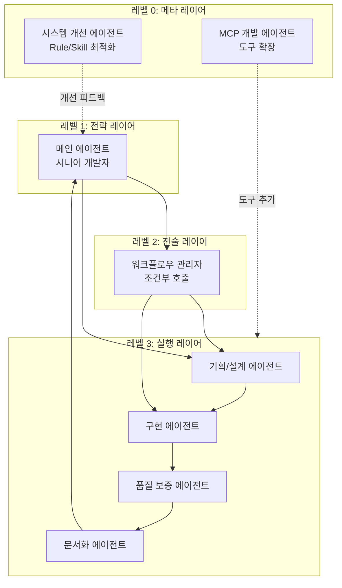
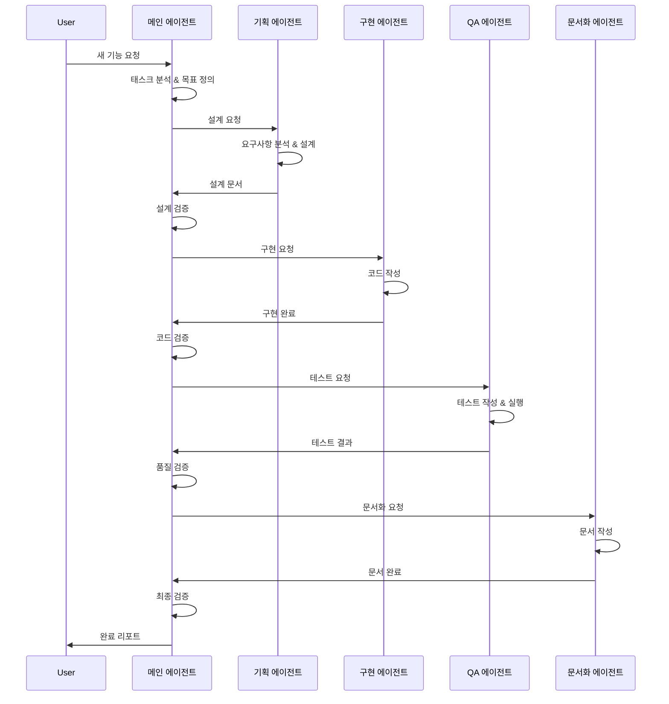
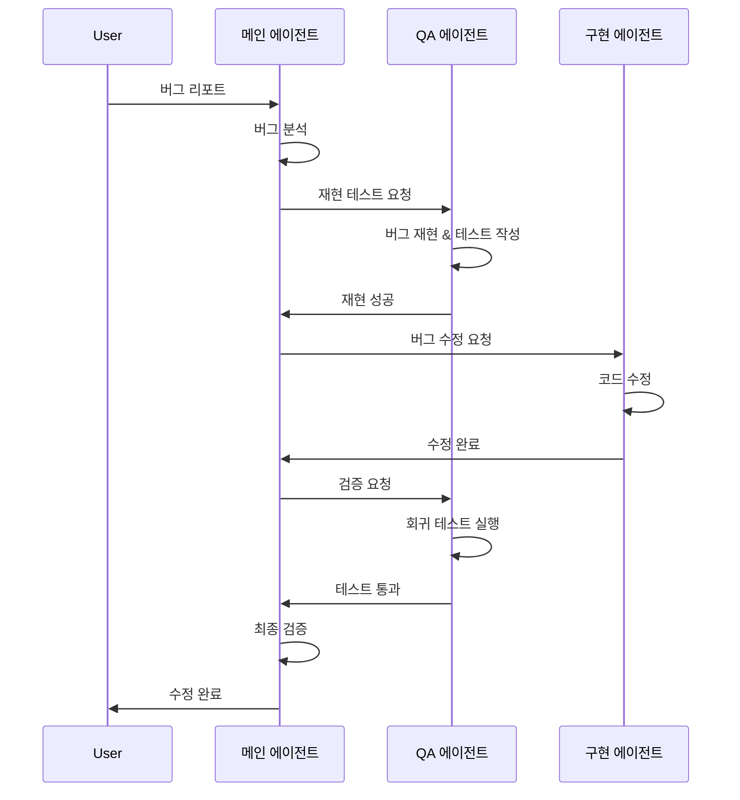
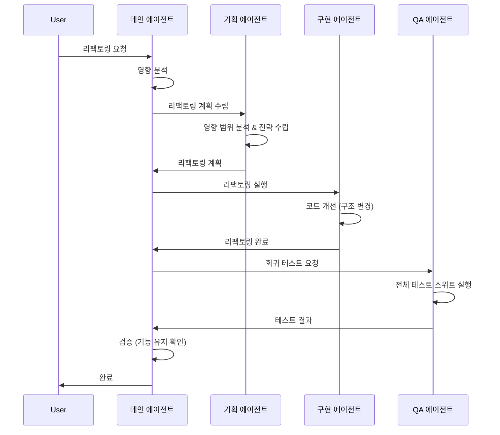
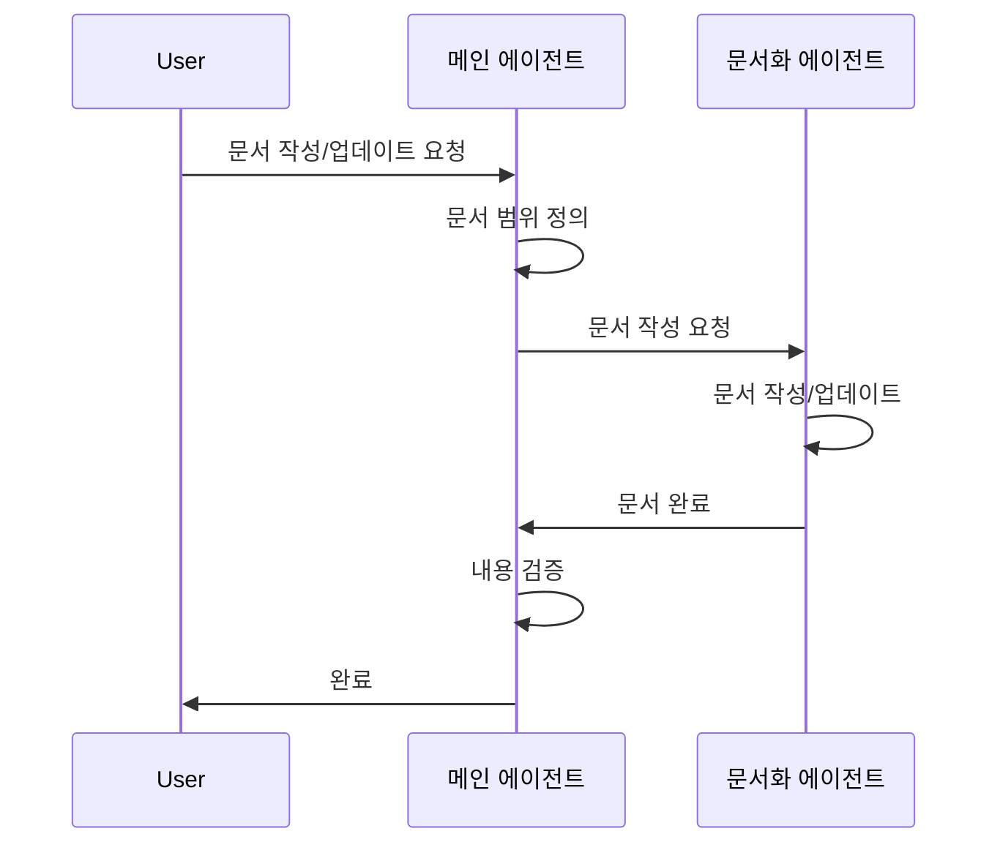
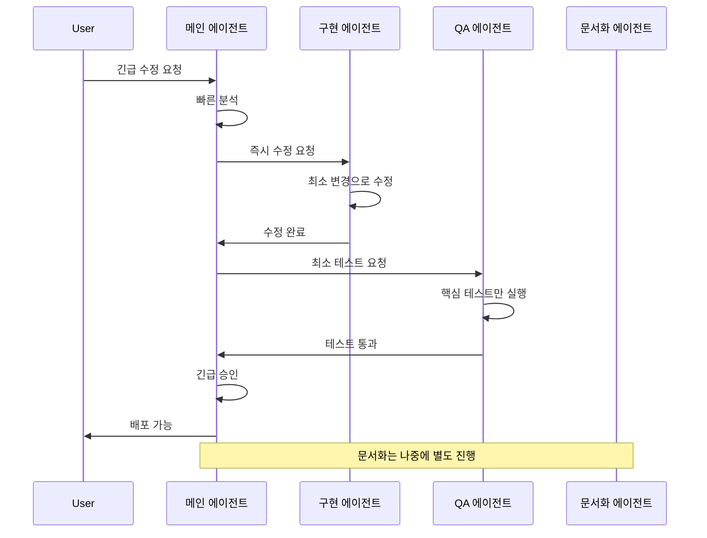
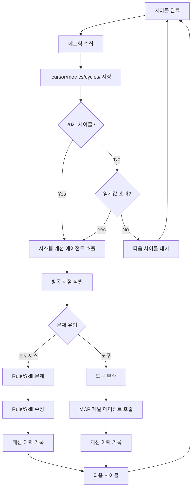
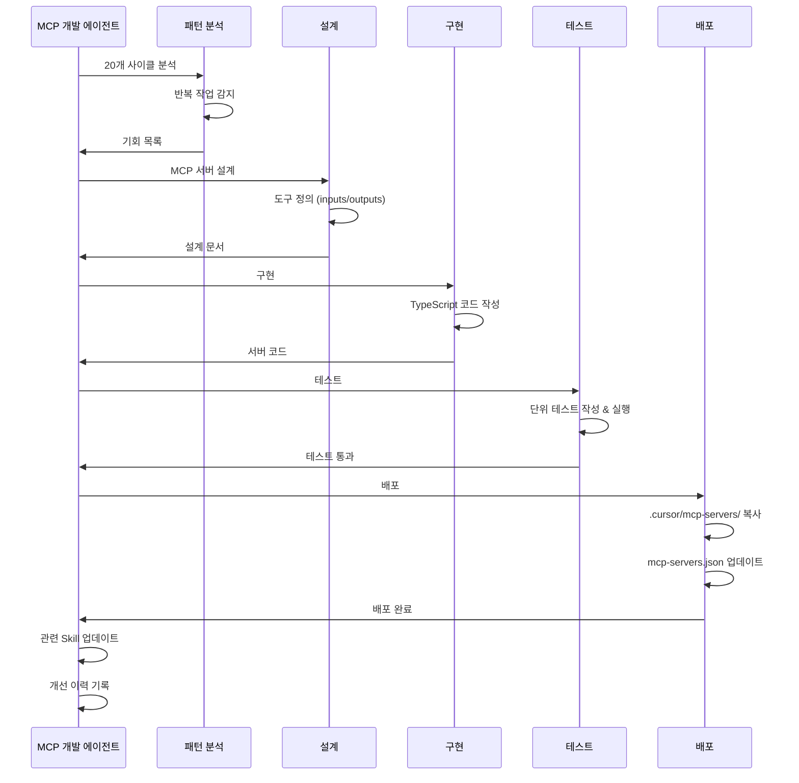
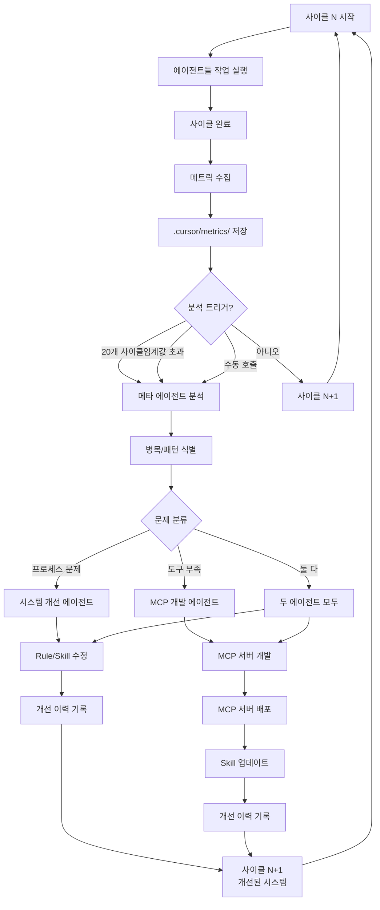
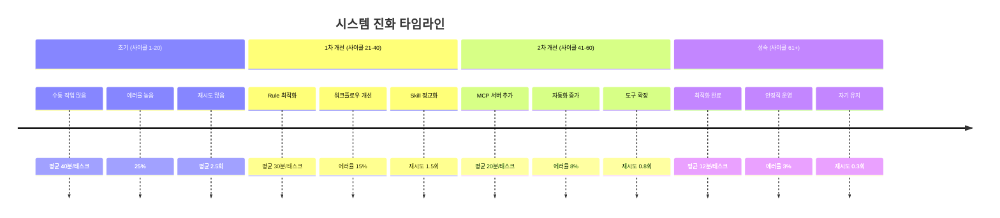

# 자기 진화 멀티 에이전트 시스템 설계

## 목차

1. [시스템 개요](#시스템-개요)
2. [전체 아키텍처](#전체-아키텍처)
3. [에이전트 상세 정의](#에이전트-상세-정의)
4. [워크플로우 패턴](#워크플로우-패턴)
5. [Rule vs Skill vs AGENTS.md](#rule-vs-skill-vs-agentsmd)
6. [메타 에이전트 시스템](#메타-에이전트-시스템)
7. [자기 진화 사이클](#자기-진화-사이클)

---

## 시스템 개요

### 목표

복잡한 소프트웨어 개발 태스크를 자동으로 분해하고 실행하며, **스스로 성능을 측정하고 개선하는** 멀티 에이전트 시스템을 구축합니다.

### 핵심 특징

- **계층적 구조**: 4계층으로 분리된 명확한 책임
- **자기 개선**: 시스템 개선 에이전트가 Rule/Skill을 자동으로 최적화
- **자기 확장**: MCP 개발 에이전트가 필요한 도구를 자동으로 개발
- **조건부 조율**: 복잡도에 따라 워크플로우 관리자 선택적 활용
- **메트릭 기반**: 데이터 중심의 의사결정 및 개선

### 설계 원칙

1. **가정 없음**: 모든 판단은 실제 데이터와 코드 분석 기반
2. **점진적 개선**: 사이클마다 누적되는 학습
3. **명확한 분리**: 각 에이전트는 단일 책임
4. **재사용 가능**: Skill 기반 모듈화
5. **측정 가능**: 모든 작업은 메트릭 생성

---

## 전체 아키텍처

### 계층 구조



### 레이어별 책임

#### 레벨 0: 메타 레이어
- **목적**: 시스템 자체를 관찰하고 개선
- **작동**: 백그라운드에서 메트릭 수집 및 분석
- **개입**: 20개 사이클마다 또는 임계값 초과 시

#### 레벨 1: 전략 레이어
- **목적**: 목표 정의 및 최종 품질 승인
- **작동**: 사용자 요청 분석 및 워크플로우 결정
- **판단**: WHAT (무엇을 할지)

#### 레벨 2: 전술 레이어
- **목적**: 복잡한 멀티 태스크 조율
- **작동**: 5개 이상 파일 작업 시 활성화
- **판단**: HOW (어떻게 할지)

#### 레벨 3: 실행 레이어
- **목적**: 실제 작업 수행
- **작동**: 각 전문 영역별로 독립적 실행
- **판단**: DO (실행)

---

## 에이전트 상세 정의

### 1. 메인 에이전트 (시니어 개발자)

**역할:**
- 사용자 요청 분석 및 목표 정의
- 품질 기준 설정
- 워크플로우 패턴 선택
- 최종 검증 및 승인

**입력:**
- 사용자 요청
- 프로젝트 컨텍스트
- 이전 사이클 결과

**출력:**
- 작업 목표 정의
- 품질 기준
- 선택된 워크플로우
- 최종 승인/거부

**사용 Rule:**
- `main-orchestrator.mdc`: 태스크 분류 기준, 워크플로우 선택 로직, 품질 게이트 기준

**사용 Skill:**
- `orchestrator/references/task-classifier.md`: 태스크 유형 분류 (새 기능/버그/리팩토링 등)
- `orchestrator/references/workflow-manager.md`: 최적 워크플로우 선택
- `orchestrator/references/quality-gate.md`: 최종 품질 검증 체크리스트
- `orchestrator/references/workflow-orchestration.md`: 단순 조율 vs 관리자 호출 판단

**특징:**
- 유일하게 Rule을 사용하는 에이전트
- 모든 워크플로우의 시작과 끝

---

### 2. 워크플로우 관리자 (오케스트레이터)

**역할:**
- 복잡한 멀티 태스크 분해 및 조율
- 서브에이전트 선택 및 호출 순서 결정
- 의존성 관리 및 병렬 실행 최적화
- 진행 상황 모니터링

**호출 조건:**
- 5개 이상 파일 동시 작업
- 3개 이상 서브에이전트 병렬 실행 필요
- 복잡한 의존성 관리 필요
- 장시간 실행 예상 작업 (30분+)

**입력:**
- 메인 에이전트의 목표 정의
- 프로젝트 컨텍스트
- 사용 가능한 서브에이전트 목록

**출력:**
- 작업 분해 계획
- 에이전트 할당 및 실행 순서
- 진행 상황 리포트

**사용 Skill:**
- `orchestrator/references/task-decomposition.md`: 작업 분해 전략
- `orchestrator/references/agent-selection.md`: 에이전트 선택 기준
- `orchestrator/references/workflow-orchestration.md`: 조율 프로토콜
- `orchestrator/references/dependency-management.md`: 의존성 관리
- `orchestrator/references/parallel-execution.md`: 병렬 실행 전략
- `orchestrator/references/progress-monitoring.md`: 진행 추적

**특징:**
- 조건부로만 호출됨
- 복잡한 작업의 성능 최적화 담당

---

### 3. 기획/설계 에이전트

**역할:**
- 요구사항 분석 및 문서화
- 시스템 아키텍처 설계
- API 설계 (RESTful/GraphQL)
- 기술 스택 선정 및 정당화
- 데이터 모델 설계

**입력:**
- 목표 정의
- 기존 시스템 구조
- 기술적 제약사항

**출력:**
- 요구사항 문서
- 아키텍처 다이어그램
- API 스펙
- 기술 스택 선정 이유
- 구현 가이드라인

**사용 Skill:**
- `planner/references/requirement-analysis.md`: 요구사항 추출 및 문서화
- `planner/references/architecture-design.md`: 아키텍처 패턴 및 설계 원칙
- `planner/references/api-design.md`: API 설계 가이드
- `planner/references/tech-stack-selection.md`: 기술 선정 기준
- `planner/references/data-modeling.md`: 데이터 모델 설계

**특징:**
- 구현 전 설계 단계 담당
- 기술적 의사결정 문서화

---

### 4. 구현 에이전트

**역할:**
- 설계에 따른 코드 작성
- 리팩토링 수행
- 의존성 관리
- 코드 컨벤션 준수
- 테스트 가능한 코드 작성

**입력:**
- 설계 문서
- 구현 가이드라인
- 기존 코드베이스

**출력:**
- 작성된 코드
- 리팩토링된 코드
- 업데이트된 의존성

**사용 Skill:**
- `developer/references/code-implementation.md`: 구현 체크리스트
- `developer/references/refactoring-patterns.md`: 리팩토링 패턴 카탈로그
- `developer/references/dependency-management.md`: 패키지 관리 원칙
- `developer/references/testable-code.md`: 테스트 가능한 코드 작성법
- `developer/references/error-handling.md`: 에러 처리 패턴

**컨벤션:**
- 변수명: `snake_case`
- 함수명: `camelCase`
- 모든 linter 오류 즉시 해결
- 파일 읽기 전 필요한 부분만 식별

**특징:**
- 가장 많은 코드 변경 수행
- QA 에이전트와 긴밀한 협업

---

### 5. 품질 보증 에이전트

**역할:**
- 코드 리뷰 수행
- 단위 테스트 작성 및 실행
- 통합 테스트 작성 및 실행
- E2E 테스트 작성 및 실행
- 커버리지 체크
- 성능 검증

**입력:**
- 구현된 코드
- 테스트 요구사항
- 품질 기준

**출력:**
- 코드 리뷰 결과
- 테스트 코드
- 테스트 결과 리포트
- 커버리지 리포트
- 성능 측정 결과

**사용 Skill:**
- `qa/references/code-review.md`: 리뷰 체크리스트 (보안, 성능, 가독성)
- `qa/references/test-strategy.md`: 테스트 유형별 전략
- `qa/references/unit-testing.md`: 단위 테스트 작성법
- `qa/references/integration-testing.md`: 통합 테스트 설계
- `qa/references/e2e-testing.md`: E2E 테스트 시나리오
- `qa/references/coverage-check.md`: 커버리지 기준 (80%+)
- `qa/references/performance-validation.md`: 성능 측정 및 기준

**품질 기준:**
- Linter 오류: 0개
- 테스트 커버리지: 80% 이상
- 모든 테스트 통과
- 성능 저하: 10% 이내

**특징:**
- 품질 게이트 역할
- 가장 많은 재시도 발생 가능 지점

---

### 6. 문서화 에이전트

**역할:**
- 코드 문서 작성 (JSDoc/TSDoc)
- API 문서 생성 (OpenAPI/Swagger)
- README 업데이트
- CHANGELOG 작성
- 사용자 가이드 작성
- 아키텍처 문서 업데이트

**입력:**
- 구현된 코드
- API 엔드포인트
- 변경사항 목록
- 기존 문서

**출력:**
- 코드 주석
- API 문서
- README.md
- CHANGELOG.md
- 가이드 문서

**사용 Skill:**
- `docs-agent/references/code-documentation.md`: JSDoc/TSDoc 작성 가이드
- `docs-agent/references/api-documentation.md`: OpenAPI 스펙 작성
- `docs-agent/references/changelog-generation.md`: CHANGELOG 형식 및 규칙
- `docs-agent/references/readme-maintenance.md`: README 구조 및 업데이트
- `docs-agent/references/user-guide.md`: 사용자 가이드 작성
- `docs-agent/references/architecture-docs.md`: 아키텍처 문서 작성

**특징:**
- 워크플로우의 마지막 단계
- 향후 유지보수를 위한 핵심 자산 생성

---

### 7. 시스템 개선 에이전트 (메타)

**역할:**
- 성능 메트릭 수집 및 분석
- 에이전트별 효율성 측정
- 병목 지점 식별
- Rule/Skill/AGENTS.md 개선
- 워크플로우 최적화 제안
- A/B 테스트 수행

**측정 지표:**
```json
{
  "duration_ms": "작업 완료 시간",
  "agent_calls": "에이전트 호출 횟수",
  "retries": "재시도 횟수",
  "error_rate": "에러 발생률",
  "token_usage": "토큰 사용량",
  "quality_score": "품질 점수 (linter, 테스트)",
  "files_modified": "수정된 파일 수",
  "user_feedback": "사용자 명시적 피드백"
}
```

**개선 액션:**
- Rule 수정: `.cursor/rules/*.mdc`
- Skill 추가/수정: `.agents/skills/*/references/*.md`
- AGENTS.md 업데이트
- 워크플로우 패턴 조정
- 에이전트 역할 재정의

**사용 Skill:**
- `system-improvement/references/performance-monitoring.md`: 메트릭 수집 방법
- `system-improvement/references/bottleneck-analysis.md`: 병목 분석 기법
- `system-improvement/references/rule-optimization.md`: Rule 개선 전략
- `system-improvement/references/skill-generation.md`: Skill 생성 및 수정
- `system-improvement/references/workflow-optimization.md`: 워크플로우 최적화
- `system-improvement/references/ab-testing.md`: A/B 테스트 설계

**호출 시점:**
- 자동: 20개 태스크마다
- 임계값: 에러율 30%+, 평균 시간 50%+ 증가, 재시도 3회+
- 수동: `@system-improve 최근 N개 태스크 분석`

**특징:**
- 프로세스 개선 담당
- 점진적 성능 향상 주도

---

### 8. MCP 개발 에이전트 (메타)

**역할:**
- 반복 작업 패턴 감지
- 도구 부족 지점 식별
- MCP 서버 설계 및 구현
- MCP 서버 테스트
- MCP 서버 등록 및 문서화
- 에이전트에게 새 도구 알림

**감지 패턴:**
- 반복 작업: 동일 작업 5회 이상
- 수동 처리: 자동화 가능한데 안 됨
- 외부 API: 빈번한 동일 API 호출
- 복잡한 파싱: 매번 반복되는 데이터 처리
- 도구 오류: 기존 도구로 해결 불가
- 성능 병목: 느린 수동 작업

**개발 대상:**
- 프로젝트 전용 도구 (예: React 컴포넌트 분석기)
- 외부 API 래퍼 (예: GitHub API 캐싱)
- 데이터 분석 도구 (예: 커버리지 분석기)
- 커스텀 린터/포매터
- 빌드/배포 자동화 도구
- 모니터링 도구

**사용 Skill:**
- `developer/references/mcp/pattern-detection.md`: 패턴 감지 알고리즘
- `developer/references/mcp/tool-gap-analysis.md`: 도구 부족 분석
- `developer/references/mcp/mcp-design.md`: MCP 서버 설계 원칙
- `developer/references/mcp/mcp-implementation.md`: 구현 가이드
- `developer/references/mcp/mcp-testing.md`: 테스트 전략
- `developer/references/mcp/mcp-deployment.md`: 배포 및 등록

**출력:**
```
.cursor/mcp-servers/[server-name]/
├── package.json
├── src/
│   └── index.ts
├── tests/
│   └── index.test.ts
└── README.md
```

**호출 시점:**
- 자동: 20개 태스크마다 패턴 분석
- 임계값: 동일 작업 5회+, 평균 시간 3분+
- 수동: `@mcp-dev 반복 작업 분석 및 MCP 개발`

**특징:**
- 능력 확장 담당
- 장기적으로 가장 큰 생산성 향상

---

## 워크플로우 패턴

### 패턴 1: 새 기능 개발



**단계:**
1. 메인: 요청 분석 → 목표 정의 → 품질 기준 설정
2. 기획: 요구사항 분석 → 아키텍처 설계 → API 설계
3. 메인: 설계 검증
4. 구현: 코드 작성 → 리팩토링
5. 메인: 코드 검증
6. QA: 테스트 작성 → 실행 → 커버리지 체크
7. 메인: 품질 검증
8. 문서화: 코드 문서 → API 문서 → README/CHANGELOG
9. 메인: 최종 승인

**예상 시간:** 30분 - 2시간
**에이전트 호출:** 6회 (메인 포함)

---

### 패턴 2: 버그 수정



**단계:**
1. 메인: 버그 분석 → 영향 범위 파악
2. QA: 버그 재현 → 재현 테스트 작성
3. 구현: 버그 수정
4. QA: 회귀 테스트 실행
5. 메인: 최종 검증

**예상 시간:** 10분 - 30분
**에이전트 호출:** 4회 (메인 포함)
**특징:** 기획 및 문서화 생략 가능

---

### 패턴 3: 리팩토링



**단계:**
1. 메인: 영향 범위 분석
2. 기획: 리팩토링 전략 수립 → 위험 분석
3. 구현: 코드 리팩토링
4. QA: 회귀 테스트 (전체 스위트)
5. 메인: 기능 유지 검증

**예상 시간:** 20분 - 1시간
**에이전트 호출:** 5회 (메인 포함)
**특징:** QA가 매우 중요 (기능 변경 없어야 함)

---

### 패턴 4: 문서 작업만



**단계:**
1. 메인: 문서 범위 및 목적 정의
2. 문서화: 문서 작성/업데이트
3. 메인: 내용 정확성 검증

**예상 시간:** 5분 - 20분
**에이전트 호출:** 2회 (메인 포함)
**특징:** 가장 단순한 워크플로우

---

### 패턴 5: 긴급 핫픽스



**단계:**
1. 메인: 최소 분석 → 긴급도 확인
2. 구현: 최소 변경으로 신속 수정
3. QA: 핵심 기능 테스트만
4. 메인: 긴급 승인
5. (나중에) 문서화: CHANGELOG 업데이트

**예상 시간:** 5분 - 15분
**에이전트 호출:** 4회 (메인 포함)
**특징:** 속도 우선, 문서화는 사후 처리

---

## Rule vs Skill vs Agent 정의 vs AGENTS.md

### 구분 기준

| 구분 | Rule (.mdc) | Skill (.md) | Agent 정의 (.md) | AGENTS.md |
|------|-------------|-------------|------------------|-----------|
| **위치** | `.cursor/rules/` | `.agents/skills/` + `.cursor/skills/` | `.cursor/agents/` | 프로젝트 루트 |
| **대상** | 각 에이전트 전용 | 특정 에이전트 전용 | 각 에이전트 전의 | 모든 에이전트 공통 |
| **목적** | 항상 적용되는 규칙 | 선택적으로 사용하는 절차 | 에이전트 역할 및 책임 정의 | 공통 컨벤션 |
| **내용** | 판단 기준, 정책, 프로세스 | 체크리스트, 방법론 | 역할, 입출력, 원칙 | 코딩 컨벤션 |
| **활성화** | 자동 (alwaysApply: true) | 명시적 호출 시 | 자동 (에이전트 참조) | 자동 (모든 에이전트) |
| **수정 주체** | 시스템 개선 에이전트 | 시스템 개선 에이전트 | 시스템 개선 에이전트 | 시스템 개선 에이전트 |
| **예시** | `main-orchestrator.mdc`<br/>`developer.mdc` | `test-strategy.md`<br/>`code-implementation.md` | `planner.md`<br/>`developer.md` | 변수명 규칙<br/>에이전트 역할 요약 |

### AGENTS.md 내용

```markdown
# 프로젝트 에이전트 시스템 가이드

## 공통 코딩 컨벤션

### 네이밍
- 변수명: snake_case
- 함수명: camelCase
- 클래스명: PascalCase
- 상수: UPPER_SNAKE_CASE

### 품질 기준
- 모든 linter 오류 즉시 해결
- 테스트 커버리지 80% 이상
- 모든 테스트 통과 필수
- 성능 저하 10% 이내

### 개발 원칙
- 가정 금지: 모든 판단은 코드 분석 기반
- 코드 직접 읽기: 주석이 아닌 실제 코드 확인
- 에러 즉시 해결: 다시 돌아오지 않음
- 현재 목표 집중: 관련 없는 코드 수정 금지

## 에이전트 역할 정의

### 메인 에이전트
- 목표 정의 및 최종 승인
- 워크플로우 선택
- 품질 게이트 관리

### 기획 에이전트
- **정의**: `.cursor/agents/planner.md`
- **Rule**: `.cursor/rules/planner.mdc`
- **역할**: 요구사항 분석, 아키텍처 설계, API 설계
- **Skills**: `planner/*.md`, `shared/*.md`

### 구현 에이전트
- **정의**: `.cursor/agents/developer.md`
- **Rule**: `.cursor/rules/developer.mdc`
- **역할**: 코드 작성, 리팩토링, 의존성 관리
- **Skills**: `developer/*.md`, `shared/*.md`

### QA 에이전트
- **정의**: `.cursor/agents/qa.md`
- **Rule**: `.cursor/rules/qa.mdc`
- **역할**: 코드 리뷰, 테스트 작성 및 실행, 커버리지 체크
- **Skills**: `qa/*.md`, `shared/*.md`

### 문서화 에이전트
- **정의**: `.cursor/agents/docs.md`
- **Rule**: `.cursor/rules/docs.mdc`
- **역할**: 코드 문서, API 문서, README/CHANGELOG
- **Skills**: `docs/*.md`, `shared/*.md`

## 서브에이전트 호출 규칙

메인 에이전트가 서브에이전트를 호출할 때:
1. 명확한 작업 범위 전달
2. 필요한 컨텍스트 명시
3. 품질 기준 명시
4. 완료 조건 명확화
```

### Rule 예시: main-orchestrator.mdc

```markdown
---
description: 메인 에이전트 조율 규칙 - 워크플로우 선택 및 품질 게이트
alwaysApply: true
---

# 메인 에이전트 조율 규칙

## 태스크 분류 기준

### 새 기능 (feature)
- 키워드: "추가", "새로운", "구현"
- 워크플로우: 기획 → 구현 → QA → 문서화
- 예상 시간: 30분 - 2시간

### 버그 수정 (bugfix)
- 키워드: "버그", "오류", "수정", "안됨"
- 워크플로우: QA (재현) → 구현 → QA (검증)
- 예상 시간: 10분 - 30분

### 리팩토링 (refactor)
- 키워드: "개선", "정리", "리팩토링"
- 워크플로우: 기획 (분석) → 구현 → QA (회귀)
- 예상 시간: 20분 - 1시간

### 문서 (docs)
- 키워드: "문서", "README", "주석"
- 워크플로우: 문서화
- 예상 시간: 5분 - 20분

### 긴급 (hotfix)
- 키워드: "긴급", "당장", "핫픽스"
- 워크플로우: 구현 → QA (최소) → (나중에) 문서화
- 예상 시간: 5분 - 15분

## 워크플로우 관리자 호출 기준

다음 조건 중 하나라도 만족 시 호출:
- 5개 이상 파일 동시 작업
- 3개 이상 서브에이전트 병렬 실행
- 복잡한 의존성 관리 필요
- 예상 시간 30분 이상

## 품질 게이트

각 단계 완료 후 다음을 검증:

### 기획 단계 후
- [ ] 요구사항이 명확히 정의됨
- [ ] 아키텍처가 기존 시스템과 일관됨
- [ ] API 설계가 RESTful 원칙 준수
- [ ] 기술 스택 선정에 정당한 이유 있음

### 구현 단계 후
- [ ] 모든 linter 오류 해결
- [ ] 설계와 일치하는 구현
- [ ] 코딩 컨벤션 준수
- [ ] 불필요한 코드 변경 없음

### QA 단계 후
- [ ] 모든 테스트 통과
- [ ] 커버리지 80% 이상
- [ ] 회귀 테스트 통과
- [ ] 성능 저하 10% 이내

### 문서화 단계 후
- [ ] 주요 함수/클래스 문서화
- [ ] API 변경 시 문서 업데이트
- [ ] CHANGELOG 작성
- [ ] README 필요 시 업데이트

## 최종 승인 기준

모든 품질 게이트 통과 + 다음 확인:
- [ ] 사용자 요청 완전히 충족
- [ ] 부작용 없음
- [ ] 프로젝트 컨벤션 준수
- [ ] 향후 유지보수 고려됨
```

### Skill 예시: qa/test-strategy.md

```markdown
---
name: test-strategy
description: QA 에이전트 테스트 전략 - 단위/통합/E2E 테스트 작성 가이드
---

# 테스트 전략

QA 에이전트가 테스트를 작성할 때 사용하는 전략입니다.

## 테스트 유형 선택

### 단위 테스트 (Unit Test)
**대상:**
- 순수 함수
- 유틸리티 함수
- 단일 컴포넌트 (props 기반)
- 비즈니스 로직

**도구:** Vitest
**커버리지 목표:** 90%+

**체크리스트:**
- [ ] 함수의 모든 경로 테스트
- [ ] 경계값 테스트
- [ ] 에러 케이스 테스트
- [ ] Mocking 최소화 (순수 함수 우선)

### 통합 테스트 (Integration Test)
**대상:**
- API 엔드포인트
- 데이터베이스 연동
- 여러 모듈 협업
- 외부 서비스 연동

**도구:** Vitest + Mock Server
**커버리지 목표:** 80%+

**체크리스트:**
- [ ] 성공 시나리오
- [ ] 실패 시나리오
- [ ] 에러 핸들링
- [ ] 타임아웃 처리

### E2E 테스트 (End-to-End Test)
**대상:**
- 주요 사용자 플로우
- 크리티컬 비즈니스 로직
- UI 인터랙션

**도구:** Playwright / Cypress
**커버리지 목표:** 핵심 플로우만

**체크리스트:**
- [ ] 사용자 관점 시나리오
- [ ] 여러 페이지 흐름
- [ ] 실제 브라우저 동작
- [ ] 스크린샷 비교 (필요 시)

## 테스트 작성 순서

1. **단위 테스트 우선**
   - 새로운 함수/모듈 작성 시 먼저 작성
   - TDD 가능하면 권장

2. **통합 테스트**
   - 단위 테스트 통과 후
   - 모듈 간 인터페이스 검증

3. **E2E 테스트 (선택적)**
   - 핵심 기능만
   - 시간이 오래 걸리므로 최소화

## MCP 도구 활용

### vitest-coverage-analyzer (있는 경우)
```typescript
// 커버리지 체크
const coverage_result = await mcp.get_coverage({ 
  project_path: "." 
});

if (coverage_result.total < 0.8) {
  // 커버리지 부족 파일 식별
  // 추가 테스트 작성
}
```

## 테스트 네이밍 컨벤션

```typescript
// ❌ 나쁜 예
test('test1', () => { ... });

// ✅ 좋은 예
test('calculateTotal should return sum of all items', () => { ... });
test('calculateTotal should throw error when items is empty', () => { ... });
```

## 실패 시 대응

테스트 실패 시:
1. 실패 원인 분석
2. 버그인지 테스트 오류인지 판단
3. 버그면 구현 에이전트에게 피드백
4. 테스트 오류면 테스트 수정
5. 재실행 및 검증

## 커버리지 리포트

테스트 완료 후 항상 리포트:
- 전체 커버리지
- 파일별 커버리지
- 미커버 라인
- 개선 제안
```

---

## 메타 에이전트 시스템

### 시스템 개선 에이전트 상세

#### 메트릭 수집 구조

```json
{
  "cycle_id": "2026-01-28-042",
  "timestamp": "2026-01-28T15:30:00Z",
  "task_type": "feature",
  "task_description": "사용자 인증 추가",
  "workflow": ["main", "planner", "developer", "qa", "docs", "main"],
  
  "agents": {
    "planner": {
      "duration_ms": 45000,
      "retries": 0,
      "tokens_used": 3500,
      "files_read": 8,
      "quality_score": 0.95,
      "output_quality": "excellent"
    },
    "developer": {
      "duration_ms": 180000,
      "retries": 1,
      "tokens_used": 12000,
      "files_modified": 5,
      "files_read": 15,
      "linter_errors_introduced": 2,
      "linter_errors_fixed": 2,
      "quality_score": 0.80
    },
    "qa": {
      "duration_ms": 90000,
      "retries": 2,
      "tokens_used": 8000,
      "tests_written": 12,
      "tests_passed": 10,
      "tests_failed": 2,
      "coverage_before": 0.75,
      "coverage_after": 0.85,
      "quality_score": 0.83
    },
    "docs": {
      "duration_ms": 25000,
      "retries": 0,
      "tokens_used": 2500,
      "files_modified": 3,
      "quality_score": 0.90
    }
  },
  
  "totals": {
    "duration_ms": 340000,
    "total_tokens": 26000,
    "total_retries": 3,
    "success": true
  },
  
  "user_feedback": {
    "rating": 5,
    "comment": "완벽합니다"
  }
}
```

#### 개선 프로세스



#### 개선 사례 예시

**사례 1: QA 에이전트 느림**

```markdown
# 개선 이력: 2026-01-28-001

## 문제 감지
- 에이전트: QA
- 지표: 평균 duration_ms 90,000 (다른 에이전트 대비 2배)
- 패턴: 매번 커버리지 수동 파싱

## 분석
- 근본 원인: vitest 결과를 매번 수동으로 파싱
- 영향: 전체 워크플로우 시간 30% 증가
- 자동화 가능성: 높음

## 액션
1. MCP 개발 에이전트 호출
2. `vitest-coverage-analyzer` MCP 서버 개발
3. `qa/coverage-check.md` Skill 업데이트
   - 추가: MCP 도구 사용 지침
   - 제거: 수동 파싱 로직

## 결과
- QA 평균 duration_ms: 90,000 → 15,000 (83% 감소)
- 에러율: 15% → 0%
- ROI: 5 사이클 만에 회수
```

### MCP 개발 에이전트 상세

#### 패턴 감지 알고리즘

```python
def detectMcpOpportunity(cycles: list[Cycle]) -> list[Opportunity]:
    opportunities = []
    
    # 반복 작업 감지
    action_frequency = countActions(cycles)
    for action, count in action_frequency.items():
        if count >= 5 and action.is_automatable:
            opportunities.append({
                'type': 'repetitive_task',
                'action': action,
                'frequency': count,
                'potential': 'high'
            })
    
    # 느린 작업 감지
    for agent in ['planner', 'developer', 'qa', 'docs']:
        avg_duration = getAvgDuration(cycles, agent)
        if avg_duration > 180000:  # 3분 이상
            slow_actions = identifySlowActions(cycles, agent)
            for slow_action in slow_actions:
                opportunities.append({
                    'type': 'slow_operation',
                    'agent': agent,
                    'action': slow_action,
                    'avg_duration_ms': avg_duration,
                    'potential': 'medium'
                })
    
    # 에러 발생 패턴 감지
    error_patterns = findErrorPatterns(cycles)
    for pattern in error_patterns:
        if pattern.error_rate > 0.1:  # 10% 이상
            opportunities.append({
                'type': 'error_prone',
                'pattern': pattern,
                'error_rate': pattern.error_rate,
                'potential': 'high'
            })
    
    return opportunities
```

#### MCP 서버 개발 프로세스



#### MCP 서버 레지스트리

`.cursor/mcp-servers.json`:

```json
{
  "mcpServers": {
    "vitest-coverage": {
      "command": "node",
      "args": [".cursor/mcp-servers/vitest-coverage/dist/index.js"],
      "created_at": "2026-01-28T10:00:00Z",
      "created_by": "mcp-dev-agent",
      "reason": "QA 에이전트 커버리지 체크 자동화",
      "cycle_id": "2026-01-28-020",
      "usage_count": 45,
      "success_rate": 1.0,
      "avg_duration_ms": 120,
      "performance_improvement": "83%",
      "tools": [
        {
          "name": "get_coverage",
          "description": "프로젝트 전체 커버리지 조회",
          "usage_count": 30
        },
        {
          "name": "get_coverage_by_file",
          "description": "파일별 커버리지 조회",
          "usage_count": 10
        },
        {
          "name": "check_threshold",
          "description": "커버리지 임계값 체크",
          "usage_count": 45
        }
      ],
      "status": "active"
    },
    "github-helper": {
      "command": "node",
      "args": [".cursor/mcp-servers/github-helper/dist/index.js"],
      "env": {
        "GITHUB_TOKEN": "${GITHUB_TOKEN}"
      },
      "created_at": "2026-01-28T15:30:00Z",
      "created_by": "mcp-dev-agent",
      "reason": "GitHub API 호출 최적화 (캐싱)",
      "cycle_id": "2026-01-28-035",
      "usage_count": 128,
      "success_rate": 0.98,
      "avg_duration_ms": 50,
      "performance_improvement": "80%",
      "tools": [
        {
          "name": "check_pr_status",
          "description": "PR 상태 확인 (캐시 5분)",
          "usage_count": 80
        },
        {
          "name": "create_pr",
          "description": "PR 생성",
          "usage_count": 20
        },
        {
          "name": "get_issues",
          "description": "이슈 목록 조회 (캐시 5분)",
          "usage_count": 28
        }
      ],
      "status": "active"
    }
  }
}
```

---

## 자기 진화 사이클

### 진화 프로세스



### 장기 진화 시나리오



### 측정 가능한 개선 지표

#### 1. 효율성 지표
- **평균 완료 시간**: 사이클당 태스크 완료 시간
- **토큰 효율**: 태스크당 토큰 사용량
- **에이전트 호출 횟수**: 불필요한 호출 감소

#### 2. 품질 지표
- **에러율**: 전체 사이클 중 에러 발생 비율
- **재시도 횟수**: 평균 재시도 횟수
- **테스트 통과율**: 첫 실행 테스트 통과율
- **코드 품질**: Linter 오류, 커버리지

#### 3. 진화 지표
- **Rule 수정 횟수**: 프로세스 개선 빈도
- **Skill 추가/수정 횟수**: 지식 누적
- **MCP 서버 개발 횟수**: 능력 확장
- **자동화율**: 수동 작업 → 자동화 비율

### 예상 진화 경로

**Phase 1: 기본 운영 (사이클 1-20)**
- Rule/Skill 초기 버전으로 운영
- 많은 시행착오와 학습
- 메트릭 수집 시작

**Phase 2: 프로세스 최적화 (사이클 21-40)**
- 시스템 개선 에이전트가 Rule/Skill 최적화
- 워크플로우 패턴 개선
- 불필요한 단계 제거

**Phase 3: 도구 확장 (사이클 41-60)**
- MCP 개발 에이전트가 반복 작업 자동화
- 프로젝트 전용 도구 개발
- 외부 API 통합

**Phase 4: 안정화 (사이클 61-100)**
- 대부분의 최적화 완료
- 간헐적 미세 조정
- 새로운 패턴 발견 시만 개선

**Phase 5: 자기 유지 (사이클 100+)**
- 시스템이 스스로 유지
- 새로운 요구사항에 자동 적응
- 최소한의 인간 개입

---

## 구현 순서

이 설계 문서를 기반으로 실제 구현은 [IMPLEMENTATION_ROADMAP.md](./IMPLEMENTATION_ROADMAP.md)를 참조하세요.

---

## 참고 문서

- [DIRECTORY_STRUCTURE.md](./DIRECTORY_STRUCTURE.md): 전체 디렉토리 구조
- [IMPLEMENTATION_ROADMAP.md](./IMPLEMENTATION_ROADMAP.md): 구현 로드맵
- [Cursor Skills 문서](https://docs.cursor.com/context/skills)
- [Cursor Rules 문서](https://docs.cursor.com/context/rules)
- [MCP 서버 개발 가이드](https://docs.cursor.com/cookbook/building-mcp-server)
