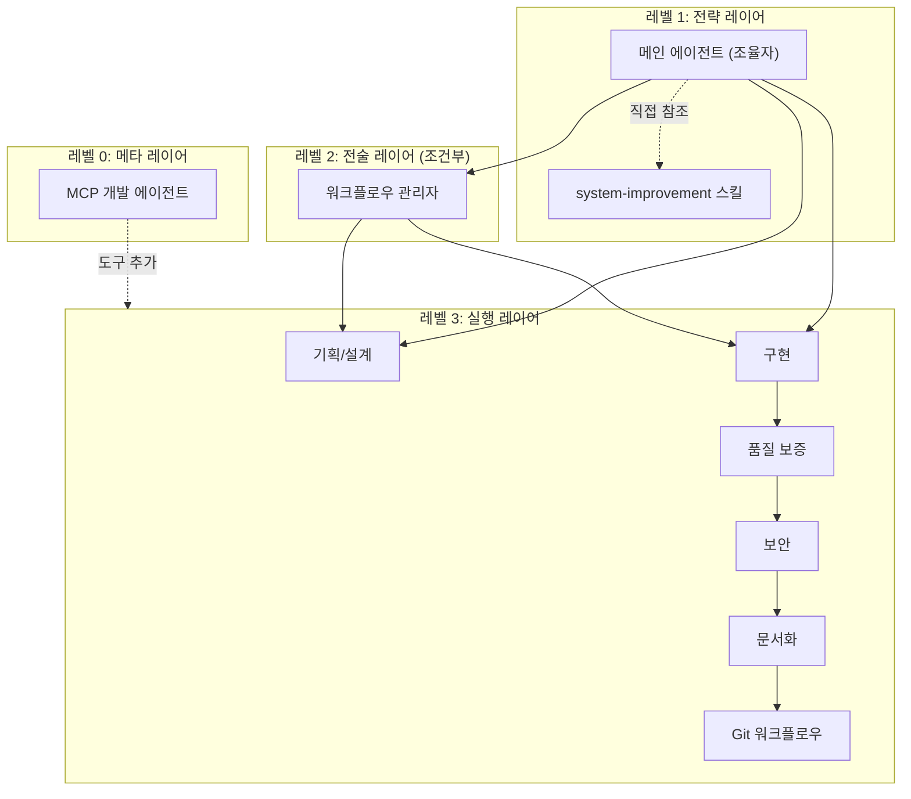

# 자기 진화 멀티 에이전트 시스템 설계

> 이 문서는 이 프로젝트의 에이전트 시스템 **현재 구조와 현황**을 기술합니다.  
> 설계 철학과 재사용 가능한 패턴은 [agent-architecture-guide.md](docs/agent-architecture-guide.md)를 참조하세요.  
> 서브에이전트 운영 규칙은 [AGENTS.md](../AGENTS.md)를 참조하세요.

---

## 시스템 개요

복잡한 소프트웨어 개발 태스크를 자동으로 분해·실행하며, 스스로 성능을 측정하고 개선하는 멀티 에이전트 시스템입니다.

### 핵심 특징

- **계층적 구조**: 4계층으로 분리된 명확한 책임
- **3계층 지식 분리**: 에이전트 정의 / 도메인 스킬 / 프로젝트 지식
- **자기 개선**: 시스템 개선 에이전트가 Rule/Skill을 자동 최적화
- **자기 확장**: MCP 개발 에이전트가 필요한 도구를 자동 개발
- **메트릭 기반**: 데이터 중심의 의사결정 및 개선

---

## 전체 아키텍처

### 4계층 에이전트 구조


```mermaid
graph TB
    subgraph metaLayer["레벨 0: 메타 레이어"]
        mcpDev["MCP 개발 에이전트"]
    end

    subgraph strategyLayer["레벨 1: 전략 레이어"]
        main["메인 에이전트 (조율자)"]
        sysSkill["system-improvement 스킬"]
    end

    subgraph tacticalLayer["레벨 2: 전술 레이어 (조건부)"]
        orchestrator["워크플로우 관리자"]
    end

    subgraph executionLayer["레벨 3: 실행 레이어"]
        planner["기획/설계"]
        developer["구현"]
        qa["품질 보증"]
        security["보안"]
        gitWorkflow["Git 워크플로우"]
        docs["문서화"]
    end

    main -.->|직접 참조| sysSkill
    mcpDev -.->|도구 추가| executionLayer

    main --> orchestrator
    main --> planner
    main --> developer
    orchestrator --> planner
    orchestrator --> developer
    developer --> qa
    qa --> security
    security --> docs
    docs --> gitWorkflow
```

### 레이어별 책임

| 레이어 | 목적 | 작동 | 판단 |
|--------|------|------|------|
| 레벨 0: 메타 | 도구 자동 개발 | MCP 서버 필요 감지 시 | IMPROVE |
| 레벨 1: 전략 | 목표 정의, 최종 품질 승인 | 모든 사용자 요청에 응답 | WHAT |
| 레벨 2: 전술 | 복잡한 멀티태스크 조율 | 5개+ 파일, 3개+ 에이전트 병렬 시 | HOW |
| 레벨 3: 실행 | 각 전문 영역 작업 수행 | 메인 에이전트가 호출 시 | DO |

---

## 에이전트 목록

### 실행 레이어 (6개 서브에이전트)

| 에이전트 | 정의 파일 | 역할 |
|----------|-----------|------|
| 기획/설계 (Planner) | `.cursor/agents/planner.md` | 요구사항 분석, 아키텍처/API 설계 |
| 구현 (Developer) | `.cursor/agents/developer.md` | 설계 기반 코드 구현, 리팩토링 |
| 품질 보증 (QA) | `.cursor/agents/qa.md` | 테스트 작성·실행, 커버리지 80%+ |
| 보안 (Security) | `.cursor/agents/security.md` | 취약점 스캔, 민감정보 탐지, 입력 검증 |
| Git 워크플로우 | `.cursor/agents/git-workflow.md` | Conventional Commits, PR 설명 생성 |
| 문서화 (Docs) | `.cursor/agents/docs.md` | JSDoc/TSDoc, README, CHANGELOG |

### 메타 레이어 (1개 서브에이전트 + 1개 스킬)

| 구분 | 위치 | 역할 |
|----------|-----------|------|
| 시스템 개선 (스킬) | `.cursor/skills/system-improvement/SKILL.md` | 메트릭 분석, Rule/Skill 최적화 (메인 에이전트 직접 수행) |
| MCP 개발 (에이전트) | `.cursor/agents/mcp-development.md` | 반복 작업 감지, MCP 서버 개발 |

---

## 3계층 지식 분리 모델

```
에이전트 정의 (.cursor/agents/*.md)
  └─ 역할, 원칙, 프로세스 (범용)
  └─ "무엇을 지켜야 하는가"

도메인 스킬 (.cursor/skills/*/references/*.md)
  └─ 재사용 가능한 기술 패턴 (함수명/변수명 없이)
  └─ "어떤 패턴으로 해결하는가"

프로젝트 지식 (.cursor/skills/project-knowledge/references/*.md)
  └─ 이 프로젝트의 구체적 구현 (함수명, 초기화 순서 등)
  └─ "이 프로젝트에서는 구체적으로 어떻게 되어있는가"
```

### 예시

| 계층 | 내용 |
|------|------|
| 에이전트 정의 | "스토리지 마이그레이션 시 삼중 일치 확인" |
| 도메인 스킬 | "FOUC 방지를 위해 동기+비동기 2단계 초기화 패턴 적용" |
| 프로젝트 지식 | "`initializeThemeSync()`이 1단계, `initializeTheme()`이 2단계" |

### 판단 기준

"이 내용에서 함수명/변수명을 제거해도 의미가 통하는가?"
- YES → 도메인 스킬
- NO → 프로젝트 지식

---

## Rule / Skill / Agent 정의 구분

| 구분 | Rule (`.mdc`) | Skill (`.md`) | Agent 정의 (`.md`) | AGENTS.md |
|------|---------------|---------------|---------------------|-----------|
| 위치 | `.cursor/rules/` | `.cursor/skills/` | `.cursor/agents/` | 프로젝트 루트 |
| 현재 파일 | `main-orchestrator.mdc` 1개만 | 12개 스킬 영역 | 8개 에이전트 | 1개 |
| 대상 | 메인 에이전트 전용 | 각 에이전트가 선택적 참조 | 각 에이전트 역할 정의 | 모든 에이전트 공통 |
| 활성화 | 자동 (alwaysApply) | 명시적 호출 시 | 에이전트 호출 시 자동 | 모든 에이전트에 자동 |

> **참고**: v1.2.0에서 서브에이전트용 Rule 파일(`planner.mdc`, `developer.mdc` 등)을 삭제하고, 모든 내용을 agents 정의 파일로 통합했습니다. Task tool로 호출되는 서브에이전트는 User Rules를 받지 못하므로 agents 파일이 유일한 지침입니다.

---

## 워크플로우 패턴

| 패턴 | 흐름 | 키워드 |
|------|------|--------|
| Feature | 기획 → Security(설계) → 구현 → Security(코드) → QA+Docs(병렬) → Security(최종) → Git | "추가", "새로운", "구현" |
| Bugfix | QA(재현) → 구현 → Security(코드) → QA(검증) → Git | "버그", "오류", "안됨" |
| Refactor | 기획(영향) → Security(설계) → 구현 → Security(코드) → QA+Docs(병렬) → Git | "개선", "정리", "리팩토링" |
| Docs | 문서화 → 승인 | "문서", "README" |
| Hotfix | 구현 → QA(최소) → 긴급 승인 → (사후)문서화 | "긴급", "핫픽스" |
| Chore | 구현 → 검증(type-check+test) → 승인 | "설정", "의존성", "config" |

상세: `.cursor/workflows/plan-execution-workflow.md`

---

## 메트릭 시스템

### 구조

```
.cursor/metrics/
├── cycle-template.json        # 사이클 JSON 스키마
├── cycles/YYYY-MM-DD-NNN.json # 사이클별 메트릭
├── reports/YYYY-MM-DD-NNN-*.md # 최종 보고서
├── improvements/YYYY-MM-DD-*.md # 시스템 개선 이력
└── summaries/                  # 집계 요약 (향후)
```

### 사이클 메트릭

각 작업 사이클에서 수집하는 데이터:
- `cycle_id`, `task_type`, `task_description`
- `started_at`, `completed_at`, `success`
- `agents`: 7개 서브에이전트별 outcome/retries/errors
- `quality_gates`: readlints, type_check, lint, test, build, security
- `decisions`, `issues_encountered`
- `files_changed`: created/modified/deleted

### 자기 진화 사이클

```
사이클 실행 → 메트릭 수집 → 트리거 판단 → 분석
  → 프로세스 문제: 메인 에이전트가 system-improvement 스킬로 직접 Rule/Skill 수정
  → 도구 부족: mcp-development 에이전트가 MCP 서버 개발
  → 개선 적용 → 다음 사이클
```

트리거 조건: 20 사이클마다 / 에러율 30%+ / 평균 시간 50%+ 증가 / 재시도 3회+

---

## 관련 문서

| 문서 | 역할 |
|------|------|
| [AGENTS.md](../AGENTS.md) | 서브에이전트 운영 가이드 (컨벤션, 호출 규칙) |
| [agent-architecture-guide.md](docs/agent-architecture-guide.md) | 설계 철학, 재사용 가능한 프레임워크 |
| [plan-execution-workflow.md](workflows/plan-execution-workflow.md) | 플랜 실행 워크플로우 (0~10단계) |
| [final-report-template.md](workflows/final-report-template.md) | 작업 완료 보고서 템플릿 |
| [DIRECTORY_STRUCTURE.md](DIRECTORY_STRUCTURE.md) | 전체 디렉토리 구조 |
| [old/](old/) | 아카이브된 구 문서 |

---

**마지막 업데이트**: 2026-03-20  
**버전**: 2.0.0

### 변경 이력

#### v2.0.0 (2026-03-20)
- 3계층 지식 분리 모델 도입 (에이전트-스킬-프로젝트지식)
- project-knowledge 스킬 신설
- Rule 구조 현행화 (main-orchestrator.mdc 1개만)
- 에이전트 목록 8개 반영 (security, git-workflow 포함)
- cycle-template에 git-workflow, mcp-development 추가
- 구 문서(v1.0.0) `.cursor/old/`로 아카이브
- 문서 간결화 (1319줄 → ~200줄)

#### v1.0.0 (2026-01-28)
- 초기 버전 (아카이브: `.cursor/old/AGENT_SYSTEM_DESIGN.md`)
