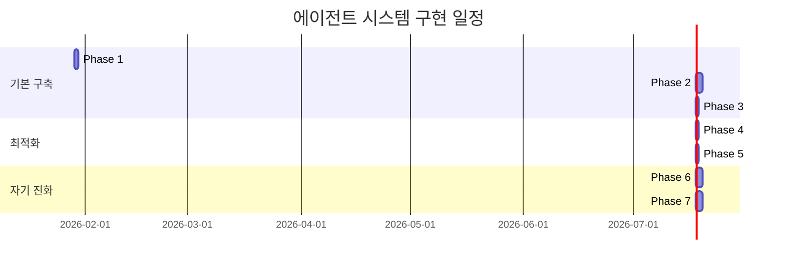

# 에이전트 시스템 구현 로드맵

이 문서는 자기 진화 멀티 에이전트 시스템을 단계별로 구현하기 위한 로드맵입니다.

## 목차

1. [구현 개요](#구현-개요)
2. [Phase 1: AGENTS.md 작성](#phase-1-agentsmd-작성)
3. [Phase 2: 실행 레이어 Skill](#phase-2-실행-레이어-skill)
4. [Phase 3: 메인 에이전트 설정](#phase-3-메인-에이전트-설정)
5. [Phase 4: 워크플로우 관리자](#phase-4-워크플로우-관리자)
6. [Phase 5: 메트릭 시스템](#phase-5-메트릭-시스템)
7. [Phase 6: 시스템 개선 에이전트](#phase-6-시스템-개선-에이전트)
8. [Phase 7: MCP 개발 에이전트](#phase-7-mcp-개발-에이전트)

---

## 구현 개요

### 전체 일정



### 구현 원칙

1. **점진적 구축**: 기본 → 최적화 → 자기 진화
2. **실전 테스트**: 각 Phase마다 실제 태스크로 검증
3. **메트릭 기반**: 개선 효과를 수치로 측정
4. **롤백 가능**: 각 Phase는 독립적으로 롤백 가능

### 성공 기준

- Phase 1-3: 기본 워크플로우 작동
- Phase 4: 복잡한 태스크 처리 가능
- Phase 5: 성능 측정 가능
- Phase 6-7: 자동 개선 작동

---

## Phase 1: AGENTS.md 작성

### 목표

모든 에이전트가 참조할 공통 가이드 문서를 작성합니다.

### 작업 목록

#### 1.1 AGENTS.md 파일 생성

**위치**: `D:\personal\AGENTS.md`

**내용 구조**:
```markdown
# 프로젝트 에이전트 시스템 가이드

## 공통 코딩 컨벤션
### 네이밍
### 품질 기준
### 개발 원칙

## 에이전트 역할 정의
### 메인 에이전트
### 기획 에이전트
### 구현 에이전트
### QA 에이전트
### 문서화 에이전트

## 서브에이전트 호출 규칙
```

#### 1.2 공통 컨벤션 작성

```markdown
## 공통 코딩 컨벤션

### 네이밍
- 변수명: `snake_case`
  ```typescript
  const user_count = 10;
  const max_retry_count = 3;
  ```
- 함수명: `camelCase`
  ```typescript
  function calculateTotal() {}
  function fetchUserData() {}
  ```
- 클래스명: `PascalCase`
- 상수: `UPPER_SNAKE_CASE`

### 품질 기준
- **Linter 오류**: 0개 (필수)
- **테스트 커버리지**: 80% 이상
- **모든 테스트 통과**: 필수
- **성능 저하**: 10% 이내 허용

### 개발 원칙
- **가정 금지**: 모든 판단은 실제 코드 분석 기반
- **코드 직접 읽기**: 주석이 아닌 실제 코드 확인
- **에러 즉시 해결**: 다시 돌아오지 않음
- **현재 목표 집중**: 관련 없는 코드 수정 금지
```

#### 1.3 에이전트 역할 명시

각 에이전트의 역할을 간략히 정의:

```markdown
## 에이전트 역할 정의

### 메인 에이전트
- **역할**: 목표 정의, 워크플로우 선택, 최종 승인
- **책임**: 전체 품질 보증
- **권한**: 모든 워크플로우 제어

### 기획 에이전트
- **역할**: 요구사항 분석, 아키텍처 설계, API 설계
- **입력**: 사용자 요청, 기존 시스템
- **출력**: 설계 문서, API 스펙

### 구현 에이전트
- **역할**: 코드 작성, 리팩토링
- **입력**: 설계 문서
- **출력**: 작동하는 코드

### QA 에이전트
- **역할**: 코드 리뷰, 테스트 작성 및 실행
- **입력**: 구현된 코드
- **출력**: 테스트 결과, 품질 리포트

### 문서화 에이전트
- **역할**: 문서 작성
- **입력**: 코드, API, 변경사항
- **출력**: 문서 (코드 주석, README, CHANGELOG)
```

### 검증 방법

#### 테스트 시나리오

간단한 요청으로 메인 에이전트가 AGENTS.md를 읽고 활용하는지 확인:

```
사용자: "간단한 유틸리티 함수 하나 추가해줘"
메인 에이전트: AGENTS.md 참조 → 컨벤션 확인 → 함수명 camelCase 사용
```

#### 체크리스트

- [ ] AGENTS.md 파일 생성됨
- [ ] 네이밍 컨벤션 명시 (snake_case, camelCase)
- [ ] 품질 기준 명시 (linter 0, 커버리지 80%)
- [ ] 개발 원칙 명시 (가정 금지, 코드 직접 읽기)
- [ ] 5개 에이전트 역할 정의
- [ ] 서브에이전트 호출 규칙 작성
- [ ] 메인 에이전트가 AGENTS.md 읽기 확인

### 예상 시간

**2-3시간**

### 완료 기준

- AGENTS.md 파일이 존재하고 150줄 내외
- 메인 에이전트가 실제로 컨벤션을 따름 (예: 함수명 camelCase 사용)

---

## Phase 2: 실행 레이어 Skill

### 목표

4개 실행 에이전트(기획, 구현, QA, 문서화)의 Skill 파일을 작성합니다.

### 우선순위

1. **구현 에이전트** (가장 많이 사용)
2. **QA 에이전트** (품질 게이트)
3. **문서화 에이전트**
4. **기획 에이전트**

### 작업 목록

#### 2.1 디렉토리 구조 생성

```bash
mkdir -p .cursor/skills/developer/references
mkdir -p .cursor/skills/qa/references
mkdir -p .cursor/skills/docs-agent/references
mkdir -p .cursor/skills/planner/references
mkdir -p .cursor/skills
```

#### 2.2 구현 에이전트 Skill (우선순위 1)

**2.2.1 code-implementation.md**

```markdown
---
name: code-implementation
description: 코드 구현 체크리스트
---

# 코드 구현 가이드

## 구현 전 체크

- [ ] 설계 문서 읽음
- [ ] 관련 기존 코드 파악
- [ ] 필요한 의존성 확인

## 구현 중 체크

- [ ] 변수명: snake_case
- [ ] 함수명: camelCase
- [ ] 에러 처리 포함
- [ ] 테스트 가능하게 작성 (의존성 분리)

## 구현 후 체크

- [ ] Linter 실행: 오류 0개
- [ ] 불필요한 코드 제거
- [ ] 설계와 일치 확인

## 코드 예시

```typescript
// ✅ 좋은 예
function calculateTotal(items: Item[]): number {
  if (items.length === 0) {
    throw new Error('Items cannot be empty');
  }
  return items.reduce((sum, item) => sum + item.price, 0);
}

// ❌ 나쁜 예
function calc(x) {
  return x.reduce((a,b)=>a+b.p,0);
}
```
```

**파일**: `.cursor/skills/developer/references/code-implementation.md`

**2.2.2 refactoring-patterns.md**

리팩토링 패턴 카탈로그 (추출, 이동, 단순화 등)

**2.2.3 testable-code.md**

테스트 가능한 코드 작성법 (의존성 주입, 순수 함수)

#### 2.3 QA 에이전트 Skill (우선순위 2)

**2.3.1 test-strategy.md**

```markdown
---
name: test-strategy
description: 테스트 전략 - 단위/통합/E2E
---

# 테스트 전략

## 테스트 유형 선택

### 단위 테스트
- **대상**: 순수 함수, 유틸리티
- **도구**: Vitest
- **커버리지 목표**: 90%+

### 통합 테스트
- **대상**: API, 모듈 협업
- **도구**: Vitest + Mock
- **커버리지 목표**: 80%+

### E2E 테스트
- **대상**: 핵심 사용자 플로우
- **도구**: Playwright
- **커버리지 목표**: 핵심 플로우만

## 테스트 작성 순서

1. 단위 테스트 우선
2. 통합 테스트
3. E2E (선택적)
```

**2.3.2 code-review.md**

코드 리뷰 체크리스트 (기능성, 가독성, 성능, 보안)

**2.3.3 coverage-check.md**

커버리지 측정 및 80% 달성 방법

#### 2.4 문서화 에이전트 Skill (우선순위 3)

**2.4.1 code-documentation.md**

JSDoc/TSDoc 작성 가이드

**2.4.2 changelog-generation.md**

CHANGELOG.md 형식 및 규칙

**2.4.3 readme-maintenance.md**

README.md 구조 및 업데이트

#### 2.5 기획 에이전트 Skill (우선순위 4)

**2.5.1 requirement-analysis.md**

요구사항 추출 및 문서화

**2.5.2 architecture-design.md**

아키텍처 패턴 및 설계 원칙

**2.5.3 api-design.md**

RESTful API 설계 가이드

#### 2.6 공통 Skill

**2.6.1 shared/project-conventions.md**

프로젝트 전체 컨벤션 (이미 AGENTS.md에 있지만 더 상세)

**2.6.2 shared/error-handling.md**

에러 처리 패턴 및 best practices

### 검증 방법

#### 테스트 시나리오 1: 간단한 기능 구현

```
사용자: "배열의 평균을 구하는 함수 만들어줘"

예상 흐름:
1. 메인 → 구현 에이전트 호출
2. 구현: code-implementation.md 참조
   - 함수명 camelCase: calculateAverage
   - 에러 처리 포함
   - 테스트 가능하게 작성
3. 메인 → QA 호출
4. QA: test-strategy.md 참조
   - 단위 테스트 작성
5. 메인 → 문서화 호출
6. 문서화: code-documentation.md 참조
   - JSDoc 작성
```

#### 테스트 시나리오 2: 버그 수정

```
사용자: "calculateTotal 함수에서 빈 배열 처리가 안돼"

예상 흐름:
1. 메인 → QA (재현)
2. QA → 메인
3. 메인 → 구현 (수정)
4. 구현: error-handling.md 참조
5. 메인 → QA (검증)
```

#### 체크리스트

**구현 에이전트**:
- [ ] code-implementation.md 작성 (50줄 이내)
- [ ] refactoring-patterns.md 작성
- [ ] testable-code.md 작성
- [ ] 실제 코드 작성 시 Skill 참조 확인

**QA 에이전트**:
- [ ] test-strategy.md 작성
- [ ] code-review.md 작성
- [ ] coverage-check.md 작성
- [ ] 실제 테스트 작성 시 Skill 참조 확인

**문서화 에이전트**:
- [ ] code-documentation.md 작성
- [ ] changelog-generation.md 작성
- [ ] readme-maintenance.md 작성

**기획 에이전트**:
- [ ] requirement-analysis.md 작성
- [ ] architecture-design.md 작성
- [ ] api-design.md 작성

**공통**:
- [ ] shared/project-conventions.md 작성
- [ ] shared/error-handling.md 작성

### 예상 시간

**1일 (8시간)**
- 구현 에이전트: 2시간
- QA 에이전트: 2시간
- 문서화 에이전트: 1.5시간
- 기획 에이전트: 1.5시간
- 공통: 1시간

### 완료 기준

- 최소 12개 Skill 파일 생성
- 각 파일 50줄 이내 (권장)
- 실제 태스크에서 Skill 활용 확인
- 코딩 컨벤션 준수 (변수명 snake_case, 함수명 camelCase)

---

## Phase 3: 메인 에이전트 설정

### 목표

메인 에이전트의 Rule과 Skill을 작성하여 워크플로우 조율 기능을 구현합니다.

### 작업 목록

#### 3.1 디렉토리 생성

```bash
mkdir -p .cursor/rules
mkdir -p .cursor/skills/orchestrator/references
```

#### 3.2 메인 에이전트 Rule 작성

**파일**: `.cursor/rules/main-orchestrator.mdc`

```markdown
---
description: 메인 에이전트 조율 규칙 - 워크플로우 선택 및 품질 게이트
alwaysApply: true
---

# 메인 에이전트 조율 규칙

## 태스크 분류 기준

### Feature (새 기능)
- **키워드**: "추가", "새로운", "구현", "만들어"
- **워크플로우**: 기획 → 구현 → QA → 문서화
- **예상 시간**: 30분 - 2시간

### Bugfix (버그 수정)
- **키워드**: "버그", "오류", "안됨", "깨짐"
- **워크플로우**: QA (재현) → 구현 → QA (검증)
- **예상 시간**: 10분 - 30분

### Refactor (리팩토링)
- **키워드**: "개선", "정리", "리팩토링"
- **워크플로우**: 기획 (분석) → 구현 → QA (회귀)
- **예상 시간**: 20분 - 1시간

### Docs (문서)
- **키워드**: "문서", "README", "주석"
- **워크플로우**: 문서화
- **예상 시간**: 5분 - 20분

### Hotfix (긴급)
- **키워드**: "긴급", "당장", "핫픽스"
- **워크플로우**: 구현 → QA (최소) → (나중에) 문서화
- **예상 시간**: 5분 - 15분

## 품질 게이트

### 기획 단계 후
- [ ] 요구사항 명확히 정의
- [ ] 아키텍처 기존 시스템과 일관
- [ ] API 설계 RESTful 준수

### 구현 단계 후
- [ ] Linter 오류 0개
- [ ] 설계와 일치
- [ ] 코딩 컨벤션 준수

### QA 단계 후
- [ ] 모든 테스트 통과
- [ ] 커버리지 80% 이상
- [ ] 회귀 테스트 통과

### 문서화 단계 후
- [ ] 주요 함수 문서화
- [ ] CHANGELOG 작성
- [ ] README 필요 시 업데이트

## 최종 승인 기준

- [ ] 사용자 요청 완전히 충족
- [ ] 부작용 없음
- [ ] 프로젝트 컨벤션 준수
```

#### 3.3 메인 에이전트 Skill 작성

**3.3.1 task-classifier.md**

```markdown
---
name: task-classifier
description: 사용자 요청을 태스크 유형으로 분류
---

# 태스크 분류기

## 분류 프로세스

1. **키워드 분석**: 요청에서 핵심 키워드 추출
2. **맥락 파악**: 기존 코드와의 관계 분석
3. **유형 결정**: 5가지 유형 중 선택

## 분류 기준

### Feature (새 기능)
- 키워드: "추가", "새로운", "구현"
- 특징: 기존에 없던 기능
- 예시: "사용자 인증 추가"

### Bugfix
- 키워드: "버그", "오류", "안됨"
- 특징: 기존 기능이 작동 안 함
- 예시: "로그인이 안돼요"

### Refactor
- 키워드: "개선", "정리", "리팩토링"
- 특징: 기능 유지, 구조 개선
- 예시: "코드 중복 제거"

### Docs
- 키워드: "문서", "README", "주석"
- 특징: 코드 변경 없음
- 예시: "API 문서 작성"

### Hotfix
- 키워드: "긴급", "당장", "핫픽스"
- 특징: 즉시 배포 필요
- 예시: "프로덕션 에러 긴급 수정"

## 애매한 경우

- 여러 키워드 포함 → 주요 목적 우선
- 명확하지 않음 → 사용자에게 질문
```

**파일**: `.cursor/skills/orchestrator/references/task-classifier.md`

**3.3.2 workflow-selector.md**

각 태스크 유형에 따른 워크플로우 선택

**3.3.3 quality-gate.md**

각 단계별 품질 검증 체크리스트

**3.3.4 agent-orchestration.md**

서브에이전트 호출 방법 및 컨텍스트 전달

### 검증 방법

#### 테스트 시나리오 1: Feature

```
사용자: "사용자 프로필 페이지 추가해줘"

예상:
1. 메인: task-classifier.md 사용
   → 분류: Feature
2. 메인: workflow-selector.md 사용
   → 워크플로우: 기획 → 구현 → QA → 문서화
3. 메인: 각 단계마다 quality-gate.md로 검증
```

#### 테스트 시나리오 2: Bugfix

```
사용자: "계산 결과가 이상해"

예상:
1. 메인: 분류 → Bugfix
2. 메인: 워크플로우 → QA (재현) → 구현 → QA (검증)
3. 기획 및 문서화 생략
```

#### 체크리스트

- [ ] main-orchestrator.mdc 생성 (alwaysApply: true)
- [ ] 5가지 태스크 유형 정의
- [ ] 5가지 워크플로우 패턴 정의
- [ ] 4단계 품질 게이트 정의
- [ ] task-classifier.md 작성
- [ ] workflow-selector.md 작성
- [ ] quality-gate.md 작성
- [ ] agent-orchestration.md 작성
- [ ] 메인 에이전트가 올바른 워크플로우 선택 확인

### 예상 시간

**4-5시간**

### 완료 기준

- Rule 파일 1개 (main-orchestrator.mdc)
- Skill 파일 4개 (main/)
- 실제 태스크에서 올바른 워크플로우 선택 확인
- 품질 게이트가 실제로 작동

---

## Phase 4: 워크플로우 관리자

### 목표

복잡한 멀티 태스크를 조율하는 워크플로우 관리자 Skill을 작성합니다.

### 작업 목록

#### 4.1 디렉토리 생성

```bash
mkdir -p .cursor/skills/orchestrator/references
```

#### 4.2 Skill 작성

**4.2.1 task-decomposition.md**

복잡한 태스크를 서브태스크로 분해

**4.2.2 agent-selection.md**

각 서브태스크에 적합한 에이전트 선택

**4.2.3 workflow-orchestration.md**

에이전트 호출 순서 및 동기화

**4.2.4 dependency-management.md**

작업 간 의존성 관리

**4.2.5 parallel-execution.md**

병렬 실행 전략

**4.2.6 progress-monitoring.md**

진행 상황 추적

#### 4.3 메인 에이전트 Rule 업데이트

`main-orchestrator.mdc`에 추가:

```markdown
## 워크플로우 관리자 호출 기준

다음 조건 중 하나라도 만족 시 호출:
- 5개 이상 파일 동시 작업
- 3개 이상 서브에이전트 병렬 실행
- 복잡한 의존성 관리 필요
- 예상 시간 30분 이상
```

### 검증 방법

#### 테스트 시나리오: 복잡한 기능

```
사용자: "사용자 인증 전체 시스템 구축 (회원가입, 로그인, 로그아웃, 토큰 갱신)"

예상:
1. 메인: 복잡도 분석 → 워크플로우 관리자 호출
2. 관리자: task-decomposition.md 사용
   → 4개 서브태스크 분해
3. 관리자: dependency-management.md 사용
   → 의존성 파악 (토큰 갱신은 로그인 이후)
4. 관리자: parallel-execution.md 사용
   → 병렬 가능 작업 식별
5. 관리자: 에이전트들 조율
6. 관리자 → 메인: 완료 리포트
```

#### 체크리스트

- [ ] 6개 Skill 파일 작성
- [ ] main-orchestrator.mdc에 호출 기준 추가
- [ ] 간단한 태스크는 관리자 생략 확인
- [ ] 복잡한 태스크는 관리자 호출 확인
- [ ] 병렬 실행 작동 확인

### 예상 시간

**4-5시간**

### 완료 기준

- 6개 Skill 파일 생성
- 복잡한 태스크에서 관리자 활용 확인
- 간단한 태스크에서 관리자 생략 확인

---

## Phase 5: 메트릭 시스템

### 목표

성능 메트릭을 수집하고 저장하는 시스템을 구축합니다.

### 작업 목록

#### 5.1 디렉토리 생성

```bash
mkdir -p .cursor/metrics/cycles
mkdir -p .cursor/metrics/agents
mkdir -p .cursor/metrics/improvements
mkdir -p .cursor/metrics/mcp-opportunities
```

#### 5.2 메트릭 수집 스크립트 (선택적)

수동으로 메트릭 JSON을 작성하거나, 자동 수집 스크립트를 만들 수 있습니다.

**자동 수집 (고급)**:
- 각 에이전트 실행 시 시간, 토큰, 에러 기록
- `.cursor/metrics/cycles/` 에 JSON 저장

**수동 수집 (간단)**:
- 사이클 완료 후 수동으로 기록
- 초기에는 이 방식 추천

#### 5.3 메트릭 JSON 템플릿 작성

**파일**: `.cursor/metrics/cycle-template.json`

```json
{
  "cycle_id": "YYYY-MM-DD-NNN",
  "timestamp": "ISO 8601",
  "task_type": "feature|bugfix|refactor|docs|hotfix",
  "task_description": "...",
  "workflow": ["main", "planner", "developer", "qa", "docs", "main"],
  "agents": {
    "planner": {
      "duration_ms": 0,
      "retries": 0,
      "tokens_used": 0,
      "files_read": 0,
      "quality_score": 0.0
    },
    "developer": {
      "duration_ms": 0,
      "retries": 0,
      "tokens_used": 0,
      "files_modified": 0,
      "linter_errors_introduced": 0,
      "linter_errors_fixed": 0,
      "quality_score": 0.0
    },
    "qa": {
      "duration_ms": 0,
      "retries": 0,
      "tokens_used": 0,
      "tests_written": 0,
      "tests_passed": 0,
      "coverage_after": 0.0,
      "quality_score": 0.0
    },
    "docs": {
      "duration_ms": 0,
      "retries": 0,
      "tokens_used": 0,
      "files_modified": 0,
      "quality_score": 0.0
    }
  },
  "totals": {
    "duration_ms": 0,
    "total_tokens": 0,
    "total_retries": 0,
    "success": true
  },
  "user_feedback": null
}
```

#### 5.4 첫 메트릭 수집

Phase 1-4 완료 후 실제 태스크 5-10개 수행하고 메트릭 기록:

```
.cursor/metrics/cycles/2026-01-29-001.json
.cursor/metrics/cycles/2026-01-29-002.json
...
```

### 검증 방법

#### 테스트

1. 간단한 태스크 수행
2. 수동으로 메트릭 기록
3. JSON 파일 생성 확인

#### 체크리스트

- [ ] metrics/ 디렉토리 구조 생성
- [ ] cycle-template.json 작성
- [ ] 최소 5개 사이클 메트릭 수집
- [ ] 메트릭 JSON 파일 확인

### 예상 시간

**2-3시간**
- 디렉토리 구조: 10분
- 템플릿 작성: 1시간
- 실제 수집 (5개 태스크): 1-2시간

### 완료 기준

- metrics/ 디렉토리 존재
- cycle-template.json 존재
- 최소 5개 사이클 메트릭 JSON 파일

---

## Phase 6: 시스템 개선 에이전트

### 목표

메트릭을 분석하고 Rule/Skill을 자동으로 개선하는 시스템 개선 에이전트 Skill을 작성합니다.

### 작업 목록

#### 6.1 디렉토리 생성

```bash
mkdir -p .cursor/skills/system-improvement/references
```

#### 6.2 Skill 작성

**6.2.1 performance-monitoring.md**

```markdown
---
name: performance-monitoring
description: 성능 메트릭 수집 및 분석
---

# 성능 모니터링

## 수집 데이터

### 사이클 레벨
- 전체 실행 시간
- 토큰 사용량
- 재시도 횟수
- 성공/실패

### 에이전트 레벨
- 에이전트별 실행 시간
- 에이전트별 재시도
- 품질 점수

## 분석 지표

### 효율성
- 평균 완료 시간
- 토큰 효율 (토큰/태스크)
- 에이전트 호출 횟수

### 품질
- 에러율
- 재시도 횟수
- 테스트 통과율

### 추세
- 시간에 따른 변화
- 개선 효과 측정

## 분석 트리거

- 20개 사이클마다 자동
- 에러율 30% 초과 시
- 평균 시간 50% 증가 시
```

**6.2.2 bottleneck-analysis.md**

병목 지점 식별 및 우선순위 결정

**6.2.3 rule-optimization.md**

Rule 파일 수정 전략

**6.2.4 skill-generation.md**

새로운 Skill 생성 및 기존 Skill 수정

**6.2.5 workflow-optimization.md**

워크플로우 패턴 개선

**6.2.6 ab-testing.md**

A/B 테스트 설계 및 실행

#### 6.3 첫 개선 사이클 실행

Phase 5에서 수집한 5-10개 메트릭 분석:

1. 병목 지점 식별
2. 개선 방안 결정
3. Rule/Skill 수정
4. 개선 이력 기록 (`.cursor/metrics/improvements/`)

### 검증 방법

#### 테스트 시나리오

```
1. 수집된 메트릭 분석
2. 시스템 개선 에이전트 수동 호출:
   "@system-improve 최근 10개 사이클 분석하고 개선해줘"
3. 개선 액션 확인:
   - Rule 수정?
   - Skill 수정?
   - 워크플로우 변경?
4. 개선 이력 문서 생성 확인
5. 다음 5개 사이클 수행
6. 개선 효과 측정
```

#### 체크리스트

- [ ] 6개 Skill 파일 작성
- [ ] performance-monitoring.md 작성
- [ ] bottleneck-analysis.md 작성
- [ ] rule-optimization.md 작성
- [ ] skill-generation.md 작성
- [ ] workflow-optimization.md 작성
- [ ] ab-testing.md 작성
- [ ] 첫 개선 사이클 실행
- [ ] 개선 이력 문서 생성
- [ ] 개선 효과 측정 (Before/After)

### 예상 시간

**1-2일 (8-16시간)**
- Skill 작성: 6시간
- 첫 분석 및 개선: 4시간
- 개선 효과 측정: 6시간 (추가 사이클 필요)

### 완료 기준

- 6개 Skill 파일 생성
- 첫 개선 사이클 실행 완료
- 개선 이력 문서 1개 이상
- 개선 효과 측정 가능 (Before/After 비교)

---

## Phase 7: MCP 개발 에이전트

### 목표

반복 작업을 자동화하는 MCP 서버를 자동으로 개발하는 시스템을 구축합니다.

### 작업 목록

#### 7.1 디렉토리 생성

```bash
mkdir -p .cursor/skills/developer/references/mcp
mkdir -p .cursor/mcp-servers
```

#### 7.2 Skill 작성

**7.2.1 pattern-detection.md**

반복 작업 패턴 감지 알고리즘

**7.2.2 tool-gap-analysis.md**

도구 부족 지점 식별

**7.2.3 mcp-design.md**

MCP 서버 설계 원칙

**7.2.4 mcp-implementation.md**

TypeScript 구현 가이드

**7.2.5 mcp-testing.md**

MCP 서버 테스트 전략

**7.2.6 mcp-deployment.md**

배포 및 등록 절차

#### 7.3 MCP 서버 템플릿 작성

**파일**: `.cursor/mcp-servers/template/`

기본 MCP 서버 구조:
```
template/
├── package.json
├── tsconfig.json
├── src/
│   └── index.ts
├── tests/
│   └── index.test.ts
└── README.md
```

#### 7.4 mcp-servers.json 생성

```json
{
  "mcpServers": {}
}
```

#### 7.5 첫 MCP 서버 개발

Phase 6에서 식별된 반복 작업 중 하나를 자동화:

예시: `vitest-coverage-analyzer`

1. 패턴 감지: QA 에이전트가 커버리지를 매번 수동 파싱
2. MCP 서버 설계
3. 구현 및 테스트
4. 배포 및 등록
5. QA Skill 업데이트
6. 효과 측정

### 검증 방법

#### 테스트 시나리오

```
1. 메트릭 분석: 반복 작업 식별
2. MCP 개발 에이전트 수동 호출:
   "@mcp-dev 커버리지 자동 분석 MCP 서버 개발"
3. MCP 서버 생성 확인:
   - .cursor/mcp-servers/vitest-coverage/
   - package.json, src/index.ts 존재
4. mcp-servers.json 업데이트 확인
5. 관련 Skill 업데이트 확인 (qa/coverage-check.md)
6. 실제 사용:
   QA 에이전트가 MCP 도구 사용
7. 효과 측정:
   - Before: 평균 30초, 에러율 15%
   - After: 평균 2초, 에러율 0%
```

#### 체크리스트

- [ ] 6개 Skill 파일 작성
- [ ] MCP 서버 템플릿 작성
- [ ] mcp-servers.json 생성
- [ ] 첫 MCP 서버 개발 (예: vitest-coverage)
- [ ] MCP 서버 테스트 통과
- [ ] mcp-servers.json 등록
- [ ] 관련 Skill 업데이트
- [ ] 실제 사용 확인
- [ ] 효과 측정 (Before/After)

### 예상 시간

**2-3일 (16-24시간)**
- Skill 작성: 6시간
- MCP 서버 템플릿: 2시간
- 첫 MCP 서버 개발: 4시간
- 테스트 및 배포: 2시간
- 효과 측정: 4시간 (추가 사이클 필요)

### 완료 기준

- 6개 Skill 파일 생성
- MCP 서버 템플릿 존재
- mcp-servers.json 존재
- 첫 MCP 서버 작동 확인
- 효과 측정 완료 (50% 이상 개선)

---

## 전체 완료 기준

### 기능적 완료

- [ ] Phase 1: AGENTS.md 작동
- [ ] Phase 2: 4개 실행 에이전트 Skill 작동
- [ ] Phase 3: 메인 에이전트 워크플로우 선택 작동
- [ ] Phase 4: 워크플로우 관리자 조건부 호출 작동
- [ ] Phase 5: 메트릭 수집 시스템 작동
- [ ] Phase 6: 시스템 개선 에이전트 자동 개선 작동
- [ ] Phase 7: MCP 개발 에이전트 도구 확장 작동

### 성능 기준

- [ ] 평균 태스크 완료 시간: 30분 이내 (새 기능)
- [ ] 에러율: 10% 이하
- [ ] 재시도 횟수: 평균 1회 이하
- [ ] 테스트 커버리지: 80% 이상 달성

### 자기 진화 확인

- [ ] 시스템 개선 에이전트가 실제로 Rule/Skill 수정
- [ ] MCP 개발 에이전트가 실제로 MCP 서버 개발
- [ ] 개선 효과가 메트릭으로 측정됨
- [ ] 시간이 지날수록 성능 향상 확인

---

## 롤백 계획

각 Phase는 독립적으로 롤백 가능:

### Phase 1 롤백
```bash
rm AGENTS.md
```

### Phase 2 롤백
```bash
rm -rf .cursor/skills/developer/references
rm -rf .cursor/skills/qa/references
rm -rf .cursor/skills/docs-agent/references
rm -rf .cursor/skills/planner/references
rm -rf .cursor/skills
```

### Phase 3 롤백
```bash
rm -rf .cursor/rules
rm -rf .cursor/skills/orchestrator/references
```

### Phase 4 롤백
```bash
rm -rf .cursor/skills/orchestrator/references
# main-orchestrator.mdc에서 관리자 호출 부분 제거
```

### Phase 5 롤백
```bash
rm -rf .cursor/metrics
```

### Phase 6 롤백
```bash
rm -rf .cursor/skills/system-improvement/references
rm -rf .cursor/metrics/improvements
```

### Phase 7 롤백
```bash
rm -rf .cursor/skills/developer/references/mcp
rm -rf .cursor/mcp-servers
rm .cursor/mcp-servers.json
```

---

## 다음 단계

1. Phase 1부터 순서대로 진행
2. 각 Phase 완료 후 체크리스트 확인
3. 실제 태스크로 검증
4. 문제 발견 시 롤백 후 수정
5. Phase 7 완료 후 자기 진화 시스템 모니터링

---

## 참고 문서

- [AGENT_SYSTEM_DESIGN.md](./AGENT_SYSTEM_DESIGN.md): 전체 시스템 설계
- [DIRECTORY_STRUCTURE.md](./DIRECTORY_STRUCTURE.md): 디렉토리 구조
- [Cursor Skills 문서](https://docs.cursor.com/context/skills)
- [Cursor Rules 문서](https://docs.cursor.com/context/rules)
- [MCP 서버 개발 가이드](https://docs.cursor.com/cookbook/building-mcp-server)
