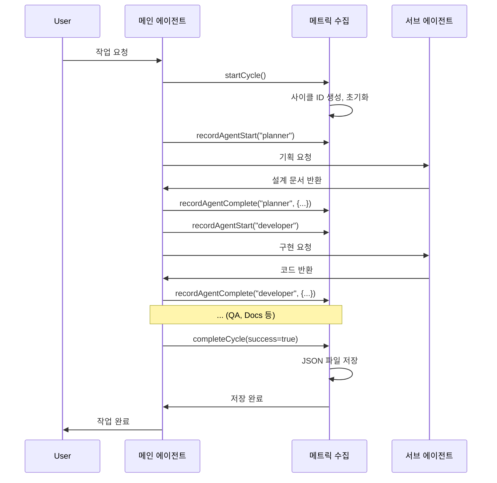

# 자동 메트릭스 수집 시스템 설계

## 1. 개요

### 목적
에이전트 시스템의 성능을 측정하고 개선하기 위해 각 작업 사이클의 메트릭을 자동으로 수집하는 시스템을 구축합니다.

### 배경
현재 `.cursor/metrics/cycle-template.json`은 템플릿만 존재하며, 실제 사이클 데이터가 자동으로 기록되지 않습니다. 이를 자동화하여 시스템 개선 에이전트가 데이터 기반으로 최적화를 수행할 수 있도록 합니다.

### 핵심 원칙
1. **비침투적**: 에이전트의 정상 작업 흐름을 방해하지 않음
2. **자동화**: 수동 개입 없이 자동으로 수집
3. **저장소 독립**: 파일 시스템 기반, 별도 DB 불필요
4. **확장 가능**: 새로운 메트릭 추가 용이
5. **실용적**: 구현 복잡도 최소화

---

## 2. 수집할 메트릭 정의

### 2.1 기존 템플릿 분석

기존 `cycle-template.json`의 구조를 기반으로 다음 메트릭을 수집합니다:

```json
{
  "cycle_id": "YYYY-MM-DD-NNN",      // 고유 사이클 ID
  "timestamp": "ISO8601",             // 시작 시점
  "task_type": "feature|bugfix|...",  // 태스크 유형
  "task_description": "...",          // 작업 설명
  "workflow": [...],                  // 실행된 워크플로우
  "agents": {...},                    // 에이전트별 메트릭
  "totals": {...},                    // 전체 집계
  "user_feedback": null               // 사용자 피드백 (선택)
}
```

### 2.2 추가 메트릭 제안

기존 템플릿에 다음 메트릭을 추가합니다:

#### 사이클 레벨 추가 메트릭
```json
{
  "cycle_id": "2026-01-28-001",
  "timestamp": "2026-01-28T10:00:00Z",
  "task_type": "feature",
  "task_description": "사용자 인증 추가",
  
  // 추가: 작업 시작/종료 시점
  "started_at": "2026-01-28T10:00:00Z",
  "completed_at": "2026-01-28T10:15:30Z",
  
  // 추가: 작업 복잡도 추정
  "complexity": {
    "estimated_files": 5,
    "actual_files": 6,
    "estimated_duration_min": 30,
    "actual_duration_min": 15.5
  },
  
  // 추가: 에러 정보
  "errors": [
    {
      "agent": "developer",
      "type": "linter_error",
      "message": "Unused variable 'x'",
      "resolved": true,
      "resolution_time_ms": 5000
    }
  ],
  
  "workflow": ["main", "planner", "developer", "qa", "docs", "main"],
  
  "agents": {
    "planner": {
      "duration_ms": 45000,
      "retries": 0,
      "tokens_used": 3500,
      "files_read": 8,
      "files_created": 1,        // 추가: 생성된 파일 수
      "quality_score": 0.95,
      
      // 추가: 상세 타이밍
      "timings": {
        "started_at": "2026-01-28T10:00:05Z",
        "completed_at": "2026-01-28T10:00:50Z",
        "thinking_time_ms": 10000,  // LLM 추론 시간
        "tool_calls": 12             // 도구 호출 횟수
      }
    },
    "developer": {
      "duration_ms": 180000,
      "retries": 1,
      "tokens_used": 12000,
      "files_modified": 5,
      "files_read": 15,
      "files_created": 2,        // 추가
      "linter_errors_introduced": 2,
      "linter_errors_fixed": 2,
      "quality_score": 0.80,
      
      // 추가: 코드 변경 통계
      "code_changes": {
        "lines_added": 234,
        "lines_deleted": 45,
        "lines_modified": 12
      }
    },
    "qa": {
      "duration_ms": 90000,
      "retries": 2,
      "tokens_used": 8000,
      "tests_written": 12,
      "tests_passed": 10,
      "tests_failed": 2,
      "coverage_before": 0.75,
      "coverage_after": 0.85,
      "quality_score": 0.83,
      
      // 추가: 테스트 상세
      "test_details": {
        "unit_tests": 8,
        "integration_tests": 3,
        "e2e_tests": 1,
        "avg_test_duration_ms": 120
      }
    },
    "docs": {
      "duration_ms": 25000,
      "retries": 0,
      "tokens_used": 2500,
      "files_modified": 3,
      "quality_score": 0.90
    }
  },
  
  "totals": {
    "duration_ms": 340000,
    "total_tokens": 26000,
    "total_retries": 3,
    "success": true,
    
    // 추가: 효율성 지표
    "efficiency": {
      "tokens_per_minute": 4588,
      "files_per_hour": 12.7,
      "tests_per_hour": 21.2
    }
  },
  
  "user_feedback": {
    "rating": 5,
    "comment": "완벽합니다",
    "provided_at": "2026-01-28T10:16:00Z"
  }
}
```

### 2.3 에이전트별 핵심 지표

#### 메인 에이전트
- 워크플로우 선택 정확도
- 품질 게이트 통과율
- 서브에이전트 호출 횟수

#### 기획 에이전트
- 설계 문서 품질 점수
- 설계 → 구현 일치도
- 재시도 원인 분석

#### 구현 에이전트
- 코드 품질 (Linter 오류 수)
- 첫 시도 성공률
- 파일 수정 효율성

#### QA 에이전트
- 테스트 커버리지 달성률
- 테스트 통과율
- 재시도 원인 (커버리지 미달 등)

#### 문서화 에이전트
- 문서 생성 속도
- 문서 품질 점수

---

## 3. 저장 형식 및 구조

### 3.1 저장 형식: JSON

**선택 이유:**
- ✅ 기존 템플릿과 일관성 유지
- ✅ 구조화된 데이터 저장 용이
- ✅ 파싱 및 분석 간편
- ✅ 버전 관리 용이 (Git)
- ✅ 추가 도구 불필요

**대안 비교:**
- ❌ Markdown: 구조화된 데이터 저장에 부적합
- ❌ CSV: 중첩 구조 표현 어려움
- ❌ SQLite: 추가 의존성, 복잡도 증가
- ❌ YAML: JSON 대비 큰 장점 없음

### 3.2 파일 저장 위치 및 네이밍

```
.cursor/metrics/
├── cycle-template.json          # 템플릿 (기존)
├── cycles/                      # 실제 사이클 데이터
│   ├── 2026-01-28-001.json
│   ├── 2026-01-28-002.json
│   ├── 2026-01-28-003.json
│   └── ...
├── summaries/                   # 일별/주별 요약
│   ├── 2026-01-28.json
│   ├── 2026-01-week-04.json
│   └── ...
└── improvements/                # 개선 이력 (기존)
    └── ...
```

**네이밍 규칙:**
- 사이클 파일: `YYYY-MM-DD-NNN.json` (NNN은 일별 순번, 001부터 시작)
- 요약 파일: `YYYY-MM-DD.json` (일별), `YYYY-MM-week-WW.json` (주별)

### 3.3 사이클 ID 생성 규칙

```typescript
function generateCycleId(): string {
  const today = new Date().toISOString().split('T')[0]; // YYYY-MM-DD
  const existingFiles = listFiles(`.cursor/metrics/cycles/${today}-*.json`);
  const sequence = existingFiles.length + 1;
  return `${today}-${String(sequence).padStart(3, '0')}`;
}
```

### 3.4 히스토리 관리

#### 보관 정책
- **개별 사이클**: 무기한 보관 (분석을 위해)
- **일별 요약**: 90일 보관 후 압축
- **주별 요약**: 1년 보관

#### 압축 및 아카이빙
```
.cursor/metrics/archives/
├── 2026-01.json.gz              # 월별 압축
└── ...
```

---

## 4. 자동화 방법 설계

### 4.1 권장 옵션: 메인 에이전트 규칙 통합 (옵션 C)

**선택 이유:**
1. ✅ **가장 실용적**: 기존 워크플로우에 자연스럽게 통합
2. ✅ **자동 수집**: 모든 사이클에서 자동으로 기록
3. ✅ **컨텍스트 접근**: 메인 에이전트가 전체 워크플로우를 알고 있음
4. ✅ **구현 간단**: 별도 서버나 도구 불필요
5. ✅ **에러 처리 용이**: 메인 에이전트가 실패 처리 가능

**단점 완화:**
- 복잡도 증가 → 메트릭 수집 로직을 별도 함수로 분리하여 관리
- 성능 영향 → 비동기 저장, 메인 작업 흐름 차단 최소화

### 4.2 대안 옵션 비교

#### 옵션 A: MCP 서버
**장점:**
- 독립 실행 가능
- 다른 도구와 통합 가능

**단점:**
- ❌ 추가 설정 필요 (mcp-servers.json 등록)
- ❌ 에이전트가 명시적으로 호출해야 함 (자동화 어려움)
- ❌ 구현 복잡도 높음

**결론:** 자동 수집 목적에는 부적합, 나중에 분석 도구로 활용 가능

#### 옵션 B: Skill
**장점:**
- 기존 시스템에 통합 용이

**단점:**
- ❌ 에이전트가 직접 호출해야 함 (자동화 불가)
- ❌ 모든 에이전트가 일관되게 호출해야 함 (실수 가능)

**결론:** 자동 수집에는 부적합

### 4.3 구현 방식

#### 4.3.1 메인 에이전트 규칙에 통합

`.cursor/rules/main-orchestrator.mdc`에 다음 로직 추가:

```markdown
## 메트릭 수집

### 사이클 시작 시
1. 사이클 ID 생성: `YYYY-MM-DD-NNN`
2. 초기 메트릭 객체 생성 (템플릿 기반)
3. 시작 시간 기록

### 각 에이전트 호출 전
1. 에이전트별 시작 시간 기록
2. 에이전트 컨텍스트 저장

### 각 에이전트 완료 후
1. 에이전트별 종료 시간 기록
2. 메트릭 업데이트:
   - duration_ms 계산
   - retries 기록
   - tokens_used 기록 (가능한 경우)
   - 파일 변경 통계
   - 품질 점수 계산

### 사이클 완료 시
1. 전체 메트릭 집계
2. JSON 파일로 저장: `.cursor/metrics/cycles/{cycle_id}.json`
3. 일별 요약 업데이트
```

#### 4.3.2 메트릭 수집 함수

별도 유틸리티 함수로 분리 (구현 시 생성):

```typescript
// .cursor/utils/metrics-collector.ts (예시 구조)

interface CycleMetrics {
  cycle_id: string;
  timestamp: string;
  // ... 기존 템플릿 구조
}

class MetricsCollector {
  private currentCycle: CycleMetrics | null = null;
  
  startCycle(taskType: string, description: string): string {
    // 사이클 시작
  }
  
  recordAgentStart(agent: string): void {
    // 에이전트 시작 기록
  }
  
  recordAgentComplete(agent: string, metrics: AgentMetrics): void {
    // 에이전트 완료 기록
  }
  
  completeCycle(success: boolean): void {
    // 사이클 완료 및 저장
  }
}
```

**주의:** 실제 구현은 Cursor의 제약사항을 고려하여 Rule에 직접 작성하거나, 가능하면 간단한 함수로 구현

---

## 5. 통합 방법

### 5.1 수집 시점

#### 사이클 레벨
- **시작**: 사용자 요청 받은 직후
- **종료**: 최종 승인 완료 시

#### 에이전트 레벨
- **시작**: 에이전트 호출 직전
- **종료**: 에이전트 작업 완료 후 (성공/실패 모두)

#### 메트릭 업데이트 시점
- **실시간**: 가능한 경우 즉시 업데이트
- **배치**: 에이전트 완료 시점에 일괄 업데이트

### 5.2 기록 담당 에이전트

**메인 에이전트가 전담:**
- 모든 워크플로우의 시작과 끝을 관리
- 각 서브에이전트 호출 전후를 알고 있음
- 전체 컨텍스트 접근 가능

**서브에이전트 역할:**
- 자신의 작업 결과만 보고 (예: "5개 파일 수정", "12개 테스트 작성")
- 메트릭 수집 로직은 포함하지 않음

### 5.3 실패한 작업 기록

**기록 대상:**
- ✅ 성공한 작업 (기본)
- ✅ 실패한 작업 (중요: 개선을 위해 필수)
- ✅ 중단된 작업 (사용자 취소 등)

**실패 메트릭:**
```json
{
  "totals": {
    "success": false,
    "failure_reason": "linter_errors_not_resolved",
    "failed_at_agent": "developer",
    "failure_stage": "implementation"
  }
}
```

### 5.4 메트릭 수집 프로세스



---

## 6. 메트릭 활용 방법

### 6.1 대시보드/리포트 생성

#### 일별 요약 리포트
```json
{
  "date": "2026-01-28",
  "total_cycles": 15,
  "success_rate": 0.93,
  "avg_duration_min": 18.5,
  "total_tokens": 450000,
  "agent_performance": {
    "planner": {"avg_duration_ms": 45000, "retry_rate": 0.05},
    "developer": {"avg_duration_ms": 120000, "retry_rate": 0.15},
    "qa": {"avg_duration_ms": 90000, "retry_rate": 0.20},
    "docs": {"avg_duration_ms": 25000, "retry_rate": 0.02}
  },
  "top_bottlenecks": [
    {"agent": "qa", "issue": "coverage_threshold", "frequency": 8}
  ]
}
```

#### 주별 트렌드 리포트
- 평균 완료 시간 추이
- 에러율 추이
- 에이전트별 성능 변화
- 개선 효과 측정

### 6.2 성능 분석

#### 효율성 분석
- **토큰 효율**: 태스크당 토큰 사용량 추세
- **시간 효율**: 태스크 유형별 평균 시간
- **재시도율**: 에이전트별 재시도 빈도

#### 품질 분석
- **성공률**: 사이클 성공 비율
- **Linter 오류**: 도입/수정 통계
- **테스트 커버리지**: 달성률 추이

### 6.3 병목 지점 식별

#### 시간 병목
```typescript
// 예시 분석 로직
const bottlenecks = cycles
  .map(cycle => ({
    agent: findSlowestAgent(cycle),
    duration: getAgentDuration(cycle, agent),
    frequency: countOccurrences(agent)
  }))
  .sort((a, b) => b.duration * b.frequency - a.duration * a.frequency);
```

#### 품질 병목
- 재시도가 가장 많은 에이전트
- 실패 원인 빈도 분석
- 품질 점수 하위 에이전트

### 6.4 A/B 테스트

#### 테스트 설계
```json
{
  "test_id": "ab-test-001",
  "hypothesis": "QA 커버리지 기준 완화 시 재시도 감소",
  "control": {
    "coverage_threshold": 0.80,
    "cycles": ["2026-01-28-001", "..."]
  },
  "treatment": {
    "coverage_threshold": 0.70,
    "cycles": ["2026-01-28-020", "..."]
  },
  "metrics": ["retry_rate", "avg_duration", "quality_score"]
}
```

#### 결과 분석
- 통계적 유의성 검증 (t-test)
- 효과 크기 측정
- 품질 저하 여부 확인

---

## 7. 구현 계획

### Phase 1: 기본 수집 시스템 (1주)

**목표:** 기본 메트릭 자동 수집 및 저장

**작업:**
1. 메인 에이전트 규칙에 메트릭 수집 로직 추가
2. 사이클 ID 생성 함수 구현
3. 기본 메트릭 수집 (duration, retries, success)
4. JSON 파일 저장 기능
5. 템플릿 기반 메트릭 구조 확장

**완료 기준:**
- [ ] 모든 사이클이 자동으로 기록됨
- [ ] `.cursor/metrics/cycles/`에 파일 생성됨
- [ ] 기본 메트릭이 정확히 기록됨

### Phase 2: 상세 메트릭 수집 (1주)

**목표:** 에이전트별 상세 메트릭 수집

**작업:**
1. 에이전트별 시작/종료 시간 기록
2. 파일 변경 통계 수집
3. 토큰 사용량 추적 (가능한 경우)
4. 에러 정보 기록
5. 코드 변경 통계 (lines added/deleted)

**완료 기준:**
- [ ] 모든 에이전트의 상세 메트릭 수집됨
- [ ] 파일 변경 통계 정확함
- [ ] 에러 정보가 기록됨

### Phase 3: 요약 및 분석 (1주)

**목표:** 일별/주별 요약 생성 및 기본 분석

**작업:**
1. 일별 요약 생성 로직
2. 주별 요약 생성 로직
3. 기본 통계 계산 (평균, 최대, 최소)
4. 병목 지점 식별 로직
5. 리포트 생성 기능

**완료 기준:**
- [ ] 일별 요약이 자동 생성됨
- [ ] 기본 통계가 정확히 계산됨
- [ ] 병목 지점이 식별됨

### Phase 4: 시스템 개선 에이전트 통합 (1주)

**목표:** 수집된 메트릭을 시스템 개선에 활용

**작업:**
1. 시스템 개선 에이전트가 메트릭 읽기
2. 분석 로직 통합
3. 개선 제안 생성
4. A/B 테스트 지원
5. 개선 이력 기록

**완료 기준:**
- [ ] 시스템 개선 에이전트가 메트릭 활용
- [ ] 자동 분석 및 제안 생성
- [ ] A/B 테스트 결과 기록

### Phase 5: 최적화 및 확장 (지속)

**목표:** 성능 최적화 및 추가 기능

**작업:**
1. 비동기 저장으로 성능 개선
2. 메트릭 압축 및 아카이빙
3. 대시보드 시각화 (선택)
4. 알림 시스템 (임계값 초과 시)
5. 추가 메트릭 수집

---

## 8. 예시

### 8.1 메인 에이전트 규칙 통합 예시

```markdown
## 메트릭 수집

### 사이클 시작
```typescript
// 사이클 시작 시 (의사코드)
const cycleId = generateCycleId(); // "2026-01-28-001"
const metrics = {
  cycle_id: cycleId,
  timestamp: new Date().toISOString(),
  started_at: new Date().toISOString(),
  task_type: classifyTask(userRequest),
  task_description: userRequest,
  workflow: [],
  agents: {},
  totals: { success: false }
};
```

### 에이전트 호출 전
```typescript
// 에이전트 호출 전
metrics.workflow.push(agentName);
metrics.agents[agentName] = {
  started_at: new Date().toISOString(),
  retries: 0
};
```

### 에이전트 완료 후
```typescript
// 에이전트 완료 후
const agentMetrics = {
  duration_ms: calculateDuration(startTime, endTime),
  retries: retryCount,
  tokens_used: estimatedTokens, // 가능한 경우
  files_read: filesReadCount,
  files_modified: filesModifiedCount,
  quality_score: calculateQualityScore(results)
};

metrics.agents[agentName] = {
  ...metrics.agents[agentName],
  ...agentMetrics,
  completed_at: new Date().toISOString()
};
```

### 사이클 완료 시
```typescript
// 사이클 완료 시
metrics.completed_at = new Date().toISOString();
metrics.totals = {
  duration_ms: calculateTotalDuration(),
  total_tokens: sumTokens(),
  total_retries: sumRetries(),
  success: allAgentsSucceeded()
};

// 파일 저장
await saveMetrics(`.cursor/metrics/cycles/${cycleId}.json`, metrics);
```
```

### 8.2 실제 사이클 메트릭 예시

```json
{
  "cycle_id": "2026-01-28-001",
  "timestamp": "2026-01-28T10:00:00Z",
  "started_at": "2026-01-28T10:00:00Z",
  "completed_at": "2026-01-28T10:15:30Z",
  "task_type": "feature",
  "task_description": "사용자 인증 API 추가",
  
  "complexity": {
    "estimated_files": 5,
    "actual_files": 6,
    "estimated_duration_min": 30,
    "actual_duration_min": 15.5
  },
  
  "workflow": ["main", "planner", "developer", "qa", "docs", "main"],
  
  "agents": {
    "planner": {
      "started_at": "2026-01-28T10:00:05Z",
      "completed_at": "2026-01-28T10:00:50Z",
      "duration_ms": 45000,
      "retries": 0,
      "tokens_used": 3500,
      "files_read": 8,
      "files_created": 1,
      "quality_score": 0.95,
      "timings": {
        "thinking_time_ms": 10000,
        "tool_calls": 12
      }
    },
    "developer": {
      "started_at": "2026-01-28T10:00:55Z",
      "completed_at": "2026-01-28T10:03:55Z",
      "duration_ms": 180000,
      "retries": 1,
      "tokens_used": 12000,
      "files_modified": 5,
      "files_read": 15,
      "files_created": 2,
      "linter_errors_introduced": 2,
      "linter_errors_fixed": 2,
      "quality_score": 0.80,
      "code_changes": {
        "lines_added": 234,
        "lines_deleted": 45,
        "lines_modified": 12
      }
    },
    "qa": {
      "started_at": "2026-01-28T10:04:00Z",
      "completed_at": "2026-01-28T10:05:30Z",
      "duration_ms": 90000,
      "retries": 2,
      "tokens_used": 8000,
      "tests_written": 12,
      "tests_passed": 10,
      "tests_failed": 2,
      "coverage_before": 0.75,
      "coverage_after": 0.85,
      "quality_score": 0.83,
      "test_details": {
        "unit_tests": 8,
        "integration_tests": 3,
        "e2e_tests": 1,
        "avg_test_duration_ms": 120
      }
    },
    "docs": {
      "started_at": "2026-01-28T10:05:35Z",
      "completed_at": "2026-01-28T10:06:00Z",
      "duration_ms": 25000,
      "retries": 0,
      "tokens_used": 2500,
      "files_modified": 3,
      "quality_score": 0.90
    }
  },
  
  "totals": {
    "duration_ms": 340000,
    "total_tokens": 26000,
    "total_retries": 3,
    "success": true,
    "efficiency": {
      "tokens_per_minute": 4588,
      "files_per_hour": 12.7,
      "tests_per_hour": 21.2
    }
  },
  
  "errors": [
    {
      "agent": "developer",
      "type": "linter_error",
      "message": "Unused variable 'x'",
      "resolved": true,
      "resolution_time_ms": 5000
    }
  ],
  
  "user_feedback": null
}
```

### 8.3 일별 요약 예시

```json
{
  "date": "2026-01-28",
  "total_cycles": 15,
  "successful_cycles": 14,
  "failed_cycles": 1,
  "success_rate": 0.93,
  
  "duration": {
    "total_ms": 5100000,
    "avg_ms": 340000,
    "avg_minutes": 5.67,
    "min_ms": 120000,
    "max_ms": 900000
  },
  
  "tokens": {
    "total": 390000,
    "avg_per_cycle": 26000,
    "avg_per_minute": 4588
  },
  
  "agent_performance": {
    "planner": {
      "avg_duration_ms": 45000,
      "total_calls": 15,
      "retry_rate": 0.05,
      "avg_quality_score": 0.92
    },
    "developer": {
      "avg_duration_ms": 120000,
      "total_calls": 14,
      "retry_rate": 0.15,
      "avg_quality_score": 0.78,
      "avg_linter_errors": 1.2
    },
    "qa": {
      "avg_duration_ms": 90000,
      "total_calls": 14,
      "retry_rate": 0.20,
      "avg_quality_score": 0.81,
      "avg_coverage_improvement": 0.10
    },
    "docs": {
      "avg_duration_ms": 25000,
      "total_calls": 14,
      "retry_rate": 0.02,
      "avg_quality_score": 0.88
    }
  },
  
  "top_bottlenecks": [
    {
      "agent": "qa",
      "issue": "coverage_threshold_not_met",
      "frequency": 8,
      "impact": "high"
    },
    {
      "agent": "developer",
      "issue": "linter_errors",
      "frequency": 5,
      "impact": "medium"
    }
  ],
  
  "task_type_distribution": {
    "feature": 8,
    "bugfix": 4,
    "refactor": 2,
    "docs": 1
  }
}
```

---

## 9. 주의사항 및 제약사항

### 9.1 성능 고려사항
- 메트릭 수집이 메인 작업 흐름을 방해하지 않도록 비동기 처리
- 파일 I/O는 최소화 (배치 저장 고려)
- 메모리 사용량 모니터링

### 9.2 데이터 정확성
- 토큰 사용량은 추정치일 수 있음 (정확한 값은 API 응답에 따라)
- 시간 측정은 시스템 시간 기반 (정확도 제한)
- 일부 메트릭은 에이전트가 명시적으로 보고해야 함

### 9.3 확장성
- 메트릭 파일이 많아질 경우 성능 이슈 가능
- 주기적 아카이빙 필요
- 대용량 분석 시 인덱싱 고려

### 9.4 프라이버시
- 사용자 요청 내용이 메트릭에 포함됨
- 민감한 정보는 마스킹 고려
- Git에 커밋 시 주의 (민감 정보 제외)

---

## 10. 향후 개선 방향

### 단기 (3개월)
1. 실시간 대시보드 (웹 기반)
2. 알림 시스템 (임계값 초과 시)
3. 메트릭 시각화 (그래프, 차트)

### 중기 (6개월)
1. 예측 모델 (작업 완료 시간 예측)
2. 자동 최적화 제안
3. 비교 분석 (프로젝트 간, 기간 간)

### 장기 (1년)
1. 머신러닝 기반 개선 제안
2. 자동 워크플로우 최적화
3. 크로스 프로젝트 학습

---

## 11. 참고 문서

- [AGENT_SYSTEM_DESIGN.md](../AGENT_SYSTEM_DESIGN.md): 전체 에이전트 시스템 설계
- [cycle-template.json](../metrics/cycle-template.json): 메트릭 템플릿
- [system-improvement.mdc](../rules/system-improvement.mdc): 시스템 개선 에이전트 규칙
- [performance-monitoring.md](../../.agents/skills/system-improvement/references/performance-monitoring.md): 성능 모니터링 스킬

---

## 12. 승인 및 검토

이 설계 문서는 다음 기준을 충족합니다:

- [x] 요구사항 반영
- [x] 실용적이고 구현 가능
- [x] 기존 시스템과 통합 가능
- [x] 확장 가능한 구조
- [x] 명확한 구현 계획

**다음 단계:** 구현 에이전트가 Phase 1부터 순차적으로 구현 시작
