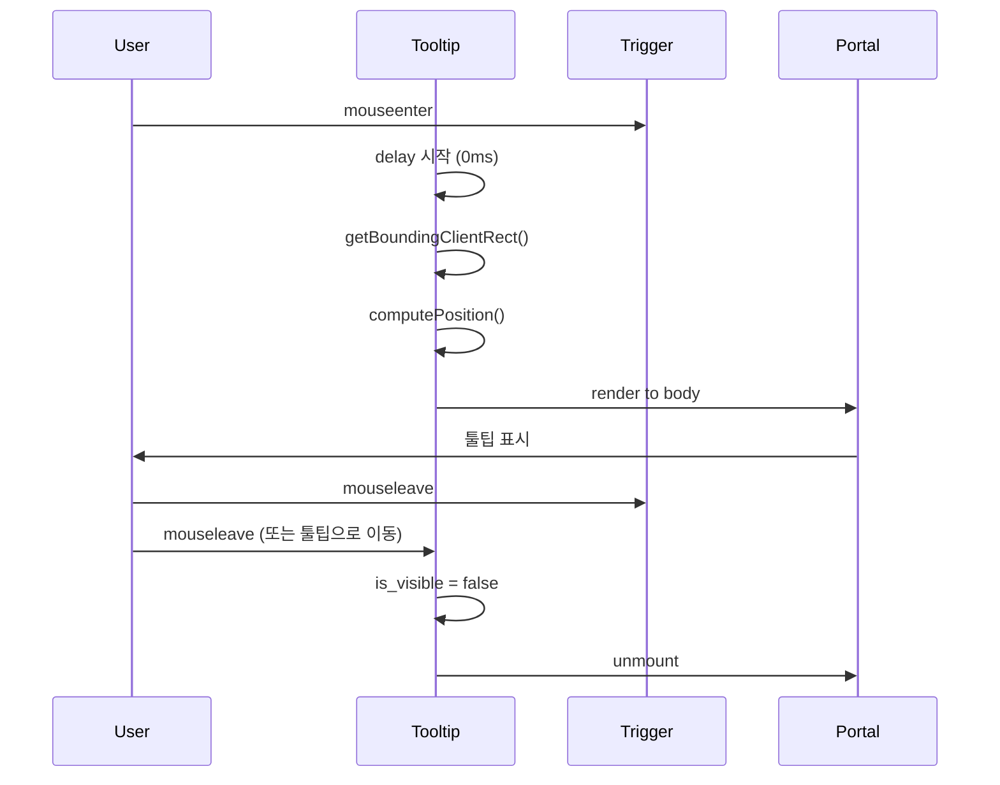
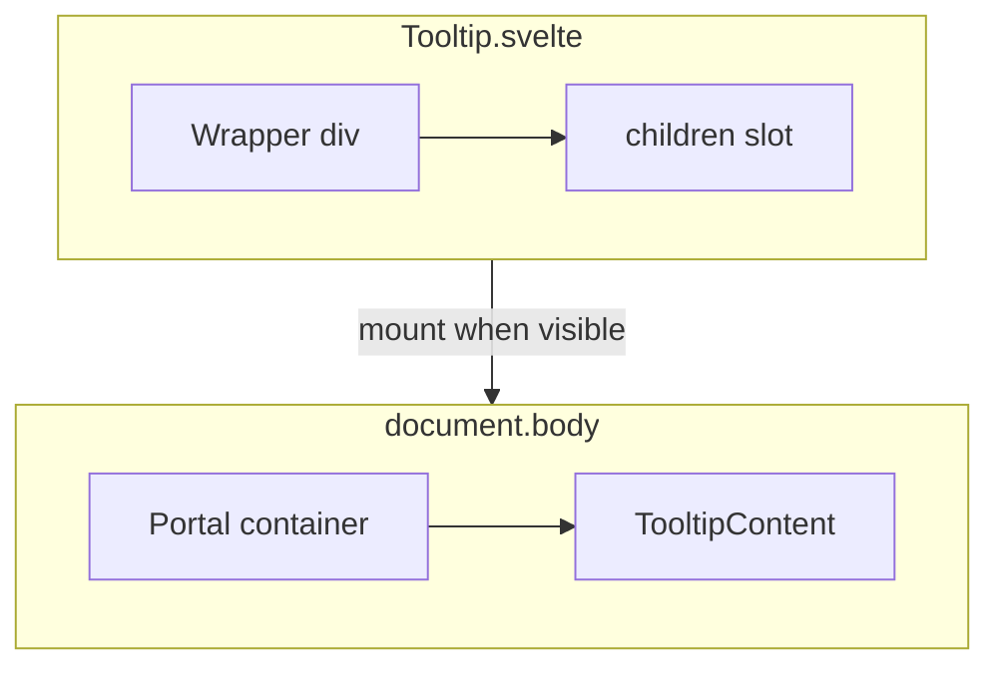

# Tooltip 컴포넌트 설계 문서

**작성일**: 2026-03-12  
**대상**: 사용자 스크립트 버튼용 Tooltip (uikit)  
**참조**: `packages/uikit/src/design/`, `packages/uikit/src/components/Popover/`

---

## 1. 시각적 디자인 명세 (design-tooltip)

### 1.1 색상 (theme_vars 기반)

| 속성 | 값 | 근거 |
|------|-----|------|
| 배경 | `theme_vars.color.surface` | Popover와 일관성, 라이트/다크 테마 자동 대응 |
| 텍스트 | `theme_vars.color.text` | WCAG 2.1 AA 명암 대비 4.5:1 이상 (surface + text 조합) |
| 테두리 | `1px solid theme_vars.color.border` | Popover, Select, TextInput과 동일 패턴 |

**명암 대비 검증**:
- Light: surface `#f8fafc`, text `#0f172a` → 약 12:1
- Dark: surface `#1e293b`, text `#f1f5f9` → 약 8:1

### 1.2 테두리 및 그림자

| 속성 | 값 |
|------|-----|
| border | `1px solid ${theme_vars.color.border}` |
| borderRadius | `theme_vars.radius.sm` (6px) |
| boxShadow | `theme_vars.shadow.sm` |

### 1.3 여백 및 폰트

| 속성 | 값 | 근거 |
|------|-----|------|
| padding | `theme_vars.space.xs` (2px) `theme_vars.space.sm` (4px) | 컴팩트한 크기, 버튼 sm과 조화 |
| fontSize | `theme_vars.font.size.xs` (11px) | 툴팁은 보조 정보, 본문보다 작게 |
| fontWeight | `theme_vars.font.weight.normal` | 가독성 |
| maxWidth | `200px` | 긴 텍스트 줄바꿈, Popover minWidth 참고 |
| whiteSpace | `normal` | 긴 텍스트 줄바꿈 허용 |

### 1.4 애니메이션

| 속성 | 값 |
|------|-----|
| opacity | 0 → 1 (fade-in) |
| transition | `opacity ${theme_vars.transition.fast}` (0.1s ease) |
| delay | 0ms (즉시 표시) |

### 1.5 위치 화살표 (CSS pseudo-element)

- **방식**: `::before` 또는 `::after`로 삼각형
- **크기**: 6px × 6px (border 기반)
- **색상**: 테두리와 동일 (`theme_vars.color.border`), 내부는 배경색과 동일
- **위치**: 툴팁 박스 가장자리 중앙, 트리거 방향으로 향함

```css
/* top 예시: 화살표가 아래를 가리킴 (트리거 위에 툴팁) */
.tooltip_content[data-position="top"]::after {
  content: '';
  position: absolute;
  bottom: -5px;  /* border 1px 고려 시 -6px 또는 overlap */
  left: 50%;
  transform: translateX(-50%);
  border: 5px solid transparent;
  border-top-color: theme_vars.color.surface;
  border-bottom-width: 0;
}
/* bottom/left/right도 동일 패턴으로 data-position별 스타일 */
```

### 1.6 위치 전략

| 항목 | 값 |
|------|-----|
| 기본 위치 | `top` (버튼 위쪽) |
| 옵션 | `top` \| `bottom` \| `left` \| `right` |
| 자동 조정 | viewport 경계 감지 시 반대 방향 flip |
| 버튼과 간격 | 8px (`theme_vars.space.md`) |

### 1.7 접근성

| 항목 | 값 |
|------|-----|
| role | `tooltip` (필수) |
| aria-describedby | 트리거의 `aria-describedby`에 툴팁 id 연결 |
| 호버 전용 | 포커스 시 툴팁 미표시 (버튼의 `aria-label`로 충분) |
| 트리거 | `aria-describedby={tooltip_id}` (선택 시에만) |

**참고**: WAI-ARIA Tooltip 패턴에 따르면, 트리거에 포커스 시 툴팁을 표시하는 경우도 있으나, 요구사항에서 "호버 전용"으로 명시되어 `aria-label`만으로 충분합니다.

---

## 2. API 설계 (design-api)

### 2.1 Props 인터페이스

```typescript
export type TooltipPosition = 'top' | 'bottom' | 'left' | 'right';

interface TooltipProps {
  /** 툴팁에 표시할 텍스트 */
  content: string;
  /** 툴팁 위치 (기본: 'top') */
  position?: TooltipPosition;
  /** true 시 툴팁 비활성화 */
  disabled?: boolean;
  /** 트리거 요소 (버튼 등) */
  children: Snippet;
  /** 표시 지연 ms (기본: 0) */
  delay?: number;
}
```

### 2.2 사용 패턴

```svelte
<script>
  import { Tooltip, Button } from '@personal/uikit';
</script>

<Tooltip content="스크립트 실행">
  <Button variant="ghost" size="sm">▶</Button>
</Tooltip>
```

**ScriptList 적용 예시**:

```svelte
<Tooltip content="스크립트 실행">
  <Button variant="ghost" size="sm" aria-label="스크립트 실행" onclick={() => handleRun(script)}>
    {#if run_status[script.id] === 'success'}✓{...}
  </Button>
</Tooltip>
```

### 2.3 구현 패턴 결정

| 항목 | 결정 | 근거 |
|------|------|------|
| **구조** | Wrapper 방식 (단일 `<Tooltip>` 컴포넌트) | 사용 패턴이 단순, Compound 방식은 Popover처럼 복잡한 UI에 적합 |
| **Portal** | `document.body`에 appendChild | `position: fixed`가 transform 조상에 의해 영향을 받지 않도록, overflow:hidden 조상에서 클리핑 방지 |
| **위치 계산** | `getBoundingClientRect()` + viewport 체크 | 표준 패턴, flip 로직으로 경계 이탈 방지 |
| **상태** | `$state`: `is_visible`, `computed_position`, `coords` | Svelte 5 Runes, 반응형 위치 업데이트 |

### 2.4 컴포넌트 구조

```
Tooltip.svelte (Root)
├── Wrapper (div, position: relative) - 트리거 감싸기
│   └── {@render children()}  ← 트리거
└── {#if is_visible}
    └── Portal Target (document.body에 렌더)
        └── TooltipContent (position: fixed, top/left)
            └── {content}
```

### 2.5 상태 관리 상세

```typescript
// $state
let is_visible = $state(false);
let coords = $state<{ top: number; left: number } | null>(null);
let resolved_position = $state<TooltipPosition>('top');

// $derived
// tooltip_id: mount 시 한 번 생성 (고정 id, aria-describedby용)

// 이벤트
// - mouseenter (트리거): delay 후 is_visible = true, 위치 계산
// - mouseleave (트리거): hide_timeout 50ms 설정 (툴팁으로 이동 중이면 mouseenter로 취소)
// - mouseenter (툴팁): hide_timeout 취소, 유지
// - mouseleave (툴팁): hide_timeout 50ms 설정 후 hide
```

### 2.6 위치 계산 로직

```typescript
function computePosition(
  trigger_rect: DOMRect,
  tooltip_size: { width: number; height: number },
  preferred: TooltipPosition
): { top: number; left: number; position: TooltipPosition } {
  const viewport = { width: window.innerWidth, height: window.innerHeight };
  const gap = 8;
  const positions: TooltipPosition[] = [preferred, ...flipOrder(preferred)];

  for (const pos of positions) {
    const { top, left } = calculateCoords(trigger_rect, tooltip_size, pos, gap);
    if (isInViewport(top, left, tooltip_size, viewport)) {
      return { top, left, position: pos };
    }
  }
  // fallback: preferred 반환
  return { ...calculateCoords(trigger_rect, tooltip_size, preferred, gap), position: preferred };
}
```

### 2.7 Portal 구현

Svelte 5에는 built-in portal이 없으므로:

1. **옵션 A**: `mount`/`unmount` + `createElement`/`appendChild`로 body에 툴팁 컨테이너 추가
2. **옵션 B**: `svelte-portal` 라이브러리 (의존성 추가)
3. **권장**: 옵션 A (의존성 없음, uikit 단순성 유지)

```typescript
// 의사코드
let portal_target: HTMLElement | null = null;

$effect(() => {
  if (is_visible) {
    portal_target = document.createElement('div');
    document.body.appendChild(portal_target);
  }
  return () => {
    portal_target?.remove();
  };
});
```

---

## 3. 설계 다이어그램





---

## 4. 파일 구조

```
packages/uikit/src/
├── components/
│   └── Tooltip/
│       ├── Tooltip.svelte      # 단일 컴포넌트 (Wrapper + Portal 로직)
│       ├── index.ts
│       └── __tests__/
│           └── Tooltip.stories.ts
├── design/
│   └── styles/
│       └── tooltip.css.ts      # tooltip_content, tooltip_arrow variants
└── design/
    └── types/
        └── index.ts            # TooltipPosition 추가
```

---

## 5. 결정사항 (Decisions)

| 결정 | 근거 | 검토한 대안 |
|------|------|-------------|
| Wrapper 방식 | 사용 패턴 단순, `<Tooltip content="..."><Button/></Tooltip>` 직관적 | Compound (Root/Trigger/Content): Popover와 유사하나 툴팁은 단순해 과도함 |
| document.body Portal | `position: fixed`가 transform/overflow 조상 영향 없음 | 상대 위치 유지: overflow:hidden 조상에서 클리핑 위험 |
| theme_vars.color.surface 배경 | Popover와 일관성, 테마 자동 대응 | 별도 tooltip 배경색: 토큰 추가 불필요 |
| font.size.xs (11px) | 툴팁은 보조 정보, 컴팩트 | font.size.sm: 버튼과 동일해 시각적 위계 약함 |
| delay 기본 0ms | 즉시 피드백, 요구사항 명시 | 200~300ms: 마우스 스윕 시 깜빡임 감소하나 요구사항과 맞지 않음 |
| 호버 전용 (포커스 미표시) | 요구사항 명시, aria-label으로 충분 | 포커스 시 툴팁: 키보드 사용자 지원하나 요구사항과 맞지 않음 |
| vanilla-extract 스타일 | 기존 Popover, Button 등과 동일 | 인라인 CSS: 테마 변수 활용 불가 |

---

## 6. 발견된 이슈 (Issues)

| 이슈 | 해결 방법 | 영향도 |
|------|----------|--------|
| Svelte 5 built-in portal 없음 | `$effect` + `createElement`/`appendChild`로 body에 툴팁 컨테이너 추가/제거 | minor |
| 툴팁 ↔ 트리거 마우스 이동 시 깜빡임 | `mouseleave` 시 50ms hide_timeout 설정, 툴팁/트리거 `mouseenter` 시 취소 | minor |
| transform 조상이 있는 경우 fixed 동작 | Portal로 body에 렌더하여 회피 | none |
| 긴 텍스트 시 maxWidth | 200px 적용, `white-space: normal` | none |

---

## 7. 구현 가이드 (Developer 에이전트용)

### 7.1 순서

1. `packages/uikit/src/design/styles/tooltip.css.ts` 생성 (vanilla-extract)
2. `packages/uikit/src/design/types/index.ts`에 `TooltipPosition` 추가
3. `packages/uikit/src/components/Tooltip/Tooltip.svelte` 생성
4. `packages/uikit/src/components/Tooltip/index.ts` 생성
5. `packages/uikit/src/index.ts`에 Tooltip export 추가
6. `Tooltip.stories.ts` 작성 (Storybook)
7. ScriptList.svelte에 Tooltip 적용

### 7.2 tooltip.css.ts 스키마

```typescript
// position별 variant: tooltip_content_top, tooltip_content_bottom, ...
// 화살표는 data-position attribute로 조정
export const tooltip_content = style({ ... });
export const tooltip_content_position = styleVariants({
  top: [...],
  bottom: [...],
  left: [...],
  right: [...],
});
```

### 7.3 주의사항

- `role="tooltip"` 필수
- `aria-describedby`는 호버 전용이므로 생략 가능 (요구사항: aria-label 충분)
- 마우스 이동: 트리거 → 툴팁으로 이동 시 툴팁 유지 (pointer-events 고려)
- `delay`가 0이 아닐 때: `mouseleave`가 `delay`보다 먼저 발생하면 표시 취소

### 7.4 품질 기준

- [ ] Linter 오류 0개
- [ ] `pnpm type-check` 통과
- [ ] Storybook 스토리 존재 확인
- [ ] 테스트 가능 (mouseenter/mouseleave 시뮬레이션)
