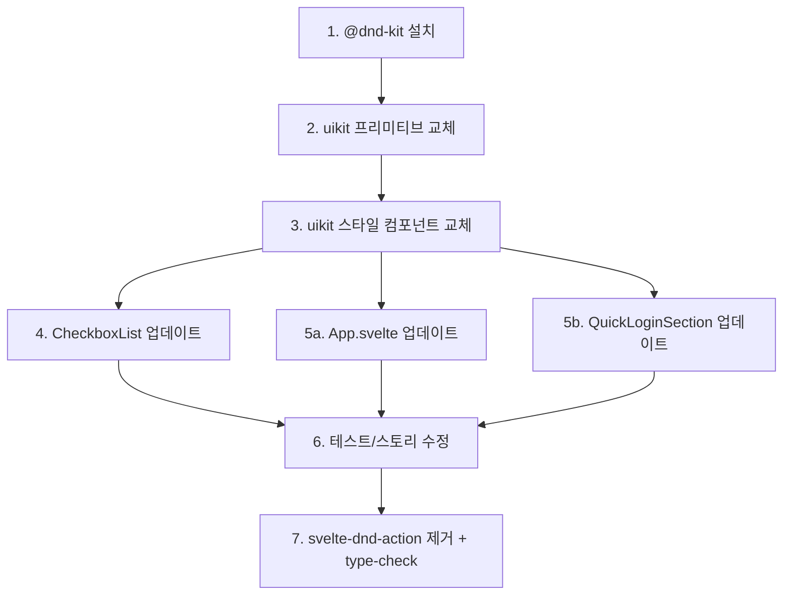
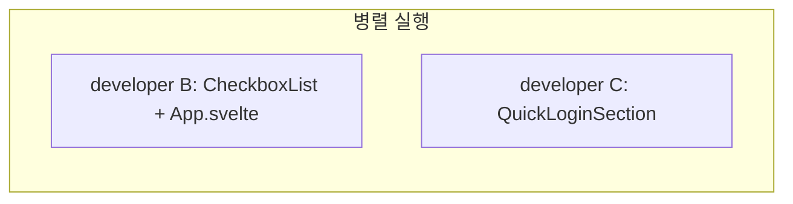
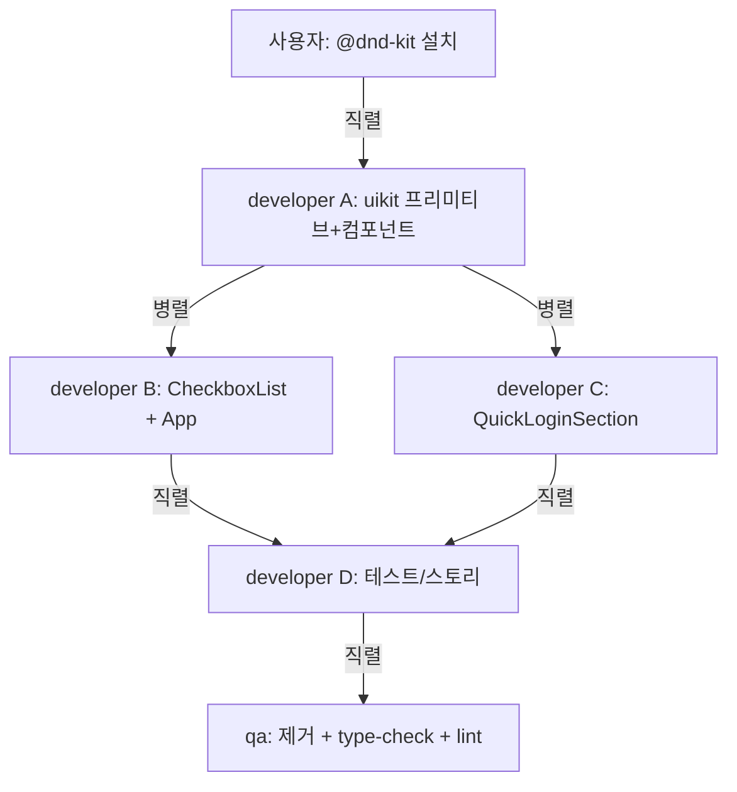

# svelte-dnd-action -> @dnd-kit/svelte 전체 마이그레이션

## 배경

`svelte-dnd-action`은 Svelte 5에서 드래그 시 요소가 `visibility: hidden` 상태로 남는 알려진 버그가 있음 (GitHub Issue #596, #640). `@dnd-kit/svelte`는 Svelte 5 네이티브 지원 (공식 패키지, `{@attach}` 사용).

## API 변경

- `Dnd.Zone` + `Dnd.Row` + `Dnd.Handle` -> `Dnd.Provider` + `Dnd.Sortable`
- `onconsider` / `onfinalize` -> `onreorder` (단일 콜백)
- `DndEvent` type -> 삭제 (불필요)

소비자 코드 변경 예시 (before/after):

```svelte
<!-- BEFORE -->
<Dnd.Zone items={items} onconsider={...} onfinalize={...}>
    {#each items as item (item.id)}
        <Dnd.Row><Dnd.Handle />{item.name}</Dnd.Row>
    {/each}
</Dnd.Zone>

<!-- AFTER -->
<Dnd.Provider items={items} onreorder={handleReorder}>
    {#each items as item, index (item.id)}
        <Dnd.Sortable id={item.id} {index}>
            {item.name}
        </Dnd.Sortable>
    {/each}
</Dnd.Provider>
```

## 영향받는 파일

### uikit 프리미티브 (삭제 + 신규)

- [primitives/Dnd/Zone.svelte](packages/uikit/src/primitives/Dnd/Zone.svelte) - 삭제
- [primitives/Dnd/Handle.svelte](packages/uikit/src/primitives/Dnd/Handle.svelte) - 삭제
- [primitives/Dnd/Row.svelte](packages/uikit/src/primitives/Dnd/Row.svelte) - 삭제
- `primitives/Dnd/Provider.svelte` - 신규 (`DragDropProvider` + `move` 래퍼)
- `primitives/Dnd/Sortable.svelte` - 신규 (`createSortable` + `{@attach}`)
- [primitives/Dnd/index.ts](packages/uikit/src/primitives/Dnd/index.ts) - 수정

### uikit 스타일 컴포넌트 (삭제 + 신규)

- [components/Dnd/Zone.svelte](packages/uikit/src/components/Dnd/Zone.svelte) - 삭제
- [components/Dnd/Handle.svelte](packages/uikit/src/components/Dnd/Handle.svelte) - 삭제
- [components/Dnd/Row.svelte](packages/uikit/src/components/Dnd/Row.svelte) - 삭제
- `components/Dnd/Provider.svelte` - 신규
- `components/Dnd/Sortable.svelte` - 신규
- [components/Dnd/index.ts](packages/uikit/src/components/Dnd/index.ts) - 수정

### CheckboxList (내부적으로 Dnd 사용)

- [primitives/CheckboxList/Root.svelte](packages/uikit/src/primitives/CheckboxList/Root.svelte) - `Zone` -> `Provider`
- [primitives/CheckboxList/Item.svelte](packages/uikit/src/primitives/CheckboxList/Item.svelte) - `Row`+`Handle` -> `Sortable`

### 소비자 컴포넌트

- [App.svelte](packages/ecount-dev-tool/src/components/App/App.svelte) - 섹션 DnD
- [QuickLoginSection.svelte](packages/ecount-dev-tool/src/components/QuickLoginSection/QuickLoginSection.svelte) - 계정 DnD

### 테스트/스토리

- [Dnd.stories.ts](packages/uikit/src/components/Dnd/__tests__/Dnd.stories.ts)
- [DndStoryWrapper.svelte](packages/uikit/src/components/Dnd/__tests__/DndStoryWrapper.svelte)
- [App.dnd.test.ts](packages/ecount-dev-tool/src/components/App/__tests__/App.dnd.test.ts)

### 패키지 설정

- [pnpm-workspace.yaml](pnpm-workspace.yaml) - catalog 변경
- [packages/uikit/package.json](packages/uikit/package.json) - 의존성 교체
- [packages/ecount-dev-tool/package.json](packages/ecount-dev-tool/package.json) - svelte-dnd-action 제거
- [package.json](package.json) - svelte-dnd-action 제거

## 실행 순서




5a/5b는 병렬 실행 가능.

## 실행 전략 (서브에이전트 상세)

### Step 1: 패키지 설정 정리 (메인 에이전트 직접)

- 사용자가 `@dnd-kit/svelte`, `@dnd-kit/helpers` 설치 완료 (done)
- `pnpm-workspace.yaml` catalog에 신규/누락 패키지 버전 등록:
  - `@dnd-kit/svelte: ^0.3.2` (신규)
  - `@dnd-kit/helpers: ^0.3.2` (신규)
  - `prettier-plugin-svelte: ^3.5.0` (기존 직접 버전 -> catalog)
  - `storybook: ^10.2.11` (기존 직접 버전 -> catalog, 이미 catalog에 등록됨 확인)
  - `turbo: ^2.7.6` (기존 직접 버전 -> catalog)
- `package.json` 수정:
  - `dependencies` 섹션의 `@dnd-kit/*` -> `devDependencies`로 이동 + `"catalog:"` 참조
  - `prettier-plugin-svelte`: `"^3.5.0"` -> `"catalog:"`
  - `storybook`: 이미 `"catalog:"`인지 확인, 아니면 변경
  - `svelte-dnd-action`: 유지 (Step 7에서 제거)
  - `turbo`: `"^2.7.6"` -> `"catalog:"`
- 수정 완료 후 사용자에게 `pnpm install --no-offline` 실행 요청
- 사용자 확인 후 다음 단계 진행

### Step 2-3: developer 서브에이전트 A (직렬)

- uikit Dnd 프리미티브 3개 삭제 + 2개 신규 작성 (Provider.svelte, Sortable.svelte)
- uikit Dnd 스타일 컴포넌트 3개 삭제 + 2개 신규 작성
- index.ts export 수정
- 프리미티브와 스타일 컴포넌트는 의존 관계가 있으므로 하나의 에이전트가 직렬로 처리

### Step 4-5: developer 서브에이전트 B, C (병렬)




- **developer B**: CheckboxList Root/Item + App.svelte 섹션 DnD (파일 4개)
- **developer C**: QuickLoginSection 계정 DnD + jiggle/active 스타일 유지 (파일 1개)
- 서로 다른 파일을 수정하므로 병렬 가능

### Step 6: developer 서브에이전트 D (직렬)

- Dnd.stories.ts + DndStoryWrapper.svelte 수정
- App.dnd.test.ts 수정
- 새 API에 맞게 테스트 케이스 업데이트

### Step 7: qa 서브에이전트 (직렬)

- svelte-dnd-action 완전 제거 (package.json, pnpm-workspace.yaml)
- `pnpm install` 실행
- `pnpm type-check` 전체 프로젝트 타입 검증
- `ReadLints` 변경 파일 전체 lint 검증
- 누락된 import/export 확인

### 전체 흐름 요약




총 서브에이전트: developer 4개 (A직렬, B+C병렬, D직렬) + qa 1개