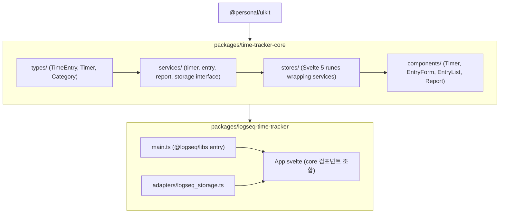

# time-tracker 프로젝트 분리 및 전체 구현

## 현재 상태

- `packages/time-tracker`는 React 기반 Logseq 플러그인 **스캐폴딩** (카운터 데모만 존재, 시간 추적 로직 없음)
- `@logseq/libs`는 프레임워크 무관 — Svelte 전환에 기술적 제약 없음
- 모노레포에 Svelte 5 인프라 이미 구축됨 ([config/vite.shared.ts](config/vite.shared.ts), [config/svelte.config.shared.js](config/svelte.config.shared.js), [config/tsconfig.svelte.json](config/tsconfig.svelte.json))

## 아키텍처



## 패키지 구조

### 1. `packages/time-tracker-core` — 플랫폼 무관 코어

```
packages/time-tracker-core/
├── src/
│   ├── types/
│   │   ├── timer.ts           # Timer, TimerState, TimerEvent
│   │   ├── entry.ts           # TimeEntry, Category, Tag
│   │   ├── report.ts          # DailySummary, WeeklySummary
│   │   └── index.ts
│   ├── services/
│   │   ├── timer_service.ts   # 타이머 시작/정지/일시정지 로직
│   │   ├── entry_service.ts   # 시간 기록 CRUD
│   │   ├── report_service.ts  # 통계 계산 (일별/주별)
│   │   └── index.ts
│   ├── storage/
│   │   ├── storage_adapter.ts # 추상 인터페이스 (StorageAdapter)
│   │   ├── memory_adapter.ts  # 테스트/기본용 인메모리 구현
│   │   ├── json_file_adapter.ts # JSON 파일 기반 (Node.js/Logseq fs)
│   │   └── index.ts
│   ├── stores/
│   │   ├── timer_store.svelte.ts   # Svelte 5 runes ($state, $derived)
│   │   ├── entries_store.svelte.ts
│   │   ├── report_store.svelte.ts
│   │   └── index.ts
│   ├── components/
│   │   ├── Timer/             # 타이머 표시 + 조작 버튼
│   │   ├── TimeEntryForm/     # 수동 시간 기록 입력
│   │   ├── TimeEntryList/     # 기록 목록 표시
│   │   ├── ReportView/        # 일별/주별 통계
│   │   └── index.ts
│   └── index.ts               # Public API (types, services, stores, components)
├── package.json
├── svelte.config.js           # config/svelte.config.shared.js 재사용
├── tsconfig.json              # config/tsconfig.svelte.json 확장
└── vite.config.ts             # config/vite.shared.ts 기반 라이브러리 빌드
```

### 2. `packages/logseq-time-tracker` — Logseq 플러그인

```
packages/logseq-time-tracker/
├── src/
│   ├── main.ts                # logseq.ready() 진입점
│   ├── App.svelte             # 메인 UI (core 컴포넌트 조합)
│   ├── adapters/
│   │   └── logseq_storage_adapter.ts  # Logseq 파일/블록 API 기반 저장
│   └── utils/
│       └── logseq_helpers.ts  # Logseq API 래퍼
├── index.html
├── logo.svg
├── package.json               # deps: @personal/time-tracker-core, @logseq/libs
├── svelte.config.js
├── tsconfig.json
└── vite.config.ts             # vite-plugin-logseq 포함
```

## 설계 문서

상세 설계는 `docs/design/` 디렉터리에 정리되어 있습니다:

- [00-overview.md](docs/design/00-overview.md) — 프로젝트 개요, 목표, 패키지 분리 구조
- [01-requirements.md](docs/design/01-requirements.md) — MoSCoW 기반 기능/비기능 요구사항
- [02-architecture.md](docs/design/02-architecture.md) — Hexagonal Architecture, 레이어, 의존성
- [03-data-model.md](docs/design/03-data-model.md) — Job, TimeEntry, Category, Status, History, Template
- [04-state-management.md](docs/design/04-state-management.md) — Job 상태 FSM, "진행중 1개" 제약
- [05-storage.md](docs/design/05-storage.md) — Storage Adapter 패턴, OPFS+SQLite, Logseq Adapter
- [06-ui-ux.md](docs/design/06-ui-ux.md) — 툴바, 풀화면, 셀렉터, 데이트피커, 템플릿
- [07-test-strategy.md](docs/design/07-test-strategy.md) — 단위/통합/E2E 테스트 전략, Phase별 범위, 인프라

## 핵심 설계 결정

- **Core ↔ Plugin 분리**: `time-tracker-core`는 Logseq 의존 없음. 껍데기만 Logseq
- **진행중 1개 제약**: `in_progress` 상태 Job은 시스템 전체에서 1개만 허용
- **Storage Adapter 패턴**: 구현체(Memory, OPFS+SQLite, Logseq) 교체 가능
- **Svelte 5 Runes**: 기존 모노레포 인프라 재사용
- **JobHistory + reason 필수**: 상태 전환 시 사유 기록 강제

## 구현 단계 (디자인 → 프로토타입 → 전체 구현)

### Phase 0: FigJam UI 디자인 (코드 구현 전)

- 에이전트가 FigJam에 와이어프레임/다이어그램 생성, 사용자가 검토/승인
- **사용자 흐름 다이어그램**: 잡생성→정보입력→트래킹시작, 상태전환 플로우
- **툴바 와이어프레임**: 진행중 Job 표시, 시작/일시정지, 작업 스위칭
- **풀화면 와이어프레임**: Job 목록, 통계, 설정, 템플릿 편집
- **공통 컴포넌트**: Timer, 셀렉터(폴더 중첩+검색), 데이트피커, JobList
- **페이지 인라인**: 현재 페이지 기반 시작 버튼, 카테고리 선택

### Phase 1: 프로토타입 (FigJam 승인 후)

- 두 패키지 스캐폴딩 + 핵심 타입 정의
- TimerService + TimerStore (Svelte 5 runes)
- MemoryStorageAdapter
- **단위 테스트**: TimerService, MemoryStorageAdapter, StatusKind 전환 검증
- Timer Svelte 컴포넌트 — **FigJam 디자인 기반**
- **통합 테스트**: Service+Storage 연동, Store 반응형, 컴포넌트 렌더링/동작
- logseq-time-tracker 진입점 (main.ts + App.svelte)
- **플러그인 테스트**: Logseq API 모킹, App+core 통합
- QA 게이트 (커버리지 80%+) → Security → Docs → Commit → 피드백

### Phase 2: 영속화 & Job 관리

- OPFS+SQLite Adapter, JobService, HistoryService, 상태 FSM
- **단위 테스트**: JobService CRUD/전환, HistoryService, SQLiteAdapter
- **통합 테스트**: FSM 전체 흐름, SQLite 영속화→재시작
- **E2E 테스트**: 기본 타이머 시작/정지, 작업 전환 플로우

### Phase 3: UI 고도화

- 셀렉터, 데이트피커, Job 생성 플로우, 템플릿 시스템
- **컴포넌트 테스트**: 셀렉터(폴더/검색), 데이트피커, JobCreation 폼
- **E2E 테스트**: 잡생성→정보입력→트래킹시작 전체 플로우

### Phase 4: 통계 & 연동

- eCount 연동, 작업별/카테고리별 통계, 폴더/검색 셀렉터
- **통합/E2E 테스트**: 통계 집계, 풀화면 표시, 툴바 상호작용

### Phase 5: 정리

- 기존 `packages/time-tracker` 삭제, 모노레포 정리
- **회귀 테스트**: 전체 테스트 스위트 실행, 커버리지 최종 확인
- 최종 문서화
