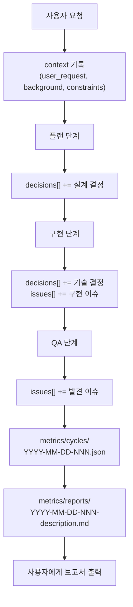

# 이슈/방향결정 기록 시스템 개선

## 현재 상태 분석

### 잘 되어 있는 부분

- planner 완료 보고에 "주요 의사결정 + 근거" 형식 존재
- developer 완료 보고에 "기술적 결정 + 이유" 형식 존재
- `.cursor/metrics/improvements/`에서 문제-원인-개선안 패턴으로 교훈 관리
- QA의 "발견된 이슈" 보고 프로세스

### 핵심 갭 (해결 대상)

1. **사용자 초기 이슈/배경이 기록되지 않음** - 왜 이 작업을 시작했는지의 맥락이 유실됨
2. **설계 단계 결정사항이 사이클 메트릭에 수집되지 않음** - planner가 보고해도 cycle JSON에 반영 안 됨
3. **작업 중 방향 전환/이슈가 추적되지 않음** - 재시도, 대안 선택 등의 판단 근거 유실
4. **최종 보고서에 이슈/결정 전용 섹션 없음** - 검증 결과에만 이슈 언급
5. **서브에이전트 간 이슈/결정 보고 형식 불통일** - planner는 "의사결정", developer는 "기술적 결정", QA는 "발견된 이슈"

## 저장소 설계 (권장)

기존 메트릭 시스템에 통합하는 방식을 권장합니다:

- **cycle-template.json**: `context`, `decisions[]`, `issues_encountered[]` 필드 추가 (구조화된 원본 데이터)
- **final-report-template.md**: "배경/이슈", "주요 결정사항" 섹션 추가 (사용자 대면 요약)
- **서브에이전트 정의**: 통일된 결정/이슈 보고 형식 적용
- **워크플로우**: 각 단계에서 결정/이슈 수집 지시 추가

별도 `.cursor/decisions/` 디렉토리는 만들지 않습니다. 기존 `improvements/`가 교훈/패턴 기록 역할을 이미 수행하고 있고, 사이클별 결정은 cycle JSON에 통합하는 것이 중복 없이 효율적입니다.

### 최종 보고서 파일 저장

최종 보고서를 채팅에만 출력하지 않고, **파일로도 저장**합니다:

- **저장 경로**: `.cursor/metrics/reports/`
- **파일명 규칙**: `YYYY-MM-DD-NNN-description.md` (improvements와 동일 패턴)
  - 예: `2026-02-27-001-이슈기록시스템개선.md`
  - NNN: 동일 날짜 내 3자리 제로패딩 시퀀스
- **내용**: final-report-template.md 형식을 따른 전체 보고서
- **시점**: 10단계(최종 보고서) 제출 시 동시에 파일 저장

## 변경 파일 목록

### 1. `cycle-template.json` - 메트릭 스키마 확장

새 필드 추가:

```json
{
  "context": {
    "user_request": "",
    "background": "",
    "constraints": []
  },
  "decisions": [
    {
      "phase": "planning|implementation|qa|security",
      "decision": "",
      "rationale": "",
      "alternatives_considered": []
    }
  ],
  "issues_encountered": [
    {
      "phase": "planning|implementation|qa|security",
      "description": "",
      "resolution": "",
      "impact": "none|minor|major|critical"
    }
  ]
}
```

- `context`: 사용자 초기 요청, 배경, 제약사항
- `decisions[]`: 각 단계의 결정 + 근거 + 검토한 대안
- `issues_encountered[]`: 발생한 문제 + 해결방법 + 영향도

### 2. `final-report-template.md` - 보고서 섹션 추가

기존 "1. 요약" 다음에 두 섹션 삽입:

- **1.5 배경 및 맥락**: 사용자 요청 배경, 제약사항
- **1.7 주요 결정사항**: 결정 + 근거 + 대안 테이블
- **2.x 발견된 이슈 및 해결**: 이슈 + 해결 + 영향도

### 3. `.cursor/metrics/reports/` - 최종 보고서 저장소 신설

- `.gitkeep` 파일로 디렉토리 생성
- 파일명: `YYYY-MM-DD-NNN-description.md`
- 기존 `cycles/`, `improvements/`, `summaries/`와 나란히 위치

### 4. `plan-execution-workflow.md` - 단계별 수집 지시 추가

각 단계(플랜, 실행, QA, 커밋)에 "결정/이슈 수집" 항목 추가:

- 2단계(플랜): 설계 결정사항 수집 필수
- 3단계(실행): 구현 중 방향 전환/이슈 수집
- 4단계(QA): 발견된 이슈 수집
- 10단계(최종 보고서): cycle JSON의 decisions/issues를 보고서에 반영

### 5. `main-orchestrator.mdc` - 메인 에이전트 규칙 보강

- 서브에이전트 호출 시 "결정/이슈를 보고하라" 지시 추가
- 서브에이전트 결과 수신 시 decisions/issues를 cycle 메트릭에 기록하는 절차 추가
- 품질 게이트에서 결정/이슈 수집 여부 확인 항목 추가

### 6. 서브에이전트 정의 파일 - 통일된 보고 형식

대상: [planner.md](`.cursor/agents/planner.md`), [developer.md](`.cursor/agents/developer.md`), [qa.md](`.cursor/agents/qa.md`)

각 에이전트의 "완료 보고" 섹션에 통일 형식 적용:

```markdown
## 결정사항 (Decisions)
| 결정 | 근거 | 검토한 대안 |
|------|------|-------------|

## 발견된 이슈 (Issues)
| 이슈 | 해결 방법 | 영향도 |
|------|-----------|--------|
```

### 7. `metrics-collection.md` - 수집 가이드 업데이트

새 필드(`context`, `decisions`, `issues_encountered`)의 수집 시점과 방법을 기존 가이드에 추가

## 데이터 흐름




