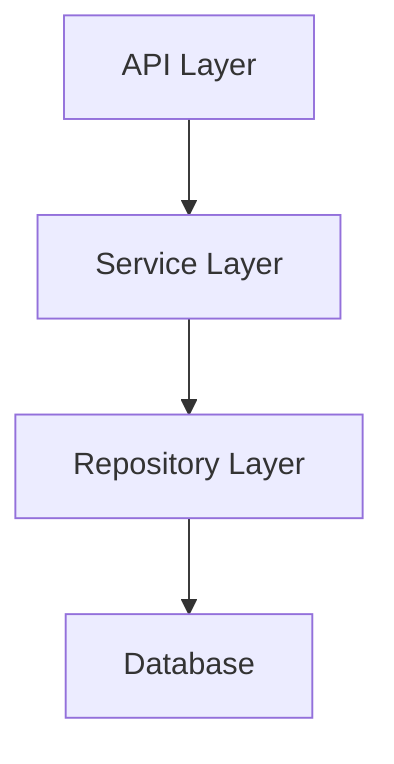

# 아키텍처 설계 가이드

이 Skill은 기획 에이전트가 시스템 아키텍처를 설계하는 방법을 제공합니다.

## 설계 원칙

### 1. SOLID 원칙
- **S**ingle Responsibility: 단일 책임
- **O**pen/Closed: 확장에는 열려있고 수정에는 닫혀있음
- **L**iskov Substitution: 하위 타입은 상위 타입을 대체 가능
- **I**nterface Segregation: 인터페이스 분리
- **D**ependency Inversion: 의존성 역전

### 2. 관심사 분리 (Separation of Concerns)
- UI / 비즈니스 로직 / 데이터 분리
- 각 레이어는 독립적

### 3. DRY (Don't Repeat Yourself)
- 중복 제거
- 재사용 가능한 컴포넌트

---

## 아키텍처 패턴

### 1. 레이어드 아키텍처 (Layered Architecture)

```
┌─────────────────────┐
│  Presentation Layer │  ← UI, Controllers
├─────────────────────┤
│   Business Layer    │  ← Services, Logic
├─────────────────────┤
│ Data Access Layer   │  ← Repositories, DAOs
├─────────────────────┤
│     Database        │
└─────────────────────┘
```

**적합한 경우:**
- 전통적인 웹 애플리케이션
- CRUD 중심 시스템

### 2. Clean Architecture

```
┌──────────────────────────────────┐
│        Frameworks & Drivers      │
│  (UI, DB, External Interfaces)   │
├──────────────────────────────────┤
│      Interface Adapters          │
│  (Controllers, Presenters, Gateways) │
├──────────────────────────────────┤
│       Use Cases                  │
│  (Application Business Rules)    │
├──────────────────────────────────┤
│         Entities                 │
│  (Enterprise Business Rules)     │
└──────────────────────────────────┘
```

**적합한 경우:**
- 복잡한 비즈니스 로직
- 테스트 중요
- 프레임워크 독립성 필요

### 3. Hexagonal Architecture (Ports & Adapters)

```
        ┌─────────────────┐
        │   Primary       │
        │   Adapters      │
        │  (REST API)     │
        └────────┬────────┘
                 │
        ┌────────▼────────┐
        │   Application   │
        │      Core       │
        │  (Domain Logic) │
        └────────┬────────┘
                 │
        ┌────────▼────────┐
        │   Secondary     │
        │   Adapters      │
        │ (DB, External)  │
        └─────────────────┘
```

**적합한 경우:**
- 외부 시스템 연동 많음
- 도메인 로직 보호 필요

---

## 컴포넌트 설계

### 디렉토리 구조 예시

```
src/
├── api/              # API 엔드포인트
│   ├── controllers/
│   ├── middlewares/
│   └── routes/
├── services/         # 비즈니스 로직
│   ├── user-service.ts
│   └── auth-service.ts
├── repositories/     # 데이터 접근
│   ├── user-repository.ts
│   └── session-repository.ts
├── models/           # 데이터 모델
│   ├── user.ts
│   └── session.ts
├── utils/            # 유틸리티
│   └── validators.ts
└── config/           # 설정
    └── database.ts
```

---

## 의존성 관리

### 의존성 방향

```
Controller → Service → Repository → Database
     ↓          ↓          ↓
   (상위)    (중간)     (하위)
```

**원칙:** 상위는 하위를 알지만, 하위는 상위를 모름

---

## 설계 문서 템플릿

```markdown
# 아키텍처 설계: [시스템명]

## 1. 개요

### 1.1 목적
이 시스템은 [...]를 제공합니다.

### 1.2 주요 목표
- 확장성
- 유지보수성
- 테스트 용이성

## 2. 아키텍처 스타일
[Layered / Clean / Hexagonal]

## 3. 컴포넌트 다이어그램



## 4. 주요 컴포넌트

### 4.1 API Layer
- 역할: HTTP 요청 처리
- 기술: Express.js
- 책임: 입력 검증, 라우팅

### 4.2 Service Layer
- 역할: 비즈니스 로직
- 기술: TypeScript
- 책임: 도메인 규칙 적용

### 4.3 Repository Layer
- 역할: 데이터 접근
- 기술: TypeORM
- 책임: DB 쿼리, 트랜잭션

## 5. 데이터 흐름

1. 클라이언트 요청
2. API Controller 수신
3. Service 호출
4. Repository를 통한 DB 접근
5. 결과 반환

## 6. 기술 스택

- Runtime: Node.js 18
- Framework: Express 4
- Database: PostgreSQL 14
- ORM: TypeORM 0.3
- Testing: Vitest

## 7. 확장성 고려사항

- 수평 확장 가능 (Stateless)
- 캐싱 (Redis)
- 로드 밸런싱

## 8. 보안 고려사항

- HTTPS 필수
- JWT 인증
- Rate Limiting
```

---

## 체크리스트

- [ ] 아키텍처 스타일 선택
- [ ] 컴포넌트 정의
- [ ] 의존성 방향 설정
- [ ] 데이터 흐름 정의
- [ ] 확장성 고려
- [ ] 보안 고려
- [ ] 다이어그램 작성

## 완료 기준

- [ ] 아키텍처 문서 완성
- [ ] 컴포넌트 다이어그램 포함
- [ ] 기술 스택 명시
- [ ] 확장성/보안 고려
