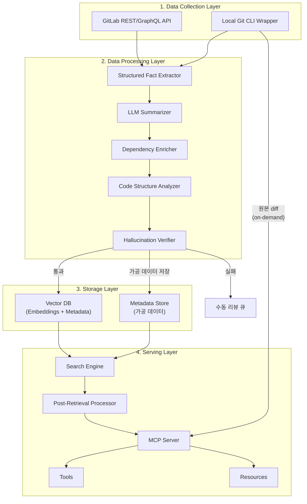
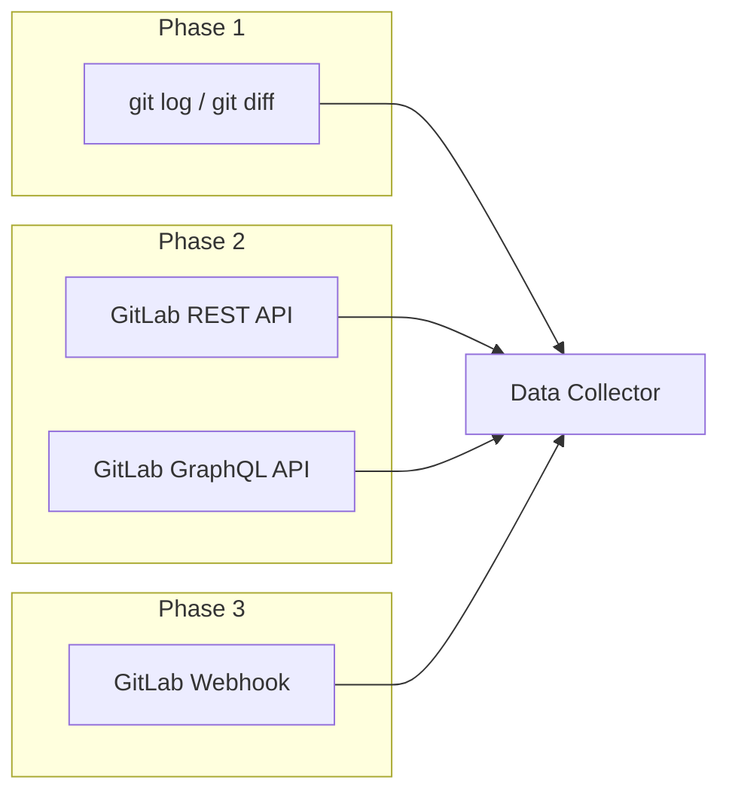
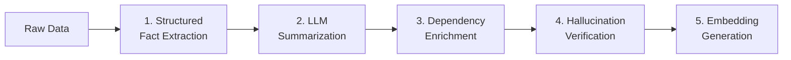
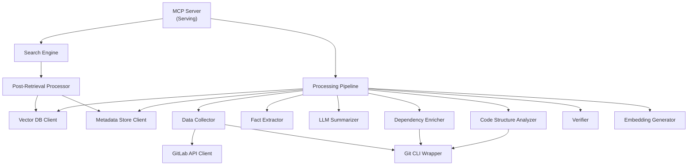
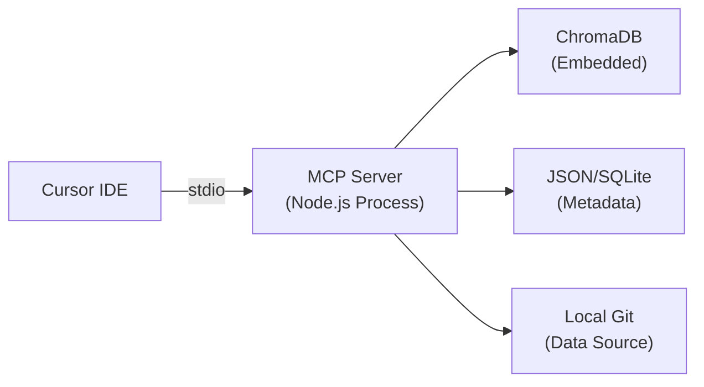
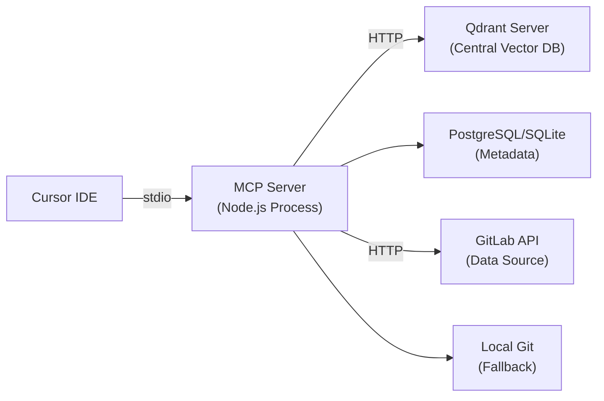
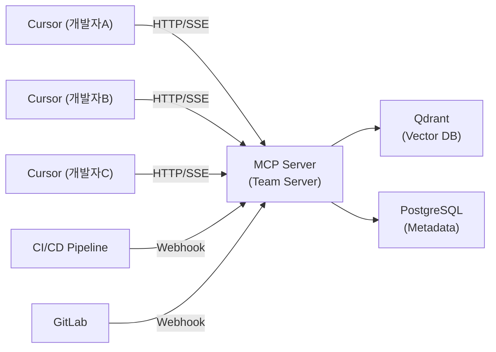

# 시스템 아키텍처

## 1. 아키텍처 개요

시스템은 4개 레이어로 분리된다. 각 레이어는 명확한 책임을 가지며, 레이어 간 인터페이스를 통해 교체 가능하도록 설계한다.



---

## 2. 레이어 상세

### 2-1. Data Collection Layer

외부 데이터 소스에서 raw 데이터를 수집하는 레이어.

| 컴포넌트              | 책임                                                   | Phase   |
| --------------------- | ------------------------------------------------------ | ------- |
| **GitCLI Wrapper**    | 로컬 `git log`, `git diff`, `git show` 실행 및 파싱    | Phase 1 |
| **GitLab API Client** | GitLab REST/GraphQL API를 통한 MR, 커밋, 디스커션 수집 | Phase 2 |
| **Webhook Receiver**  | GitLab 웹훅으로 실시간 이벤트 수신 (MR 머지, 푸시 등)  | Phase 3 |



**수집 대상 데이터**:

| 소스              | 데이터                      | 용도                  |
| ----------------- | --------------------------- | --------------------- |
| Git commit        | diff, message, author, date | 코드 변경 팩트 + 맥락 |
| GitLab MR         | title, description, labels  | 변경 목적/배경        |
| GitLab Discussion | 리뷰 코멘트, 스레드         | 의사결정 근거         |
| GitLab Approval   | 승인자, 승인 시점           | 리뷰 히스토리         |

### 2-2. Data Processing Layer

수집된 raw 데이터를 벡터 DB에 적재 가능한 형태로 가공하는 레이어. 파이프라인 형태로 순차 처리한다.



| 단계                       | 방식                 | 입력                 | 출력                          | Phase |
| -------------------------- | -------------------- | -------------------- | ----------------------------- | ----- |
| Structured Fact Extraction | Deterministic (파서) | diff, commit message | 파일목록, 함수목록, 변경 통계 | 1a    |
| LLM Summarization          | LLM API 호출         | 팩트 + diff 컨텍스트 | "무엇을/왜" 요약 텍스트       | 1a    |
| Dependency Enrichment      | AST 파싱             | 변경 파일 경로       | import/export 관계 그래프     | 1b    |
| Code Structure Analysis    | AST 파싱 + 패턴 매칭 | 프로젝트 소스 파일   | 아키텍처 스냅샷, 파일 역할    | 1b    |
| Hallucination Verification | Rule-based + LLM     | 요약 + 팩트          | 통과/실패 + 신뢰도 점수       | 1a    |
| Embedding Generation       | Embedding API        | 검증 통과 요약       | 벡터 임베딩                   | 1a    |

상세: [02-data-pipeline.md](./02-data-pipeline.md)

### 2-3. Storage Layer

처리된 데이터를 저장하고 검색을 지원하는 레이어.

**두 개의 스토어**를 운영한다:

| 스토어             | 저장 내용                                   | 용도                        |
| ------------------ | ------------------------------------------- | --------------------------- |
| **Vector DB**      | 임베딩 + 요약 텍스트 + 필터용 메타데이터    | 유사도 검색, 필터링 검색    |
| **Metadata Store** | structured_facts, llm_summary, verification | 가공 데이터 저장, 상세 조회 |

> raw diff는 별도 저장하지 않는다. 원본은 `git show` 또는 GitLab API로 on-demand 조회.

Vector DB와 Metadata Store를 분리하는 이유:

- 벡터 DB에는 검색에 필요한 최소 데이터만 저장 (성능)
- 원본 raw 데이터는 크기가 크고 검색 대상이 아님
- 요약에서 원본을 추적해야 할 때 메타데이터 스토어 참조

**Phase별 구현**:

| Phase | Vector DB                      | Metadata Store         |
| ----- | ------------------------------ | ---------------------- |
| 1     | ChromaDB (embedded, 로컬 파일) | JSON 파일 또는 SQLite  |
| 2~3   | Qdrant (서버 모드)             | PostgreSQL 또는 SQLite |

상세: [03-data-model.md](./03-data-model.md)

### 2-4. Serving Layer

MCP 프로토콜을 통해 LLM(Cursor 등)에 컨텍스트를 제공하는 레이어.

| 컴포넌트                     | 책임                                                       | Phase |
| ---------------------------- | ---------------------------------------------------------- | ----- |
| **MCP Server**               | MCP 프로토콜 핸들링, 요청 라우팅                           | 1a    |
| **Search Engine**            | Vector DB 쿼리, 메타데이터 조합, 시간 가중치 적용          | 1a    |
| **Post-Retrieval Processor** | 검색 결과 중복 제거, 시간순 정렬, 맥락 조합, 노이즈 필터링 | 1a    |
| **Tools**                    | LLM이 호출하는 도구 (검색, 분석, 인제스트)                 | 1a    |
| **Resources**                | 정적 컨텍스트 제공 (프로젝트 통계, 핫 파일 등)             | 1a    |

**Phase별 전송 방식**:

| Phase | Transport                  | 접근 방식                                   |
| ----- | -------------------------- | ------------------------------------------- |
| 1     | stdio                      | Cursor에서 로컬 프로세스로 실행             |
| 2     | stdio                      | Cursor에서 로컬 프로세스, 원격 벡터 DB 접속 |
| 3     | HTTP/SSE (Streamable HTTP) | 팀 서버에 배포, Cursor에서 원격 접속        |

상세: [05-mcp-interface.md](./05-mcp-interface.md)

---

## 3. 컴포넌트 의존성



---

## 4. 배포 진화 경로

### Phase 1: 로컬 All-in-One



- 단일 Node.js 프로세스
- ChromaDB embedded 모드 (파일 기반)
- 메타데이터는 로컬 JSON/SQLite
- 데이터 소스는 로컬 Git 리포지토리

### Phase 2: 중앙 벡터 DB 분리



- MCP 서버는 여전히 로컬 프로세스
- 벡터 DB는 중앙 서버(Qdrant)로 분리
- GitLab API로 MR/커밋 수집
- 여러 개발자가 동일 벡터 DB 공유 가능

### Phase 3: 팀 공유 MCP 서버



- MCP 서버를 팀 서버에 배포
- HTTP/SSE(Streamable HTTP) 전송
- CI/CD 파이프라인에서 MR 머지 시 자동 인덱싱
- 인증/권한으로 프로젝트별 접근 제어

---

## 5. 패키지 구조 (모노레포 내)

```
packages/cr-rag-mcp/
├── src/
│   ├── index.ts                 # MCP 서버 엔트리포인트
│   ├── server/                  # MCP 서버 설정, 핸들러 라우팅
│   ├── tools/                   # MCP Tools 구현
│   ├── resources/               # MCP Resources 구현
│   ├── collection/              # Data Collection Layer
│   │   ├── git_cli.ts           # Git CLI 래퍼
│   │   └── gitlab_client.ts     # GitLab API 클라이언트
│   ├── processing/              # Data Processing Layer
│   │   ├── extractor.ts         # 구조화 팩트 추출
│   │   ├── summarizer.ts        # LLM 요약 생성
│   │   ├── enricher.ts          # 의존성 분석
│   │   ├── code_analyzer.ts     # 코드 구조 분석 (Phase 1b)
│   │   ├── verifier.ts          # 할루시네이션 검증
│   │   └── embedder.ts          # 임베딩 생성
│   ├── storage/                 # Storage Layer
│   │   ├── vector_db.ts         # Vector DB 클라이언트 (인터페이스 + 구현)
│   │   └── meta_store.ts        # 메타데이터 스토어 (인터페이스 + 구현)
│   └── search/                  # 검색 엔진
│       ├── engine.ts            # 유사도 검색 + 필터링 + 결과 조합
│       └── post_processor.ts    # 후처리 (중복제거, 시간순 정렬, 맥락 조합)
├── package.json
├── tsconfig.json
└── README.md
```

기존 `packages/mcp-server`(개인 유틸리티 MCP)와는 **독립된 패키지**로 운영한다. 공통 의존성(`@modelcontextprotocol/sdk`)은 모노레포 catalog에서 버전을 공유한다.
