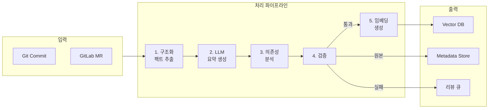
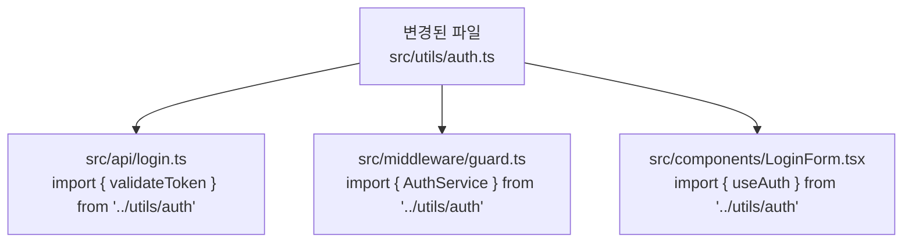
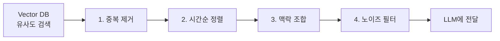
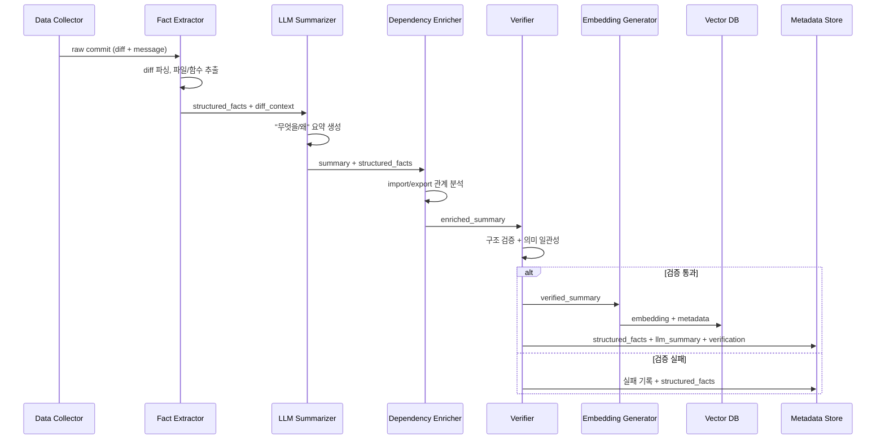

# 데이터 파이프라인

## 1. 개요

데이터 파이프라인은 raw 데이터(커밋, MR)를 벡터 DB에 적재 가능한 형태로 가공한다. 핵심은 **팩트와 해석의 분리**이다.

- **팩트**(무엇이 변경되었는가): diff에서 결정론적으로 추출
- **해석**(왜 변경되었는가): LLM이 생성, 검증을 거쳐 인덱싱



---

## 2. 수집 전략

### 2-1. Phase 1: 로컬 Git 기반

외부 API 없이 로컬 Git 리포지토리에서 직접 수집한다.

**수집 명령**:

```bash
# 커밋 목록 (JSON 형태)
git log --format='{"hash":"%H","short":"%h","author":"%an","date":"%aI","subject":"%s"}' --since="2024-01-01"

# 특정 커밋의 diff
git show --format="" --stat <commit_hash>   # 변경 파일 통계
git show --format="" -p <commit_hash>        # 전체 diff
git diff <commit_hash>^..<commit_hash>       # 부모 대비 diff
```

**초기 벌크 로드**:

- 지정된 날짜 이후의 모든 커밋을 일괄 수집
- 배치 크기 조절 (LLM API 비용/속도 고려)
- 진행 상황 추적 (마지막 처리된 commit hash 기록)

**증분 업데이트**:

- 마지막 처리된 commit hash 이후의 새 커밋만 처리
- 수동 트리거 (`ingest_commits` MCP Tool) 또는 주기적 실행

### 2-2. Phase 2: GitLab API 기반

GitLab REST/GraphQL API로 MR + 커밋 + 디스커션을 수집한다.

**수집 대상**:

| API 엔드포인트                                      | 데이터       | 비고                           |
| --------------------------------------------------- | ------------ | ------------------------------ |
| `GET /projects/:id/merge_requests`                  | MR 목록      | `state=merged` 필터            |
| `GET /projects/:id/merge_requests/:iid`             | MR 상세      | description, labels, milestone |
| `GET /projects/:id/merge_requests/:iid/commits`     | MR 커밋      | MR에 포함된 커밋 목록          |
| `GET /projects/:id/merge_requests/:iid/changes`     | MR 변경 사항 | diff 데이터                    |
| `GET /projects/:id/merge_requests/:iid/discussions` | MR 디스커션  | 리뷰 코멘트                    |
| `GET /projects/:id/merge_requests/:iid/approvals`   | MR 승인      | 승인자, 승인 시점              |
| `GET /projects/:id/repository/commits`              | 커밋 목록    | MR 없는 직접 푸시 커밋 포함    |
| `GET /projects/:id/repository/commits/:sha/diff`    | 커밋 diff    | 개별 커밋 diff                 |

**Rate Limiting 대응**:

- GitLab API 기본 제한: 300 requests/minute (인증 시)
- 배치 간 delay 삽입
- 429 응답 시 `Retry-After` 헤더 기반 대기
- GraphQL 사용 시 단일 요청으로 여러 필드 조회 (요청 수 절감)

### 2-3. Phase 3: 웹훅 기반 실시간

GitLab 웹훅으로 MR 머지 이벤트를 실시간 수신하여 자동 인덱싱한다.

**웹훅 이벤트**:

- `merge_request` (action: `merge`): MR 머지 시 트리거
- `push`: 직접 푸시 시 트리거

---

## 3. 커밋 그룹핑 (Logical Change Unit)

MR이 없는 환경에서는 하나의 작업이 여러 커밋으로 나뉘어 푸시되는 경우가 많다. 이를 개별로 요약하면 `"wip"`, `"fix typo"`, `"done"` 같은 무의미한 데이터가 생기고, LLM 토큰도 낭비된다. 수집 직후, LLM 요약 전에 연속 커밋을 하나의 **논리적 변경 단위(Logical Change Unit)**로 그룹핑한다.

### 3-0-1. 그룹핑 조건

동일 그룹으로 판정하는 기준 (모든 조건 AND):

| 조건        | 기준                  | 비고         |
| ----------- | --------------------- | ------------ |
| 동일 작성자 | `author` 일치         | 필수         |
| 시간 간격   | 연속 커밋 간 N분 이내 | 기본값: 30분 |
| 동일 브랜치 | `branch` 일치         | 필수         |

선택적 강화 조건:

| 조건      | 기준                      | 비고                            |
| --------- | ------------------------- | ------------------------------- |
| 파일 겹침 | 변경 파일이 1개 이상 겹침 | 정확도 향상, Phase 1에서는 선택 |

> 시간 간격 임계값(30분)은 프로토타입에서 튜닝. 팀/프로젝트마다 패턴이 다르므로 설정 가능하게 구현.

### 3-0-2. 그룹핑 알고리즘

```
입력: 시간순 정렬된 커밋 목록
출력: 그룹핑된 LogicalChangeUnit 목록

1. 커밋 목록을 시간순(오래된 것 먼저) 정렬
2. 첫 커밋으로 새 그룹 시작
3. 다음 커밋이 현재 그룹의 마지막 커밋과:
   - 동일 작성자 AND 동일 브랜치 AND 시간 간격 ≤ N분
   → 현재 그룹에 추가
   - 아니면 → 새 그룹 시작
4. 반복
```

### 3-0-3. 인터페이스

```typescript
interface LogicalChangeUnit {
    group_id: string; // 그룹의 첫 커밋 hash
    commits: string[]; // 포함된 커밋 hash 목록 (시간순)
    author: string;
    branch: string;
    time_range: {
        first: string; // 첫 커밋 시간 (ISO 8601)
        last: string; // 마지막 커밋 시간
    };
    merged_message: string; // 모든 커밋 메시지 연결
    merged_files: FileChange[]; // 모든 파일 변경 통합 (중복 제거)
    total_additions: number;
    total_deletions: number;
    is_single: boolean; // 단일 커밋 그룹 여부
}
```

### 3-0-4. LLM 요약 단위

| 케이스                         | 요약 단위          | Vector DB 저장                              |
| ------------------------------ | ------------------ | ------------------------------------------- |
| 단일 커밋 (`is_single: true`)  | 커밋 1개           | CommitDocument 1개                          |
| 그룹 커밋 (`is_single: false`) | 그룹 전체를 하나로 | CommitDocument 1개 (대표 hash = `group_id`) |

그룹 커밋의 경우:

- `merged_message`(모든 커밋 메시지 연결)와 통합 diff를 LLM에 전달
- Vector DB에는 대표 문서 1개만 저장, metadata의 `commit_hash`는 첫 커밋, `grouped_commits`에 전체 목록 보관
- 개별 커밋은 Metadata Store에 참조용으로 기록

### 3-0-5. MR이 있는 경우

MR에 포함된 커밋은 이미 MRDocument로 묶이므로 그룹핑 대상에서 제외한다. 그룹핑은 MR 없이 직접 푸시된 커밋에만 적용.

---

## 4. 처리 단계 상세

### 4-1. 구조화 팩트 추출 (Deterministic)

diff에서 LLM 없이 결정론적으로 추출하는 팩트 데이터.

**추출 항목**:

| 항목             | 추출 방식                  | 예시                                        |
| ---------------- | -------------------------- | ------------------------------------------- |
| 변경 파일 목록   | diff 헤더 파싱             | `["src/utils/auth.ts", "src/api/login.ts"]` |
| 파일별 변경 통계 | `--stat` 파싱              | `{ additions: 25, deletions: 10 }`          |
| 변경 함수/클래스 | diff hunk 헤더 (`@@`) 파싱 | `["validateToken()", "AuthService"]`        |
| 변경 유형        | 파일 상태                  | `added / modified / deleted / renamed`      |
| 커밋 메시지      | git log                    | `"fix: 토큰 만료 시 무한 리다이렉트 수정"`  |
| 커밋 메시지 분류 | Conventional Commits 파싱  | `type: "fix", scope: null`                  |

**출력 구조** (TypeScript):

```typescript
interface StructuredFacts {
    commit_hash: string;
    author: string;
    date: string; // ISO 8601
    message: string;
    conventional_type?: string; // feat, fix, refactor, ...
    conventional_scope?: string;
    files: FileChange[];
    total_additions: number;
    total_deletions: number;
}

interface FileChange {
    path: string;
    status: 'added' | 'modified' | 'deleted' | 'renamed';
    old_path?: string; // renamed인 경우
    additions: number;
    deletions: number;
    functions_modified: string[]; // hunk 헤더에서 추출
}
```

### 4-2. LLM 요약 생성

구조화 팩트와 diff 컨텍스트를 LLM에 전달하여 변경 내용을 요약한다.

**핵심 원칙: "what" 확실, "why" 정직, 추론은 명시**

커밋 메시지와 diff만으로는 변경 이유("why")를 확신할 수 없는 경우가 많다. LLM이 이유를 추측하여 그럴듯한 가짜 이유를 만들어내면, 이후 코드 리뷰에서 잘못된 컨텍스트를 제공하게 된다. 따라서:

- **"무엇을(what)" 변경했는지**는 diff에서 확정적으로 추출 → 반드시 정확하게 기술
- **"왜(why)" 변경했는지**는 커밋 메시지에 명확한 근거가 있을 때만 기술
- diff의 기술적 맥락에서 **추론 가능한 이유**는 `[추론된내용]` 태그를 붙여 명시
- 비즈니스적 이유의 추측은 금지 (예: "기획팀 요청으로..." 같은 추측)
- 이유를 전혀 알 수 없으면 `reason_known: false`로 명시
- 사용자가 나중에 이유를 보강할 수 있는 구조 제공

**"why" 데이터의 3단계 분류**:

| 분류            | `reason_known` | `reason_inferred` | content 표기            | 예시                                            |
| --------------- | :------------: | :---------------: | ----------------------- | ----------------------------------------------- |
| **명확한 이유** |     `true`     |      `false`      | 태그 없음               | 커밋 메시지 "fix: 토큰 만료 시 무한 리다이렉트" |
| **기술적 추론** |     `true`     |      `true`       | `[추론된내용]`          | diff에서 null check 추가 → "NPE 방지로 추론"    |
| **이유 불명**   |    `false`     |      `false`      | 없음 (reason 필드 null) | 커밋 메시지 "update", "wip"                     |

**content 생성 예시**:

```
# reason_known: true, reason_inferred: false (명확한 이유)
"validateToken() 함수에서 만료된 토큰에 대해 false를 반환하도록 변경하고,
리다이렉트 전 토큰 갱신 로직을 추가. 토큰 만료 시 무한 리다이렉트 루프 버그 수정."

# reason_known: true, reason_inferred: true (기술적 추론)
"UserService 클래스의 getProfile() 메서드에 null check를 추가하고,
Optional chaining으로 변경. [추론된내용] user 객체가 null일 때 발생하는
런타임 에러 방지를 위한 방어적 코딩으로 보임."

# reason_known: false (이유 불명)
"validateToken() 함수에 revoked 토큰 체크 조건을 추가."
```

**프롬프트 설계 원칙**:

- 구조화 팩트를 명시적으로 제공하여 LLM이 팩트를 "만들어내지" 않도록 함
- **"왜"를 모를 때는 반드시 `reason_known: false`로 표기** (추측 금지)
- 요약은 **변경 내용(what) 우선**, 이유(why)는 근거가 있을 때만
- 출력 형식을 JSON으로 강제

**프롬프트 구조** (예시):

```
당신은 코드 변경 히스토리 분석가입니다.

아래 커밋의 구조화 팩트와 diff를 분석하여 요약해주세요.

## 중요 규칙
- "무엇을 변경했는지(what)"는 diff를 기반으로 정확하게 기술하세요.
- "왜 변경했는지(why)"는 커밋 메시지에 명확한 이유가 있을 때만 기술하세요.
- diff의 기술적 맥락에서 이유를 추론할 수 있는 경우(예: null check 추가 → NPE 방지),
  reason_known을 true, reason_inferred를 true로 설정하고,
  content(what) 본문에 추론된 부분을 [추론된내용] 태그로 감싸세요.
- 비즈니스적 이유(기획 요청, 사용자 피드백 등)는 절대로 추측하지 마세요.
- 커밋 메시지가 "fix bug", "update", "wip" 등 모호하고 diff에서도 이유를 추론할 수 없으면,
  reason_known을 false로 설정하고 reason을 null로 두세요.

## 구조화 팩트
- 커밋 메시지: {message}
- 변경 파일: {files}
- 변경 통계: +{additions}, -{deletions}
- 변경 함수: {functions}

## Diff
{diff_content}

## 출력 형식 (JSON)
{
  "what": "무엇을 변경했는지 1~3문장으로 요약. 추론된 부분은 [추론된내용] 태그 사용",
  "reason_known": true | false,
  "reason_inferred": true | false,
  "reason": "변경 이유 (reason_known이 false이면 null, 추론이면 추론 근거)",
  "change_type": "bugfix | feature | refactor | optimization | chore | unknown",
  "impact": "이 변경이 시스템에 미치는 영향",
  "risk_notes": "주의해야 할 점 (없으면 null)"
}
```

**요약 출력 인터페이스**:

```typescript
interface CommitSummary {
    what: string; // 변경 내용 (항상 존재, 추론 부분은 [추론된내용] 태그 포함)
    reason_known: boolean; // 이유를 알 수 있는가
    reason_inferred: boolean; // 기술적 추론인가 (true면 content에 [추론된내용] 태그 포함)
    reason: string | null; // 변경 이유 (모르면 null, 추론이면 추론 근거)
    change_type: 'bugfix' | 'feature' | 'refactor' | 'optimization' | 'chore' | 'unknown';
    impact: string;
    risk_notes: string | null;
}
```

**사용자 보강 구조**:

`reason_known: false`인 커밋은 나중에 사용자가 이유를 보강할 수 있다. 보강된 이유는 Metadata Store에 저장하고, Vector DB의 content(임베딩 대상 텍스트)를 재생성한다.

```typescript
interface ReasonSupplement {
    commit_hash: string;
    reason: string; // 사용자가 보강한 이유
    supplemented_by: string; // 보강한 사람
    supplemented_at: string; // ISO 8601
}
```

**Diff 크기 게이트**:

LLM에 전달하기 전에 diff 줄 수를 측정하여 처리 방식을 결정한다. 바이너리 파일, 자동 생성 파일(lock 파일, `*.min.js` 등)은 측정 전에 제외.

```typescript
interface DiffSizeGate {
    total_lines: number;
    estimated_tokens: number; // 줄 수 기반 추정 (평균 ~4 tokens/line)
    estimated_cost_usd: number; // estimated_tokens * 모델 단가
    tier: 'small' | 'medium' | 'large';
    strategy: 'auto' | 'split' | 'confirm';
}
```

| 구분          | 줄 수 기준 | 예상 토큰         | 처리 방식                      |
| ------------- | ---------- | ----------------- | ------------------------------ |
| 소형 (small)  | ~200줄     | ~800 tokens       | 자동 처리: 전체 diff → LLM     |
| 중형 (medium) | 200~500줄  | ~800~2,000 tokens | 자동 분할: 파일별 분할 후 처리 |
| 대형 (large)  | 500줄~     | ~2,000+ tokens    | **사용자 확인 요청** 후 처리   |

**대형 diff 사용자 확인 흐름**:

```
1. diff 줄 수 측정
2. 예상 토큰 수 + 예상 비용(USD) 계산
3. 사용자에게 선택지 제시:
   - (a) 파일별 분할 처리 (비용: $X.XX 예상)
   - (b) 구조화 팩트만 저장, LLM 요약 스킵
   - (c) 이 커밋 전체 스킵
4. 사용자 선택에 따라 처리
```

**토큰 추정 로직**:

```typescript
function estimateDiffSize(diff_lines: string[]): DiffSizeGate {
    const total_lines = diff_lines.length;
    const estimated_tokens = Math.ceil(total_lines * 4);
    const cost_per_token = 0.00000015; // GPT-4o-mini input
    const estimated_cost_usd = estimated_tokens * cost_per_token;

    let tier: DiffSizeGate['tier'];
    let strategy: DiffSizeGate['strategy'];

    if (total_lines <= 200) {
        tier = 'small';
        strategy = 'auto';
    } else if (total_lines <= 500) {
        tier = 'medium';
        strategy = 'split';
    } else {
        tier = 'large';
        strategy = 'confirm';
    }

    return { total_lines, estimated_tokens, estimated_cost_usd, tier, strategy };
}
```

> 임계값(200/500줄)은 프로토타입에서 실측 후 튜닝. `cost_per_token`은 모델 변경 시 갱신.

**파일별 분할 처리** (medium/large 공통):

- 파일별 diff를 개별 LLM 호출로 요약
- 파일별 요약 → 커밋 전체 요약으로 2단계 집계

### 4-3. 코드 구조 추출 (Code Structure Extraction)

코드 리뷰에서 "어떤 함수가 변경되었는가"뿐만 아니라 **"그 함수가 어디에 속하고, 무슨 역할인가"**를 이해해야 정확한 컨텍스트를 제공할 수 있다. 구조화 팩트 추출(3-1)에서 추출하는 hunk 헤더 기반 함수명은 이름만 알 수 있고, 소속/역할/시그니처를 모른다.

**추출 수준**:

| 수준         | 추출 대상                               | Phase | 방식                                           |
| ------------ | --------------------------------------- | ----- | ---------------------------------------------- |
| L1: 파일     | 파일 경로, 파일 역할 추론               | 1a    | 경로 패턴 (`/utils/`, `/api/`, `/components/`) |
| L2: 심볼     | 함수명, 클래스명                        | 1a    | diff hunk 헤더 (`@@`) 파싱                     |
| L3: 시그니처 | 함수 파라미터/반환 타입, 클래스 멤버    | 1b    | TypeScript Compiler API                        |
| L4: 관계     | 클래스 상속, 인터페이스 구현, 호출 관계 | 1b    | TypeScript Compiler API + 타입 체커            |

> Phase 1a에서는 hunk 헤더 파싱으로 L1~L2를 추출하고, Phase 1b에서 TypeScript Compiler API를 도입하여 L3~L4 상세 정보를 보완한다.

**코드 구조 추출 인터페이스**:

```typescript
interface CodeStructure {
    file_path: string;
    file_role: string; // 사용자 정의 역할 포함 가능 (기본: component, util, api, ...)
    symbols_modified: string[]; // hunk 헤더 1차 추출 + AST 보완
    symbols_detail: SymbolDetail[]; // AST에서 추출한 상세 정보
}
```

**file_role 추론: 사용자 정의 우선**

프로젝트마다 디렉토리 구조가 다르므로, `file_role` 추론은 사용자 정의 설정을 우선 적용하고, 매칭되지 않으면 내장 패턴으로 폴백한다.

설정 파일 위치: `.cursor/cr-rag-mcp.yaml`

```yaml
# .cursor/cr-rag-mcp.yaml

file_roles:
    # 사용자 정의 역할 매핑 (정규식 → 역할명)
    # 위에서부터 순서대로 매칭, 첫 번째 매칭 적용
    custom_rules:
        - pattern: '/features/.*/components/'
          role: 'component'
        - pattern: '/features/.*/hooks/'
          role: 'hook'
        - pattern: '/modules/'
          role: 'module'
        - pattern: '/packages/shared/src/utils/'
          role: 'shared-util'
        - pattern: '/e2e/'
          role: 'e2e-test'

    # 사용자 정의 역할 (기본 역할 외 추가)
    # 기본 역할: component, util, api, store, hook, type, config, test, unknown
    additional_roles:
        - 'module'
        - 'shared-util'
        - 'e2e-test'
        - 'middleware'
        - 'migration'

    # 내장 패턴 사용 여부 (기본값: true)
    use_builtin_patterns: true

# 커밋 그룹핑 설정 (3절 참조)
grouping:
    time_gap_minutes: 30 # 연속 커밋 시간 간격 임계값
    require_file_overlap: false # 파일 겹침 조건 활성화 여부

# diff 크기 게이트 설정 (4-2절 참조)
diff_size_gate:
    small_max_lines: 200
    medium_max_lines: 500
```

**추론 우선순위**: 사용자 `custom_rules` → 내장 패턴 → `'unknown'`

```typescript
function inferFileRole(path: string, config?: CrRagConfig): string {
    // 1. 사용자 정의 규칙 우선
    if (config?.file_roles?.custom_rules) {
        for (const rule of config.file_roles.custom_rules) {
            if (new RegExp(rule.pattern).test(path)) return rule.role;
        }
    }

    // 2. 내장 패턴 (use_builtin_patterns가 false면 스킵)
    if (config?.file_roles?.use_builtin_patterns !== false) {
        if (/\.(test|spec)\.(ts|js|tsx|jsx)$/.test(path)) return 'test';
        if (/\/components\//.test(path)) return 'component';
        if (/\/hooks\/|\/composables\//.test(path)) return 'hook';
        if (/\/api\/|\/services\//.test(path)) return 'api';
        if (/\/store\/|\/stores\//.test(path)) return 'store';
        if (/\/utils\/|\/helpers\/|\/lib\//.test(path)) return 'util';
        if (/\/types\/|\.d\.ts$/.test(path)) return 'type';
        if (/\.(config|rc)\.(ts|js|json)$/.test(path)) return 'config';
    }

    return 'unknown';
}
```

**SymbolDetail** (TypeScript Compiler API로 추출):

```typescript
interface SymbolDetail {
    name: string;
    kind: 'function' | 'class' | 'interface' | 'type' | 'variable' | 'enum';
    signature?: string; // "function validateToken(token: string): boolean"
    parent_class?: string; // 클래스 소속인 경우
    implements?: string[]; // 구현하는 인터페이스
    extends?: string; // 상속하는 클래스
    exported: boolean; // export 여부
    is_async: boolean;
}
```

AST에서 변경된 라인 범위에 해당하는 심볼을 찾아 상세 정보를 추출한다. 이를 통해 LLM 요약과 검색 모두에서 **"AuthService 클래스의 validateToken 메서드(public, async, string → boolean)"** 수준의 구조 정보를 활용할 수 있다.

### 4-4. 의존성 분석 (Dependency Enrichment)

변경된 파일이 어디서 import되고 있는지 분석하여 영향 범위를 파악한다.

**TypeScript/JavaScript import 분석**:



**분석 방식**:

Phase 1부터 TypeScript Compiler API를 사용하여 정확한 import/export 관계를 추출한다.

**AST 기반 분석**:

- `ts.createProgram()`으로 프로젝트 전체 AST 생성
- `ImportDeclaration` 노드에서 import 경로 추출
- 상대 경로 / alias 경로를 실제 파일 경로로 resolve
- 결과를 파일 의존성 그래프로 구성

**출력 구조**:

```typescript
interface DependencyInfo {
    file_path: string;
    imported_by: string[]; // 이 파일을 import하는 파일 목록
    imports: string[]; // 이 파일이 import하는 파일 목록
    exported_symbols: string[]; // export하는 심볼 목록
}
```

### 4-5. Registry 패턴 추적

동적 등록 패턴은 import 그래프에 나타나지 않는 **암묵적 의존성**을 만든다.

**추적 대상 패턴**:

| 패턴 유형       | 예시                                       | FE 프로젝트 빈도 |
| --------------- | ------------------------------------------ | ---------------- |
| 라우터 등록     | `router.addRoute()`, route config 배열     | 높음             |
| 스토어 모듈     | Vuex `registerModule()`, Pinia store 정의  | 높음             |
| DI 컨테이너     | `container.register()`, `container.bind()` | 중간             |
| 플러그인 시스템 | `app.use()`, `app.component()`             | 높음             |
| 이벤트 리스너   | `emitter.on()`, `addEventListener()`       | 중간             |

**결정: 2계층 하이브리드 접근법**

단일 방식으로는 정확도와 자동화를 동시에 달성하기 어렵다. **패턴 시그니처 매칭**(자동, 넓은 범위)과 **설정 파일 구조 분석**(정확, 좁은 범위)을 조합한다.

#### 계층 1: 패턴 시그니처 매칭 (Phase 1~)

코드에서 알려진 등록 호출 패턴을 정규식으로 탐지한다.

```typescript
interface RegistryPattern {
    name: string; // 패턴 이름
    category: 'router' | 'store' | 'di' | 'plugin' | 'event';
    signatures: RegExp[]; // 탐지용 정규식
    confidence: 'high' | 'medium'; // 매칭 신뢰도
}

const KNOWN_PATTERNS: RegistryPattern[] = [
    {
        name: 'vue-router',
        category: 'router',
        signatures: [/router\.addRoute\s*\(/, /createRouter\s*\(\s*\{[\s\S]*?routes\s*:/],
        confidence: 'high',
    },
    {
        name: 'pinia-store',
        category: 'store',
        signatures: [/defineStore\s*\(/],
        confidence: 'high',
    },
    {
        name: 'di-container',
        category: 'di',
        signatures: [/container\.(register|bind|provide)\s*\(/, /inject\s*\(/],
        confidence: 'medium',
    },
    {
        name: 'vue-plugin',
        category: 'plugin',
        signatures: [/app\.(use|component|directive)\s*\(/],
        confidence: 'high',
    },
    {
        name: 'event-listener',
        category: 'event',
        signatures: [/\.(on|addEventListener|subscribe)\s*\(\s*['"`]/],
        confidence: 'medium',
    },
];
```

Phase 1에서는 `grep` 기반, Phase 2+에서는 AST 기반으로 동일 패턴을 더 정확하게 탐지.

#### 계층 2: 설정 파일 구조 분석 (Phase 2~)

라우터 정의 파일, 스토어 인덱스 등 **구조화된 설정 파일**을 파싱하여 등록 관계를 추출한다.

| 설정 파일 유형                        | 추출 대상                     | 방식                       |
| ------------------------------------- | ----------------------------- | -------------------------- |
| `router/index.ts` (route config 배열) | route path → component 매핑   | AST에서 객체 리터럴 파싱   |
| `store/index.ts` (모듈 등록)          | module name → store file 매핑 | import + registration 추적 |
| `plugins/index.ts` (플러그인 목록)    | plugin → 설정 매핑            | `app.use()` 호출 추적      |

#### 출력 구조

```typescript
interface RegistryRelation {
    source_file: string; // 등록이 발생하는 파일
    target_file: string; // 등록되는 대상 파일
    category: 'router' | 'store' | 'di' | 'plugin' | 'event';
    pattern_name: string; // 매칭된 패턴 이름
    registered_symbol?: string; // 등록되는 심볼 (컴포넌트명, 스토어명 등)
    confidence: 'high' | 'medium';
    detection_method: 'signature' | 'config_parse';
}
```

**오탐 대응**:

- `confidence: 'medium'` 결과는 메타데이터에만 기록하고 검색 가중치를 낮춤
- 프로젝트별로 `cr-rag-config.json`에서 커스텀 패턴 추가/제외 가능

```json
{
    "registry_patterns": {
        "include": [{ "name": "custom-di", "category": "di", "signature": "myContainer\\.add\\(" }],
        "exclude": ["event-listener"]
    }
}
```

**기각된 접근법**:

- **주석 기반 힌트**: 기존 코드베이스에 주석 추가 부담이 큼, 자동화 우선
- **런타임 분석**: 실행 환경 구성 복잡, CI에서 실행 어려움, 비용 대비 효과 낮음

---

## 5. MR 단위 처리

MR은 여러 커밋을 포함하는 상위 단위이다. 커밋 단위 처리와 별도로 MR 단위 처리를 수행한다.

### 5-1. MR 데이터 수집 (Phase 2+)

| 데이터                 | 용도                     | 처리 방법                         |
| ---------------------- | ------------------------ | --------------------------------- |
| MR Title + Description | 변경 목적/배경           | 직접 사용 (요약 불필요할 수 있음) |
| Review Comments        | 의사결정 근거, 지적 사항 | LLM으로 핵심 포인트 요약          |
| Discussion Threads     | 기술적 논의 내용         | LLM으로 결론/합의 사항 추출       |
| Approval History       | 리뷰 과정                | 메타데이터로 저장                 |
| Labels                 | 분류                     | 메타데이터 필터용                 |

### 5-2. MR 요약 생성

```
MR 요약 = MR 자체 설명 + 커밋 요약 종합 + 디스커션 핵심
```

**프롬프트 구조** (예시):

```
아래 MR의 전체 맥락을 요약해주세요.

## MR 정보
- 제목: {title}
- 설명: {description}
- 라벨: {labels}

## 포함된 커밋 요약
{commit_summaries}

## 주요 리뷰 코멘트
{review_comments}

## 출력 형식 (JSON)
{
  "purpose": "MR의 목적을 1~2문장으로",
  "key_changes": ["주요 변경사항 1", "주요 변경사항 2"],
  "decisions": ["리뷰에서 논의된 주요 결정사항"],
  "risks_discussed": ["논의된 위험/주의사항"]
}
```

---

## 6. FileHistoryDocument 생성/갱신

파일별 변경 히스토리를 요약한 FileHistoryDocument는 CommitDocument/MRDocument에서 **파생**되는 2차 문서이다. 개별 커밋 처리와 별도의 생성/갱신 파이프라인을 가진다.

### 6-1. 생성 트리거

| 트리거        | 조건                | 동작                              |
| ------------- | ------------------- | --------------------------------- |
| **초기 벌크** | Bulk Ingest 완료 후 | 변경된 모든 파일에 대해 일괄 생성 |
| **증분 갱신** | 새 커밋 N개 누적 시 | 해당 파일의 문서만 갱신           |
| **수동 갱신** | 사용자 요청 시      | 특정 파일 또는 전체 재생성        |

> 매 커밋마다 content를 LLM으로 재생성하면 비용이 과다하므로, **N개 커밋 누적 후 배치 갱신**한다. 기본 N=5 (`.cursor/cr-rag-mcp.yaml`에서 설정 가능).

### 6-2. 생성 파이프라인

```
1. 대상 파일 결정
   - Bulk: 인제스트된 모든 CommitDocument의 file_paths 집합
   - 증분: 새로 처리된 커밋에서 변경된 file_paths

2. 파일별 관련 CommitDocument 수집
   - Vector DB에서 metadata.file_paths 필터로 해당 파일을 변경한 커밋 조회
   - 시간순 정렬

3. 통계 계산 (LLM 불필요, 집계만)
   - total_commits, total_mrs: 카운트
   - top_authors: author별 카운트 → 상위 3명
   - first_seen_at, last_modified_at: 날짜 범위
   - change_frequency: total_commits / 활동 기간(월)
   - is_hot_file: change_frequency > 임계값 (기본: 월 4회 이상)

4. 의존성 추출 (AST 결과 재사용)
   - imported_by: CommitDocument의 imported_by 필드 통합
   - imports: AST에서 해당 파일의 import 목록

5. content 생성 (LLM 호출)
   - 커밋 요약 목록(what + reason) + 통계 + 의존성을 LLM에 전달
   - 파일의 "변천사"를 시간순으로 요약
```

**content 생성 프롬프트** (예시):

```
아래 파일의 변경 히스토리를 시간순으로 요약해주세요.

## 파일 정보
- 경로: {file_path}
- 역할: {file_role}
- 총 변경 횟수: {total_commits}회
- 주요 기여자: {top_authors}
- import하는 파일: {imported_by}

## 변경 이력 (시간순)
{commit_summaries_chronological}
// 각 항목: 날짜, what, reason(있으면), change_type

## 출력 규칙
- 시간순으로 주요 변경 흐름을 1~3문장으로 요약
- "이 파일은 ~를 담당하며, ~한 변경을 거쳐 현재 상태가 되었다" 형식
- 모든 커밋을 나열하지 말고 핵심 변곡점만 포함
```

### 6-3. 갱신 전략

| 항목                    | 갱신 방식              | 비용              |
| ----------------------- | ---------------------- | ----------------- |
| metadata (통계, 의존성) | 집계 쿼리로 즉시 갱신  | 없음 (LLM 불필요) |
| content (요약 텍스트)   | LLM으로 재생성         | LLM 토큰 비용     |
| 임베딩                  | content 변경 시 재생성 | 임베딩 API 비용   |

**비용 최적화**:

- metadata만 변경된 경우: content/임베딩 재생성 스킵
- content 재생성 조건: 해당 파일에 대한 새 커밋이 N개 이상 누적
- 재생성 시 이전 content + 새 커밋 요약만 LLM에 전달 (전체 히스토리 재전달 방지)

### 6-4. 설정

`.cursor/cr-rag-mcp.yaml`에 `file_history` 섹션 추가 (4-3절의 메인 설정 파일과 동일 파일):

```yaml
# .cursor/cr-rag-mcp.yaml (file_history 섹션 추가)

file_history:
    update_threshold: 5 # N개 커밋 누적 후 content 재생성
    hot_file_threshold: 4 # 월 N회 이상 변경 시 hot_file 판정
    max_commits_in_summary: 20 # content 생성 시 최대 참조 커밋 수
```

---

## 7. 콜드 스타트 (빈 Vector DB 처리)

Vector DB가 완전히 비어 있는 초기 상태에서는 검색 결과가 없으므로 MCP 서버가 유용한 컨텍스트를 제공할 수 없다. 이 상태를 감지하고 사용자를 안내하는 전략이 필요하다.

### 7-1. 콜드 스타트 감지

```typescript
interface ColdStartStatus {
    is_cold: boolean; // Vector DB에 문서가 0개
    is_warming: boolean; // 인제스트 진행 중
    indexed_commits: number;
    indexed_mrs: number;
    indexed_files: number; // FileHistoryDocument 수
    recommended_action: 'ingest' | 'wait' | 'ready';
}
```

| 상태        | 조건             | `recommended_action`            |
| ----------- | ---------------- | ------------------------------- |
| **Cold**    | 문서 0개         | `'ingest'`                      |
| **Warming** | 인제스트 진행 중 | `'wait'`                        |
| **Thin**    | 문서 < 50개      | `'ingest'` (추가 인제스트 권장) |
| **Ready**   | 문서 ≥ 50개      | `'ready'`                       |

### 7-2. 콜드 상태 시 MCP 응답

Vector DB가 비어 있을 때 Tool 호출에 대한 응답:

```typescript
// search_review_context, get_file_history 등 검색 Tool 호출 시
{
    results: [],
    total_found: 0,
    cold_start: {
        status: 'cold',
        message: '벡터 DB가 비어 있습니다. ingest_commits Tool로 커밋 데이터를 먼저 인제스트해주세요.',
        suggested_command: {
            tool: 'ingest_commits',
            args: {
                project_id: '<감지된 프로젝트>',
                mode: 'bulk',
                since_date: '<6개월 전>'
            }
        }
    }
}
```

### 7-3. 초기 인제스트 가이드

콜드 스타트 시 자동으로 제안하는 인제스트 전략:

```
1단계: 최근 커밋 우선 (빠른 워밍업)
   - 최근 1개월 커밋을 먼저 인제스트
   - 가장 최근 변경이 코드 리뷰에서 가장 유용
   - 소요: 커밋 수에 따라 5~15분

2단계: 과거 확장 (선택)
   - 1개월 → 3개월 → 6개월 순으로 확장
   - 사용자가 필요한 범위까지만 확장
   - 각 단계마다 예상 토큰/비용 표시 후 확인

3단계: FileHistoryDocument 생성
   - 2단계까지 인제스트된 커밋 기반으로 일괄 생성
   - 인제스트 완료 후 자동 트리거
```

### 7-4. project://overview Resource의 콜드 상태 표시

```typescript
// 콜드 상태일 때 project://overview
{
    project_id: 'my-project',
    status: 'cold',
    total_indexed_commits: 0,
    message: '아직 인제스트된 데이터가 없습니다.',
    getting_started: [
        'ingest_commits(project_id="my-project", mode="bulk", since_date="2025-09-01")로 최근 6개월 커밋을 인제스트하세요.',
        '인제스트 완료 후 search_review_context, get_file_history 등의 Tool을 사용할 수 있습니다.'
    ]
}
```

---

## 8. 코드 구조 스냅샷 파이프라인 (Phase 1b)

MR이 없고 커밋 히스토리도 부족한 초기 상태에서, **현재 코드의 구조적 특징**을 RAG에 주입하여 아키텍처 일관성 리뷰를 가능하게 한다. 히스토리가 없어도 "현재 우리 프레임워크의 규칙상 이 코드가 적절한가?"는 판단할 수 있다.

### 8-1. 스냅샷 대상

| 대상            | 추출 내용                        | 방식                    |
| --------------- | -------------------------------- | ----------------------- |
| 핵심 인터페이스 | 인터페이스 시그니처, 멤버        | TypeScript Compiler API |
| 베이스 클래스   | 클래스 계층 구조, 추상 메서드    | TypeScript Compiler API |
| 컨벤션 패턴     | 디렉토리 구조, 파일 네이밍 패턴  | 파일 시스템 스캔        |
| 설정 파일       | tsconfig, ESLint 규칙, 주요 설정 | 파일 파싱               |

### 8-2. 생성 트리거

- **수동**: `analyze_architecture` MCP Tool 호출 시
- **자동**: 초기 벌크 인제스트 완료 후 (Phase 1b)

### 8-3. ArchitectureDocument 생성

```
1. 프로젝트 루트에서 소스 파일 스캔
2. TypeScript Compiler API로 핵심 심볼 추출
   - export된 interface, abstract class, base class
   - 주요 타입 정의 (3개 이상 파일에서 참조되는)
3. 디렉토리 구조 패턴 분석
   - feature 기반 / 레이어 기반 / 혼합 구조 판별
   - 반복 패턴 추출 (예: features/*/components/, features/*/hooks/)
4. LLM으로 아키텍처 요약 생성
   - "이 프로젝트는 ~한 구조를 따르며, ~한 컨벤션을 사용한다"
5. Vector DB에 ArchitectureDocument로 저장
```

> 상세 스키마: [03-data-model.md](./03-data-model.md) 섹션 2-4 참조

---

## 9. 후처리 레이어 (Post-Retrieval Processing)

Vector DB 유사도 검색 결과를 그대로 LLM에 전달하면 중복, 시간 순서 혼란, 맥락 단절 문제가 발생한다. 검색 결과를 LLM에 전달하기 전에 후처리를 수행한다.

### 9-1. 후처리 단계



| 단계            | 처리 내용                                                | Phase |
| --------------- | -------------------------------------------------------- | ----- |
| **중복 제거**   | 동일 커밋이 다른 쿼리 경로로 중복 검색된 경우 병합       | 1a    |
| **시간순 정렬** | 검색 결과를 시간 역순(최신 먼저)으로 재정렬              | 1a    |
| **맥락 조합**   | 같은 파일/기능의 연속 변경을 하나의 스토리로 조합        | 1b    |
| **노이즈 필터** | 유사도 점수 임계값 이하 결과 제거, 관련성 낮은 결과 필터 | 1a    |

### 9-2. 중복 제거 전략

```typescript
interface DeduplicationRule {
    same_commit_hash: boolean; // 동일 커밋 해시 → 하나로 병합
    overlapping_files: number; // 파일 겹침 비율 > 80% → 관련도 높은 것만 유지
    same_logical_group: boolean; // 동일 LogicalChangeUnit → 대표 문서만 유지
}
```

### 9-3. 시간 가중치 (Temporal Weighting)

유사도 점수에 시간 기반 감쇠를 적용하여 최근 변경을 우선한다.

```
final_score = similarity_score * time_decay_factor
time_decay_factor = e^(-λ * days_since_commit)
```

- `λ` (감쇠율): 기본 0.01 (약 70일에 50% 감쇠)
- `.cursor/cr-rag-mcp.yaml`에서 조정 가능

### 9-4. 맥락 조합 (Phase 1b)

동일 파일에 대한 여러 CommitDocument를 시간순으로 연결하여 "변경 스토리"를 구성한다.

```
입력: [commit_A (2월), commit_B (3월), commit_C (4월)] (동일 파일 auth.ts)
출력: "auth.ts: 2월에 토큰 검증 로직 추가 → 3월에 리프레시 토큰 지원 → 4월에 만료 처리 수정"
```

### 9-5. 출력 구조

```typescript
interface PostProcessedResult {
    results: ProcessedSearchResult[];
    metadata: {
        total_raw_results: number; // 원본 검색 결과 수
        after_dedup: number; // 중복 제거 후
        after_filter: number; // 노이즈 필터 후
        time_range: { earliest: string; latest: string };
    };
    context_narrative?: string; // Phase 1b: 맥락 조합 결과
}

interface ProcessedSearchResult {
    content: string;
    score: number; // 최종 점수 (유사도 * 시간 가중치)
    commit_hash: string;
    date: string;
    file_paths: string[];
    reason_known: boolean;
    reason_inferred: boolean;
}
```

---

## 10. 파이프라인 실행 모드

| 모드            | 트리거                       | 설명                                     |
| --------------- | ---------------------------- | ---------------------------------------- |
| **Bulk Ingest** | 수동 (`ingest_commits` Tool) | 초기 데이터 적재, 날짜 범위 지정         |
| **Incremental** | 수동 또는 주기적             | 마지막 처리 커밋 이후 새 커밋 처리       |
| **Webhook**     | GitLab 웹훅 (Phase 3)        | MR 머지 시 자동 트리거                   |
| **Single**      | 수동                         | 특정 커밋/MR 하나만 처리 (디버깅/재처리) |

### 파이프라인 상태 관리

처리 진행 상황을 추적하여 중단/재시작을 지원한다.

```typescript
interface PipelineState {
    project_id: string;
    last_processed_commit: string; // commit hash
    last_processed_mr_iid?: number;
    last_run_at: string; // ISO 8601
    total_processed: number;
    total_failed: number;
    failed_items: FailedItem[]; // 실패한 항목 (재처리용)
}

interface FailedItem {
    type: 'commit' | 'mr';
    id: string; // commit hash 또는 MR iid
    error: string;
    failed_at: string;
    retry_count: number;
}
```

---

## 11. 처리 흐름 다이어그램 (커밋 단위)


