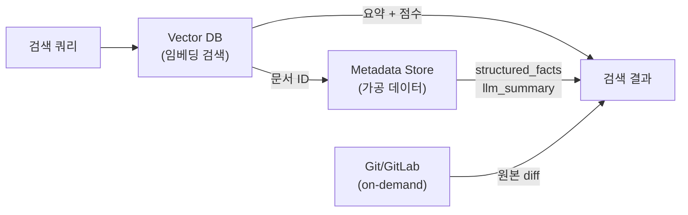
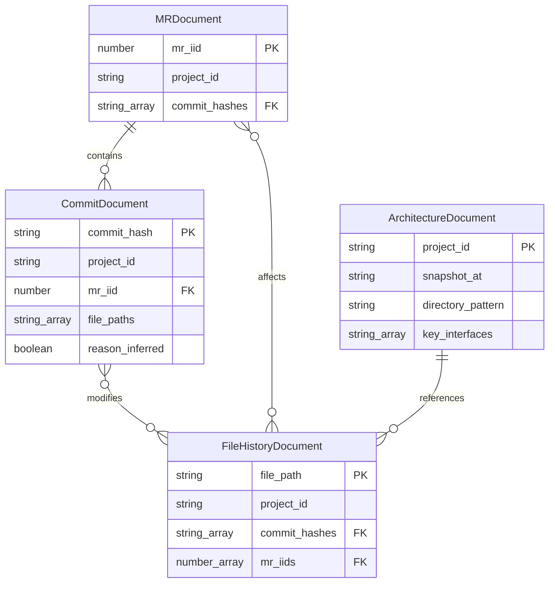

# 데이터 모델 및 벡터 DB 스키마

## 1. 개요

시스템은 두 종류의 스토어를 사용한다:

| 스토어             | 역할                 | 저장 데이터                                      |
| ------------------ | -------------------- | ------------------------------------------------ |
| **Vector DB**      | 유사도 검색 + 필터링 | 임베딩 + 요약 텍스트 + 필터용 메타데이터         |
| **Metadata Store** | 가공 데이터 저장     | structured_facts, llm_summary, verification 결과 |
| **Git/GitLab**     | 원본 참조            | raw diff, 원본 커밋 메시지 (on-demand 조회)      |

> **설계 결정**: raw diff는 별도 저장하지 않는다. git repo에 이미 존재하며 `git show <hash>`로 언제든 조회 가능하므로 중복 저장은 용량 낭비다. Phase 2+에서도 GitLab API로 동일하게 조회 가능.



---

## 2. Vector DB 컬렉션 설계

### 2-1. CommitDocument 컬렉션

커밋 단위의 변경 기록. 가장 기본이 되는 문서 유형.

**스키마**:

```typescript
interface CommitDocument {
    // === 임베딩 대상 텍스트 ===
    content: string;
    // LLM이 생성한 요약 텍스트 (what 중심, 추론된 부분은 [추론된내용] 태그 포함)
    //
    // 예 (명확한 이유, reason_known: true, reason_inferred: false):
    //   "validateToken() 함수에서 만료된 토큰에 대해 false를 반환하도록 변경하고,
    //    리다이렉트 전 토큰 갱신 로직을 추가. 토큰 만료 시 무한 리다이렉트 루프 버그 수정."
    //
    // 예 (기술적 추론, reason_known: true, reason_inferred: true):
    //   "UserService 클래스의 getProfile() 메서드에 null check를 추가하고,
    //    Optional chaining으로 변경. [추론된내용] user 객체가 null일 때 발생하는
    //    런타임 에러 방지를 위한 방어적 코딩으로 보임."
    //
    // 예 (이유 불명, reason_known: false):
    //   "validateToken() 함수에 revoked 토큰 체크 조건을 추가."

    // === 필터/검색용 메타데이터 ===
    metadata: {
        // 식별
        doc_type: 'commit';
        commit_hash: string; // 전체 SHA (primary key)
        commit_short: string; // 7자리 축약 SHA

        // 프로젝트/브랜치
        project_id: string; // "group/project-name"
        branch: string; // 커밋이 속한 브랜치

        // 작성자/시간
        author: string;
        committed_at: string; // ISO 8601

        // MR 연결 (있는 경우)
        mr_iid?: number; // GitLab MR internal ID
        mr_title?: string;

        // 분류
        change_type: 'bugfix' | 'feature' | 'refactor' | 'optimization' | 'chore' | 'docs' | 'unknown';
        conventional_type?: string; // Conventional Commits type (feat, fix, ...)
        conventional_scope?: string;

        // 변경 통계
        files_changed: number;
        total_additions: number;
        total_deletions: number;

        // 변경 파일 경로 (필터용)
        file_paths: string[];

        // 변경 심볼 (필터용)
        symbols_modified: string[];

        // 코드 구조 (02-data-pipeline 3-3절 참조)
        file_roles: string[]; // 변경 파일의 역할 분류 ['component', 'util', ...]
        symbol_signatures: string[]; // 변경 심볼 시그니처 목록 (AST 추출)

        // 의존성 (영향 범위)
        imported_by: string[]; // 변경 파일을 import하는 파일 목록
        registry_relations: string[]; // Registry 패턴으로 연결된 파일 (02-data-pipeline 3-6절)

        // 커밋 그룹핑 (02-data-pipeline 3절 참조)
        grouped_commits?: string[]; // 그룹 커밋인 경우 포함된 커밋 hash 목록
        is_grouped: boolean; // 그룹핑된 커밋인가 (false = 단일 커밋)

        // 이유 파악 여부 (02-data-pipeline 4-2절 참조)
        reason_known: boolean; // 변경 이유를 알 수 있는가
        reason_inferred: boolean; // LLM이 기술적으로 추론한 이유인가 (content에 [추론된내용] 태그 포함)
        reason_supplemented: boolean; // 사용자가 이유를 보강했는가

        // 품질
        confidence_score: number; // 0.0 ~ 1.0, 검증 통과 신뢰도
        verified_at: string; // 검증 시점

        // LLM 분석 결과
        impact: string; // 시스템 영향 요약
        risk_notes?: string; // 주의사항 (없으면 null)
    };
}
```

**임베딩 대상**: `content` 필드만 임베딩. 메타데이터는 필터링에만 사용.

### 2-2. MRDocument 컬렉션

MR 단위의 변경 기록. 여러 커밋을 묶는 상위 문서.

**스키마**:

```typescript
interface MRDocument {
    // === 임베딩 대상 텍스트 ===
    content: string;
    // MR 목적 + 디스커션 요약
    // 예: "인증 모듈 리팩토링. JWT 토큰 갱신 로직을 AuthService로 분리하고,
    //      미들웨어 레벨에서 자동 갱신을 처리하도록 변경.
    //      리뷰에서 토큰 갱신 실패 시 로그아웃 처리 방식에 대해 논의,
    //      silent refresh 패턴 적용으로 합의."

    metadata: {
        doc_type: 'mr';
        mr_id: number; // GitLab MR global ID
        mr_iid: number; // GitLab MR internal ID (프로젝트 내 번호)
        title: string;
        project_id: string;

        // 작성자/리뷰
        author: string;
        reviewers: string[]; // 리뷰어 목록
        approvers: string[]; // 승인자 목록
        merged_by?: string;

        // 시간
        created_at: string;
        merged_at?: string;
        closed_at?: string;

        // 분류
        labels: string[];
        milestone?: string;
        source_branch: string;
        target_branch: string;

        // 관련 커밋
        commit_hashes: string[]; // MR에 포함된 커밋 해시 목록
        commit_count: number;

        // 변경 통계 (전체 MR 기준)
        files_changed: number;
        total_additions: number;
        total_deletions: number;
        file_paths: string[];

        // LLM 분석 결과
        key_changes: string[]; // 주요 변경사항 목록
        decisions: string[]; // 리뷰에서 합의된 결정사항
        risks_discussed: string[]; // 논의된 위험/주의사항

        // 품질
        confidence_score: number;
        verified_at: string;
    };
}
```

### 2-3. FileHistoryDocument 컬렉션

파일별 변경 히스토리 요약. 특정 파일의 변경 맥락을 빠르게 파악하기 위한 문서.

**스키마**:

```typescript
interface FileHistoryDocument {
    // === 임베딩 대상 텍스트 ===
    content: string;
    // 파일의 주요 변경 히스토리 요약
    // 예: "src/utils/auth.ts - 인증 유틸리티 모듈.
    //      주요 변경: JWT 검증 로직 추가(2024-03), 토큰 갱신 버그 수정(2024-05),
    //      AuthService 클래스로 리팩토링(2024-07).
    //      이 파일은 login.ts, guard.ts, LoginForm.tsx에서 import됨."

    metadata: {
        doc_type: 'file_history';
        file_path: string; // primary key
        project_id: string;

        // 변경 통계
        total_commits: number; // 이 파일을 변경한 총 커밋 수
        total_mrs: number; // 이 파일이 포함된 MR 수
        last_modified_at: string; // 마지막 변경 시점
        first_seen_at: string; // 최초 등장 시점

        // 주요 기여자
        top_authors: string[]; // 가장 많이 수정한 작성자 (상위 3명)

        // 의존성
        imported_by: string[];
        imports: string[];

        // 참조
        commit_hashes: string[]; // 관련 커밋 해시 (최근 N개)
        mr_iids: number[]; // 관련 MR iid (최근 N개)

        // 분류
        is_hot_file: boolean; // 자주 변경되는 파일 여부
        change_frequency: number; // 월평균 변경 횟수

        // 품질
        last_updated_at: string; // 이 문서의 마지막 업데이트 시점
    };
}
```

**업데이트 전략**:

- FileHistoryDocument는 새 커밋이 처리될 때마다 갱신
- content는 주기적으로 재생성 (최신 히스토리 반영)
- 임베딩도 content 변경 시 재생성

### 2-4. ArchitectureDocument 컬렉션 (Phase 1b)

프로젝트의 코드 구조 스냅샷. 커밋 히스토리가 부족해도 아키텍처 일관성 리뷰를 가능하게 한다.

**스키마**:

```typescript
interface ArchitectureDocument {
    // === 임베딩 대상 텍스트 ===
    content: string;
    // 프로젝트 아키텍처 요약
    // 예: "이 프로젝트는 feature-based 디렉토리 구조를 따르며,
    //      각 feature 폴더에 components/, hooks/, api/ 서브 디렉토리를 가진다.
    //      인증은 AuthService 클래스(src/services/auth.ts)가 담당하며,
    //      IAuthProvider 인터페이스를 구현한다.
    //      상태 관리는 Pinia store를 사용하고, API 호출은 axios 인스턴스를 래핑한
    //      apiClient 유틸리티를 통해 수행한다."

    metadata: {
        doc_type: 'architecture';
        project_id: string;
        snapshot_at: string; // 스냅샷 시점 (ISO 8601)

        // 구조 정보
        directory_pattern: string; // 'feature-based' | 'layer-based' | 'hybrid'
        key_interfaces: string[]; // 핵심 인터페이스 목록
        base_classes: string[]; // 베이스 클래스 목록
        conventions: string[]; // 감지된 컨벤션 패턴

        // 통계
        total_source_files: number;
        total_exported_symbols: number;

        // 품질
        confidence_score: number;
        last_updated_at: string;
    };
}
```

**생성 트리거**: `analyze_architecture` Tool 호출 시, 또는 초기 벌크 인제스트 완료 후 자동 생성.

**갱신 주기**: 수동 재실행 또는 파일 구조에 큰 변화(새 디렉토리, 핵심 인터페이스 변경) 감지 시.

> 상세 파이프라인: [02-data-pipeline.md](./02-data-pipeline.md) 섹션 8 참조

---

## 3. Metadata Store 스키마

파이프라인에서 가공된 데이터(구조화 팩트, LLM 요약, 검증 결과)를 저장한다. **raw diff는 저장하지 않으며**, 원본이 필요할 때 `git show <hash>` 또는 GitLab API로 on-demand 조회한다.

### 3-1. Phase 1: JSON 파일 기반

```
.cr-rag-data/
├── metadata/
│   ├── commits/
│   │   ├── {commit_hash_prefix}/
│   │   │   └── {commit_hash}.json  # structured_facts + llm_summary + verification
│   ├── mrs/
│   │   └── {project_id}/
│   │       └── {mr_iid}.json       # MR llm_summary + discussions 요약
│   └── pipeline/
│       └── state.json               # 파이프라인 상태
```

### 3-2. Phase 2+: SQLite/PostgreSQL

```sql
CREATE TABLE commit_processed (
    commit_hash TEXT PRIMARY KEY,
    project_id TEXT NOT NULL,
    author TEXT NOT NULL,
    committed_at TEXT NOT NULL,
    structured_facts JSON NOT NULL,
    code_structure JSON,              -- AST 추출 결과
    llm_summary JSON NOT NULL,
    verification_result JSON,         -- 검증 점수 + 통과 여부
    created_at TEXT NOT NULL DEFAULT (datetime('now'))
);

CREATE TABLE mr_processed (
    mr_id INTEGER PRIMARY KEY,
    mr_iid INTEGER NOT NULL,
    project_id TEXT NOT NULL,
    title TEXT NOT NULL,
    discussions_summary JSON,         -- 디스커션 요약 (원본 X)
    approvals JSON,
    labels JSON,
    llm_summary JSON NOT NULL,
    verification_result JSON,
    created_at TEXT NOT NULL DEFAULT (datetime('now'))
);

CREATE TABLE pipeline_state (
    project_id TEXT PRIMARY KEY,
    last_processed_commit TEXT,
    last_processed_mr_iid INTEGER,
    last_run_at TEXT,
    total_processed INTEGER DEFAULT 0,
    total_failed INTEGER DEFAULT 0,
    failed_items JSON DEFAULT '[]'
);

CREATE INDEX idx_commit_project ON commit_processed(project_id);
CREATE INDEX idx_commit_date ON commit_processed(committed_at);
CREATE INDEX idx_mr_project ON mr_processed(project_id);
```

### 3-3. 원본 데이터 조회 전략

| Phase    | 원본 소스         | 조회 방법                                         |
| -------- | ----------------- | ------------------------------------------------- |
| Phase 1  | 로컬 Git repo     | `git show <hash>`, `git diff <hash>~1 <hash>`     |
| Phase 2+ | GitLab API        | `GET /projects/:id/repository/commits/:sha/diff`  |
| Phase 3  | GitLab API (캐시) | API 조회 + 선택적 LRU 캐시 (자주 참조되는 diff만) |

---

## 4. 문서 간 관계



**관계 활용**:

- 커밋 → MR: `mr_iid`로 해당 커밋이 포함된 MR 조회
- MR → 커밋: `commit_hashes`로 MR에 포함된 커밋 목록 조회
- 커밋/MR → 파일: `file_paths`로 변경된 파일 조회
- 파일 → 커밋/MR: `commit_hashes`, `mr_iids`로 파일을 변경한 이력 조회
- 아키텍처 → 파일: 핵심 인터페이스/베이스 클래스가 위치한 파일 참조

---

## 5. 임베딩 모델 선택

### 5-1. 요구사항

- **코드 + 자연어 혼합**: 요약 텍스트에는 코드 용어(함수명, 파일 경로)와 자연어 설명이 섞여 있음
- **다국어**: 한국어 커밋 메시지/MR 설명 지원
- **차원 수**: 검색 정확도와 저장 비용의 균형
- **비용**: Phase 1에서는 로컬 모델 또는 저비용 API

### 5-2. 후보 모델 비교

| 모델                              | 차원 | 코드 이해 | 한국어 | 비용            | 비고         |
| --------------------------------- | ---- | --------- | ------ | --------------- | ------------ |
| **OpenAI text-embedding-3-small** | 1536 | 양호      | 양호   | $0.02/1M tokens | 범용, 가성비 |
| **OpenAI text-embedding-3-large** | 3072 | 우수      | 양호   | $0.13/1M tokens | 높은 정확도  |
| **Voyage Code 3**                 | 1024 | 최우수    | 보통   | $0.06/1M tokens | 코드 특화    |
| **nomic-embed-text**              | 768  | 양호      | 보통   | 무료 (로컬)     | Ollama 지원  |
| **BGE-M3**                        | 1024 | 양호      | 우수   | 무료 (로컬)     | 다국어 특화  |

### 5-3. 선택 전략

- **Phase 1~**: `text-embedding-3-small` (OpenAI API)
    - 코드 + 자연어 혼합 텍스트에서 안정적 성능
    - $0.02/1M tokens로 가성비 우수
    - 외부 API 사용 가능하므로 Phase 1부터 적용 (06-tech-stack 참조)
- **Phase 3 (선택)**: 검색 정확도 개선 필요 시 `Voyage Code 3` 또는 `text-embedding-3-large`로 전환 검토

---

## 6. 검색 패턴

### 6-1. 유사도 검색

```
사용자가 리뷰 중인 diff → 임베딩 → Vector DB 유사도 검색
→ 유사한 과거 변경 요약 반환
```

### 6-2. 필터 + 유사도 검색

```
특정 프로젝트 + 특정 파일의 변경 히스토리
→ metadata 필터 (project_id, file_paths) + 시간순 정렬
```

### 6-3. 하이브리드 검색

```
자연어 쿼리 ("인증 관련 버그 수정")
→ 유사도 검색 + change_type='bugfix' 필터
→ 교차 결과
```

### 6-4. 시간 가중치 검색 (Temporal Weighting)

코드 리뷰에서 과거 히스토리의 관련성은 시간에 따라 감소한다. 6개월 전 버그 수정보다 1주일 전 버그 수정이 더 관련성이 높을 가능성이 크다. 벡터 유사도 점수에 시간 감쇠(time decay)를 적용한다.

**가중치 공식**:

```
final_score = similarity_score * time_weight
time_weight = base_weight + (1 - base_weight) * exp(-decay_rate * days_ago)
```

| 파라미터      | 기본값 | 설명                                 |
| ------------- | ------ | ------------------------------------ |
| `base_weight` | 0.3    | 시간과 무관하게 보장되는 최소 가중치 |
| `decay_rate`  | 0.005  | 감쇠 속도 (높을수록 최신 편향 강함)  |

**예시** (기본값 기준):

| 경과 일수     | time_weight | 효과          |
| ------------- | ----------- | ------------- |
| 0일 (오늘)    | 1.0         | 유사도 그대로 |
| 30일 (1개월)  | 0.93        | 7% 감소       |
| 90일 (3개월)  | 0.74        | 26% 감소      |
| 180일 (6개월) | 0.54        | 46% 감소      |
| 365일 (1년)   | 0.36        | 64% 감소      |

`base_weight = 0.3`이므로 아무리 오래되어도 유사도의 30%는 보장. 1년 전 매우 유사한 버그 수정(similarity 0.95)은 `0.95 * 0.36 = 0.34`로 여전히 반환될 수 있다.

**적용 위치**: MCP 서버의 검색 엔진에서 벡터 DB 결과를 받은 후 re-ranking 단계에서 적용.

**설정 가능**: 사용자가 검색 시 `time_weight_enabled: false`로 비활성화하거나, `decay_rate` 조정 가능.

### 6-5. 검색 결과 보강

```
Vector DB 결과 (요약 + 점수)
→ 후처리 레이어 (02-data-pipeline 섹션 9 참조)
  → 중복 제거
  → 시간 가중치 re-ranking
  → 맥락 조합 (Phase 1b)
  → 노이즈 필터
→ commit_hash로 Metadata Store 조회 (structured_facts, llm_summary)
→ 필요 시 git show / GitLab API로 원본 diff on-demand 조회
→ reason_inferred 여부 표시 (추론된 내용 태그 포함 여부)
→ 최종 결과 반환
```
