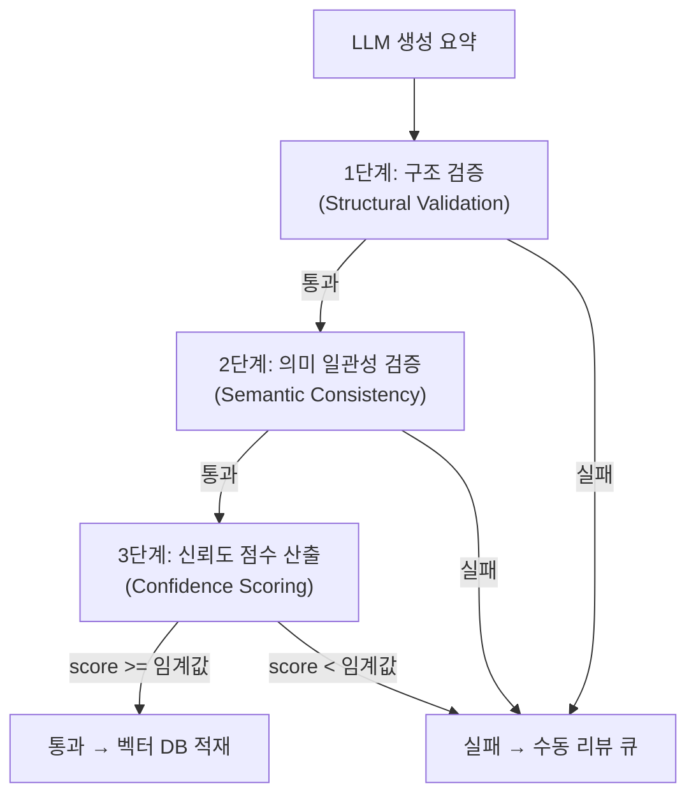
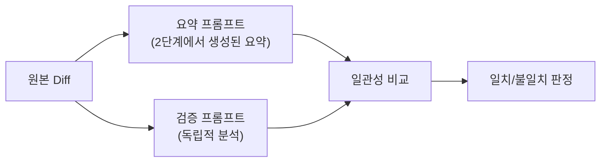
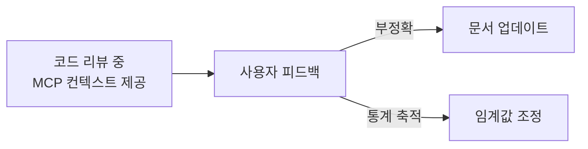

# 할루시네이션 방지 전략

## 1. 왜 검증이 필요한가

코드 리뷰를 위한 히스토리 데이터가 **가짜 히스토리**라면, 코드 리뷰를 하지 않는 것보다 나쁘다. 잘못된 히스토리를 근거로 한 리뷰는 개발자를 잘못된 방향으로 유도한다.

**LLM 요약에서 발생 가능한 할루시네이션 유형**:

| 유형               | 예시                                                      | 위험도 |
| ------------------ | --------------------------------------------------------- | ------ |
| **팩트 조작**      | 변경하지 않은 파일을 변경했다고 기술                      | 높음   |
| **함수명 오류**    | 존재하지 않는 함수명을 언급                               | 높음   |
| **인과 관계 날조** | "A 버그를 수정하기 위해"라고 했지만 실제로 A 버그와 무관  | 중간   |
| **비즈니스 추측**  | "기획팀 요청으로..."처럼 확인 불가능한 비즈니스 이유 추측 | 높음   |
| **근거 없는 추론** | diff에서 근거를 찾을 수 없는 기술적 추론                  | 중간   |
| **과잉 해석**      | 단순 코드 정리를 "성능 최적화"로 해석                     | 낮음   |
| **누락**           | 핵심 변경사항을 요약에서 빠뜨림                           | 중간   |

---

## 2. 3단계 검증 파이프라인



### 2-1. 1단계: 구조 검증 (Structural Validation)

LLM 요약에 등장하는 **구체적 팩트**가 실제 diff와 일치하는지 rule-based로 검증한다. LLM을 사용하지 않는 결정론적 검증.

**검증 항목**:

| 항목          | 검증 방법                                                               | 실패 조건                          |
| ------------- | ----------------------------------------------------------------------- | ---------------------------------- |
| 파일명 언급   | 요약에서 파일 경로 추출 → diff 파일 목록과 대조                         | diff에 없는 파일 언급              |
| 함수/클래스명 | 요약에서 심볼 추출 → diff hunk 헤더와 대조                              | diff에 없는 심볼 언급              |
| 변경 방향     | "추가", "삭제", "수정" 키워드 → 파일 상태와 대조                        | "파일 삭제"라고 했는데 실제로 수정 |
| 변경 규모     | "대규모 리팩토링" 등 표현 → 실제 변경 라인 수 비교                      | 3줄 변경을 "대규모"로 기술         |
| 추론 근거     | `[추론된내용]` 태그된 부분의 근거가 diff에 존재하는지 검증              | diff에서 근거를 찾을 수 없는 추론  |
| 추론 분류     | `reason_inferred: true`인 내용이 기술적 추론인지 비즈니스 추측인지 판별 | 비즈니스적 추측 포함 (즉시 실패)   |

**구현 접근**:

```typescript
interface StructuralValidation {
    // 요약 텍스트에서 추출한 팩트
    mentioned_files: string[];
    mentioned_symbols: string[];
    mentioned_actions: Array<{ target: string; action: 'add' | 'delete' | 'modify' }>;

    // 실제 diff에서 추출한 팩트 (02-data-pipeline의 StructuredFacts)
    actual_files: string[];
    actual_symbols: string[];
    actual_statuses: Array<{ path: string; status: FileChangeStatus }>;
}

interface StructuralValidationResult {
    passed: boolean;
    file_accuracy: number; // 언급된 파일 중 실제 존재하는 비율
    symbol_accuracy: number; // 언급된 심볼 중 실제 존재하는 비율
    action_accuracy: number; // 변경 방향 일치 비율
    inference_validity: number; // [추론된내용] 태그 내용 중 diff에서 근거를 찾을 수 있는 비율
    violations: Violation[]; // 구체적 위반 사항
}

interface Violation {
    type:
        | 'phantom_file' // diff에 없는 파일 언급
        | 'phantom_symbol' // diff에 없는 심볼 언급
        | 'wrong_action' // 변경 방향 불일치
        | 'scale_mismatch' // 변경 규모 불일치
        | 'unsupported_inference' // 근거 없는 추론
        | 'business_speculation'; // 비즈니스적 추측 (즉시 실패)
    detail: string;
    severity: 'critical' | 'warning';
}
```

**판정 기준**:

- `critical` 위반이 1개 이상: 즉시 실패
- `warning` 위반만 있는 경우: 다음 단계로 진행, 신뢰도 점수에 반영

### 2-2. 2단계: 의미 일관성 검증 (Semantic Consistency Check)

요약의 **해석 부분**(왜 변경했는가)이 diff 내용과 모순되지 않는지 LLM으로 검증한다.

**검증 방식**: Cross-validation

원본 요약과 다른 프롬프트로 동일 diff를 분석하여 결과를 비교한다.



**검증 프롬프트** (예시):

```
아래 diff를 분석하고, 주어진 요약이 정확한지 검증해주세요.

## Diff
{diff_content}

## 검증 대상 요약
{llm_summary}

## 검증 항목
1. 요약에서 설명하는 "변경 이유"가 diff 내용과 일관되는가?
2. 요약에서 언급하는 "영향"이 실제 코드 변경 범위와 부합하는가?
3. 요약에서 빠뜨린 중요한 변경사항이 있는가?
4. [추론된내용] 태그로 표시된 부분이 기술적 추론인가, 비즈니스적 추측인가?
5. [추론된내용]의 근거가 diff에서 확인 가능한가?

## 출력 형식 (JSON)
{
  "is_consistent": true/false,
  "consistency_score": 0.0~1.0,
  "inconsistencies": ["불일치 사항 목록"],
  "missing_changes": ["빠뜨린 변경사항"],
  "inference_issues": ["추론 관련 문제점 (근거 부족, 비즈니스 추측 등)"],
  "assessment": "한 줄 평가"
}
```

**비용 최적화**:

- 검증 프롬프트는 요약 프롬프트보다 작은 모델 사용 가능
- 1단계(구조 검증) 통과한 건만 2단계 실행 (비용 절감)
- diff가 매우 작은 경우 (10줄 미만) 2단계 스킵 가능

### 2-3. 3단계: 신뢰도 점수 산출 (Confidence Scoring)

1~2단계 결과를 종합하여 최종 신뢰도 점수를 산출한다.

**점수 산출 공식**:

```
confidence_score = (
    structural_weight * structural_score +
    semantic_weight * semantic_score +
    metadata_weight * metadata_score
)
```

| 요소             | 가중치 | 산출 기준                                                          |
| ---------------- | ------ | ------------------------------------------------------------------ |
| structural_score | 0.4    | 구조 검증 정확도 (file + symbol + action accuracy 평균)            |
| semantic_score   | 0.4    | 의미 일관성 점수 (consistency_score)                               |
| metadata_score   | 0.2    | 메타데이터 완전성 (커밋 메시지 존재, Conventional Commits 형식 등) |

**임계값 설정**:

| 범위      | 판정            | 처리                                               |
| --------- | --------------- | -------------------------------------------------- |
| 0.8 ~ 1.0 | **높은 신뢰도** | 벡터 DB 즉시 적재                                  |
| 0.6 ~ 0.8 | **중간 신뢰도** | 벡터 DB 적재, `confidence_score` 메타데이터에 기록 |
| 0.0 ~ 0.6 | **낮은 신뢰도** | 인덱싱 보류, 수동 리뷰 큐로 이동                   |

**임계값 튜닝**:

- Phase 1에서 초기 임계값 설정 후 실제 데이터로 조정
- False Positive(잘못된 요약이 통과) vs False Negative(정확한 요약이 거부) 균형

---

## 3. 수동 리뷰 큐

검증 실패한 항목은 수동 리뷰 큐에 보관한다.

```typescript
interface ReviewQueueItem {
    id: string;
    type: 'commit' | 'mr';
    source_id: string; // commit hash 또는 MR iid
    project_id: string;
    original_summary: string; // LLM이 생성한 원본 요약
    structured_facts: StructuredFacts;
    validation_result: {
        structural: StructuralValidationResult;
        semantic?: SemanticValidationResult;
        confidence_score: number;
    };
    status: 'pending' | 'approved' | 'rejected' | 'regenerated';
    created_at: string;
    reviewed_at?: string;
    reviewer_notes?: string;
}
```

**리뷰 큐 처리 옵션**:

- **수동 승인**: 사용자가 요약을 확인하고 승인/거부
- **수정 후 승인**: 사용자가 요약을 수정한 뒤 인덱싱
- **재생성**: 다른 프롬프트/모델로 요약 재생성 후 재검증
- **무시**: 검증 불가능한 항목으로 분류 (인덱싱하지 않음)

---

## 4. 특수 케이스 처리

### 4-1. 커밋 메시지가 부실한 경우

커밋 메시지가 "fix", "update", "wip" 등 의미 없는 경우:

- LLM이 diff만으로 요약을 생성해야 하므로 할루시네이션 위험 증가
- `metadata_score` 감소 → 전체 신뢰도 하락
- 임계값 미달 시 리뷰 큐로 이동

### 4-2. 대규모 커밋 (변경 파일 20개 이상)

- 파일별로 분할 처리 후 통합 요약
- 각 파일별 요약은 개별 검증
- 통합 요약은 개별 검증 결과 기반으로 신뢰도 산출

### 4-3. 자동 생성 파일

lock 파일, 빌드 아티팩트, 코드 생성기 출력물:

- 사전 정의된 패턴으로 필터링 (`.lock`, `dist/`, `generated/`)
- 요약 대상에서 제외
- 메타데이터에만 기록

### 4-4. 머지 커밋

- 머지 커밋 자체는 요약 대상에서 제외
- MR 단위 처리에서 통합 처리

---

## 5. 품질 피드백 루프

검증 시스템 자체의 정확도를 지속적으로 개선하기 위한 피드백 메커니즘.

### 5-1. 사용자 피드백

코드 리뷰에서 MCP 서버가 제공한 컨텍스트에 대해 피드백을 수집한다.



**피드백 유형**:

- "이 컨텍스트는 정확하고 유용했다" → 긍정 피드백
- "이 컨텍스트는 부정확했다" → 해당 문서 재검증 트리거
- "관련 없는 컨텍스트가 반환되었다" → 임베딩/검색 품질 이슈

**피드백 수집 방식**:

- Phase 1~2: MCP Tool로 피드백 제출 (`report_feedback`)
- Phase 3: 대시보드에서 피드백 관리

### 5-2. 자동 품질 모니터링

| 지표                 | 측정 방법                       | 목표   |
| -------------------- | ------------------------------- | ------ |
| 검증 통과율          | 통과 / 전체 처리 건수           | > 80%  |
| 리뷰 큐 승인율       | 승인 / 리뷰 큐 처리 건수        | > 60%  |
| 사용자 정확도 피드백 | 긍정 / 전체 피드백              | > 90%  |
| 평균 신뢰도 점수     | 통과 건의 평균 confidence_score | > 0.85 |

### 5-3. 임계값 동적 조정

피드백 데이터가 충분히 축적되면 임계값을 동적으로 조정한다.

- 사용자 부정확 피드백이 증가 → 임계값 상향
- 리뷰 큐 승인율이 높음 → 임계값 하향 (불필요한 리뷰 감소)

---

## 6. Phase별 검증 전략

| Phase    | 1단계 (구조)          | 2단계 (의미)  | 3단계 (신뢰도) | 리뷰 큐        |
| -------- | --------------------- | ------------- | -------------- | -------------- |
| Phase 1a | 필수 (추론 근거 포함) | 선택적 (비용) | 기본 공식      | JSON 파일 기반 |
| Phase 1b | 필수 (추론 근거 포함) | 선택적 (비용) | 기본 공식      | JSON 파일 기반 |
| Phase 2  | 필수                  | 필수          | 튜닝된 공식    | DB 기반        |
| Phase 3  | 필수                  | 필수          | 동적 임계값    | 대시보드 연동  |

Phase 1a/1b에서는 비용을 절약하기 위해 2단계(의미 일관성)를 선택적으로 운영할 수 있다. diff가 크거나 커밋 메시지가 부실한 경우에만 2단계를 실행하는 방식. 단, 1단계의 추론 근거 검증(`inference_validity`)은 Phase 1a부터 필수 항목이다.
