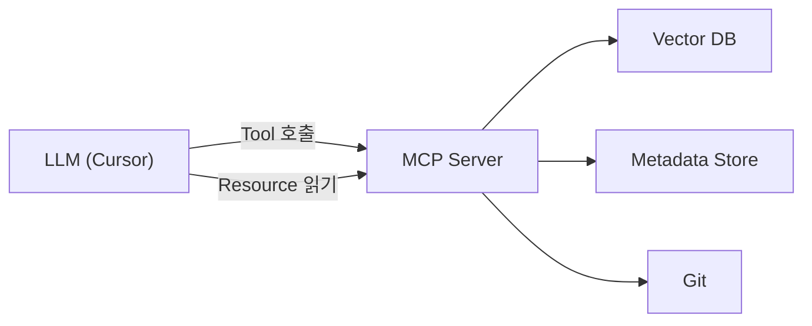

# MCP 서버 인터페이스

## 1. 개요

MCP(Model Context Protocol) 서버는 Cursor 등 LLM 클라이언트에 코드 히스토리 컨텍스트를 제공한다. **Tools**는 LLM이 능동적으로 호출하는 도구이고, **Resources**는 정적 컨텍스트로 제공된다.

> **문서와 구현 동기화**: 본 문서의 **§2.1~2.3, §3.1**은 `packages/cr-rag-mcp/src/server/mcp_server.ts`의 실제 등록 내용과 일치한다. 그 외 도구·리소스는 설계안이며 **미구현** 상태를 명시한다.



---

## 2. Tools

### 구현 현황 요약

| 도구 | 구현 | 비고 |
|------|:----:|------|
| `search_review_context` | ✅ | Phase 1a |
| `ingest_commits` | ✅ | 로컬 Git, `repo_path` 필수 |
| `supplement_reason` | ✅ | `supplemented_by` 필수 |
| `get_file_history` | ❌ | **미구현 (Phase 1b 예정)** |
| `search_by_topic` | ❌ | **미구현 (Phase 1b 예정)** |
| `get_impact_analysis` | ❌ | **미구현 (Phase 1b 예정)** |
| `analyze_architecture` | ❌ | **미구현 (Phase 1b 예정)** |

---

### 2.1. search_review_context（구현됨）

코드 리뷰 맥락 검색: diff 텍스트를 쿼리로 벡터 검색하고 후처리된 유사 커밋을 반환한다.

**MCP Tool 정의**（`TOOL_DEFINITIONS`와 동일）:

```json
{
    "name": "search_review_context",
    "description": "코드 리뷰 맥락 검색: diff 텍스트를 쿼리로 벡터 검색하고 후처리된 유사 커밋을 반환합니다.",
    "inputSchema": {
        "type": "object",
        "properties": {
            "diff_text": {
                "type": "string",
                "description": "검색 쿼리로 쓸 unified diff 또는 변경 요약 텍스트"
            },
            "file_paths": {
                "type": "array",
                "items": { "type": "string" },
                "description": "선택: 결과를 이 경로와 겹치는 커밋으로만 좁힘"
            },
            "limit": { "type": "number", "description": "최대 결과 수", "default": 10 },
            "include_raw_diff": {
                "type": "boolean",
                "description": "응답에 원본 diff_text 포함",
                "default": false
            }
        },
        "required": ["diff_text"]
    }
}
```

**구현 메모**: 인덱스가 비어 있으면 `cold_start` 안내와 빈 `results`를 반환한다. 응답 본문 형식은 `handleSearchReviewContext`（`src/tools/search_review_context.ts`）를 따른다. 설계안에 있던 `project_id`, `change_types`, `date_range`, `time_weight_enabled` 등은 **현재 스키마에 없음**（Phase 이후 검토）.

---

### 2.2. ingest_commits（구현됨）

Git 저장소 커밋을 수집·요약·임베딩하여 Chroma에 인덱싱한다.

**MCP Tool 정의**（`TOOL_DEFINITIONS`와 동일）:

```json
{
    "name": "ingest_commits",
    "description": "Git 저장소 커밋을 수집·요약·임베딩하여 Chroma에 인덱싱합니다.",
    "inputSchema": {
        "type": "object",
        "properties": {
            "repo_path": { "type": "string", "description": "Git 저장소 루트 경로" },
            "project_id": { "type": "string", "description": "프로젝트 식별자 (메타·파일 경로에 사용)" },
            "mode": {
                "type": "string",
                "enum": ["bulk", "incremental", "single"],
                "description": "bulk: 전체, incremental: 마지막 처리 이후, single: 단일 커밋"
            },
            "since_date": {
                "type": "string",
                "description": "증분 콜드 스타트 시 git --since (ISO 날짜)"
            },
            "commit_hash": { "type": "string", "description": "mode=single일 때 대상 커밋 해시" }
        },
        "required": ["repo_path", "project_id", "mode"]
    }
}
```

**구현 메모**: 과거 설계안의 `mr_iid`, `dry_run`, `until_date` 등은 **미구현**. 파이프라인 상세는 `handleIngestCommits` 및 `runIngestPipeline`을 참고한다.

---

### 2.3. supplement_reason（구현됨）

인덱스된 커밋에 보충 사유를 메타데이터에 반영하고 임베딩을 갱신한다.

**MCP Tool 정의**（`TOOL_DEFINITIONS`와 동일）:

```json
{
    "name": "supplement_reason",
    "description": "인덱스된 커밋에 대해 보충 사유를 메타데이터에 반영하고 임베딩을 갱신합니다.",
    "inputSchema": {
        "type": "object",
        "properties": {
            "commit_hash": { "type": "string" },
            "reason": { "type": "string", "description": "보충 사유 본문" },
            "supplemented_by": {
                "type": "string",
                "description": "기록할 사용자/시스템 식별"
            }
        },
        "required": ["commit_hash", "reason", "supplemented_by"]
    }
}
```

**구현 메모**: 설계 초안에는 `supplemented_by`가 없었으나 **현재 구현에서는 필수**이다. `reason` 길이 상한 등은 `src/tools/supplement_reason.ts`를 참고한다.

---

### 2.4. get_file_history — 미구현 (Phase 1b 예정)

특정 파일의 변경 히스토리를 시간순으로 조회하는 도구. 스키마·동작은 향후 `mcp_server.ts`에 등록 시 본 절을 갱신한다.

---

### 2.5. search_by_topic — 미구현 (Phase 1b 예정)

자연어 쿼리로 주제별 변경 히스토리를 검색하는 도구.

---

### 2.6. get_impact_analysis — 미구현 (Phase 1b 예정)

변경 파일의 영향 범위(import 관계 등)를 분석하는 도구.

---

### 2.7. analyze_architecture — 미구현 (Phase 1b 예정)

프로젝트 구조 분석 및 ArchitectureDocument 생성.

---

## 3. Resources

### 구현 현황 요약

| URI | 구현 | 비고 |
|-----|:----:|------|
| `project://overview` | ✅ | 전역 단일 URI（프로젝트별 `{id}` 경로 아님） |
| `project://{id}/overview` | ❌ | **미구현 (Phase 1b+ 설계)** |
| `project://{id}/hot-files` | ❌ | **미구현 (Phase 1b 예정)** |
| `project://{id}/recent-issues` | ❌ | **미구현 (Phase 1b 예정)** |

### 3.1. project://overview（구현됨）

`ListResources`에 노출되는 이름: `프로젝트 인덱싱 개요`, MIME: `application/json`. 내용은 `readProjectOverview`（`src/resources/project_overview.ts`）가 생성한다.

---

### 3.2. project://{id}/hot-files — 미구현 (Phase 1b 예정)

자주 변경되는 파일 목록. 설계만 존재.

---

### 3.3. project://{id}/recent-issues — 미구현 (Phase 1b 예정)

최근 버그 수정 이력. 설계만 존재.

---

## 4. 사용 시나리오（구현 기준）

### 시나리오 1: 코드 리뷰 맥락 검색（가능）

```
ingest_commits로 저장소 인덱싱 후
→ search_review_context(diff_text=..., file_paths=선택)
→ 유사 과거 커밋·후처리 결과를 근거로 리뷰 코멘트 생성
```

### 시나리오 2: 파일 단위 히스토리（미구현）

`get_file_history` 도구가 추가되면 본 시나리오가 가능하다. 현재는 `search_review_context`의 `file_paths` 필터로 간접적으로만 유사 목적을 달성할 수 있다.

### 시나리오 3: 영향 범위 분석（미구현）

`get_impact_analysis` Phase 1b 이후.

### 시나리오 4: 주제별 히스토리（미구현）

`search_by_topic` Phase 1b 이후.

---

## 5. Phase별 Tool·Resource 가용성（로드맵）

설계상 로드맵이다. **현재 코드**는 §2·§3의 “구현됨” 행만 동작한다.

| Tool                  | 현재 (코드) | Phase 1b      | Phase 2          | Phase 3         |
| --------------------- | ----------- | ------------- | ---------------- | --------------- |
| search_review_context | ✅          | O (맥락 조합) | O (+ MR 기반)    | O               |
| ingest_commits        | ✅          | O (로컬 Git)  | O (+ GitLab API) | O (+ 웹훅 자동) |
| supplement_reason     | ✅          | O             | O                | O               |
| get_file_history      | —           | O             | O                | O               |
| search_by_topic       | —           | O             | O                | O               |
| get_impact_analysis   | —           | O (AST 기반)  | O                | O               |
| analyze_architecture  | —           | O             | O                | O               |

| Resource                | 현재 (코드) | Phase 1b | Phase 2 | Phase 3 |
| ----------------------- | ----------- | -------- | ------- | ------- |
| project://overview      | ✅ (단일 URI) | O        | O       | O       |
| project://{id}/overview | —           | O        | O       | O       |
| project://hot-files     | —           | O        | O       | O       |
| project://recent-issues | —           | O        | O       | O       |

---

## 6. 에러 처리

| 상황                     | 응답（구현 기준）                    |
| ------------------------ | ------------------------------------- |
| `OPENAI_API_KEY` 없음    | 서버 기동 실패（예외）                |
| ChromaDB 연결 실패       | 서버 기동 실패（안내 메시지 포함）    |
| 알 수 없는 Tool 이름     | `Unknown tool` 예외                 |
| 인덱스 비어 검색         | `search_review_context`가 cold_start JSON |
| 인제스트 인자 오류       | Tool 응답 본문에 `error` 필드（JSON） |

GitLab API·웹훅 등은 Phase 2 이후 도입 시 본 표를 확장한다.
