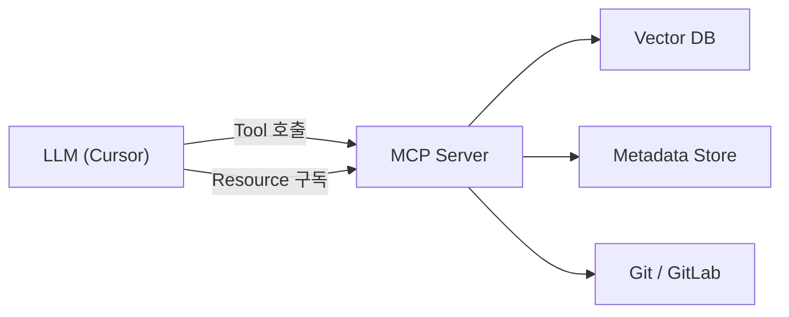

# MCP 서버 인터페이스

## 1. 개요

MCP(Model Context Protocol) 서버는 Cursor 등 LLM 클라이언트에 코드 히스토리 컨텍스트를 제공한다. **Tools**는 LLM이 능동적으로 호출하는 도구이고, **Resources**는 정적 컨텍스트로 자동 제공된다.



---

## 2. Tools

### 2-1. search_review_context

주어진 diff 또는 파일 경로에 대해 관련 과거 변경 히스토리를 검색한다. **코드 리뷰의 핵심 도구**.

**사용 시나리오**: LLM이 코드 리뷰 중 "이 변경과 관련된 과거 히스토리"를 조회할 때.

```typescript
// 입력 스키마
interface SearchReviewContextInput {
    // diff 텍스트 또는 파일 경로 (둘 중 하나 필수)
    diff_text?: string; // 리뷰 대상 diff
    file_paths?: string[]; // 리뷰 대상 파일 경로

    // 필터 (선택)
    project_id?: string; // 특정 프로젝트로 한정
    change_types?: string[]; // 'bugfix', 'feature', 'refactor' 등
    date_range?: {
        since?: string; // ISO 8601
        until?: string;
    };

    // 검색 옵션
    limit?: number; // 최대 결과 수 (기본값: 5)
    include_raw_diff?: boolean; // 원본 diff 포함 여부 (기본값: false)

    // 시간 가중치 (03-data-model 6-4절 참조)
    time_weight_enabled?: boolean; // 시간 감쇠 적용 (기본값: true)
    decay_rate?: number; // 감쇠 속도 (기본값: 0.005)
}

// 출력 스키마 (후처리 레이어 적용 결과)
interface SearchReviewContextOutput {
    results: Array<{
        type: 'commit' | 'mr';
        id: string; // commit hash 또는 MR iid
        summary: string; // LLM 생성 요약 ([추론된내용] 태그 포함 가능)
        change_type: string;
        similarity_score: number; // 0.0 ~ 1.0 (시간 가중치 적용 후)
        confidence_score: number; // 검증 신뢰도
        reason_known: boolean;
        reason_inferred: boolean; // true면 summary에 [추론된내용] 태그 포함
        metadata: {
            author: string;
            date: string;
            files_changed: string[];
            mr_title?: string;
        };
        raw_diff?: string; // include_raw_diff=true인 경우
        risk_notes?: string;
    }>;
    total_found: number;
    query_type: 'diff_similarity' | 'file_history';
    post_processing: {
        total_raw: number; // 원본 검색 결과 수
        after_dedup: number; // 중복 제거 후
        after_filter: number; // 노이즈 필터 후
        time_range: { earliest: string; latest: string };
    };
    context_narrative?: string; // Phase 1b: 맥락 조합 스토리
}
```

**MCP Tool 정의**:

```json
{
    "name": "search_review_context",
    "description": "코드 리뷰 시 관련 과거 변경 히스토리를 검색합니다. diff 텍스트 또는 파일 경로를 기반으로 유사한 과거 변경을 찾아 요약, 유사도 점수, 위험 노트를 반환합니다.",
    "inputSchema": {
        "type": "object",
        "properties": {
            "diff_text": { "type": "string", "description": "리뷰 대상 diff 텍스트" },
            "file_paths": { "type": "array", "items": { "type": "string" }, "description": "리뷰 대상 파일 경로 목록" },
            "project_id": { "type": "string", "description": "프로젝트 ID (예: group/project-name)" },
            "change_types": {
                "type": "array",
                "items": { "type": "string" },
                "description": "변경 유형 필터 (bugfix, feature, refactor 등)"
            },
            "limit": { "type": "number", "default": 5, "description": "최대 결과 수" },
            "include_raw_diff": { "type": "boolean", "default": false, "description": "원본 diff 포함 여부" }
        }
    }
}
```

### 2-2. get_file_history

특정 파일의 변경 히스토리를 시간순으로 조회한다.

**사용 시나리오**: LLM이 특정 파일의 변경 맥락을 파악할 때. "이 파일이 왜 이렇게 구성되어 있는지" 이해용.

```typescript
interface GetFileHistoryInput {
    file_path: string; // 조회 대상 파일 경로
    project_id?: string;
    limit?: number; // 최대 결과 수 (기본값: 10)
    date_range?: {
        since?: string;
        until?: string;
    };
    include_raw_diff?: boolean;
}

interface GetFileHistoryOutput {
    file_path: string;
    total_changes: number;
    history: Array<{
        type: 'commit' | 'mr';
        id: string;
        summary: string;
        change_type: string;
        author: string;
        date: string;
        additions: number;
        deletions: number;
        functions_modified: string[];
        mr_title?: string;
        raw_diff?: string;
    }>;
    top_authors: string[];
    imported_by: string[]; // 이 파일을 import하는 파일
    imports: string[]; // 이 파일이 import하는 파일
}
```

**MCP Tool 정의**:

```json
{
    "name": "get_file_history",
    "description": "특정 파일의 변경 히스토리를 시간순으로 조회합니다. 파일의 변경 맥락, 주요 기여자, 의존 관계를 파악할 수 있습니다.",
    "inputSchema": {
        "type": "object",
        "properties": {
            "file_path": { "type": "string", "description": "조회 대상 파일 경로" },
            "project_id": { "type": "string", "description": "프로젝트 ID" },
            "limit": { "type": "number", "default": 10, "description": "최대 결과 수" },
            "include_raw_diff": { "type": "boolean", "default": false, "description": "원본 diff 포함 여부" }
        },
        "required": ["file_path"]
    }
}
```

### 2-3. search_by_topic

자연어 쿼리로 특정 주제/기능 관련 변경 히스토리를 검색한다.

**사용 시나리오**: "인증 관련 변경 이력", "성능 최적화 관련 커밋" 등 주제 기반 검색.

```typescript
interface SearchByTopicInput {
    query: string; // 자연어 검색 쿼리
    project_id?: string;
    change_types?: string[];
    date_range?: {
        since?: string;
        until?: string;
    };
    limit?: number; // 기본값: 10
}

interface SearchByTopicOutput {
    query: string;
    results: Array<{
        type: 'commit' | 'mr';
        id: string;
        summary: string;
        change_type: string;
        similarity_score: number;
        metadata: {
            author: string;
            date: string;
            files_changed: string[];
            mr_title?: string;
        };
    }>;
    total_found: number;
}
```

**MCP Tool 정의**:

```json
{
    "name": "search_by_topic",
    "description": "자연어 쿼리로 특정 주제나 기능 관련 변경 히스토리를 검색합니다. 예: '인증 관련 버그 수정', '성능 최적화 이력'",
    "inputSchema": {
        "type": "object",
        "properties": {
            "query": { "type": "string", "description": "자연어 검색 쿼리" },
            "project_id": { "type": "string", "description": "프로젝트 ID" },
            "change_types": { "type": "array", "items": { "type": "string" }, "description": "변경 유형 필터" },
            "limit": { "type": "number", "default": 10, "description": "최대 결과 수" }
        },
        "required": ["query"]
    }
}
```

### 2-4. get_impact_analysis

변경 파일의 영향 범위를 분석한다. import 관계 기반으로 영향 받는 파일과 관련 과거 이슈를 반환.

**사용 시나리오**: 코드 리뷰 시 "이 파일을 변경하면 어디에 영향이 가는지" 파악.

```typescript
interface GetImpactAnalysisInput {
    file_paths: string[]; // 분석 대상 파일 경로
    project_id?: string;
    depth?: number; // import 추적 깊이 (기본값: 2)
    include_history?: boolean; // 관련 과거 이슈 포함 (기본값: true)
}

interface GetImpactAnalysisOutput {
    analyzed_files: string[];
    impact_graph: Array<{
        source: string; // 변경 파일
        affected: string; // 영향 받는 파일
        relationship: 'direct_import' | 'indirect_import' | 're_export';
        depth: number;
    }>;
    affected_files_count: number;
    related_issues: Array<{
        // 과거 관련 이슈 (include_history=true)
        type: 'commit' | 'mr';
        id: string;
        summary: string;
        change_type: string;
        date: string;
        overlap_files: string[]; // 영향 범위와 겹치는 파일
    }>;
}
```

**MCP Tool 정의**:

```json
{
    "name": "get_impact_analysis",
    "description": "변경 파일의 영향 범위를 분석합니다. import 관계 기반으로 영향 받는 파일 목록과 관련 과거 이슈를 반환합니다.",
    "inputSchema": {
        "type": "object",
        "properties": {
            "file_paths": { "type": "array", "items": { "type": "string" }, "description": "분석 대상 파일 경로" },
            "project_id": { "type": "string", "description": "프로젝트 ID" },
            "depth": { "type": "number", "default": 2, "description": "import 추적 깊이" },
            "include_history": { "type": "boolean", "default": true, "description": "관련 과거 이슈 포함" }
        },
        "required": ["file_paths"]
    }
}
```

### 2-5. ingest_commits

새 커밋/MR 데이터를 수동으로 인제스트한다. 파이프라인 트리거 역할.

**사용 시나리오**: 초기 벌크 로드, 수동 증분 업데이트, 특정 커밋 재처리.

```typescript
interface IngestCommitsInput {
    project_id: string;
    mode: 'bulk' | 'incremental' | 'single';
    // bulk 모드
    since_date?: string; // ISO 8601, bulk 시 시작 날짜
    until_date?: string;
    // single 모드
    commit_hash?: string; // 특정 커밋 재처리
    mr_iid?: number; // 특정 MR 재처리
    // 옵션
    dry_run?: boolean; // 실제 인덱싱 없이 처리 결과만 반환
}

interface IngestCommitsOutput {
    mode: string;
    project_id: string;
    processed: {
        commits: number;
        mrs: number;
    };
    indexed: {
        commits: number; // 검증 통과하여 인덱싱된 수
        mrs: number;
    };
    failed: {
        commits: number; // 검증 실패 수
        mrs: number;
    };
    skipped: {
        commits: number; // 사용자 스킵 또는 대형 diff 보류
    };
    pending_confirmation: PendingLargeDiff[]; // 대형 diff 확인 대기
    duration_ms: number;
    errors: string[];
}

interface PendingLargeDiff {
    commit_hash: string;
    message: string;
    total_diff_lines: number;
    estimated_tokens: number;
    estimated_cost_usd: number;
    file_count: number;
}
```

**MCP Tool 정의**:

```json
{
    "name": "ingest_commits",
    "description": "Git 커밋/MR 데이터를 수집하여 벡터 DB에 인덱싱합니다. 초기 벌크 로드, 증분 업데이트, 특정 커밋 재처리를 지원합니다.",
    "inputSchema": {
        "type": "object",
        "properties": {
            "project_id": { "type": "string", "description": "프로젝트 ID (예: group/project-name)" },
            "mode": { "type": "string", "enum": ["bulk", "incremental", "single"], "description": "인제스트 모드" },
            "since_date": { "type": "string", "description": "시작 날짜 (ISO 8601, bulk 모드)" },
            "commit_hash": { "type": "string", "description": "특정 커밋 해시 (single 모드)" },
            "mr_iid": { "type": "number", "description": "특정 MR iid (single 모드)" },
            "dry_run": { "type": "boolean", "default": false, "description": "시뮬레이션 모드" }
        },
        "required": ["project_id", "mode"]
    }
}
```

### 2-6. supplement_reason

`reason_known: false`인 커밋에 대해 사용자가 변경 이유를 보강한다. 보강 후 임베딩 재생성.

**사용 시나리오**: 인제스트 후 이유 미파악 커밋 목록을 확인하고, 기억나는 커밋에 이유를 보강.

```typescript
interface SupplementReasonInput {
    commit_hash: string;
    reason: string; // 사용자가 보강하는 변경 이유
}

interface SupplementReasonOutput {
    commit_hash: string;
    previous_reason_known: boolean;
    updated: boolean;
    reembedded: boolean; // content 재생성 + 임베딩 갱신 여부
}
```

**MCP Tool 정의**:

```json
{
    "name": "supplement_reason",
    "description": "변경 이유를 알 수 없는 커밋에 대해 사용자가 이유를 보강합니다. 보강 후 요약 텍스트와 임베딩이 재생성됩니다.",
    "inputSchema": {
        "type": "object",
        "properties": {
            "commit_hash": { "type": "string", "description": "보강할 커밋 해시" },
            "reason": { "type": "string", "description": "변경 이유" }
        },
        "required": ["commit_hash", "reason"]
    }
}
```

### 2-7. analyze_architecture (Phase 1b)

프로젝트의 코드 구조를 분석하여 ArchitectureDocument를 생성/갱신한다.

**사용 시나리오**: 초기 설정 시 프로젝트 구조를 인덱싱하거나, 구조 변경 후 스냅샷을 갱신할 때.

```typescript
interface AnalyzeArchitectureInput {
    project_id: string;
    force_refresh?: boolean; // 기존 스냅샷 무시하고 재생성 (기본값: false)
    scope?: 'full' | 'interfaces_only' | 'directory_only';
}

interface AnalyzeArchitectureOutput {
    project_id: string;
    directory_pattern: string; // 'feature-based' | 'layer-based' | 'hybrid'
    key_interfaces: string[];
    base_classes: string[];
    conventions: string[];
    total_source_files: number;
    total_exported_symbols: number;
    indexed: boolean; // Vector DB에 저장되었는지
}
```

**MCP Tool 정의**:

```json
{
    "name": "analyze_architecture",
    "description": "프로젝트의 코드 구조를 분석하여 아키텍처 스냅샷을 생성합니다. 핵심 인터페이스, 베이스 클래스, 디렉토리 패턴, 컨벤션을 추출하여 아키텍처 일관성 리뷰에 활용합니다.",
    "inputSchema": {
        "type": "object",
        "properties": {
            "project_id": { "type": "string", "description": "프로젝트 ID" },
            "force_refresh": { "type": "boolean", "default": false, "description": "기존 스냅샷 무시하고 재생성" },
            "scope": {
                "type": "string",
                "enum": ["full", "interfaces_only", "directory_only"],
                "default": "full",
                "description": "분석 범위"
            }
        },
        "required": ["project_id"]
    }
}
```

---

## 3. Resources

Resources는 LLM이 자동으로 참조할 수 있는 정적 컨텍스트이다. 프로젝트 수준의 요약 정보를 제공한다.

### 3-1. project://{id}/overview

프로젝트의 전체 변경 통계와 요약.

```typescript
interface ProjectOverviewResource {
    uri: string; // "project://group/project-name/overview"
    name: string; // "프로젝트명 - 변경 통계"
    mime_type: 'text/plain';
    content: {
        project_id: string;
        total_indexed_commits: number;
        total_indexed_mrs: number;
        date_range: { from: string; to: string };
        top_change_types: Array<{ type: string; count: number }>;
        most_active_authors: Array<{ author: string; commits: number }>;
        last_indexed_at: string;
    };
}
```

### 3-2. project://{id}/hot-files

자주 변경되는 파일 목록. 코드 리뷰 시 "이 파일은 자주 변경되므로 주의" 컨텍스트 제공.

```typescript
interface HotFilesResource {
    uri: string; // "project://group/project-name/hot-files"
    name: string;
    mime_type: 'text/plain';
    content: {
        project_id: string;
        period: string; // "last_90_days"
        hot_files: Array<{
            file_path: string;
            change_count: number; // 변경 횟수
            unique_authors: number; // 변경한 작성자 수
            last_change_type: string; // 마지막 변경 유형
            last_changed_at: string;
        }>;
    };
}
```

### 3-3. project://{id}/recent-issues

최근 버그 수정 이력. 회귀 위험 감지에 활용.

```typescript
interface RecentIssuesResource {
    uri: string; // "project://group/project-name/recent-issues"
    name: string;
    mime_type: 'text/plain';
    content: {
        project_id: string;
        period: string; // "last_30_days"
        recent_bugfixes: Array<{
            type: 'commit' | 'mr';
            id: string;
            summary: string;
            files_affected: string[];
            date: string;
            author: string;
        }>;
    };
}
```

---

## 4. 사용 시나리오

### 시나리오 1: 코드 리뷰에서 회귀 위험 감지

```
개발자가 auth.ts를 수정하는 MR을 작성
→ LLM이 코드 리뷰 시작
→ search_review_context(diff_text=auth.ts_diff)
→ "6개월 전 동일 파일에서 토큰 만료 버그 수정한 이력 발견"
→ LLM: "이 변경이 과거 토큰 만료 버그(commit abc123)의 수정 사항을 되돌리지 않는지 확인 필요"
```

### 시나리오 2: 파일 변경 맥락 파악

```
개발자가 레거시 코드를 이해하려 함
→ LLM에게 "이 파일의 변경 이력을 알려줘"
→ get_file_history(file_path="src/legacy/payment.ts")
→ "2024-01: 결제 모듈 초기 구현, 2024-04: PG사 변경으로 인한 API 교체,
    2024-08: 동시 결제 버그 수정"
```

### 시나리오 3: 영향 범위 분석

```
개발자가 유틸리티 함수를 수정하려 함
→ get_impact_analysis(file_paths=["src/utils/format.ts"])
→ "이 파일을 import하는 파일 15개, depth=2에서 영향 받는 파일 32개"
→ "과거 이 파일 변경 시 TableComponent에서 렌더링 버그 발생 이력 있음"
```

### 시나리오 4: 주제별 히스토리 조회

```
개발자가 성능 관련 과거 작업을 조사
→ search_by_topic(query="렌더링 성능 최적화")
→ "2024-06 MR#145: 가상화 적용, 2024-09 MR#203: memo 최적화,
    2024-11 커밋 def456: 불필요한 리렌더 수정"
```

---

## 5. Phase별 Tool 가용성

| Tool                  | Phase 1a        | Phase 1b      | Phase 2          | Phase 3         |
| --------------------- | --------------- | ------------- | ---------------- | --------------- |
| search_review_context | O (기본 후처리) | O (맥락 조합) | O (+ MR 기반)    | O               |
| get_file_history      | -               | O             | O                | O               |
| search_by_topic       | -               | O             | O                | O               |
| get_impact_analysis   | -               | O (AST 기반)  | O                | O               |
| ingest_commits        | O (로컬 Git)    | O (로컬 Git)  | O (+ GitLab API) | O (+ 웹훅 자동) |
| supplement_reason     | O               | O             | O                | O               |
| analyze_architecture  | -               | O             | O                | O               |

| Resource                | Phase 1a | Phase 1b | Phase 2 | Phase 3 |
| ----------------------- | -------- | -------- | ------- | ------- |
| project://overview      | O        | O        | O       | O       |
| project://hot-files     | -        | O        | O       | O       |
| project://recent-issues | -        | O        | O       | O       |

---

## 6. 에러 처리

| 상황                     | 응답                                                 |
| ------------------------ | ---------------------------------------------------- |
| 벡터 DB 연결 실패        | 에러 메시지 + 로컬 캐시에서 시도                     |
| 검색 결과 없음           | 빈 결과 + "관련 히스토리를 찾지 못했습니다"          |
| GitLab API 인증 실패     | 에러 메시지 + 설정 가이드                            |
| 인제스트 중 LLM API 실패 | 해당 항목 스킵, 재시도 큐에 추가, 처리된 결과만 반환 |
| 대량 검색 결과 (100건+)  | limit에 따라 상위 N개만 반환 + total_found 표시      |
