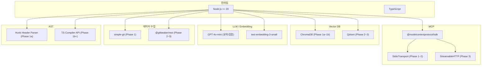

# 기술 스택 선정

## 1. 개요

기술 스택 선정은 **Phase 1a(MVP + 검증) → Phase 1b(확장) → Phase 2~3(스케일)**하는 전략을 따른다. Phase 1a 초반에 검증 게이트를 두고, 각 Phase 사이에 ROI 검증 게이트를 두어 실효성이 확인된 범위만 확장한다.

> **전제**: 외부 LLM API(OpenAI 등) 사용 가능. Phase 1a부터 API 직접 사용.

| 영역        | Phase 1a (MVP + 검증)  | Phase 1b (확장)         | Phase 2~3 (팀 서버)        |
| ----------- | ---------------------- | ----------------------- | -------------------------- |
| Vector DB   | ChromaDB (embedded)    | ChromaDB (embedded)     | Qdrant (server)            |
| LLM (요약)  | OpenAI GPT-4o-mini     | OpenAI GPT-4o-mini      | OpenAI GPT-4o-mini         |
| LLM (검증)  | OpenAI GPT-4o-mini     | OpenAI GPT-4o-mini      | OpenAI GPT-4o              |
| 임베딩      | text-embedding-3-small | text-embedding-3-small  | text-embedding-3-small     |
| 메타데이터  | JSON 파일              | JSON 파일 / SQLite      | SQLite / PostgreSQL        |
| MCP 전송    | stdio                  | stdio                   | HTTP/SSE (Streamable HTTP) |
| 데이터 수집 | git CLI                | git CLI                 | GitLab REST/GraphQL API    |
| AST 파서    | hunk 헤더 파싱 (L1~L2) | TypeScript Compiler API | TypeScript Compiler API    |
| 후처리      | 중복제거 + 시간정렬    | + 맥락 조합             | + 맥락 조합                |

---

## 2. Vector DB

### 2-1. 후보 비교

| 항목                | ChromaDB          | Qdrant                 | LanceDB           | Pinecone                    | Weaviate           |
| ------------------- | ----------------- | ---------------------- | ----------------- | --------------------------- | ------------------ |
| **설치**            | pip/npm, embedded | Docker/binary          | npm, embedded     | SaaS (클라우드)             | Docker/SaaS        |
| **서버 모드**       | 지원 (선택)       | 지원 (기본)            | 미지원 (embedded) | 클라우드 전용               | 지원               |
| **로컬 개발**       | 우수              | 양호                   | 우수              | 불가                        | 보통               |
| **Node.js SDK**     | chromadb          | @qdrant/js-client-rest | @lancedb/lancedb  | @pinecone-database/pinecone | weaviate-client    |
| **필터링**          | where 절          | payload filter         | SQL-like          | metadata filter             | GraphQL filter     |
| **하이브리드 검색** | 미지원            | 지원 (sparse+dense)    | 미지원            | 지원                        | 지원 (BM25+vector) |
| **스케일링**        | 소규모            | 대규모                 | 중규모            | 대규모                      | 대규모             |
| **비용**            | 무료              | 무료 (self-host)       | 무료              | 유료                        | 무료 (self-host)   |
| **커뮤니티**        | 활발              | 활발                   | 성장 중           | 활발                        | 활발               |

### 2-2. 선정

**Phase 1a, 1b: ChromaDB**

- 이유: embedded 모드로 별도 서버 불필요, Node.js SDK 지원, 빠른 프로토타이핑
- Phase 1a: 단일 프로젝트 로컬 운영 (초반 검증 게이트 포함)
- Phase 1b: 확장 기능 추가
- 저장: 로컬 파일시스템
- 제한: 대규모 데이터에서 성능 한계 (수만 건 이하 적합)

**Phase 2~3: Qdrant**

- 이유: 서버 모드 기본 지원, 하이브리드 검색, 대규모 데이터 처리, Docker 배포 용이
- payload filter가 메타데이터 필터링에 적합
- sparse vector 지원으로 키워드+시맨틱 하이브리드 검색 가능
- 무료 self-host

**기각 사유**:

- LanceDB: 서버 모드 미지원, 팀 공유에 부적합
- Pinecone: 클라우드 전용, 비용 발생, 사내 데이터 외부 전송 이슈
- Weaviate: Qdrant 대비 설정 복잡, 기능 차이 적음

### 2-3. 마이그레이션 전략

Phase 1 → 2 전환 시:

- ChromaDB 데이터 export → Qdrant import 스크립트 작성
- Vector DB 클라이언트를 인터페이스로 추상화하여 구현체만 교체
- 임베딩은 동일 모델 사용 시 재생성 불필요

---

## 3. LLM (요약/검증)

### 3-1. 후보 비교

| 항목           | Ollama (로컬)         | OpenAI GPT-4o-mini | OpenAI GPT-4o  | Claude 3.5 Sonnet |
| -------------- | --------------------- | ------------------ | -------------- | ----------------- |
| **비용**       | 무료                  | $0.15/1M input     | $2.50/1M input | $3.00/1M input    |
| **속도**       | HW 의존               | 빠름               | 보통           | 보통              |
| **코드 이해**  | 모델 의존             | 양호               | 우수           | 우수              |
| **한국어**     | 모델 의존             | 양호               | 우수           | 우수              |
| **오프라인**   | 가능                  | 불가               | 불가           | 불가              |
| **프라이버시** | 데이터 외부 전송 없음 | 외부 전송          | 외부 전송      | 외부 전송         |

### 3-2. 선정

> 외부 LLM API 사용이 확정되어, Phase 1부터 OpenAI API를 직접 사용한다. Ollama 로컬 모델은 불필요.

**Phase 1~2: OpenAI GPT-4o-mini (요약 + 검증)**

- 요약과 검증 모두 GPT-4o-mini로 처리
- 월 $0.50 수준의 저비용 (아래 비용 추정 참조)
- Phase 1에서 충분한 품질이 확인되면 Phase 2에서도 유지

**Phase 3 (선택적 업그레이드): GPT-4o-mini (요약) + GPT-4o (검증)**

- 팀 서버 운영 시 검증 정확도를 높이려면 GPT-4o로 전환
- 검증은 건수가 적으므로 비용 증가폭이 크지 않음
- 필요에 따라 Azure OpenAI Service로 전환 가능

### 3-3. 비용 추정

| 작업              | 토큰/건 (입력) | 토큰/건 (출력) | 건수/월 | GPT-4o-mini 비용/월 |
| ----------------- | -------------- | -------------- | ------- | ------------------- |
| 커밋 요약         | ~2,000         | ~300           | 500     | ~$0.17              |
| MR 요약           | ~5,000         | ~500           | 50      | ~$0.05              |
| 할루시네이션 검증 | ~3,000         | ~200           | 550     | ~$0.28              |
| **합계**          |                |                |         | **~$0.50/월**       |

저비용. 대규모 프로젝트(월 5,000 커밋)에서도 $5/월 수준.

---

## 4. 임베딩 모델

### 4-1. 후보 비교

| 모델                   | 차원 | 코드 이해 | 한국어 | 비용            | 로컬 실행 |
| ---------------------- | ---- | --------- | ------ | --------------- | --------- |
| text-embedding-3-small | 1536 | 양호      | 양호   | $0.02/1M tokens | 불가      |
| text-embedding-3-large | 3072 | 우수      | 양호   | $0.13/1M tokens | 불가      |
| Voyage Code 3          | 1024 | 최우수    | 보통   | $0.06/1M tokens | 불가      |
| nomic-embed-text       | 768  | 양호      | 보통   | 무료            | Ollama    |
| BGE-M3                 | 1024 | 양호      | 우수   | 무료            | Ollama/HF |
| CodeBERT               | 768  | 양호      | 낮음   | 무료            | HF        |

### 4-2. 선정

> 외부 API 사용 가능이 확정되어, Phase 1부터 `text-embedding-3-small`을 사용한다. 로컬 모델 비교 평가 단계를 생략하여 프로토타이핑 속도를 높인다.

**Phase 1~3: text-embedding-3-small**

- 이유: API 안정성, 코드+자연어 혼합 양호, 한국어 양호, $0.02/1M tokens (무시 가능한 비용)
- 모든 Phase에서 동일 모델을 사용하면 임베딩 재생성 없이 데이터 마이그레이션 가능
- 검색 품질이 부족한 경우 Voyage Code 3(코드 특화)로 전환 검토

### 4-3. 임베딩 비용 추정 (Phase 2~3)

| 작업             | 토큰/건 | 건수/월 | text-embedding-3-small 비용/월 |
| ---------------- | ------- | ------- | ------------------------------ |
| 커밋 요약 임베딩 | ~200    | 500     | ~$0.002                        |
| MR 요약 임베딩   | ~500    | 50      | ~$0.0005                       |
| 검색 쿼리 임베딩 | ~100    | 1,000   | ~$0.002                        |
| **합계**         |         |         | **~$0.005/월**                 |

무시 가능한 수준.

---

## 5. MCP SDK

### 5-1. 선정: @modelcontextprotocol/sdk

기존 모노레포(`packages/mcp-server`)에서 이미 사용 중. 동일 SDK를 사용하여 일관성 유지.

```json
{
    "dependencies": {
        "@modelcontextprotocol/sdk": "^1.25.3"
    }
}
```

**전송 프로토콜**:

- Phase 1~2: `StdioServerTransport` (로컬 프로세스)
- Phase 3: `StreamableHTTPServerTransport` (팀 서버)
    - MCP SDK에서 제공하는 Streamable HTTP transport 사용
    - 세션 관리, 인증 헤더 지원

---

## 6. GitLab API

### 6-1. REST vs GraphQL

| 항목             | REST API v4        | GraphQL API            |
| ---------------- | ------------------ | ---------------------- |
| **학습 곡선**    | 낮음               | 중간                   |
| **요청 효율**    | 여러 API 호출 필요 | 단일 쿼리로 여러 필드  |
| **페이지네이션** | Link 헤더          | cursor 기반            |
| **Rate Limit**   | 300/분 (인증)      | 300/분 (복잡도 가중치) |
| **문서화**       | 우수               | 양호                   |

### 6-2. 선정: REST API v4 (Phase 2 초기) → GraphQL (최적화)

- Phase 2 초기: REST API v4로 빠르게 구현
- Phase 2 후기: MR + 커밋 + 디스커션을 한 번에 가져오는 GraphQL 쿼리로 최적화
- GitLab REST 라이브러리: `@gitbeaker/rest` (타입 지원, 활발한 유지보수)

### 6-3. 인증

```typescript
// GitLab Personal Access Token 또는 OAuth2
interface GitLabConfig {
    base_url: string; // "https://gitlab.company.com"
    token: string; // Personal Access Token
    token_type: 'personal' | 'oauth2';
}
```

- Phase 2: Personal Access Token (개인 토큰)
- Phase 3: OAuth2 또는 Project Access Token (팀 서버에서 관리)

---

## 7. AST 파서

### 7-1. 후보 비교

| 항목             | grep 패턴 매칭 | TypeScript Compiler API | tree-sitter        |
| ---------------- | -------------- | ----------------------- | ------------------ |
| **정확도**       | 낮음           | 높음                    | 높음               |
| **설정 복잡도**  | 없음           | 중간 (tsconfig 필요)    | 높음 (바인딩 필요) |
| **다언어 지원**  | 제한적         | TypeScript/JavaScript만 | 다수 언어          |
| **속도**         | 빠름           | 중간                    | 빠름               |
| **Node.js 통합** | 네이티브       | 네이티브                | FFI 필요           |

### 7-2. 선정

**Phase 1a: hunk 헤더 파싱 (L1~L2)**

- diff `@@` 헤더에서 파일 경로, 함수/클래스명을 빠르게 추출
- 외부 의존성 없음, 구현이 단순
- L1(파일 역할 추론)과 L2(심볼명) 수준의 구조 정보 제공
- MVP에서 검색 품질을 검증하는 데 충분

**Phase 1b~: TypeScript Compiler API**

- `ts.createProgram()` + `ts.resolveModuleName()`으로 정확한 import resolve
- tsconfig.json의 paths alias 자동 처리
- L3(시그니처), L4(관계) 수준의 상세 구조 정보 제공
- tree-sitter 대비 Node.js 네이티브, 별도 바인딩 불필요
- Phase 1a에서 검색 품질이 검증된 후 도입하여 정확도 향상

**기각**:

- grep 패턴 매칭: 오탐 빈도가 높고 alias 경로 미지원. hunk 헤더 파싱이 더 구조적
- tree-sitter: FFI 바인딩 필요, 설정 복잡. TS/JS만 대상이므로 오버스펙

---

## 8. 패키지 위치 및 런타임

### 8-1. 모노레포 내 패키지

```
packages/cr-rag-mcp/
├── package.json
├── tsconfig.json
└── src/
    └── ...
```

**package.json 초안**:

```json
{
    "name": "@personal/cr-rag-mcp",
    "version": "0.1.0",
    "type": "module",
    "main": "dist/index.js",
    "bin": {
        "cr-rag-mcp": "dist/index.js"
    },
    "scripts": {
        "build": "tsc",
        "dev": "tsc --watch",
        "start": "node dist/index.js",
        "type-check": "tsc --noEmit"
    },
    "dependencies": {
        "@modelcontextprotocol/sdk": "catalog:",
        "chromadb": "^1.x",
        "simple-git": "^3.x"
    },
    "devDependencies": {
        "typescript": "catalog:",
        "@types/node": "catalog:"
    }
}
```

### 8-2. 런타임 요구사항

| 항목           | 요구사항                     |
| -------------- | ---------------------------- |
| Node.js        | >= 20                        |
| pnpm           | >= 9                         |
| Git            | 로컬 설치 필수               |
| Docker         | Phase 2~3에서 Qdrant 실행 시 |
| OpenAI API Key | 필수 (LLM 요약 + 임베딩)     |

---

## 9. 기술 스택 요약 다이어그램


