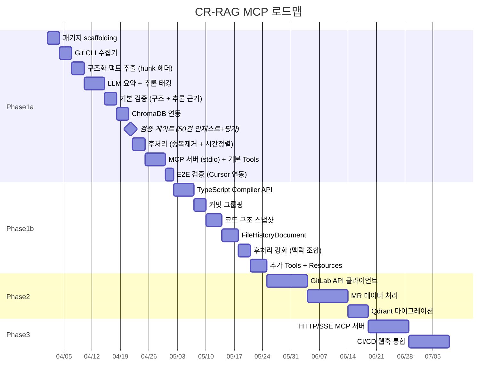

# 로드맵

## 1. Phase 요약



### ROI 검증 게이트

```
Phase 1a 내부 게이트: P1a-6 완료 후 50건 인제스트 → 검색 시뮬레이션 5건, 유용한 결과 60%+
  → 통과 시: 나머지 Phase 1a 진행 (후처리, MCP 서버, E2E)
  → 실패 시: 프롬프트/모델 변경 후 재시도 또는 접근 방식 재검토
Phase 1a → 1b: 2주 실사용, 주 1회 이상 유용한 컨텍스트 제공
Phase 1b → 2: 단일 프로젝트 안정 운영, 팀 확장 필요성 확인
Phase 2 → 3: 멀티 프로젝트 운영 안정, 팀원 3명+ 사용 의향
```

---

## 2. Phase 1a: MVP + 핵심 가정 검증 (~3주)

**목표**: 최소한의 기능으로 동작하는 MCP 서버. 초반에 임베딩 검색 유용성을 검증한 뒤, Cursor에서 `search_review_context`로 과거 변경을 검색할 수 있음을 확인.

### 2-1. 마일스톤

| #      | 마일스톤              | 산출물                                   | 완료 기준                                  |
| ------ | --------------------- | ---------------------------------------- | ------------------------------------------ |
| P1a-1  | 패키지 scaffolding    | `packages/cr-rag-mcp` 프로젝트 구조      | 빌드 성공, type-check 통과                 |
| P1a-2  | Git CLI 수집기        | `git log`, `git diff` 파싱 모듈          | 로컬 리포에서 커밋 목록 + diff 추출        |
| P1a-3  | 구조화 팩트 추출      | diff → StructuredFacts (hunk 헤더 L1~L2) | 파일 경로, 함수명, 변경 통계 추출          |
| P1a-4  | LLM 요약 + 추론 태깅  | OpenAI API 연동, `[추론된내용]` 태그     | 커밋 요약 생성, reason_inferred 분류       |
| P1a-5  | 기본 검증             | 구조 검증 (1단계) + 추론 근거 검증       | 팩트/요약 일치, 추론 근거 존재 확인        |
| P1a-6  | ChromaDB 연동         | 벡터 DB 적재/검색                        | 임베딩 저장, 유사도 검색 동작              |
| **--** | **검증 게이트**       | **50건 인제스트 → 5건 시뮬레이션**       | **유용한 결과 60%+ → 통과, 아니면 재검토** |
| P1a-7  | 후처리 (기본)         | 중복 제거, 시간순 정렬, 노이즈 필터      | 검색 결과 품질 향상                        |
| P1a-8  | MCP 서버 + 기본 Tools | stdio 서버, 3개 Tool                     | Cursor에서 Tools 호출 가능                 |
| P1a-9  | E2E 검증              | Cursor 연동 코드 리뷰                    | 실제 리뷰에서 유용한 히스토리 반환         |

### 2-2. 검증 게이트 (P1a-6 완료 후)

P1a-6(ChromaDB 연동)까지 완료되면, 파이프라인이 "수집 → 요약 → 검증 → 임베딩"까지 동작하는 상태이다. 이 시점에서 50건의 커밋을 자동 인제스트한 뒤, 실제 코드 리뷰 5건으로 검색 시뮬레이션을 수행한다.

```
1. P1a-2~6 파이프라인으로 실제 커밋 50건 자동 인제스트
2. 최근 코드 변경 5건의 diff를 선택
3. 각 diff를 임베딩하여 유사도 검색 실행
4. 검색 결과가 해당 리뷰에서 실제로 유용한 컨텍스트인지 평가
   - 유용: 회귀 위험 감지, 관련 과거 변경 발견
   - 무용: 관련 없는 결과, 너무 일반적인 결과
5. 판정:
   - >= 60%: 나머지 Phase 1a 진행 (P1a-7~9)
   - 40~60%: 프롬프트/임베딩 모델 변경 후 재시도
   - < 40%: 접근 방식 재검토 (RAG 대신 직접 Git 분석 등)
```

### 2-3. Phase 1a 구현 범위

**포함**:

- `search_review_context` Tool (기본 후처리 적용)
- `ingest_commits` Tool (bulk, incremental)
- `supplement_reason` Tool
- `project://overview` Resource
- Diff 크기 게이트 (2-tier: normal / oversized)
- 구조 검증 (1단계, 추론 근거 검증 포함)
- ChromaDB embedded
- JSON 파일 기반 Metadata Store
- OpenAI API (GPT-4o-mini + text-embedding-3-small)
- hunk 헤더 파싱 (L1~L2)
- 콜드 스타트 처리
- `[추론된내용]` 태그 시스템

**제외 (Phase 1b로 이연)**:

- TypeScript Compiler API (L3~L4)
- 커밋 그룹핑 (메타데이터 방식, Phase 1b)
- 코드 구조 스냅샷 (ArchitectureDocument)
- FileHistoryDocument
- `get_file_history`, `search_by_topic`, `get_impact_analysis`, `analyze_architecture` Tools
- `project://hot-files`, `project://recent-issues` Resources
- 맥락 조합 (후처리 강화)
- Registry 패턴 추적

### 2-4. 기술 스택 (Phase 1a)

```
Node.js >= 20 + TypeScript
├── @modelcontextprotocol/sdk (stdio)
├── chromadb (embedded)
├── simple-git (Git CLI 래퍼)
├── OpenAI API (GPT-4o-mini + text-embedding-3-small)
└── JSON 파일 (메타데이터)
```

### 2-5. 검증 기준

- [ ] 로컬 Git 리포에서 최근 100개 커밋 인제스트 성공
- [ ] 검증 통과율 80% 이상
- [ ] Cursor에서 `search_review_context` 호출 시 관련 히스토리 반환
- [ ] 검색 결과가 실제로 유용한지 수동 평가 (10건 샘플, 60%+ 유용)
- [ ] MCP 서버 시작~응답 시간 3초 이내
- [ ] `[추론된내용]` 태그가 정확히 분류되는지 검증 (추론 vs 사실)

---

## 3. Phase 1b: 확장 (~3주)

**목표**: Phase 1a 검증 후, AST 분석, 커밋 그룹핑, 코드 구조 스냅샷 등 고급 기능 추가.

### 3-1. 마일스톤

| #     | 마일스톤                | 산출물                       | 완료 기준                            |
| ----- | ----------------------- | ---------------------------- | ------------------------------------ |
| P1b-1 | TypeScript Compiler API | AST 분석 모듈 (L3~L4)        | 시그니처, 의존성 관계 추출           |
| P1b-2 | 커밋 그룹핑             | 커밋 그룹 감지 + 메타데이터 부여 모듈 | 연속 커밋 자동 그룹핑, `group_id` / `group_size` / `group_index` 메타데이터 부여 |
| P1b-3 | 코드 구조 스냅샷        | ArchitectureDocument 생성    | 핵심 인터페이스/베이스 클래스 인덱싱 |
| P1b-4 | FileHistoryDocument     | 파일별 히스토리 요약 생성    | 파일 변천사 요약, 갱신 파이프라인    |
| P1b-5 | 후처리 강화             | 맥락 조합 (동일 파일 스토리) | 시간순 변경 스토리 생성              |
| P1b-6 | 추가 Tools + Resources  | 4개 Tool + 2개 Resource 추가 | 모든 Phase 1b Tool Cursor에서 동작   |

### 3-2. Phase 1b 추가 구현 범위

- `get_file_history`, `search_by_topic`, `get_impact_analysis`, `analyze_architecture` Tools
- `project://hot-files`, `project://recent-issues` Resources
- TypeScript Compiler API (L3~L4 구조 추출)
- 커밋 그룹핑 (메타데이터 방식, 커밋 합치지 않음)
- 코드 구조 스냅샷 (ArchitectureDocument)
- FileHistoryDocument 생성/갱신 파이프라인
- 맥락 조합 (후처리 강화)
- Registry 패턴 추적 (계층 1: 패턴 시그니처)
- 의존성 분석 (import/export 관계)

### 3-3. 검증 기준

- [ ] AST 분석으로 시그니처/의존성 정확도 90%+ 확인
- [ ] 커밋 그룹핑이 실제 작업 단위와 일치하는지 수동 평가 (70%+)
- [ ] ArchitectureDocument가 아키텍처 일관성 리뷰에 유용한지 평가
- [ ] FileHistoryDocument가 파일 맥락 파악에 유용한지 평가
- [ ] 맥락 조합 결과가 시간순 변경 스토리로서 가치가 있는지 평가

---

## 4. Phase 2: GitLab 통합 + 중앙 벡터 DB

**목표**: GitLab API로 MR + 커밋 수집, 중앙 벡터 DB(Qdrant)로 팀 데이터 공유, 검증 파이프라인 강화.

### 4-1. 마일스톤

| #    | 마일스톤              | 산출물               | 완료 기준                           |
| ---- | --------------------- | -------------------- | ----------------------------------- |
| P2-1 | GitLab API 클라이언트 | REST API 연동 모듈   | MR 목록, 커밋, diff, 디스커션 수집  |
| P2-2 | MR 데이터 처리        | MR 요약 파이프라인   | MR 목적 + 디스커션 요약 생성        |
| P2-3 | 의미 일관성 검증      | 2단계 검증 추가      | cross-validation 동작, 정확도 향상  |
| P2-4 | 신뢰도 점수 튜닝      | 임계값 최적화        | Phase 1a/1b 데이터 기반 임계값 조정 |
| P2-5 | Qdrant 마이그레이션   | ChromaDB → Qdrant    | 기존 데이터 무손실 이전             |
| P2-6 | 멀티 프로젝트         | project_id 기반 분리 | 여러 프로젝트 동시 인덱싱/검색      |
| P2-7 | 설정 파일 구조 분석   | Registry 패턴 계층 2 | 라우터/스토어 설정 파일 AST 파싱    |

### 4-2. 기술 스택 변경

```diff
  Node.js >= 20 + TypeScript
  ├── @modelcontextprotocol/sdk (stdio)
- ├── chromadb (embedded)
+ ├── @qdrant/js-client-rest (Qdrant 서버)
  ├── simple-git
+ ├── @gitbeaker/rest (GitLab API)
  ├── OpenAI API (GPT-4o-mini + text-embedding-3-small)
  ├── typescript (Compiler API, AST 분석)
- └── JSON 파일
+ └── better-sqlite3 (메타데이터)
```

### 4-3. 검증 기준

- [ ] GitLab 프로젝트에서 MR + 커밋 일괄 인제스트 성공
- [ ] 검증 통과율 85% 이상 (1+2단계)
- [ ] 멀티 프로젝트 검색 동작
- [ ] Qdrant에서 검색 응답 시간 500ms 이내

---

## 5. Phase 3: 팀 공유 서버

**목표**: 팀원들이 공유하는 MCP 서버 배포, CI/CD 통합으로 자동 인덱싱, 품질 피드백 루프.

### 5-1. 마일스톤

| #    | 마일스톤          | 산출물                             | 완료 기준                                 |
| ---- | ----------------- | ---------------------------------- | ----------------------------------------- |
| P3-1 | HTTP/SSE MCP 서버 | Streamable HTTP transport          | 원격 Cursor 연결 성공                     |
| P3-2 | 인증/권한         | 토큰 기반 인증, 프로젝트별 ACL     | 인증 없이 접근 불가, 프로젝트별 접근 제어 |
| P3-3 | CI/CD 웹훅 통합   | GitLab 웹훅 수신, 자동 인덱싱      | MR 머지 시 자동 인덱싱                    |
| P3-4 | 대시보드          | 인덱싱 상태, 품질 통계 UI          | 프로젝트별 인덱싱 현황, 검증 통과율 조회  |
| P3-5 | 피드백 루프       | 피드백 수집 Tool, 임계값 동적 조정 | 사용자 피드백 기반 품질 개선              |

### 5-2. 배포 구성

```yaml
# docker-compose.yml
services:
    cr-rag-mcp:
        build: ./packages/cr-rag-mcp
        ports:
            - '3100:3100'
        environment:
            - QDRANT_URL=http://qdrant:6333
            - DATABASE_URL=postgresql://...
            - GITLAB_TOKEN=${GITLAB_TOKEN}
            - OPENAI_API_KEY=${OPENAI_API_KEY}
        depends_on:
            - qdrant
            - postgres

    qdrant:
        image: qdrant/qdrant:latest
        ports:
            - '6333:6333'
        volumes:
            - qdrant_data:/qdrant/storage

    postgres:
        image: postgres:16
        environment:
            POSTGRES_DB: cr_rag_mcp
        volumes:
            - pg_data:/var/lib/postgresql/data
```

### 5-3. Cursor 연결 설정 (팀원용)

```json
{
    "mcpServers": {
        "cr-rag-mcp": {
            "url": "http://team-server:3100/mcp",
            "transport": "streamable-http",
            "headers": {
                "Authorization": "Bearer ${CR_RAG_MCP_TOKEN}"
            }
        }
    }
}
```

### 5-4. 검증 기준

- [ ] 3명 이상 팀원 동시 접속 테스트
- [ ] MR 머지 후 5분 이내 자동 인덱싱 완료
- [ ] 검색 응답 시간 1초 이내
- [ ] 사용자 정확도 피드백 90% 이상
- [ ] 24시간 무중단 운영

---

## 6. 미결정 사항 (Open Questions)

| #     | 항목                              | 관련 Phase | 상태                                                    |
| ----- | --------------------------------- | ---------- | ------------------------------------------------------- |
| ~~1~~ | ~~Registry 패턴 추적 방식~~       | -          | **결정 완료**: 2계층 하이브리드, 02-data-pipeline 4-5절 |
| ~~2~~ | ~~외부 LLM API 사용 가능 여부~~   | -          | **결정 완료**: 사용 가능, OpenAI API 직접 사용          |
| ~~3~~ | ~~임베딩 모델 선택~~              | -          | **결정 완료**: text-embedding-3-small                   |
| ~~4~~ | ~~Phase 1 범위~~                  | -          | **결정 완료**: Phase 1a/1b 분리                         |
| ~~5~~ | ~~추론된 내용 태깅~~              | -          | **결정 완료**: `[추론된내용]` 태그 사용                 |
| 6     | GraphQL로 전환 시점               | Phase 2    | 미정. REST API 병목 발생 시                             |
| 7     | 대시보드 기술 스택                | Phase 3    | 미정. Phase 2 완료 후                                   |
| 8     | FileHistoryDocument 업데이트 주기 | Phase 1b   | 미정. 프로토타입에서 실험                               |
| 9     | 시간 감쇠 파라미터 튜닝           | Phase 1a   | 미정. 프로토타입에서 실험                               |

---

## 7. 위험 요소 및 대응

| 위험                           | 영향                  | 확률 | 대응                                                              |
| ------------------------------ | --------------------- | ---- | ----------------------------------------------------------------- |
| **임베딩 검색 유용성 미검증**  | 전체 시스템 가치 부재 | 중   | Phase 1a 내부 검증 게이트에서 사전 검증, 실패 시 접근 방식 재검토 |
| **MVP 범위 확장**              | 개발 기간 초과        | 높   | Phase 1a/1b 분리, ROI 게이트로 범위 통제                          |
| LLM 요약 품질 부족             | 검색 결과 무용지물    | 중   | 프롬프트 반복 개선, `[추론된내용]` 태그로 품질 투명성             |
| 운영 부담 과다                 | 시스템 방치           | 중   | Phase 1a를 최소 유지보수 설계, 자동화 우선                        |
| OpenAI API 장애/지연           | 인제스트/검색 중단    | 낮   | 재시도 로직, 큐 기반 비동기 처리                                  |
| GitLab API Rate Limit          | 벌크 인제스트 지연    | 낮   | 배치 간 delay, GraphQL 전환, 캐싱                                 |
| 대규모 리포 처리 시 성능       | 인제스트 시간 과다    | 중   | Diff 크기 게이트, 증분 업데이트 우선                              |
| ChromaDB → Qdrant 마이그레이션 | 데이터 손실 위험      | 낮   | 마이그레이션 스크립트 + 검증, 재인제스트 가능                     |
