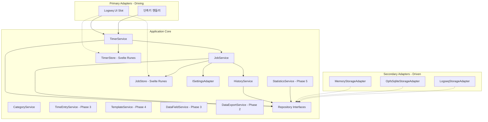
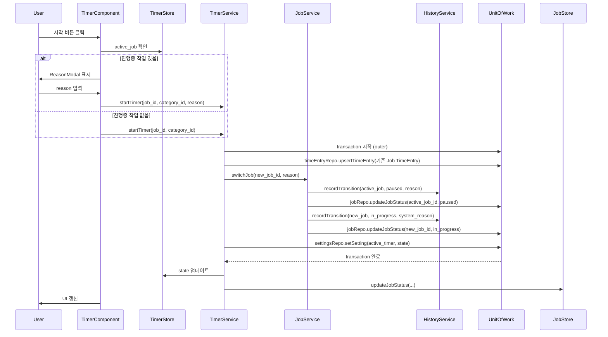
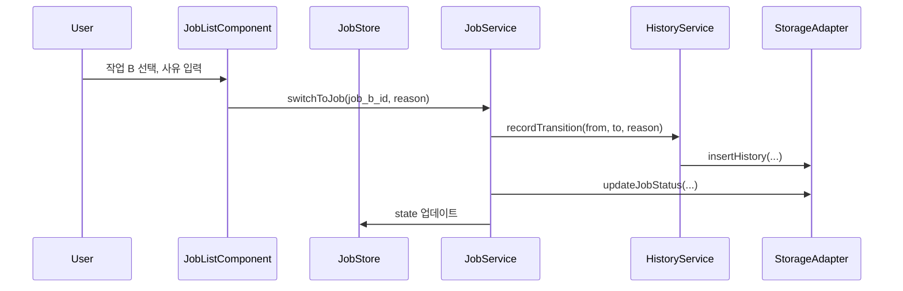

# Time Tracker 아키텍처 설계

**작성일**: 2026-03-15
**버전**: 1.0

---

## 1. 아키텍처 스타일

**Hexagonal Architecture (Ports & Adapters)** + **Layered** 혼합

- **Core**: 도메인 로직, 타입, 서비스 (Logseq 무관, Svelte 5 기반)
- **Adapters**: 저장소, 설정, UI 슬롯 등 외부 시스템 연동
- **의존성 방향**: Core ← Adapters (Dependency Inversion)

---

## 2. 시스템 구조



---

## 3. 패키지 구조

### 3.1 `time-tracker-core` 디렉터리 구조

```
packages/time-tracker-core/
├── src/
│   ├── types/                    # 도메인 타입
│   │   ├── job.ts
│   │   ├── time_entry.ts
│   │   ├── category.ts
│   │   ├── job_status.ts
│   │   ├── history.ts
│   │   └── index.ts
│   │
│   ├── adapters/                 # 포트(인터페이스) + 어댑터
│   │   ├── storage/
│   │   │   ├── unit_of_work.ts          # IUnitOfWork 인터페이스
│   │   │   ├── memory_unit_of_work.ts   # MemoryAdapter (Phase 1)
│   │   │   ├── sqlite_unit_of_work.ts   # OPFS+SQLite (Phase 2)
│   │   │   └── index.ts
│   │   └── settings/
│   │       ├── settings_adapter.ts
│   │       └── index.ts
│   │
│   ├── services/                 # 도메인 서비스
│   │   ├── timer_service.ts
│   │   ├── job_service.ts
│   │   ├── category_service.ts
│   │   ├── time_entry_service.ts  # Phase 3
│   │   ├── template_service.ts    # Phase 4
│   │   ├── history_service.ts
│   │   ├── statistics_service.ts  # Phase 5
│   │   └── index.ts
│   │
│   ├── stores/                   # Svelte 5 Runes 기반 스토어
│   │   ├── timer_store.svelte.ts # $state, $derived 사용 → .svelte.ts 필수
│   │   ├── job_store.svelte.ts
│   │   └── index.ts
│   │
│   ├── constants/                # 상수 정의
│   │   ├── strings.ts            # UI 문자열 상수 (한국어 only, i18n 미지원)
│   │   ├── config.ts             # 앱 설정 상수 (CATEGORY_MAX_DEPTH 등)
│   │   └── index.ts
│   │
│   ├── components/               # Svelte 5 UI 컴포넌트
│   │   ├── Timer/
│   │   │   ├── Timer.svelte
│   │   │   ├── TimerButton.svelte
│   │   │   └── TimerDisplay.svelte
│   │   ├── JobList/
│   │   │   └── JobList.svelte
│   │   └── index.ts
│   │
│   └── index.ts
├── package.json
├── tsconfig.json
├── vite.config.ts
└── svelte.config.js
```

### 3.2 `logseq-time-tracker` 디렉터리 구조

```
packages/logseq-time-tracker/
├── src/
│   ├── main.ts                   # Logseq 플러그인 진입점
│   ├── App.svelte                # 루트 UI
│   ├── adapters/
│   │   ├── logseq_unit_of_work.ts    # Logseq 그래프 동기화 (Phase 3+, 선택적)
│   │   └── logseq_settings_adapter.ts
│   ├── slots/                    # Logseq UI 슬롯 매핑
│   │   └── toolbar.ts
│   └── ...
├── package.json
├── tsconfig.json
├── vite.config.ts
└── svelte.config.js
```

---

## 4. 레이어 설명

### 4.1 Types (도메인 타입)

- **역할**: 순수 데이터 타입 (가장 안쪽 레이어, 외부 의존 금지)

> **상세**: [03-data-model.md §7 TypeScript 타입 정의](03-data-model.md) 참조

### 4.2 Adapters (포트 + 구현체)

| 포트                  | 설명                                                  | 구현체                                                                           |
| --------------------- | ----------------------------------------------------- | -------------------------------------------------------------------------------- |
| Repository 인터페이스 | 역할별 분리된 데이터 접근 포트                        | 각 백엔드별 구현체 (Memory, SQLite, Logseq)                                      |
| `ISettingsAdapter`    | **Logseq 플러그인 설정 UI** 전용 (플랫폼 레이어 한정) | LogseqSettingsAdapter, MemorySettingsAdapter                                     |
| `ILogger`             | 로깅 포트 (레벨: debug/info/warn/error)               | ConsoleLogger (기본), Services 생성자에서 선택적 주입. 하단 로깅 가이드라인 참조 |

> **Repository 인터페이스 + IUnitOfWork 상세**: [05-storage.md §Repository 인터페이스](05-storage.md) 참조. 9개 역할별 Repository와 `IUnitOfWork` 트랜잭션 인터페이스가 정의되어 있습니다.

> **IUnitOfWork Phase별 확장 전략**: Phase 1에서는 `jobRepo`, `categoryRepo`, `historyRepo`, `settingsRepo`만 실질 구현하고, 나머지는 `stub`(`NotImplementedError` throw)으로 제공합니다. 각 Phase에서 해당 Repository를 실제 구현체로 교체하여 점진적 구현을 수행합니다.

> **중첩 트랜잭션 전략 (조인)**: `TimerService.start()`가 `uow.transaction()` 내에서 `JobService.switchJob()`을 호출하면, `JobService`의 내부 `uow.transaction()` 호출은 **새 트랜잭션을 열지 않고 기존 트랜잭션에 조인(join)** 합니다. 구현: `IUnitOfWork` 내부에 `_active_transaction` 플래그를 두고, 이미 활성이면 `fn(this)`를 직접 실행합니다.

> **설정 역할 구분**: `ISettingsRepository`(core 앱 내부 데이터) vs `ISettingsAdapter`(Logseq 플러그인 설정 UI). 상세: [05-storage.md §Settings 역할 구분](05-storage.md) 참조. 설정 스키마: [01-requirements.md §3.8](01-requirements.md) 참조.

### 4.3 Services (도메인 서비스)

| 서비스               | 책임                                                                                                                                                                                                                                                                   |
| -------------------- | ---------------------------------------------------------------------------------------------------------------------------------------------------------------------------------------------------------------------------------------------------------------------- |
| `TimerService`       | 이벤트 타임스탬프 기록, elapsed 계산, ActiveTimerState 영속화, **전환 시 기존 Job의 TimeEntry 즉시 생성** (ITimeEntryRepository 직접 접근). Job 상태 변경은 JobService를 호출하여 위임. **cancel()**: 실행 중 작업 취소 → cancelled 전환, 경과 시간은 TimeEntry로 기록 |
| `JobService`         | Job CRUD, 상태 전환 (FSM 규칙 enforce), 전환 시 HistoryService에 기록 위임                                                                                                                                                                                             |
| `CategoryService`    | Category CRUD, 트리 깊이 검증 (최대 10), 삭제 시 참조 검사, 시드 데이터 초기화 (Phase 1)                                                                                                                                                                               |
| `TimeEntryService`   | 수동 TimeEntry CRUD, 시간 중복(overlap) 감지 및 해소, duration_seconds 정합성 검증 (Phase 3)                                                                                                                                                                           |
| `TemplateService`    | JobTemplate CRUD, 플레이스홀더 치환 (XSS 이스케이프 적용), 템플릿 기반 페이지 생성 (Phase 4)                                                                                                                                                                           |
| `JobCategoryService` | Job-Category 연결 관리, `is_default` 유일성 보장 (동일 Job 내), 연결 CRUD (Phase 2)                                                                                                                                                                                    |
| `HistoryService`     | 상태 변경 시 History 기록 생성, 기간별/잡별 조회                                                                                                                                                                                                                       |
| `DataFieldService`   | DataField CRUD, 시스템 필드 보호 (`is_system=true` 삭제 거부), `(entity_type_id, key)` 유일성 검증 (Phase 3)                                                                                                                                                           |
| `DataExportService`  | 데이터 Export/Import, ExportData 버전 관리, 버전별 마이그레이션 체인 실행 (Phase 2)                                                                                                                                                                                    |
| `StatisticsService`  | 기간별/잡별/카테고리별 시간 집계, 통계 데이터 생성 (Phase 5)                                                                                                                                                                                                           |

**서비스 간 호출 방향**:

```
TimerService → JobService → HistoryService
                          → IJobRepository (via IUnitOfWork)
TimerService → ITimeEntryRepository (전환 시 기존 Job의 TimeEntry 즉시 생성)
TimerService → ISettingsRepository (ActiveTimerState 영속화)
CategoryService → ICategoryRepository (CRUD, 트리 깊이 검증, 참조 검사)
JobCategoryService → IJobCategoryRepository (연결 CRUD, is_default 유일성 보장)
TimeEntryService → ITimeEntryRepository (수동 CRUD, 중복 감지)
TemplateService → ITemplateRepository (CRUD, 플레이스홀더 치환)
StatisticsService → ITimeEntryRepository (집계 쿼리), ICategoryRepository (카테고리명 조회)

# Cascade 삭제 경로 (Job 삭제 시)
JobService → ITimeEntryRepository.deleteByJobId()
JobService → IHistoryRepository.deleteByJobId()
JobService → IJobCategoryRepository.deleteByJobId()
JobService → IExternalRefRepository.deleteByJobId()
```

> **핵심 원칙**: Job 상태 변경은 반드시 JobService를 통해서만 수행됩니다. 이를 통해 FSM 규칙 검증이 JobService 한 곳에서만 이루어집니다. **예외**: TimerService는 전환 시 기존 Job의 실행 구간(started_at ~ now)으로 TimeEntry를 직접 생성합니다. TimeEntry 생성은 타이머 메커니즘의 일부(구간 종료 시 기록)이므로 TimerService가 ITimeEntryRepository에 직접 접근합니다.

> **Cascade 삭제 전략**: Job 삭제 시 관련 레코드(TimeEntry, JobHistory, JobCategory, ExternalRef) 정리는 **서비스 레이어(JobService)**가 `IUnitOfWork` 트랜잭션 내에서 각 Repository의 `deleteByJobId()`를 순차 호출하여 수행합니다. SQLite 어댑터(Phase 2+)에서는 FK `ON DELETE CASCADE` 제약을 추가로 적용하여 이중 안전장치를 구성합니다. MemoryAdapter에서는 서비스 레벨 삭제만 적용됩니다.

### 4.4 JobService (Phase 1)

```typescript
interface IJobService {
    createJob(params: { title: string; description?: string }): Promise<Job>;
    getJobs(filter?: { status?: StatusKind }): Promise<Job[]>;
    getJobById(id: string): Promise<Job | null>;
    updateJob(id: string, updates: Partial<Pick<Job, 'title' | 'description'>>): Promise<Job>;
    deleteJob(id: string): Promise<void>;
    transitionStatus(job_id: string, to_status: StatusKind, reason: string): Promise<void>;
    switchJob(from_job_id: string, to_job_id: string, reason: string): Promise<void>;
}
```

**책임**:

- Job CRUD 및 FSM 규칙에 따른 상태 전환
- `transitionStatus()`: FSM 유효성 검증 → HistoryService.recordTransition() → status 갱신
- `switchJob()`: 기존 Job paused + 새 Job in_progress를 하나의 트랜잭션에서 수행 (TimerService가 호출)
- `deleteJob()`: cascade 삭제 (TimeEntry, JobHistory, JobCategory, ExternalRef) — `IUnitOfWork` 트랜잭션 내에서 수행
- 제약: `in_progress`/`paused` 상태의 Job은 삭제 거부 (`StateTransitionError`)

### 4.5 HistoryService (Phase 1)

```typescript
interface IHistoryService {
    recordTransition(job_id: string, from: StatusKind | null, to: StatusKind, reason: string): Promise<void>;
    getJobHistory(job_id: string): Promise<JobHistory[]>;
    getHistoryByPeriod(filter: HistoryFilter): Promise<JobHistory[]>;
}
```

**책임**:

- 모든 상태 전환 시 JobHistory 레코드 생성
- `recordTransition()`: JobService가 호출하며, occurred_at은 호출 시점의 UTC ISO8601
- 특정 Job의 이력 조회, 기간별 이력 조회 지원

### 4.6 Stores (Svelte Runes)

> **상세**: [04-state-management.md §Svelte 5 Runes](04-state-management.md) 참조. `TimerStore`(이벤트 타임스탬프 기반 타이머 상태)와 `JobStore`(Job 목록) 필드 및 동작이 정의되어 있습니다.

### 4.7 StatisticsService (Phase 5)

```typescript
interface IStatisticsService {
    getJobDuration(job_id: string, period?: DateRange): Promise<DurationSummary>;
    getCategoryDuration(category_id: string, period?: DateRange): Promise<DurationSummary>;
    getJobCategoryBreakdown(job_id: string, period?: DateRange): Promise<CategoryBreakdown[]>;
    getDailySummary(period: DateRange, tz_offset_minutes?: number): Promise<DailySummary[]>;
}

interface DateRange {
    from: string; // UTC ISO8601
    to: string; // UTC ISO8601
}

interface DurationSummary {
    total_seconds: number;
    entry_count: number;
    first_entry: string;
    last_entry: string;
}

interface CategoryBreakdown {
    category_id: string;
    category_name: string;
    total_seconds: number;
    percentage: number;
}

interface DailySummary {
    date: string; // YYYY-MM-DD (사용자 로컬 타임존 기준)
    total_seconds: number;
    entries: { job_id: string; category_id: string; seconds: number }[];
}
```

> Phase 5에서 구현합니다. `ITimeEntryRepository`의 기간별 조회를 기반으로 집계합니다.

> **DailySummary 타임존 경계 정책**: `getDailySummary`는 `tz_offset_minutes` 파라미터(기본값: 클라이언트의 `new Date().getTimezoneOffset() * -1`)를 받아 **사용자 로컬 타임존 기준**으로 날짜 경계를 결정합니다. 예: KST(UTC+9) 사용자의 경우 `tz_offset_minutes=540`이면, UTC 기준 `2026-03-15T15:00:00Z`~`2026-03-16T14:59:59Z`가 로컬 날짜 `2026-03-16`에 해당합니다. TimeEntry의 `started_at`(UTC ISO8601)에 offset을 적용하여 로컬 날짜를 산출한 후 집계합니다. 저장된 데이터는 항상 UTC이며, 표시 시점에만 로컬 변환합니다.

> **TimeEntry 없는 Job 처리**: `pending → completed` (사후 기록) 또는 TimeEntry 생성 전 삭제된 경우, Job에 연결된 TimeEntry가 0건일 수 있습니다. `StatisticsService`는 이런 Job에 대해 `total_seconds: 0, entry_count: 0`을 반환합니다. UI에서는 "기록 없음"으로 표시합니다.

### 4.8 CategoryService (Phase 1)

```typescript
interface ICategoryService {
    getCategories(): Promise<Category[]>;
    getCategoryTree(): Promise<CategoryTreeNode[]>;
    createCategory(name: string, parent_id?: string): Promise<Category>;
    updateCategory(id: string, updates: Partial<Pick<Category, 'name' | 'sort_order'>>): Promise<Category>;
    deleteCategory(id: string): Promise<void>;
    seedDefaults(): Promise<void>;
}
```

**책임**:

- Category CRUD 및 트리 구조 관리
- 생성/이동 시 **순환 참조 검사** (visited set 기반) + **트리 깊이 10 제한** 검증 (`ValidationError` 발생)
- 삭제 시 **참조 검사**: TimeEntry, JobCategory에 참조가 있으면 `ReferenceIntegrityError` 발생
- 하위 카테고리가 있으면 삭제 거부
- 앱 초기화 시 시드 데이터(개발, 분석, 회의, 기타) 삽입. `seedDefaults()`는 **멱등(idempotent)**: 이미 카테고리가 1개 이상 존재하면 시드를 건너뜁니다
- 생성/이동 시 동일 부모 내 **이름 유일성 검증** (`ValidationError` 발생, 03-data-model.md 참조)

### 4.9 TimeEntryService (Phase 3)

```typescript
interface ITimeEntryService {
    createManualEntry(params: ManualEntryParams): Promise<TimeEntry>;
    detectOverlaps(started_at: string, ended_at: string, exclude_id?: string): Promise<TimeEntry[]>;
    resolveOverlap(
        new_entry: TimeEntry,
        existing: TimeEntry[],
        strategy: 'new_first' | 'existing_first',
    ): Promise<TimeEntry[]>;
    updateEntry(
        id: string,
        updates: Partial<Pick<TimeEntry, 'started_at' | 'ended_at' | 'note' | 'category_id'>>,
    ): Promise<TimeEntry>;
    deleteEntry(id: string): Promise<void>;
}

interface ManualEntryParams {
    job_id: string;
    category_id: string;
    started_at: string;
    ended_at: string;
    note?: string;
}
```

**책임**:

- 수동 TimeEntry 생성 (타이머 없이 과거 시간 기록)
- `ended_at >= started_at` 검증, `duration_seconds` 자동 계산
- 기존 TimeEntry와의 시간 중복(overlap) 감지
- OverlapResolutionModal 선택에 따른 중복 해소 (`new_first` / `existing_first`)

> **참고**: 타이머에 의한 자동 TimeEntry 생성은 TimerService가 담당합니다. TimeEntryService는 수동 입력 전용입니다.

### 4.10 TemplateService (Phase 4)

```typescript
interface ITemplateService {
    getTemplates(): Promise<JobTemplate[]>;
    getTemplateById(id: string): Promise<JobTemplate | null>;
    createTemplate(name: string, content: string, placeholders?: PlaceholderDef[]): Promise<JobTemplate>;
    updateTemplate(
        id: string,
        updates: Partial<Pick<JobTemplate, 'name' | 'content' | 'placeholders'>>,
    ): Promise<JobTemplate>;
    deleteTemplate(id: string): Promise<void>;
    renderTemplate(template_id: string, values: Record<string, string>): Promise<string>;
}
```

**책임**:

- JobTemplate CRUD
- 플레이스홀더 치환 시 **XSS 방지**: HTML 엔티티 이스케이프 (`<` → `&lt;` 등)
- 위험 태그 필터링 (`<script>`, `<iframe>` 등 제거)
- DataField 참조(field_ref)를 통한 값 자동 매핑

### 4.11 입력값 새니타이징

> **NFR-7.1**(DOMPurify)은 **템플릿 플레이스홀더 치환** 전용입니다. 일반 사용자 입력(NFR-7.2)은 아래 유틸로 처리합니다.

- **적용 레이어**: 각 Service의 create/update 메서드 진입점 (서비스 경계)
- **대상 필드**: `Job.title`, `Job.description`, `JobHistory.reason`, `TimeEntry.note`, `Category.name`
- **유틸 함수**: `sanitizeText(input: string): string`
    - HTML 태그 제거 (`<tag>` → 공백)
    - 앞뒤 공백 trim
    - 최대 길이 검증 (title: 200자, description: 2000자, reason: 500자, note: 1000자, name: 100자)
    - 초과 시 `ValidationError` 발생

---

## 5. 데이터 흐름

### 5.1 타임 트래킹 시작



> **의존성 방향**: UI(TimerComponent)가 먼저 상태를 확인하고, 필요시 사용자에게 reason을 받은 뒤 Service를 호출합니다. **Service → UI 방향 호출은 금지**합니다.

> **TimeEntry 즉시 생성**: 전환 시 기존 Job의 실행 구간(started_at ~ now)으로 TimeEntry를 트랜잭션 내에서 즉시 생성합니다. 이를 통해 전환(paused)된 Job의 시간이 유실되지 않습니다.

### 5.2 Job 전환 (스위칭)



---

## 6. 기술 스택

| 구분   | 기술                                         | 선택 근거                                 |
| ------ | -------------------------------------------- | ----------------------------------------- |
| UI     | Svelte 5 (Runes)                             | 프로젝트 인프라 이미 구축, 가벼움, 반응형 |
| 스타일 | vanilla-extract                              | 기존 uikit, ecount-dev-tool과 일관성      |
| 빌드   | Vite 7                                       | 모노레포 표준, HMR, Logseq 플러그인 호환  |
| 타입   | TypeScript 5.x                               | 타입 안전성                               |
| 테스트 | Vitest + @testing-library/svelte             | 모노레포 표준                             |
| 저장소 | OPFS + sql.js (또는 @sqlite.org/sqlite-wasm) | 브라우저 내 영속 저장                     |
| Logseq | @logseq/libs, vite-plugin-logseq             | 표준 Logseq 플러그인 스택                 |

> **NFR 근거**: [01-requirements.md §3.3 기술 스택](01-requirements.md) 참조

---

## 7. 의존성 그래프 (pnpm workspace)

> **상세**: [00-overview.md §3 패키지 분리 구조](00-overview.md) 참조. 패키지 역할/의존성/방향이 정의되어 있습니다.

---

## 8. 서비스 초기화 (팩토리 함수)

서비스 간 의존성 순서를 명시적으로 관리하기 위해 팩토리 함수를 사용합니다.

```typescript
function createServices(uow: IUnitOfWork, logger?: ILogger) {
    // Phase 1 (Core)
    const history_service = new HistoryService(uow, logger);
    const job_service = new JobService(uow, history_service, logger);
    const category_service = new CategoryService(uow, logger);
    const timer_service = new TimerService(uow, job_service, logger);

    // Phase 2
    const job_category_service = new JobCategoryService(uow, logger);

    // Phase 3 (수동 시간 입력)
    const time_entry_service = new TimeEntryService(uow, logger);

    // Phase 4 (템플릿)
    const template_service = new TemplateService(uow, logger);

    // Phase 5 (통계/내보내기)
    const statistics_service = new StatisticsService(uow, logger);
    const data_export_service = new DataExportService(uow, statistics_service, logger);
    const data_field_service = new DataFieldService(uow, logger);

    return {
        // Phase 1
        history_service,
        job_service,
        category_service,
        timer_service,
        // Phase 2+
        job_category_service,
        time_entry_service,
        template_service,
        statistics_service,
        data_export_service,
        data_field_service,
    };
}
```

> **Phase별 서비스 확장**: 초기 구현(Phase 1)에서는 Phase 1 서비스만 인스턴스화합니다. Phase 2+ 서비스는 해당 Phase 구현 시 추가하며, 상위 Phase 서비스는 하위 Phase 서비스에 의존하지 않습니다.

**초기화 순서 규칙**:

1. `HistoryService` (의존성 없음)
2. `JobService` (HistoryService 의존)
3. `CategoryService` (의존성 없음, JobService와 독립)
4. `JobCategoryService` (의존성 없음, Phase 2에서 추가)
5. `TimerService` (JobService 의존)

> Phase별 서비스 추가 시 이 팩토리를 확장합니다. 순환 의존은 구조적으로 금지됩니다.

---

## 9. 확장성 고려사항

- **새 Storage 백엔드**: 각 Repository 인터페이스에 대한 구현체 추가
- **새 플랫폼**: `logseq-time-tracker`와 유사하게 `web-time-tracker`, `desktop-time-tracker` 등 추가 (Logseq API 무관, Svelte 5 기반 core 재사용)
- **eCount 연동**: `IEcountAdapter` 포트 추가, `JobService`에서 주입
- **알림 시스템**: Phase 4에서 `INotificationAdapter` 포트 정의 및 구현 (앱 내 토스트 + 브라우저 Web Notification 하이브리드). Phase 1~3에서는 정의하지 않음 (YAGNI)

---

## 10. Logseq 플러그인 통신 방식

Logseq 플러그인은 **iframe(sandbox)** 내에서 실행되며, `@logseq/libs`가 제공하는 API를 통해 호스트 Logseq 앱과 통신합니다.

### 통신 구조

```text
┌──────────────────────────────┐     postMessage     ┌──────────────────────────────┐
│  Logseq Main App             │ ◄──────────────────► │  Plugin iframe               │
│  (Host)                      │                      │  (logseq-time-tracker)       │
│                              │                      │                              │
│  logseq.Editor.*             │                      │  @logseq/libs proxy          │
│  logseq.App.*                │                      │  → 실제 API 호출을           │
│  logseq.DB.*                 │                      │    postMessage로 중계        │
└──────────────────────────────┘                      └──────────────────────────────┘
```

### 사용하는 Logseq API

| API                                   | 용도                    | 사용 위치               |
| ------------------------------------- | ----------------------- | ----------------------- |
| `logseq.ready(callback)`              | 플러그인 초기화         | `main.ts`               |
| `logseq.App.registerUIItem()`         | 툴바 아이콘 등록        | `main.ts`               |
| `logseq.App.registerCommandPalette()` | 커맨드 팔레트 등록      | `main.ts`               |
| `logseq.provideModel(model)`          | iframe → host 콜백 등록 | `main.ts`               |
| `logseq.provideUI(ui)`                | 커스텀 UI 삽입          | `main.ts`               |
| `logseq.Editor.createPage()`          | 템플릿 기반 페이지 생성 | `LogseqStorageAdapter`  |
| `logseq.Editor.upsertBlockProperty()` | 블록 property 업데이트  | `LogseqStorageAdapter`  |
| `logseq.Editor.getPage()`             | 페이지 조회             | `LogseqStorageAdapter`  |
| `logseq.App.getCurrentPage()`         | 현재 페이지 정보        | 인라인 UI               |
| `logseq.useSettingsSchema()`          | 설정 UI 등록            | `LogseqSettingsAdapter` |
| `logseq.settings`                     | 설정값 읽기             | `LogseqSettingsAdapter` |
| `logseq.beforeunload(callback)`       | 종료 전 정리            | `main.ts`               |

### 제약사항

- iframe 내에서 호스트 DOM에 직접 접근 불가
- API 호출은 비동기 (postMessage 기반)
- 호스트 Logseq 버전에 따라 API 지원 범위가 다를 수 있음 → `@logseq/libs` 버전 고정으로 대응

---

## 11. 에러 타입 체계

코어 패키지에서 사용하는 에러 클래스 계층을 정의합니다. 모든 커스텀 에러는 `TimeTrackerError`를 상속하여 일관된 처리가 가능합니다.

```typescript
class TimeTrackerError extends Error {
    constructor(
        message: string,
        public readonly code: string,
        options?: ErrorOptions,
    ) {
        super(message, options);
        this.name = this.constructor.name;
    }
}

class ValidationError extends TimeTrackerError {
    constructor(
        message: string,
        public readonly field?: string,
    ) {
        super(message, 'VALIDATION_ERROR');
    }
}

class StateTransitionError extends TimeTrackerError {
    constructor(
        public readonly from_status: StatusKind | null,
        public readonly to_status: StatusKind,
        message?: string,
    ) {
        super(message ?? `Invalid transition: ${from_status} -> ${to_status}`, 'STATE_TRANSITION_ERROR');
    }
}

class StorageError extends TimeTrackerError {
    constructor(
        message: string,
        public readonly operation: string,
    ) {
        super(message, 'STORAGE_ERROR');
    }
}

class TimerError extends TimeTrackerError {
    constructor(message: string) {
        super(message, 'TIMER_ERROR');
    }
}

class ReferenceIntegrityError extends TimeTrackerError {
    constructor(
        message: string,
        public readonly entity: string,
        public readonly id: string,
    ) {
        super(message, 'REFERENCE_INTEGRITY_ERROR');
    }
}
```

**에러 사용 예시**:

| 에러 클래스               | 발생 시점                                        | 예시                                                                     |
| ------------------------- | ------------------------------------------------ | ------------------------------------------------------------------------ |
| `ValidationError`         | reason 빈 문자열, title 누락, Category 깊이 초과 | `new ValidationError('reason은 최소 1글자 필수', 'reason')`              |
| `StateTransitionError`    | FSM 규칙 위반 전환 시도                          | `new StateTransitionError('completed', 'in_progress')`                   |
| `StorageError`            | DB 접근 실패, 트랜잭션 실패                      | `new StorageError('OPFS 접근 불가', 'write')`                            |
| `TimerError`              | 활성 작업 없이 pause, 이미 실행 중 start         | `new TimerError('활성 작업이 없습니다')`                                 |
| `ReferenceIntegrityError` | 참조 중인 Category 삭제, 존재하지 않는 Job 참조  | `new ReferenceIntegrityError('참조 레코드 존재', 'Category', 'cat-001')` |

---

## 11.1 ILogger 사용 가이드라인

`ILogger`는 선택적으로 Services 생성자에 주입됩니다. 각 로그 레벨의 사용 기준을 정의합니다.

### 로그 레벨별 기준

| 레벨    | 용도                               | 예시                                                                                  |
| ------- | ---------------------------------- | ------------------------------------------------------------------------------------- |
| `debug` | 개발 디버깅용, 프로덕션에서 비활성 | 상태 전환 상세 정보, SQL 쿼리 내용, 타임스탬프 기록                                   |
| `info`  | 주요 비즈니스 이벤트               | 타이머 시작/정지, Job 생성/삭제, 스키마 마이그레이션 완료                             |
| `warn`  | 비정상적이지만 복구 가능한 상황    | custom_fields JSON 파싱 실패 → fallback, Storage fallback 전환, ActiveTimerState 복구 |
| `error` | 예외 상황, 사용자 개입 필요        | StorageError, 트랜잭션 실패, 초기화 실패                                              |

### 구조화 로깅 형식

```typescript
interface ILogger {
    debug(message: string, context?: Record<string, unknown>): void;
    info(message: string, context?: Record<string, unknown>): void;
    warn(message: string, context?: Record<string, unknown>): void;
    error(message: string, context?: Record<string, unknown>): void;
}
```

### 로깅 원칙

- **민감 정보 금지**: reason 내용, 사용자 입력값을 로그에 포함하지 않음
- **구조화**: 자유 텍스트 대신 context 객체로 부가 정보 전달
- **프로덕션 레벨**: `info` 이상만 출력 (debug는 개발 모드에서만)
- **성능**: 로깅이 주요 동작 성능에 영향을 주지 않도록 비동기 처리 고려

---

## 12. ISettingsAdapter

> **설정 역할 구분 + ISettingsRepository**: [05-storage.md §Settings 역할 구분](05-storage.md) 참조
> **설정 항목 스키마 (키/타입/Phase)**: [01-requirements.md §3.8](01-requirements.md) 참조
>
> `ISettingsAdapter`는 Logseq 플러그인 레이어 전용 (`logseq.useSettingsSchema()` 매핑). `ISettingsRepository`(core 앱 내부 데이터)와 별도 계층입니다.

---

## 13. Repository 저장 규칙

### Plain Object 전용

`MemoryUnitOfWork`의 각 Repository는 **`Map<string, T>`에 일반 객체(plain object)만 저장**합니다. `structuredClone()`을 사용하여 입력 객체를 복제한 뒤 저장하고, 조회 시에도 복제본을 반환합니다.

```typescript
async upsertJob(job: Job): Promise<void> {
    this.jobs.set(job.id, structuredClone(job));
}

async getJobById(id: string): Promise<Job | null> {
    const job = this.jobs.get(id);
    return job ? structuredClone(job) : null;
}
```

**이유**: Svelte 5 Runes(`$state`)로 감싸진 Proxy 객체를 Map에 직접 저장하면, 예기치 않은 반응성 추적 및 `structuredClone()` 직렬화 실패가 발생합니다.

---

## 14. 서비스 리소스 정리 (dispose 패턴)

장기 실행 리소스(setInterval, Web Locks 등)를 보유하는 서비스는 `dispose()` 메서드를 구현합니다.

```typescript
interface IDisposable {
    dispose(): void;
}
```

**적용 대상**:

| 서비스         | 리소스                           | dispose 시 동작          |
| -------------- | -------------------------------- | ------------------------ |
| `TimerService` | 30초 주기적 백업 (`setInterval`) | clearInterval, 최종 백업 |
| `SqliteUoW`    | OPFS 파일 핸들, Web Locks        | DB close, 락 해제        |

**호출 시점**:

- `logseq.beforeunload` 콜백에서 모든 disposable 서비스의 `dispose()` 호출
- 앱 재초기화(Storage fallback 전환) 시 기존 인스턴스 dispose 후 새 인스턴스 생성

---

## 15. 스키마 마이그레이션 정책

> **상세**: [05-storage.md §스키마 마이그레이션](05-storage.md) 참조. Forward-only 정책, 마이그레이션 절차, 폴더 구조가 정의되어 있습니다.
