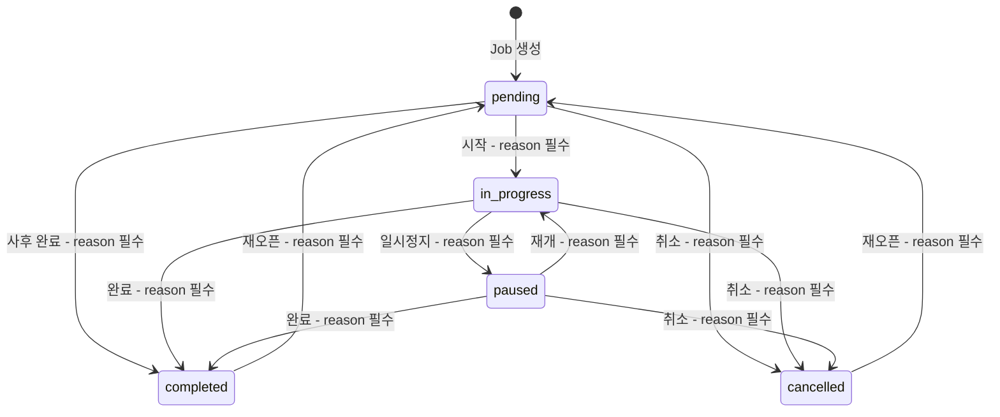

# 상태 관리 설계

## 개요

타임 트래커의 **핵심 제약**을 준수하는 상태 관리 방식을 정의합니다.

- **진행중(in_progress) 상태는 시스템 전체에서 1개만 존재**
- 대기(pending), 보류(paused), 취소(cancelled) 등은 **0개 이상** 존재 가능

> **관련 문서 (SSOT)**
>
> - StatusKind 타입 정의: [03-data-model.md §2.1 Job](03-data-model.md) (데이터 모델이 SSOT)
> - JobHistory 레코드 구조: [03-data-model.md §2.4 JobHistory](03-data-model.md)
> - 서비스 레벨 전환 로직: [02-architecture.md §4.3 Services](02-architecture.md)
> - 타이머 영속화 (ActiveTimerState): [05-storage.md §진행 중 타이머 영속화](05-storage.md)

---

## 제약 조건

1. **진행중 상태 유일성 (Critical)**: 동시에 `in_progress` 상태인 Job은 반드시 1개 이하. 상세 전환 규칙은 아래 **상태 머신 (FSM)** 참조.
2. **상태 전환 시 History 기록**: 매 전환마다 `JobHistory` 레코드 생성. 데이터 모델: [03-data-model.md §2.4 JobHistory](03-data-model.md) 참조.
3. **중앙 → 페이지 단방향 동기화**: TimerService/timer_store가 단일 소스, 페이지별 상태는 중앙에서 파생.

---

## 상태 머신 (FSM)

### StatusKind 전환 다이어그램



### 전환 규칙

| from          | to            | 조건                                                     |
| ------------- | ------------- | -------------------------------------------------------- |
| `*`           | `in_progress` | 기존 in_progress Job이 있으면 → 자동 paused 전환 후 진행 |
| `pending`     | `cancelled`   | 생성 후 시작 전 취소                                     |
| `pending`     | `completed`   | 사후 기록 (이미 완료된 작업 등록), reason 필수           |
| `in_progress` | `paused`      | 사용자 일시정지 또는 다른 Job 시작 시                    |
| `in_progress` | `completed`   | 사용자 완료                                              |
| `in_progress` | `cancelled`   | 사용자 취소                                              |
| `paused`      | `in_progress` | 사용자 재개                                              |
| `completed`   | `pending`     | 사용자 재오픈 (reason 필수)                              |
| `cancelled`   | `pending`     | 사용자 재오픈 (reason 필수)                              |

**TimeEntry 생성 보호**: completed/cancelled 상태의 Job에 대해 타이머를 시작할 수 없습니다. `TimerService.start()` → `JobService.switchJob()` → FSM 규칙에 의해 거부됩니다. completed/cancelled에서 작업을 재개하려면 먼저 pending으로 재오픈(reason 필수) 후 시작해야 합니다.

---

## Svelte 5 Runes 기반 상태

### timer_store (반응형 상태 — 이벤트 타임스탬프 기반)

> **설계 원칙**: Store는 **순수 이벤트 타임스탬프**만 보관합니다. `setInterval`, `requestAnimationFrame` 같은 부수효과는 Store에 존재하지 않습니다. UI 갱신(째깍째깍 표시)은 컴포넌트 레이어의 책임입니다 ([06-ui-ux.md §Timer 표시용 tick](06-ui-ux.md) 참조).

```typescript
// src/stores/timer_store.svelte.ts

// 현재 진행중 Job (0 또는 1개)
let active_job = $state<Job | null>(null);

// 현재 카테고리 (타임 트래킹 중인)
let active_category = $state<Category | null>(null);

// 일시정지 여부
let is_paused = $state<boolean>(false);

// 일시정지 구간을 제외한 누적 시간 (밀리초) — ActiveTimerState.accumulated_ms와 단위 통일
let accumulated_ms = $state<number>(0);

// 현재 구간 시작 시각 (pause/resume 시 갱신, null이면 미실행 또는 일시정지)
let current_segment_start = $state<string | null>(null);

// 경과 시간 계산 (순수 함수, 호출 시점의 값 반환)
function getElapsedMs(): number {
    if (!current_segment_start || is_paused) return accumulated_ms;
    return accumulated_ms + (Date.now() - new Date(current_segment_start).getTime());
}
```

**상태 변경 시점별 동작**:

- **시작**: `accumulated_ms = 0`, `current_segment_start = now`
- **일시정지**: `accumulated_ms += (now - current_segment_start)`, `current_segment_start = null`
- **재개**: `current_segment_start = now` (accumulated_ms 유지)
- **정지**: 최종 `duration_seconds = Math.floor(getElapsedMs() / 1000)`

> **단위 규칙**: Store 내부와 ActiveTimerState 영속화 모두 `accumulated_ms`(밀리초)를 사용합니다. UI 표시용 변환(ms → 초)은 컴포넌트 레이어에서 `getElapsedMs()`를 호출하여 수행합니다.

> **이벤트 기반 정확도**: Store는 이벤트 타임스탬프(`current_segment_start`, `accumulated_ms`)만 보관하므로 tick 드리프트가 원천적으로 발생하지 않습니다. 경과 시간은 `getElapsedMs()` 호출 시점에 `Date.now()` 기준으로 정확히 계산됩니다. UI 표시용 `requestAnimationFrame`은 브라우저 throttling 영향을 받지만, 매 프레임 `Date.now()` 기준으로 재계산하므로 표시 정확도에 영향 없습니다.

### job_store (반응형 상태)

```typescript
// src/stores/job_store.svelte.ts

let jobs = $state<Job[]>([]);

let pending_jobs = $derived(jobs.filter((j) => j.status === 'pending'));
let in_progress_job = $derived(jobs.find((j) => j.status === 'in_progress') ?? null);
let paused_jobs = $derived(jobs.filter((j) => j.status === 'paused'));
let completed_jobs = $derived(jobs.filter((j) => j.status === 'completed'));

function refreshJobs(new_jobs: Job[]) {
    jobs = new_jobs;
}
function updateJobStatus(job_id: string, status: StatusKind) {
    jobs = jobs.map((j) => (j.id === job_id ? { ...j, status } : j));
}
function addJob(job: Job) {
    jobs = [...jobs, job];
}
function removeJob(job_id: string) {
    jobs = jobs.filter((j) => j.id !== job_id);
}
```

### toast_store (반응형 상태)

> **SSOT**: 토스트 UI 규칙(FIFO, 최대 3개, 중복 방지 등)은 [06-ui-ux.md §에러 및 알림 UI](06-ui-ux.md) 참조. 여기서는 상태 관리만 정의합니다.

```typescript
// src/stores/toast_store.svelte.ts

interface Toast {
    id: string;
    level: 'success' | 'info' | 'warning' | 'error';
    message: string;
}

let toasts = $state<Toast[]>([]);

function addToast(level: Toast['level'], message: string): void {
    if (toasts.some((t) => t.message === message)) return; // 동일 메시지 중복 방지
    const id = crypto.randomUUID();
    if (toasts.length >= 3) toasts = toasts.slice(1); // FIFO: 가장 오래된 토스트 제거
    toasts = [...toasts, { id, level, message }];
}

function dismissToast(id: string): void {
    toasts = toasts.filter((t) => t.id !== id);
}
```

### TimerService (비즈니스 로직)

```typescript
// src/services/timer_service.ts

interface TimerService {
    start(job: Job, category: Category, reason?: string): Promise<void>; // reason: 기존 Job paused 전환 사유 (기존 Job 없으면 생략)
    pause(reason: string): Promise<void>;
    resume(reason: string): Promise<void>;
    stop(reason: string): Promise<TimeEntry | null>;
    cancel(reason: string): Promise<TimeEntry | null>;
    getActiveJob(): Job | null;
}
```

> **트랜잭션 내 단일 타임스탬프 규칙**: 하나의 트랜잭션(UoW) 내에서 생성되는 모든 레코드(`TimeEntry.started_at`, `JobHistory.occurred_at`, `Job.updated_at` 등)는 트랜잭션 시작 시점에 한 번 캡처한 `const now = new Date().toISOString()`을 공유합니다. 이를 통해 "같은 순간에 발생한 전환"임을 보장하고, 정렬 시 일관된 결과를 얻습니다.

**start 시 동작**:

0. 새 Job이 현재 `active_job`과 동일하면 → **no-op** (카테고리가 다르면 `active_category`만 변경). 불필요한 paused→in_progress 사이클과 무의미한 History/TimeEntry 생성을 방지합니다.
1. 기존 `active_job`이 있으면 → UI에서 사유 입력 요청
2. 입력된 reason으로 기존 Job을 `paused` 전환, JobHistory에 기록
3. 기존 Job의 실행 구간(started_at ~ now)으로 TimeEntry 즉시 생성
4. 새 `active_job`, `active_category`, `started_at` 설정
5. Storage에 Job.status 갱신 + ActiveTimerState 영속화

> **카테고리 필수 정책 (FR-6.2)**: `category`는 필수 파라미터입니다. UI 레이어에서 start 호출 전 반드시 카테고리를 확정해야 합니다.
>
> - **일반 시작**: 사용자가 카테고리 셀렉터에서 직접 선택
> - **원클릭 시작 (FR-1.1)**: `last_selected_category` 설정값 사용. null이면 시드 카테고리 중 `sort_order` 첫 번째를 자동 선택. 카테고리가 0개이면 셀렉터를 강제 표시
> - **start() 호출 시점에 category는 항상 non-null**: UI가 위 정책으로 category를 확정한 뒤 서비스를 호출합니다

**cancel 시 동작**:

1. `active_job`이 in_progress 또는 paused 상태인지 확인
2. 경과 시간이 0보다 크면 TimeEntry 생성 (취소된 작업이라도 실제 작업한 시간은 기록)
3. Job을 `cancelled` 상태로 전환, JobHistory에 reason 기록
4. `active_job = null`, `current_segment_start = null`, ActiveTimerState 삭제
5. Storage에 Job.status 갱신

> **취소 시 TimeEntry 정책**: 취소는 "작업 무효화"가 아니라 "더 이상 진행하지 않음"을 의미합니다. 이미 소요된 시간은 사실이므로 TimeEntry로 기록합니다. `TimeEntry.note`에 `"[cancelled]"` 접두사를 추가하여 취소 시점의 기록임을 구분합니다.

> **paused → completed 전환 시 TimeEntry 정책**: FSM에서 paused → completed는 유효한 전환이지만, paused 상태에서는 타이머가 정지된 상태(`accumulated_ms`만 존재, `current_segment` 없음)입니다.
>
> - **UI 경유 (권장)**: 풀화면에서 paused Job의 "완료" 버튼 클릭 시, `TimerService.stop()`을 경유합니다. `accumulated_ms > 0`이면 해당 시간으로 TimeEntry를 생성합니다.
> - **JobService 직접 전환**: 사후 기록(`pending → completed`과 유사) 취급. JobService는 전환 전 TimerService에 해당 Job의 잔여 `accumulated_ms`를 조회하여 `> 0`이면 TimeEntry를 생성한 후 상태를 전환합니다.
> - **결론**: paused → completed 경로에서도 `accumulated_ms`에 해당하는 TimeEntry가 유실되지 않습니다.

> **stop() 0초 경과 정책**: `duration_seconds === 0`(시작 직후 즉시 stop)인 경우 TimeEntry를 생성하지 않고 `null`을 반환합니다. cancel()과 동일하게 "경과 시간이 0보다 큰 경우에만" TimeEntry를 기록합니다.

**자동 전환 시 reason 처리**:

새 Job을 시작할 때 기존 in_progress Job이 자동 paused되는 경우:

- **기존 Job(paused)**: 사용자가 ReasonModal에서 직접 입력한 reason을 기록합니다.
- **새 Job(in_progress)**: 시스템이 컨텍스트 기반 reason을 자동 생성합니다 (형식: `"작업 전환: {new_job.title}"`).

> **FR-2.6과의 관계**: FR-2.6("잡 변경 시 사유 필수")는 **사용자가 의도적으로 수행하는 상태 전환**에 적용됩니다. 자동 전환(기존 Job → paused)의 경우, 기존 Job에 대한 reason은 사용자가 입력하고, 새 Job의 시작 reason은 시스템이 생성합니다. 이는 UX를 위한 의도적 예외이며, 사용자에게 모달을 2번 표시하지 않기 위한 설계입니다.

**reason 정책 요약**:

| 전환 유형                                                         | reason 출처                          | 근거    |
| ----------------------------------------------------------------- | ------------------------------------ | ------- |
| 사용자 직접 전환 (start, pause, resume, complete, cancel, reopen) | 사용자 입력 (ReasonModal)            | FR-2.6  |
| 자동 전환 - 기존 Job (in_progress → paused)                       | 사용자 입력 (ReasonModal)            | FR-2.6  |
| 자동 전환 - 새 Job (→ in_progress)                                | 시스템 생성 (`"작업 전환: {title}"`) | UX 예외 |

---

## TimeEntry overlap 정책

> **SSOT**: TimeEntry 시간 중복 정책은 여기서 정의합니다. 05-storage.md, 06-ui-ux.md는 이 섹션을 참조합니다.

### 타이머 생성 TimeEntry vs 수동 입력

- **타이머 생성 TimeEntry**: `TimerService.start()/stop()/cancel()`이 자동 생성하는 TimeEntry는 **"실시간 기록"**이므로 overlap 검증을 수행하지 않습니다. 타이머는 항상 현재 시각을 기준으로 동작하며, 진행 중 1개 제약에 의해 동일 시간대에 2개 이상의 타이머가 실행되는 것은 FSM이 방지합니다.
- **수동 입력 TimeEntry**: `TimeEntryService`가 생성하는 수동 TimeEntry(Phase 3)는 과거/현재 임의 구간을 지정할 수 있으므로, `detectOverlaps()`로 중복을 감지하고 `OverlapResolutionModal`로 해결합니다.

### 교차 Job overlap (서로 다른 Job 간)

- overlap 감지 범위는 **동일 Job 내** 수동 입력 간에만 적용합니다.
- 서로 다른 Job 간의 시간 중복은 **허용**합니다 (예: 프로젝트 A와 프로젝트 B에 동일 시간대를 기록하는 것은 유효한 사용 사례).
- 타이머 생성 TimeEntry와 수동 입력 TimeEntry 간의 중복도 허용합니다.

---

## JobStore ↔ Storage 동기화

`job_store`는 UI 반응성을 위한 **in-memory 캐시**이며, Storage(Repository)가 **진실의 원천**입니다.

**동기화 시점**:

- **앱 초기화**: `IJobRepository.getJobs()` → `job_store.refreshJobs(jobs)`
- **상태 전환 후**: `JobService.transitionStatus()` 완료 → `job_store.updateJobStatus(job_id, status)`
- **Job 생성/삭제 후**: `job_store.addJob()` / `job_store.removeJob()`

**불일치 방지 규칙**:

- 모든 Job 변경은 **Storage 먼저 → Store 갱신** 순서
- Storage 쓰기 실패 시 Store를 갱신하지 않음 (rollback 불필요)
- 멀티탭(Phase 2): `BroadcastChannel`로 다른 탭의 Store 갱신 알림

---

## 페이지별 상태 연동

### 개념

- **중앙**: `timer_store` + StorageAdapter
- **페이지**: Logseq 블록의 property (`_internal_job_id`, `_internal_status` 등)

### 동기화 방향

```
중앙 (timer_store)  ──>  Logseq 페이지 property
     (단일 소스)              (표시용, 읽기 전용)
```

- 페이지에서 "시작" 클릭 시: 중앙 `TimerService.start()` 호출 → 성공 시 해당 페이지에 `_internal_status` 업데이트
- 페이지는 중앙 상태를 **구독**하여 표시 (또는 주기적 폴링)

### 시작 버튼 노출 조건

- **노출**: `status === 'pending' | 'paused'` 이고, 중앙에 진행중 Job이 없거나, 해당 Job이 현재 진행중
- **비노출**: `status === 'in_progress'` (이미 진행중) — 대신 "일시정지" 표시
- **개념만 있는 경우**: Job이 생성만 되고 status가 없으면 버튼 미노출 (사용자 기획: "개념만 두고 버튼 노출하지 말자")

---

## 요약

| 항목             | 설계                                                   |
| ---------------- | ------------------------------------------------------ |
| 진행중 1개 제약  | TimerService에서 start 시 기존 in_progress 자동 paused |
| 상태 전환        | JobHistory 무조건 기록, reason 필수                    |
| 중앙-페이지 연동 | 중앙이 단일 소스, 페이지는 구독/표시                   |
| 상태 저장        | Logseq 미사용, StorageAdapter (OPFS/SQLite) 사용       |

### UI 문자열 상수 구조 (i18n 준비)

`constants/strings.ts`에 네임스페이스 구조로 UI 문자열을 관리합니다. 현재는 한국어 only이지만, 향후 i18n 전환 시 키 구조를 유지한 채 라이브러리로 마이그레이션할 수 있습니다.

```typescript
// src/constants/strings.ts
export const STRINGS = {
    timer: {
        start: '시작',
        pause: '일시정지',
        resume: '재개',
        stop: '정지',
        elapsed: '경과 시간',
    },
    job: {
        create: '새 작업',
        delete: '삭제',
        reopen: '재오픈',
        status: {
            pending: '대기',
            in_progress: '진행중',
            paused: '보류',
            cancelled: '취소',
            completed: '완료',
        },
    },
    reason_modal: {
        confirm: '확인',
        cancel: '취소',
        placeholder: '사유를 입력하세요 (최소 1글자)',
    },
    error: {
        storage_fallback: '저장소에 접근할 수 없어 임시 모드로 실행 중입니다.',
        timer_recovery: '이전 세션에서 타이머가 실행 중이었습니다.',
    },
} as const;
```

### 알려진 제한사항

**시스템 시계 변경**: 타이머 실행 중 사용자가 시스템 시계를 수동으로 변경(과거/미래로 이동)하면 `Date.now()` 기반 경과 시간 계산이 영향을 받습니다. 이는 브라우저 환경의 구조적 한계이며, `performance.now()` 사용 시에도 탭 복귀 시 정확도 문제가 있습니다. 이 시나리오는 발생 빈도가 극히 낮으므로 현재 설계에서 수용합니다. 비정상적으로 큰 경과 시간이 감지되면(예: 음수 또는 24시간 초과) 경고 토스트를 표시합니다.

---

## 사유 입력 모달 (ReasonModal)

모든 상태 전환 시 사유(reason) 입력을 받기 위한 모달 UI 플로우를 정의합니다.

### 트리거 조건

모든 Job 상태 전환 시 ReasonModal이 표시됩니다:

- 시작 (pending → in_progress)
- 일시정지 (in_progress → paused)
- 재개 (paused → in_progress)
- 완료 (in_progress → completed)
- 취소 (\* → cancelled)
- 재오픈 (completed/cancelled → pending)
- 사후 완료 (pending → completed)
- **자동 전환**: 다른 Job 시작 시 기존 Job paused 전환

### 모달 UI 명세

| 항목         | 내용                                               |
| ------------ | -------------------------------------------------- |
| **컴포넌트** | ReasonModal.svelte                                 |
| **입력**     | textarea (최소 1글자, 빈 문자열 거부)              |
| **버튼**     | 확인 (reason 제출), 취소 (전환 중단)               |
| **포커스**   | 모달 열림 시 textarea 자동 포커스                  |
| **키보드**   | Enter = 확인 (Shift+Enter = 줄바꿈), Escape = 취소 |

### 자동 전환 시 플로우

다른 Job 시작 시 기존 in_progress Job이 자동 paused되는 경우:

```text
1. 사용자가 Job B "시작" 클릭
2. 시스템이 기존 Job A (in_progress) 감지
3. ReasonModal 표시: "작업 A를 일시정지하는 사유를 입력하세요"
4. 사용자 입력 후 "확인"
5. 트랜잭션 내에서:
   a. Job A → paused (입력된 reason으로 History 기록)
   b. Job B → in_progress (시스템 reason: "작업 전환: {Job B title}"으로 History 기록)
6. 모달 닫힘, UI 갱신
```

### 취소 시 동작

- ReasonModal에서 "취소" 또는 Escape 시: **전환 중단**
- 기존 상태 유지, 어떤 변경도 발생하지 않음
- 사용자에게 별도 알림 불필요

---

## 앱 초기화 순서 (App Initialization Order)

앱 시작 시 Storage → Store로 데이터를 로드하는 순서를 정의합니다.

### 초기화 흐름

```text
1. IUnitOfWork 인스턴스 생성 (MemoryUoW 또는 SqliteUoW)
2. 스키마 마이그레이션 실행 (SqliteUoW의 경우)
3. 시드 데이터 확인 및 삽입
   a. CategoryService.seedDefaults() — 기본 카테고리 (개발, 분석, 회의, 기타)
   b. DataType/EntityType 시드 (Phase 3)
4. ActiveTimerState 복구
   a. settingsRepo.getSetting('active_timer') 조회
   b. 값이 존재하면 → TimerStore에 상태 복원 (active_job, accumulated_ms, is_paused)
   c. **active_category 복구**: ActiveTimerState.category_id로 categoryRepo에서 조회 → active_category 설정
   d. is_paused === false이면 → `current_segment_start` 복원 (UI 컴포넌트 마운트 시 rAF로 표시 갱신)
5. JobStore 초기화
   a. jobRepo.getJobsByStatus('in_progress') → active job
   b. jobRepo.getJobsByStatus('pending') → pending jobs
   c. jobRepo.getJobsByStatus('paused') → paused jobs
   d. JobStore.$state에 반영
6. UI 마운트 (App.svelte) — 단계 4, 5가 모두 완료된 후에만 마운트
   > 단계 4, 5는 서로 독립적이므로 `Promise.all`로 병렬 실행 가능. UI(6단계)는 두 단계 완료 후 마운트하므로 경합 조건 없음.
7. 초기화 실패 시 → 에러 배너 표시, 기능 제한 모드
```

### 초기화 상태

```typescript
type AppInitState = 'loading' | 'ready' | 'error';

let app_init_state = $state<AppInitState>('loading');
let init_error = $state<string | null>(null);
```

- `loading`: 초기화 진행 중 (스피너 표시)
- `ready`: 초기화 완료 (정상 UI 표시)
- `error`: 초기화 실패 (에러 배너 + 재시도 버튼)

### 순서 보장

- 1~3단계는 반드시 순차 실행 (DB 준비 → 시드)
- 4~5단계는 병렬 가능 (독립된 데이터 로드)
- 6단계는 4~5 완료 후에만 실행
