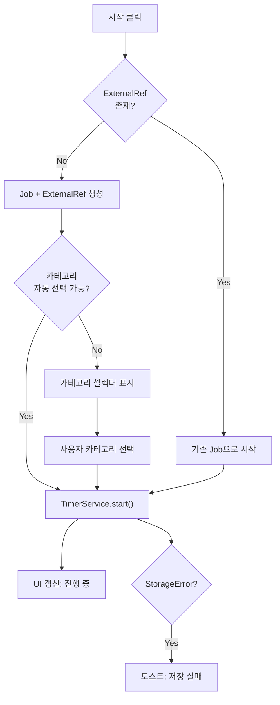
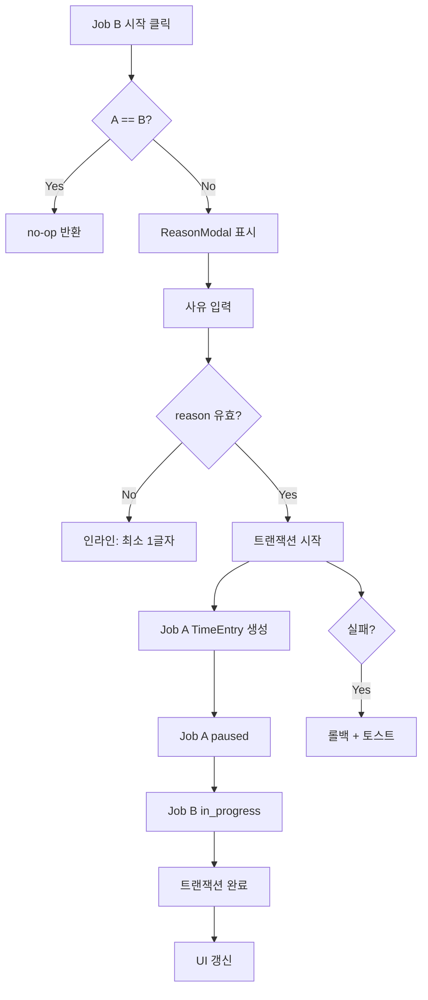
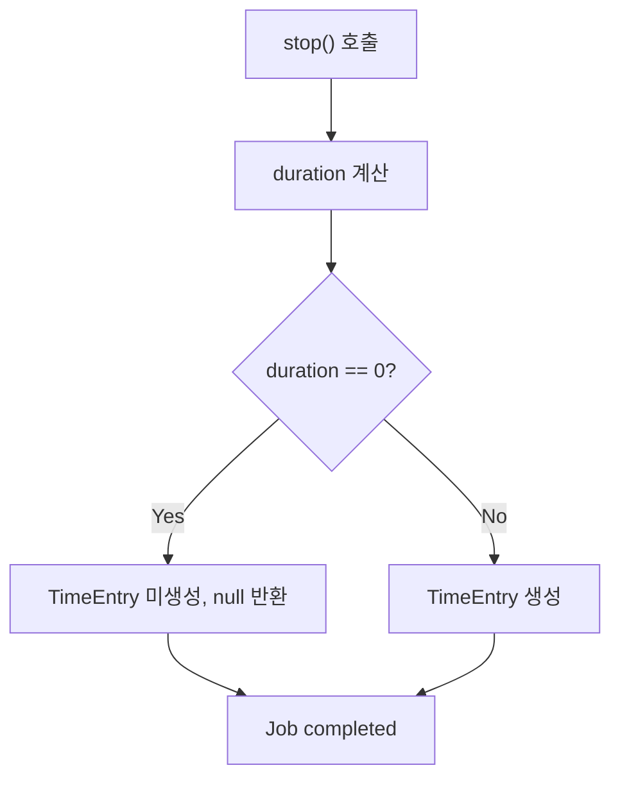
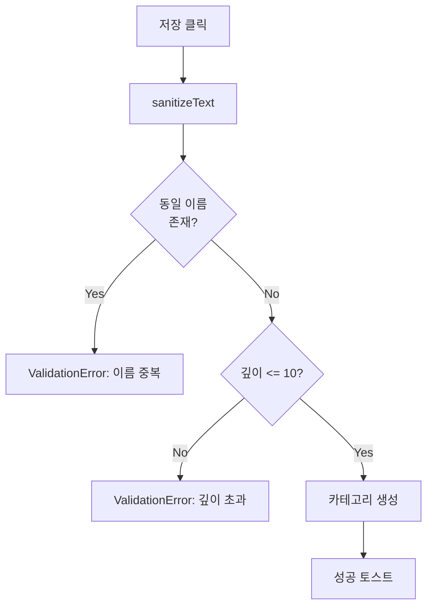
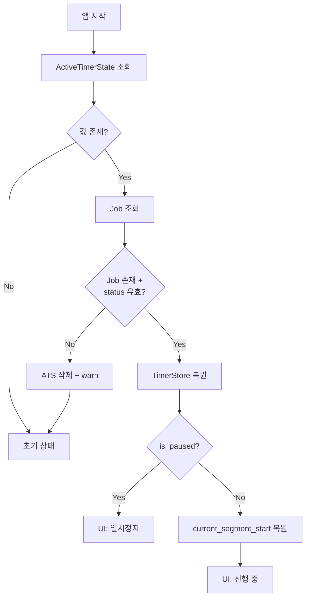
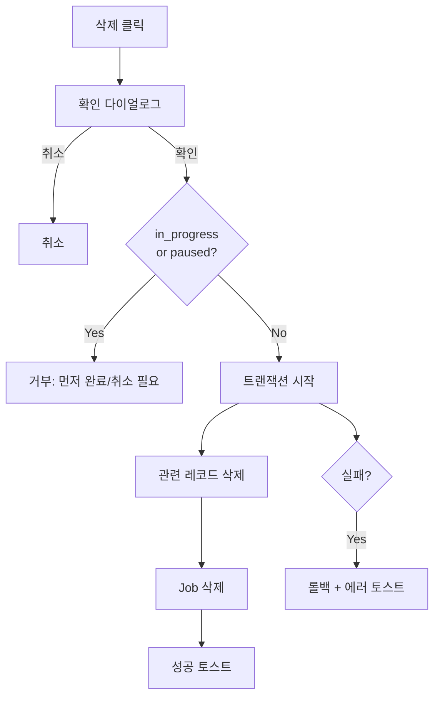
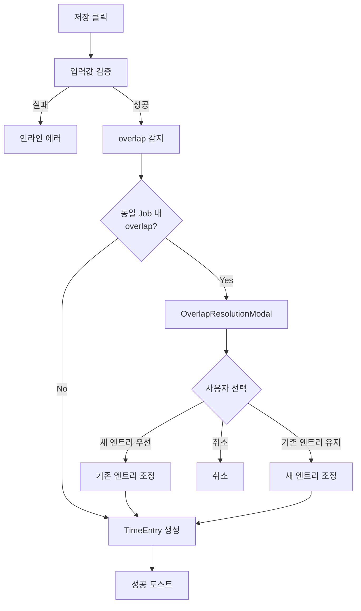
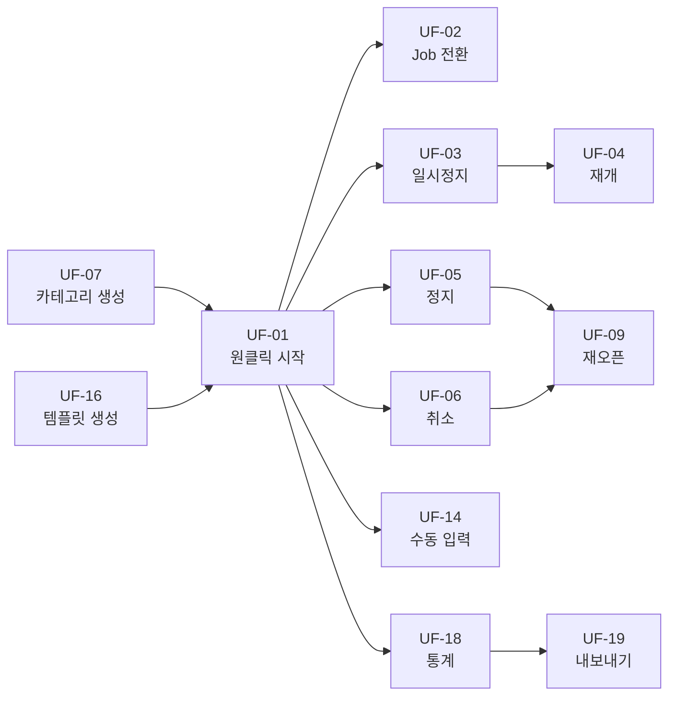

# 09. 핵심 유저 플로우

> **목적**: 사용자 관점의 핵심 행위 → 시스템 결과를 정리합니다. 설계 문서 작성과 테스트케이스 도출의 근거 문서입니다.
>
> **형식**: `유저가 어떤 동작을 수행한다 → 어떤 결과가 도출된다`. 분기/에러 경로가 있는 플로우는 Mermaid 플로우차트를 포함합니다.
>
> **SSOT 참조**:
>
> - FSM 상태 전환: [04-state-management.md](04-state-management.md)
> - Repository 인터페이스: [05-storage.md](05-storage.md)
> - UI 컴포넌트: [06-ui-ux.md](06-ui-ux.md)
> - 테스트 유즈케이스: [08-test-usecases.md](08-test-usecases.md)

---

## Phase 1: 핵심 타이머

### UF-01: 새 Job 생성 및 타이머 시작 (원클릭)

**전제**: 앱 초기화 완료, 진행 중인 Job 없음

| 단계 | 사용자 행동                   | 시스템 결과                                                  |
| ---- | ----------------------------- | ------------------------------------------------------------ |
| 1    | Logseq 페이지에서 "시작" 클릭 | 페이지 UUID로 ExternalRef 조회                               |
| 2    | (Job 없으면 자동)             | JobService.createJob(title: 페이지 제목) + ExternalRef 생성  |
| 3    | (카테고리 자동 선택)          | last_selected_category 또는 시드 첫 번째 카테고리 적용       |
| 4    | -                             | TimerService.start(job, category) → Job: pending→in_progress |
| 5    | -                             | ActiveTimerState 저장, UI "진행 중" 표시                     |

**에러 경로**:

> **테스트**: UC-TIMER-001, UC-E2E-001 | **설계**: 04-state §start 시 동작, 06-ui-ux §페이지→Job 매핑

---

### UF-02: 진행 중 다른 Job으로 전환

**전제**: Job A가 in_progress 상태

| 단계 | 사용자 행동                                | 시스템 결과                                                  |
| ---- | ------------------------------------------ | ------------------------------------------------------------ |
| 1    | 다른 페이지/Job 목록에서 Job B "시작" 클릭 | 기존 Job A 감지                                              |
| 2    | ReasonModal에 사유 입력, "확인" 클릭       | reason 유효성 검증 (1글자 이상)                              |
| 3    | -                                          | 트랜잭션 시작 (단일 now 타임스탬프)                          |
| 4    | -                                          | Job A의 현재 구간 → TimeEntry 생성                           |
| 5    | -                                          | Job A: in_progress→paused + History(reason: 사용자 입력)     |
| 6    | -                                          | Job B: →in_progress + History(reason: 시스템 "작업 전환: B") |
| 7    | -                                          | 트랜잭션 완료, ActiveTimerState 갱신                         |
| 8    | -                                          | UI: Job A "일시정지", Job B "진행 중"                        |

**에러 경로**:

> **테스트**: UC-TIMER-003~004, UC-FSM-001, UC-E2E-002 | **설계**: 04-state §start/자동 전환, 02-arch §시퀀스 다이어그램

---

### UF-03: 타이머 일시정지

**전제**: Job이 in_progress 상태

| 단계 | 사용자 행동          | 시스템 결과                                                        |
| ---- | -------------------- | ------------------------------------------------------------------ |
| 1    | "일시정지" 버튼 클릭 | ReasonModal 표시                                                   |
| 2    | 사유 입력 후 "확인"  | TimerService.pause(reason)                                         |
| 3    | -                    | accumulated_ms 갱신 (현재 구간 합산), current_segment_start = null |
| 4    | -                    | Job: in_progress→paused, History 기록                              |
| 5    | -                    | ActiveTimerState.is_paused = true 저장                             |
| 6    | -                    | UI: "일시정지" 상태, 경과 시간 고정 표시                           |

> **테스트**: UC-TIMER-005~006 | **설계**: 04-state §pause

---

### UF-04: 타이머 재개

**전제**: Job이 paused 상태

| 단계 | 사용자 행동         | 시스템 결과                             |
| ---- | ------------------- | --------------------------------------- |
| 1    | "재개" 버튼 클릭    | ReasonModal 표시                        |
| 2    | 사유 입력 후 "확인" | TimerService.resume(reason)             |
| 3    | -                   | current_segment_start = now             |
| 4    | -                   | Job: paused→in_progress, History 기록   |
| 5    | -                   | ActiveTimerState.is_paused = false 저장 |
| 6    | -                   | UI: "진행 중" 상태, 경과 시간 재카운트  |

> **테스트**: UC-TIMER-007~008 | **설계**: 04-state §resume

---

### UF-05: 타이머 정지 (완료)

**전제**: Job이 in_progress 또는 paused 상태

| 단계 | 사용자 행동         | 시스템 결과                                    |
| ---- | ------------------- | ---------------------------------------------- |
| 1    | "정지" 버튼 클릭    | ReasonModal 표시                               |
| 2    | 사유 입력 후 "확인" | TimerService.stop(reason)                      |
| 3    | -                   | duration_seconds 계산 (0이면 TimeEntry 미생성) |
| 4    | -                   | TimeEntry 생성 (duration > 0인 경우)           |
| 5    | -                   | Job: →completed, History 기록                  |
| 6    | -                   | ActiveTimerState 삭제, 타이머 상태 초기화      |
| 7    | -                   | UI: 초기 상태 복귀, "완료" 토스트              |

**분기: 0초 경과 시**:

> **테스트**: UC-TIMER-009~010, UC-STOP-001~002 | **설계**: 04-state §stop/0초 정책

---

### UF-06: 타이머 취소

**전제**: Job이 in_progress 또는 paused 상태

| 단계 | 사용자 행동         | 시스템 결과                                              |
| ---- | ------------------- | -------------------------------------------------------- |
| 1    | "취소" 버튼 클릭    | ReasonModal 표시                                         |
| 2    | 사유 입력 후 "확인" | TimerService.cancel(reason)                              |
| 3    | -                   | 경과 > 0이면 TimeEntry 생성 (note: "[cancelled]" 접두사) |
| 4    | -                   | Job: →cancelled, History 기록                            |
| 5    | -                   | ActiveTimerState 삭제, 타이머 상태 초기화                |
| 6    | -                   | UI: 초기 상태 복귀                                       |

> **테스트**: UC-CANCEL-001~003 | **설계**: 04-state §cancel 시 동작

---

### UF-07: 카테고리 생성

**전제**: 앱 초기화 완료

| 단계 | 사용자 행동                           | 시스템 결과                           |
| ---- | ------------------------------------- | ------------------------------------- |
| 1    | 풀화면 → 카테고리 관리 → "추가"       | 카테고리 생성 폼 표시                 |
| 2    | 이름 입력, 부모 카테고리 선택(선택적) | 입력값 검증                           |
| 3    | "저장" 클릭                           | sanitizeText(name) 적용               |
| 4    | -                                     | 동일 부모 내 이름 중복 검사           |
| 5    | -                                     | 트리 깊이 ≤ 10 검증                   |
| 6    | -                                     | CategoryService.createCategory() 호출 |
| 7    | -                                     | UI: 카테고리 목록 갱신, 성공 토스트   |

**에러 경로**:

> **테스트**: UC-CAT-001~002 | **설계**: 02-arch §CategoryService, 03-data §Category

---

### UF-08: 카테고리 삭제/비활성화

**전제**: 카테고리가 존재

| 단계 | 사용자 행동                    | 시스템 결과                                              |
| ---- | ------------------------------ | -------------------------------------------------------- |
| 1    | 카테고리 "삭제" 클릭           | 확인 다이얼로그 표시                                     |
| 2    | "확인" 클릭                    | 참조 검사 수행 (TimeEntry, JobCategory, 하위 카테고리)   |
| 3a   | (참조 없음)                    | 카테고리 삭제 완료, 성공 토스트                          |
| 3b   | (참조 존재)                    | ReferenceIntegrityError, 토스트: "비활성화를 사용하세요" |
| 4    | (참조 존재 시) "비활성화" 선택 | is_active = false, 셀렉터에서 숨김 처리                  |

> **테스트**: UC-CAT-003~004 | **설계**: 06-ui-ux §삭제 제한 UI, 03-data §삭제 cascade

---

### UF-09: Job 재오픈

**전제**: Job이 completed 또는 cancelled 상태

| 단계 | 사용자 행동                | 시스템 결과                                        |
| ---- | -------------------------- | -------------------------------------------------- |
| 1    | Job 목록에서 "재오픈" 클릭 | ReasonModal 표시                                   |
| 2    | 사유 입력 후 "확인"        | JobService.transitionStatus(id, 'pending', reason) |
| 3    | -                          | Job: completed/cancelled→pending, History 기록     |
| 4    | -                          | UI: Job 목록에서 "대기" 상태로 표시                |

> **테스트**: UC-JOB-001 | **설계**: 04-state §FSM 전환 규칙

---

### UF-10: 앱 재시작 시 타이머 복구

**전제**: 이전 세션에서 타이머가 실행 중이었음 (비정상 종료)

| 단계 | 사용자 행동 | 시스템 결과                                 |
| ---- | ----------- | ------------------------------------------- |
| 1    | 앱 실행     | ActiveTimerState 조회                       |
| 2    | -           | 참조 무결성 검증 (job_id 존재 + 상태 유효)  |
| 3a   | (유효)      | TimerStore에 상태 복원, 경과 시간 재계산    |
| 3b   | (무효)      | ActiveTimerState 삭제, warn 로깅, 초기 상태 |
| 4    | -           | UI: 복구된 타이머 표시 또는 초기 상태       |

> **테스트**: UC-EDGE-007, UC-STORE-001~002 | **설계**: 05-storage §앱 재시작 시 복구

---

## Phase 2: 확장 기능

### UF-11: Job에 다중 카테고리 할당

**전제**: Job과 카테고리가 존재

| 단계 | 사용자 행동                | 시스템 결과                                       |
| ---- | -------------------------- | ------------------------------------------------- |
| 1    | Job 상세 → "카테고리 추가" | 카테고리 셀렉터 표시                              |
| 2    | 카테고리 선택              | JobCategoryService.assignCategory(job_id, cat_id) |
| 3    | -                          | JobCategory 레코드 생성, 중복 검사                |
| 4    | -                          | UI: Job의 카테고리 뱃지 업데이트                  |

> **테스트**: UC-JCAT-001~003 | **설계**: 03-data §JobCategory

---

### UF-12: Job 삭제 (cascade)

**전제**: Job이 pending, completed, 또는 cancelled 상태

| 단계 | 사용자 행동              | 시스템 결과                                                          |
| ---- | ------------------------ | -------------------------------------------------------------------- |
| 1    | Job 목록에서 "삭제" 클릭 | 확인 다이얼로그: "관련 기록이 모두 삭제됩니다"                       |
| 2    | "확인" 클릭              | 상태 검사: in_progress/paused면 거부                                 |
| 3    | -                        | UoW 트랜잭션: TimeEntry, History, JobCategory, ExternalRef 순차 삭제 |
| 4    | -                        | Job 삭제                                                             |
| 5    | -                        | job_store.removeJob(), 성공 토스트                                   |

**에러 경로**:

> **테스트**: UC-JOB-003~004, UC-EDGE-008 | **설계**: 02-arch §Cascade 삭제, 06-ui-ux §삭제 제한 UI

---

### UF-13: 스키마 마이그레이션 (SQLite)

**전제**: 앱 업데이트 후 스키마 버전 불일치

| 단계 | 사용자 행동 | 시스템 결과                                         |
| ---- | ----------- | --------------------------------------------------- |
| 1    | 앱 실행     | 현재 DB 버전 확인 (schema_version 테이블)           |
| 2    | -           | 마이그레이션 필요 여부 판단                         |
| 3    | -           | Forward-only 마이그레이션 순차 실행                 |
| 4    | -           | 성공: 새 버전 기록, 앱 정상 시작                    |
| 4b   | -           | 실패: StorageError, MemoryAdapter로 fallback + 배너 |

> **테스트**: UC-MIGRATE-001~002 | **설계**: 05-storage §스키마 마이그레이션

---

## Phase 3: 수동 시간 입력

### UF-14: 수동 TimeEntry 생성

**전제**: Job이 존재 (상태 무관)

| 단계 | 사용자 행동                          | 시스템 결과                               |
| ---- | ------------------------------------ | ----------------------------------------- |
| 1    | 풀화면 → Job 상세 → "시간 기록 추가" | 시간 입력 폼 표시 (DatePicker 포함)       |
| 2    | 시작/종료 시각, 카테고리, 메모 입력  | 입력값 검증 (시작 < 종료, 필수 필드)      |
| 3    | "저장" 클릭                          | TimeEntryService.createManualEntry()      |
| 4    | -                                    | 동일 Job 내 overlap 감지 (detectOverlaps) |
| 5a   | (overlap 없음)                       | TimeEntry 생성, 성공 토스트               |
| 5b   | (overlap 있음)                       | OverlapResolutionModal 표시               |

> **테스트**: UC-ENTRY-001~004 | **설계**: 04-state §overlap 정책, 06-ui-ux §OverlapResolutionModal

---

### UF-15: 커스텀 필드 관리

**전제**: DataType/EntityType 시드 완료

| 단계 | 사용자 행동                                                         | 시스템 결과                                          |
| ---- | ------------------------------------------------------------------- | ---------------------------------------------------- |
| 1    | 풀화면 → 설정 → "커스텀 필드"                                       | DataField 목록 표시                                  |
| 2    | "추가" 클릭 → 이름, 타입(text/number/date/select), 대상 엔티티 선택 | DataField 생성                                       |
| 3    | Job 생성/편집 시                                                    | 커스텀 필드 입력 UI 자동 표시 (DataType 기반 렌더링) |
| 4    | 값 입력                                                             | Job.custom_fields JSON에 저장                        |

> **테스트**: UC-DFIELD-001~003 | **설계**: 03-data §메타-레지스트리, 06-ui-ux §Core UI 컴포넌트

---

## Phase 4: 템플릿

### UF-16: 템플릿으로 Job 생성

**전제**: JobTemplate이 존재

| 단계 | 사용자 행동                | 시스템 결과                                   |
| ---- | -------------------------- | --------------------------------------------- |
| 1    | 풀화면 → "템플릿으로 생성" | 템플릿 목록 표시                              |
| 2    | 템플릿 선택                | 플레이스홀더 입력 폼 표시                     |
| 3    | 플레이스홀더 값 입력       | DOMPurify로 치환 값 새니타이징                |
| 4    | "생성" 클릭                | TemplateService.createJobFromTemplate()       |
| 5    | -                          | 치환된 content로 Logseq 페이지 생성 (Phase 4) |
| 6    | -                          | Job + ExternalRef 생성, 성공 토스트           |

> **테스트**: UC-TMPL-001~004 | **설계**: 02-arch §TemplateService, 03-data §JobTemplate

---

### UF-17: 알림 및 리마인더

**전제**: 타이머 진행 중

| 단계 | 사용자 행동               | 시스템 결과                                 |
| ---- | ------------------------- | ------------------------------------------- |
| 1    | (설정에서 알림 간격 지정) | 설정 저장                                   |
| 2    | -                         | 경과 시간이 임계값(기본 2시간) 초과 시 알림 |
| 3    | -                         | idle Job(paused 상태 24시간 이상) 리마인더  |
| 4    | 알림 확인 또는 무시       | 다음 알림 주기까지 억제                     |

> **테스트**: UC-REMIND-001~003 | **설계**: 01-requirements §FR-2.7

---

## Phase 5: 통계 및 내보내기

### UF-18: 기간별 통계 조회

**전제**: TimeEntry 데이터 존재

| 단계 | 사용자 행동            | 시스템 결과                                          |
| ---- | ---------------------- | ---------------------------------------------------- |
| 1    | 풀화면 → "통계" 탭     | 기본 기간(오늘) 통계 표시                            |
| 2    | DatePicker로 기간 변경 | StatisticsService.getDailySummary(period, tz_offset) |
| 3    | -                      | Job별, Category별 시간 집계                          |
| 4    | -                      | 차트/테이블로 표시                                   |

> **테스트**: UC-STAT-001~004, UC-E2E-004 | **설계**: 02-arch §StatisticsService

---

### UF-19: 데이터 내보내기

**전제**: TimeEntry 데이터 존재

| 단계 | 사용자 행동         | 시스템 결과                              |
| ---- | ------------------- | ---------------------------------------- |
| 1    | 풀화면 → "내보내기" | 기간 선택 + 형식(CSV/JSON) 선택 UI       |
| 2    | "내보내기" 클릭     | DataExportService.export(period, format) |
| 3    | -                   | 데이터 수집 + 파일 생성                  |
| 4    | -                   | 브라우저 다운로드 트리거                 |

**에러 경로**: 빈 기간 → 헤더만 포함된 파일 + "기록 없음" 토스트

> **테스트**: UC-EXPORT-001~003 | **설계**: 02-arch §DataExportService

---

## 플로우 간 의존 관계

---

## Phase별 플로우 요약

| Phase | 플로우   | 핵심 시나리오                             |
| ----- | -------- | ----------------------------------------- |
| 1     | UF-01~10 | 타이머 CRUD, FSM 전환, 카테고리, 복구     |
| 2     | UF-11~13 | 다중 카테고리, cascade 삭제, 마이그레이션 |
| 3     | UF-14~15 | 수동 TimeEntry, overlap 해결, 커스텀 필드 |
| 4     | UF-16~17 | 템플릿, 알림/리마인더                     |
| 5     | UF-18~19 | 통계 조회, 데이터 내보내기                |
