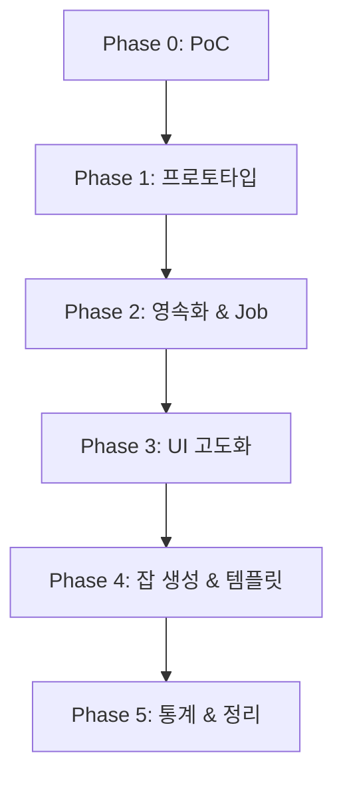

# Time Tracker 구현 플랜 — 전체 개요

**작성일**: 2026-03-22
**기반**: `docs/design/` 설계 문서 9개 (00-overview ~ 09-user-flows)

---

## 1. Phase 구조

| Phase | 명칭 | 범위 | 예상 산출물 |
|-------|------|------|-------------|
| **0** | PoC | vanilla-extract + Svelte 5 + Logseq iframe 호환성 검증 | 빌드 성공, iframe CSS 로드 확인 |
| **1** | 프로토타입 | 패키지 스캐폴딩, 핵심 타입, 최소 Job CRUD, TimerService/Store, MemoryAdapter, 기본 UI | 동작하는 타이머 + Job 목록 |
| **2** | 영속화 & Job 완성 | OPFS+SQLite, Job 전체 CRUD, History, DataExport, ExternalRef, JobCategory | DB 영속화, 데이터 내보내기 |
| **3** | UI 고도화 & 커스텀 필드 | 툴바, 풀화면, 셀렉터, 수동 TimeEntry, DataField + custom_fields | 완성된 UI, 커스텀 필드 |
| **4** | 잡 생성 & 템플릿 | 잡 생성 워크플로우, 템플릿 엔진, 페이지 생성, 알림 | 잡 생성 플로우, 템플릿 |
| **5** | 통계 & 정리 | 통계 서비스, eCount 연동 스켈레톤, Logseq 동기화, 문서화 | 통계 대시보드, 릴리스 |

---

## 2. Phase 간 의존성

- Phase 0 실패 시 → 스타일링 대안(Svelte scoped style) 확정 후 Phase 1 진입
- Phase 2 OPFS 검증 실패 시 → IndexedDB fallback (05-storage.md §OPFS iframe 제약)
- Phase 3~5는 순차 의존이지만, 일부 UI 작업은 병렬 가능

---

## 3. Phase 1 세부 분할

Phase 1은 규모가 크므로 8개 서브페이즈로 분할합니다:

| 서브페이즈 | 명칭 | 핵심 산출물 |
|-----------|------|-------------|
| **1A** | 패키지 인프라 | `time-tracker-core` + `logseq-time-tracker` 스캐폴드 |
| **1B** | 코어 타입 & 에러 | 도메인 타입, 에러 계층, 상수, 유틸 |
| **1C** | 저장소 레이어 | Repository 인터페이스, IUnitOfWork, MemoryUoW |
| **1D** | 서비스 레이어 | HistoryService, JobService, CategoryService, TimerService |
| **1E** | 스토어 | timer_store, job_store, toast_store (Svelte 5 Runes) |
| **1F** | UI 컴포넌트 | Timer, TimerDisplay, TimerButton, JobList, ReasonModal |
| **1G** | 앱 통합 | 초기화 로직, 진입점, App.svelte, public API exports |
| **1H** | 테스트 | 단위 테스트, 통합 테스트 |

---

## 4. 설계 문서 → Phase 매핑

어떤 Phase에서 어떤 설계 문서를 참조하는지 매핑합니다.

### 4.1 문서별 Phase 커버리지

| 설계 문서 | P0 | P1 | P2 | P3 | P4 | P5 |
|-----------|:--:|:--:|:--:|:--:|:--:|:--:|
| 00-overview | O | O | O | O | O | O |
| 01-requirements | - | O | O | O | O | O |
| 02-architecture | O | O | O | O | O | O |
| 03-data-model | - | O | O | O | O | - |
| 04-state-management | - | O | - | O | - | O |
| 05-storage | - | O | O | O | - | - |
| 06-ui-ux | - | O | - | O | O | O |
| 07-test-strategy | - | O | O | O | O | O |
| 08-test-usecases | - | O | O | O | O | O |
| 09-user-flows | - | O | O | O | O | O |

### 4.2 Phase별 핵심 참조 섹션

**Phase 0**:
- `00-overview.md` §6.1 PoC, §6.2 리스크 대응 의사결정 트리
- `02-architecture.md` §6 기술 스택

**Phase 1**:
- `02-architecture.md` §3 패키지 구조, §4 레이어 설명, §8 서비스 초기화, §11 에러 타입, §13 Repository 저장 규칙, §14 dispose 패턴
- `03-data-model.md` §7 TypeScript 타입 정의
- `04-state-management.md` §상태 머신(FSM), §Svelte 5 Runes, §TimerService, §앱 초기화 순서
- `05-storage.md` §Repository 인터페이스, §MemoryUnitOfWork, §진행 중 타이머 영속화
- `06-ui-ux.md` §Phase 1 UI 범위, §ReasonModal, §Timer 표시용 tick, §에러 및 알림 UI
- `08-test-usecases.md` §1~4 Phase 1 유즈케이스
- `09-user-flows.md` UF-01 ~ UF-06

**Phase 2**:
- `05-storage.md` §OPFS+SQLite, §스키마 마이그레이션, §OPFS iframe 제약, §데이터 백업, §Storage Fallback, §멀티탭 동시 접근
- `02-architecture.md` §4.3 Services (JobCategoryService, DataExportService)
- `03-data-model.md` §2 테이블 정의 (ExternalRef, JobCategory)
- `01-requirements.md` FR-2 (Job 전체 CRUD), FR-5 (Logseq 연동 기초)
- `09-user-flows.md` UF-07 ~ UF-10

**Phase 3**:
- `06-ui-ux.md` §툴바, §풀화면, §셀렉터, §수동 TimeEntry, §OverlapResolutionModal, §Core UI 컴포넌트 분기, §데이트피커, §반응형 레이아웃
- `03-data-model.md` §3~6 메타 레지스트리 (DataType, EntityType, DataField)
- `02-architecture.md` §4.9 TimeEntryService, §4.3 DataFieldService
- `04-state-management.md` §TimeEntry overlap 정책
- `09-user-flows.md` UF-11 ~ UF-14

**Phase 4**:
- `06-ui-ux.md` §잡 생성 플로우, §템플릿 시스템, §알림 & 리마인더
- `02-architecture.md` §4.10 TemplateService, §10 Logseq 통신
- `01-requirements.md` FR-8 (템플릿), FR-10 (알림)
- `09-user-flows.md` UF-15 ~ UF-17

**Phase 5**:
- `02-architecture.md` §4.7 StatisticsService
- `05-storage.md` §데이터 동기화 전략 (OPFS ↔ Logseq)
- `06-ui-ux.md` §타임존 UI 처리
- `01-requirements.md` FR-9 (통계), FR-11 (eCount)
- `09-user-flows.md` UF-18 ~ UF-19

---

## 5. 공통 패턴 (Phase 1에서 확립)

Phase 2~5는 Phase 1에서 확립된 다음 패턴을 따릅니다:

- **서비스 구조**: 생성자 주입 (`uow`, `logger`), async 메서드, 커스텀 에러 throw
- **Repository 구현**: `structuredClone()` 입출력, `Map<string, T>` 저장
- **스토어 패턴**: Svelte 5 `$state`/`$derived`, 변경 함수 export
- **테스트 패턴**: Vitest + @testing-library/svelte, BDD Given-When-Then
- **에러 처리**: Service throw → UI catch → toast/inline 표시
- **네이밍**: 변수 `snake_case`, 함수 `camelCase`, 컴포넌트 `PascalCase`, 파일 `snake_case.ts`

---

## 6. 플랜 문서 인덱스

| 문서 | 경로 |
|------|------|
| 전체 개요 (이 문서) | `docs/phase-plans/time-tracker/00-overview.md` |
| Phase 0: PoC | `docs/phase-plans/time-tracker/phase-0/poc.md` |
| Phase 1A: 패키지 인프라 | `docs/phase-plans/time-tracker/phase-1/1a-package-infra.md` |
| Phase 1B: 코어 타입 | `docs/phase-plans/time-tracker/phase-1/1b-core-types.md` |
| Phase 1C: 저장소 | `docs/phase-plans/time-tracker/phase-1/1c-storage.md` |
| Phase 1D: 서비스 | `docs/phase-plans/time-tracker/phase-1/1d-services.md` |
| Phase 1E: 스토어 | `docs/phase-plans/time-tracker/phase-1/1e-stores.md` |
| Phase 1F: UI 컴포넌트 | `docs/phase-plans/time-tracker/phase-1/1f-ui-components.md` |
| Phase 1G: 앱 통합 | `docs/phase-plans/time-tracker/phase-1/1g-app-integration.md` |
| Phase 1H: 테스트 | `docs/phase-plans/time-tracker/phase-1/1h-tests.md` |
| Phase 2: 영속화 & Job | `docs/phase-plans/time-tracker/phase-2/plan.md` |
| Phase 3: UI 고도화 | `docs/phase-plans/time-tracker/phase-3/plan.md` |
| Phase 4: 잡 생성 & 템플릿 | `docs/phase-plans/time-tracker/phase-4/plan.md` |
| Phase 5: 통계 & 정리 | `docs/phase-plans/time-tracker/phase-5/plan.md` |
