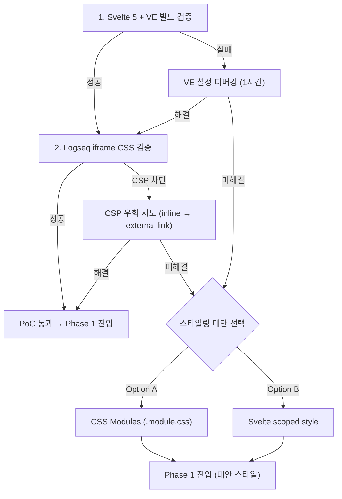

# Phase 0: PoC (vanilla-extract + Svelte 5 + Logseq iframe)

## 목표

Phase 1 구현 착수 전, 핵심 기술 조합의 호환성을 검증합니다.

---

## 선행 조건

- pnpm workspace 환경 구축 완료 (현재 모노레포에서 `packages/uikit`이 이미 Svelte 5 + vanilla-extract로 동작 중)
- Node.js >= 20, pnpm >= 9

---

## 참조 설계 문서

| 문서 | 섹션 | 참조 내용 |
|------|------|-----------|
| `00-overview.md` | §6.1 PoC | 검증 항목 4개, 산출물, 실패 시 대안 |
| `00-overview.md` | §6.2 리스크 대응 의사결정 트리 | OPFS/WASM fallback 순서 (Phase 2용이나 참고) |
| `02-architecture.md` | §6 기술 스택 | Svelte 5, vanilla-extract, Vite 7 선택 근거 |

---

## 검증 항목

### 1. Svelte 5 + vanilla-extract `.css.ts` 빌드

**검증 방법**: `time-tracker-core` 패키지에 최소 Svelte 5 컴포넌트 + `.css.ts` 스타일 파일 생성 후 `pnpm build` 실행

**생성 파일**:

| 파일 | 내용 |
|------|------|
| `packages/time-tracker-core/package.json` | 최소 의존성 (svelte, @vanilla-extract/css) |
| `packages/time-tracker-core/vite.config.ts` | `createSvelteViteConfig()` 재사용 |
| `packages/time-tracker-core/svelte.config.js` | 공유 설정 재사용 |
| `packages/time-tracker-core/tsconfig.json` | `config/tsconfig.svelte.json` 확장 |
| `packages/time-tracker-core/src/poc/poc_test.css.ts` | `style()` 1~2개 정의 |
| `packages/time-tracker-core/src/poc/PocTest.svelte` | `.css.ts` import + 스타일 적용 |
| `packages/time-tracker-core/src/index.ts` | re-export |

**성공 기준**: `pnpm build` 에러 없이 완료, `dist/` 에 CSS가 포함된 출력 생성

### 2. Vite 빌드 파이프라인 통합

**검증 방법**: 모노레포 루트에서 `pnpm build --filter @personal/time-tracker-core` 실행

**성공 기준**: turbo 캐시 포함 정상 빌드

### 3. Logseq 플러그인 iframe 내 CSS 로드

**검증 방법**:
1. `packages/logseq-time-tracker/` 최소 스캐폴드 생성
2. `@logseq/libs` + `vite-plugin-logseq` 설정
3. `PocTest.svelte`를 import하여 렌더링
4. Logseq dev mode에서 플러그인 로드

**생성 파일**:

| 파일 | 내용 |
|------|------|
| `packages/logseq-time-tracker/package.json` | `@personal/time-tracker-core` workspace 의존 |
| `packages/logseq-time-tracker/vite.config.ts` | Logseq 플러그인 빌드 설정 |
| `packages/logseq-time-tracker/src/main.ts` | `logseq.ready()` + UI 마운트 |
| `packages/logseq-time-tracker/index.html` | 진입점 HTML |

**성공 기준**: iframe 내에서 vanilla-extract 스타일이 렌더링됨

### 4. CSP 제한 확인

**검증 방법**: Logseq 개발자 도구(F12) > Console에서 CSP 관련 에러 유무 확인

**성공 기준**: CSP 에러 없이 빌드 타임 CSS가 정상 적용

---

## 실패 시 대안

**대안 평가**:

| 대안 | 장점 | 단점 |
|------|------|------|
| CSS Modules | 기존 uikit 패턴과 유사, 빌드 타임 CSS | uikit과 토큰 공유 불가 |
| Svelte scoped style | 가장 간단, CSP 완전 무관 | 디자인 토큰 공유 어려움, 런타임 주입 |

---

## 완료 기준

- [ ] Svelte 5 컴포넌트에서 `.css.ts` 스타일 정상 적용
- [ ] Vite 7 빌드 파이프라인에서 정상 빌드
- [ ] Logseq iframe 내에서 CSS 렌더링 확인 (또는 대안 확정)
- [ ] CSP 관련 에러 없음 (또는 우회 방법 확보)

---

## 예상 소요

- 성공 경로: 2~3시간
- 디버깅 포함: 최대 4시간
- 대안 확정 시: 추가 1시간

---

## 다음 단계

PoC 통과 → Phase 1A (패키지 인프라)로 진입. PoC에서 만든 스캐폴드를 Phase 1A에서 확장합니다.
