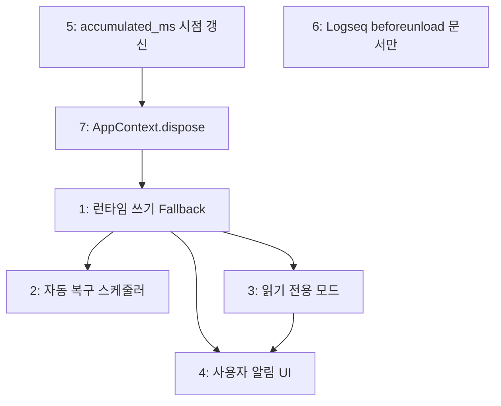

# Phase 2H: 미구현 항목 보완

## 목표

Phase 2 설계문서에서 미구현으로 식별된 7개 항목을 보완합니다. 런타임 쓰기 fallback, 자동 복구, 읽기 전용 모드, 사용자 알림 UI, 백업 시점 누적시간 갱신, Logseq beforeunload 검토, `AppContext.dispose()` 통합을 다룹니다.

---

## 선행 조건

- Phase 2A ~ 2F 구현 완료
- `StorageManager`, `StorageStateMachine`, `WebLocksManager` 구현 완료
- `TimerService` 30초 주기 백업 (`setInterval`) 구현 완료

---

## 참조 설계 문서

| 문서 | 섹션 | 참조 |
|------|------|------|
| `05-storage.md` | §Storage Fallback 상세 설계 | 전체 fallback 흐름(초기화·런타임 실패, Memory 전환, 복구) |
| `05-storage.md` | §멀티탭 동시 접근 | Web Locks API 상세, 쓰기 직렬화 정책 |
| `05-storage.md` | §Logseq 플러그인 생명주기 | `beforeunload`, 30초 주기 백업, 플러그인 언로드 시나리오 |
| `02-architecture.md` | §14 리소스 정리 | `IDisposable`, dispose 패턴, `setInterval` 정리 |
| `2e-fallback.md` | 전체 | fallback·Web Locks·생명주기 구현 사양 |

---

## 미구현 항목 목록

| # | 항목 | 우선순위 | 난이도 | 관련 코드 |
|---|------|----------|--------|-----------|
| 1 | 런타임 쓰기 실패 → Memory Fallback | Medium | Medium | `storage_manager.ts` |
| 2 | 자동 복구 스케줄러 (30초 주기) | Low | Low | `storage_manager.ts`, `initialize.ts` |
| 3 | 읽기 전용 모드 (Web Lock 실패 시) | Low | Medium | `storage_manager.ts`, `timer_service.ts` |
| 4 | 사용자 알림 UI (배너 + 토스트) | Low | Medium | `App.svelte` |
| 5 | `backupTick`에서 `accumulated_ms` 시점 갱신 | Medium | Low | `timer_service.ts` |
| 6 | Logseq `beforeunload` 이중 등록 검토 | Low | - | `main.ts` (결론: SDK 미지원) |
| 7 | `AppContext.dispose()` 통합 + 정리 순서 | Medium | Low | `context.ts`, `initialize.ts`, `main.ts` |

---

## 상세 구현 내용

### 1. 런타임 쓰기 실패 → Memory Fallback

**현재 상태**: `SqliteUnitOfWork.transaction()`에서 `persist()` 실패 시 예외만 throw. 재시도나 fallback 전환 없음.

**구현 방안**:

`StorageManager`에 런타임 쓰기 래핑 메서드를 추가합니다.

```typescript
// storage_manager.ts
private static readonly RUNTIME_RETRY: ExponentialBackoffOptions = {
    max_attempts: 3,
    base_delay_ms: 500,  // 500ms → 1s → 2s
};

async executeWithFallback<T>(fn: (uow: IUnitOfWork) => Promise<T>): Promise<T> {
    if (this._state_machine.getState().mode === 'memory_fallback') {
        return fn(this._active_uow);
    }
    try {
        return await runWithExponentialBackoff(
            StorageManager.RUNTIME_RETRY,
            () => fn(this._active_uow),
        );
    } catch (e) {
        const reason = e instanceof Error ? e.message : String(e);
        this._options.logger?.warn('Runtime write failed after retries; switching to memory', { reason });
        this._switchToMemoryFallback(reason);
        return fn(this._active_uow);
    }
}

private _switchToMemoryFallback(reason: string): void {
    const mem = new MemoryUnitOfWork();
    this._memory_uow = mem;
    this._active_uow = mem;
    this._state_machine.transitionToFallback(reason);
}
```

**생성/변경 파일**:

| 파일 | 변경 유형 |
|------|-----------|
| `adapters/storage/storage_manager.ts` | 변경: `executeWithFallback()`, `_switchToMemoryFallback()` 추가 |

---

### 2. 자동 복구 스케줄러 (30초 주기)

**현재 상태**: `tryRecover()` 메서드는 구현됨. 자동으로 주기적 호출하는 스케줄러 없음.

**구현 방안**:

```typescript
// storage_manager.ts
private _recovery_interval: ReturnType<typeof setInterval> | null = null;

startAutoRecovery(interval_ms = 30_000): void {
    if (this._recovery_interval) return;
    this._recovery_interval = setInterval(async () => {
        if (this.getStorageState().mode !== 'memory_fallback') {
            this.stopAutoRecovery();
            return;
        }
        const recovered = await this.tryRecover();
        if (recovered) {
            this.stopAutoRecovery();
        }
    }, interval_ms);
}

stopAutoRecovery(): void {
    if (this._recovery_interval) {
        clearInterval(this._recovery_interval);
        this._recovery_interval = null;
    }
}
```

- `initialize()`에서 fallback 전환 시 `startAutoRecovery()` 자동 호출
- `dispose()`에서 `stopAutoRecovery()` 호출
- `tryRecover()` 성공 시 자동 중지

**생성/변경 파일**:

| 파일 | 변경 유형 |
|------|-----------|
| `adapters/storage/storage_manager.ts` | 변경: 자동 복구 interval 추가 |
| `app/initialize.ts` | 변경: fallback 시 `startAutoRecovery()` 연동 |

---

### 3. 읽기 전용 모드 (Web Lock 실패 시)

**현재 상태**: `WebLocksManager` 구현됨. 락 실패 시 경고 로그만 하고 진행. 읽기 전용 모드 없음.

**구현 방안**:

```typescript
// storage_manager.ts 확장
private _is_readonly = false;
private _lock_retry_interval: ReturnType<typeof setInterval> | null = null;
private readonly _readonly_listeners = new Set<(readonly_mode: boolean) => void>();

get is_readonly(): boolean {
    return this._is_readonly;
}

subscribeReadonly(listener: (readonly_mode: boolean) => void): () => void {
    this._readonly_listeners.add(listener);
    return () => this._readonly_listeners.delete(listener);
}
```

- `initialize()`에서 `acquireLock()` 실패 시 `_is_readonly = true` + 5초 재시도 시작
- 재시도 성공 시 `_is_readonly = false` + 리스너 알림 + 재시도 중지
- `TimerService` 쓰기 메서드에 readonly guard:

```typescript
// timer_service.ts 각 쓰기 메서드 진입부
private assertWritable(): void {
    if (this._readonly) {
        throw new TimerError('읽기 전용 모드에서는 타이머를 조작할 수 없습니다');
    }
}
```

- `TimerService` 생성자에 `readonly_getter?: () => boolean` 옵션 추가 또는 `AppContext`에서 연결

**생성/변경 파일**:

| 파일 | 변경 유형 |
|------|-----------|
| `adapters/storage/storage_manager.ts` | 변경: readonly 상태 관리 + 5초 재시도 |
| `services/timer_service.ts` | 변경: readonly guard 추가 |
| `app/initialize.ts` | 변경: readonly 상태 연결 |

**UI 연동** (항목 4와 함께):
- 읽기 전용 진입: info 배너 "다른 탭에서 실행 중 - 읽기 전용 모드"
- 읽기 전용 해제: success 토스트 "전체 기능이 복원되었습니다"

---

### 4. 사용자 알림 UI (배너 + 토스트)

**현재 상태**: `StorageManager.subscribe()` API 존재. UI에서 구독하지 않음. 디버그 모달에만 스토리지 모드 텍스트 표시.

**구현 방안**:

`App.svelte`에서 `storage_manager` 구독 연동:

```svelte
<!-- App.svelte -->
<script>
  let storage_banner: { type: 'warning' | 'info'; message: string } | null = $state(null);

  $effect(() => {
    const sm = ctx.storage_manager;
    if (!sm) return;
    const unsub = sm.subscribe((state) => {
      if (state.mode === 'memory_fallback') {
        storage_banner = {
          type: 'warning',
          message: '임시 모드: 데이터가 영구 저장되지 않습니다.',
        };
      } else {
        if (storage_banner?.type === 'warning') {
          ctx.stores.toast_store.addToast({ type: 'success', message: '저장소가 복구되었습니다' });
        }
        storage_banner = null;
      }
    });
    return unsub;
  });
</script>

{#if storage_banner}
  <div class="storage-banner storage-banner--{storage_banner.type}">
    <span>{storage_banner.message}</span>
    {#if storage_banner.type === 'warning'}
      <button onclick={() => ctx.storage_manager?.tryRecover()}>재시도</button>
    {/if}
  </div>
{/if}
```

**알림 매핑**:

| 상황 | UI 타입 | 내용 |
|------|---------|------|
| SQLite → Memory 전환 | 영구 배너 (warning) | "임시 모드: 데이터가 영구 저장되지 않습니다. [재시도]" |
| 재시도 성공 | 토스트 (success) | "저장소가 복구되었습니다" |
| 읽기 전용 모드 진입 | 영구 배너 (info) | "다른 탭에서 실행 중 - 읽기 전용 모드" |
| 읽기 전용 해제 | 토스트 (success) | "전체 기능이 복원되었습니다" |

**생성/변경 파일**:

| 파일 | 변경 유형 |
|------|-----------|
| `logseq-time-tracker/src/App.svelte` | 변경: 배너 + 구독 연동 |

---

### 5. `backupTick`에서 `accumulated_ms` 시점 갱신

**현재 상태**: `backupTick()`이 `persistActiveTimerState()`를 호출하지만, `_accumulated_ms`에 현재 실행 중인 세그먼트의 경과 시간이 반영되지 않음. 실제 `_accumulated_ms`는 `pause`/`stop` 시에만 갱신됨.

**구현 방안**:

`persistActiveTimerState()`에서 스냅샷용 누적시간을 계산:

```typescript
// timer_service.ts
private computeSnapshotAccumulatedMs(): number {
    if (this._is_paused || !this._current_segment_start) {
        return this._accumulated_ms;
    }
    return getElapsedMs(this._accumulated_ms, this._current_segment_start, false);
}

private async persistActiveTimerState(): Promise<void> {
    if (!this._active_job || !this._active_category) {
        return;
    }
    const now = new Date().toISOString();
    const state: ActiveTimerState = {
        version: 1,
        job_id: this._active_job.id,
        category_id: this._active_category.id,
        started_at: this._current_segment_start ?? now,
        is_paused: this._is_paused,
        accumulated_ms: this.computeSnapshotAccumulatedMs(),  // 변경: 시점 반영
    };
    if (this._is_paused) {
        state.paused_at = now;
    }
    await this._uow.transaction(async (uow) => {
        await uow.settingsRepo.setSetting('active_timer', state);
    });
}
```

기존 `getElapsedMs(accumulated_ms, current_segment_start, is_paused)` 유틸을 재사용합니다. `_accumulated_ms` 필드 자체를 변경하지 않고, 저장할 때만 스냅샷 값을 계산합니다.

**생성/변경 파일**:

| 파일 | 변경 유형 |
|------|-----------|
| `services/timer_service.ts` | 변경: `computeSnapshotAccumulatedMs()` 추가, `persistActiveTimerState()` 수정 |

---

### 6. Logseq `beforeunload` 이중 등록 검토

**현재 상태**: `window.addEventListener('beforeunload')` 단일 경로 사용.

**조사 결과**: `@logseq/libs` SDK에 `logseq.beforeunload` API가 **존재하지 않음**. npm 패키지 내부에서도 `beforeunload` 관련 타입/메서드를 찾을 수 없음.

**결론**: 현재의 `window.beforeunload` 단일 경로가 유일한 옵션. 코드 변경 없음.

**문서 업데이트**: `2e-fallback.md` §7에 다음 주석 추가:

> `@logseq/libs` SDK(현재 사용 버전)에 `logseq.beforeunload` API가 없어, `window.addEventListener('beforeunload')`만 사용합니다. 향후 SDK에 해당 API가 추가되면 이중 등록으로 전환합니다.

---

### 7. `AppContext.dispose()` 통합 + 정리 순서

**현재 상태**: `AppContext`는 인터페이스만으로, `dispose()` 엔트리포인트 없음. `main.ts`에서 개별적으로 `timer_service.dispose()` 호출.

**구현 방안**:

```typescript
// context.ts
export interface AppContext {
    services: Services;
    stores: { timer_store: TimerStore; job_store: JobStore; toast_store: ToastStore };
    uow: IUnitOfWork;
    logger: ILogger;
    storage_manager?: StorageManager;
    dispose(): void;
}
```

```typescript
// initialize.ts - AppContext 생성 시
const ctx: AppContext = {
    services,
    stores: { timer_store, job_store, toast_store },
    uow,
    logger,
    ...(storage_manager !== undefined ? { storage_manager } : {}),
    dispose() {
        // 정리 순서 (중요):
        // 1. 타이머 백업 interval 중지 + 최종 persist
        services.timer_service.dispose();
        // 2. Web Lock 해제 + SQLite close + 리스너 clear
        storage_manager?.dispose();
    },
};
```

```typescript
// main.ts 단순화
function disposeTimerOnBeforeUnload() {
    app_context?.dispose();
    unregister_before_unload?.();
    unregister_before_unload = null;
}
```

**정리 순서 규칙**:

1. `timer_service.dispose()` — 백업 `clearInterval` + `active_timer` 설정 삭제
2. `storage_manager?.dispose()` — Web Lock 해제 + SQLite `close()` + 리스너 clear

이 순서는 타이머의 최종 데이터가 스토리지에 반영된 후 스토리지를 닫는 것을 보장합니다.

**생성/변경 파일**:

| 파일 | 변경 유형 |
|------|-----------|
| `app/context.ts` | 변경: `dispose()` 메서드 추가 |
| `app/initialize.ts` | 변경: `dispose()` 구현 |
| `logseq-time-tracker/src/main.ts` | 변경: `app_context.dispose()` 단일 호출로 단순화 |

---

## 구현 순서 및 의존성



**권장 구현 순서**:

1. **5 → 7**: 독립적이며 기반 정리에 해당. 먼저 처리
2. **1**: 런타임 fallback은 2·3·4의 전제
3. **2, 3**: 1 완료 후 병렬 가능
4. **4**: 1·3 완료 후 UI 통합
5. **6**: 코드 변경 없음, 문서만 업데이트

---

## 완료 기준

- [ ] `StorageManager.executeWithFallback()`: 런타임 쓰기 3회 재시도(500ms→1s→2s) 후 Memory 전환
- [ ] `StorageManager.startAutoRecovery()`: 30초 주기 `tryRecover()` + 성공 시 자동 중지
- [ ] `StorageManager.is_readonly`: 락 실패 시 읽기 전용 + 5초 재시도
- [ ] `TimerService`: readonly guard로 쓰기 메서드 차단
- [ ] `App.svelte`: fallback/readonly 배너 + 복구 토스트
- [ ] `persistActiveTimerState()`: 실행 중 세그먼트 경과시간 포함한 `accumulated_ms` 저장
- [x] `2e-fallback.md`: Logseq beforeunload SDK 미지원 주석
- [ ] `AppContext.dispose()`: timer → storage 순서로 정리
- [ ] `main.ts`: `app_context.dispose()` 단일 호출

---

## 다음 단계

→ **Phase 2G: 테스트** (보완 항목 포함한 단위·통합 테스트)
→ **Phase 3: UI 고도화 & 커스텀 필드**
