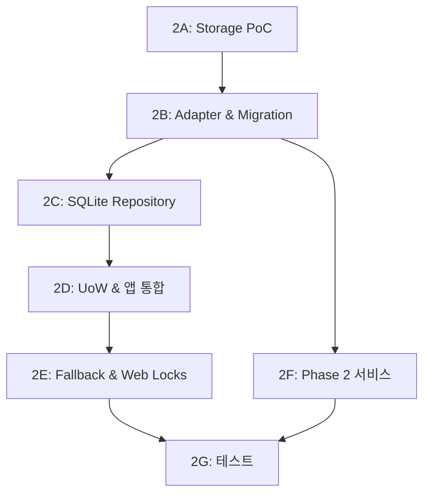

# Phase 2: 영속화 & Job 완성

## 목표

OPFS + SQLite(sql.js) 영속화 계층을 구현하고, Job CRUD를 완성하며, ExternalRef/JobCategory/DataExport 기능을 추가합니다.

---

## 선행 조건

- Phase 1 완료 — MemoryAdapter로 동작하는 프로토타입
- 모노레포 환경 정상 동작 (pnpm workspace + turbo)

---

## 참조 설계 문서

| 문서 | 섹션 | 참조 내용 |
|------|------|-----------|
| `05-storage.md` | §OPFS + SQLite | sql.js 초기화, OPFS/IndexedDB 읽기/쓰기 |
| `05-storage.md` | §스키마 마이그레이션 | Forward-only 마이그레이션 |
| `05-storage.md` | §OPFS iframe 제약 | createSyncAccessHandle 불가 시 IndexedDB fallback |
| `05-storage.md` | §Storage Fallback | 초기화/런타임 실패 시 MemoryAdapter 전환 |
| `05-storage.md` | §멀티탭 동시 접근 | Web Locks API |
| `05-storage.md` | §데이터 백업 | JSON export/import |
| `02-architecture.md` | §4.3 Services | JobCategoryService, DataExportService |
| `02-architecture.md` | §8 서비스 초기화 | createServices 팩토리 |
| `02-architecture.md` | §13 Repository 저장 규칙 | structuredClone, SQL 매핑 |
| `03-data-model.md` | §2 테이블 정의 | 전체 테이블 스키마 |
| `03-data-model.md` | §7 TypeScript 타입 | ExternalRef, JobCategory, JobTemplate |
| `01-requirements.md` | FR-2, FR-5 | Job CRUD, Logseq 연동 |
| `08-test-usecases.md` | §Phase 2 유즈케이스 | 영속화, 폴백, export/import |
| `09-user-flows.md` | UF-07 ~ UF-10 | 카테고리, 재오픈, 타이머 복구 |

---

## 서브페이즈 구조 (7개)

| 서브페이즈 | 명칭 | 핵심 산출물 | 문서 |
|-----------|------|-------------|------|
| **2A** | Storage PoC | OPFS/IndexedDB 검증, 스토리지 백엔드 확정 | [2a-storage-poc.md](2a-storage-poc.md) |
| **2B** | sql.js Adapter & Migration | sql.js 초기화, Storage Adapter, Migration Runner, DDL | [2b-sqlite-adapter.md](2b-sqlite-adapter.md) |
| **2C** | SQLite Repository | 9개 SQLite Repository 구현 | [2c-sqlite-repository.md](2c-sqlite-repository.md) |
| **2D** | UnitOfWork & 앱 통합 | SqliteUnitOfWork, initializeApp 통합 | [2d-integration.md](2d-integration.md) |
| **2E** | Fallback & Web Locks | StorageState 상태 머신, Web Locks, 복구 로직 | [2e-fallback.md](2e-fallback.md) |
| **2F** | Phase 2 서비스 | JobCategoryService, DataExportService | [2f-services.md](2f-services.md) |
| **2G** | 테스트 | SQLite Repo, Fallback, Export 테스트 | [2g-tests.md](2g-tests.md) |

---

## 서브페이즈 간 의존성

---

## 현재 코드베이스 상태

- **9개 Repository 인터페이스**: `repositories.ts`에 정의 완료
- **IUnitOfWork**: `transaction(fn)` 단일 API, 9개 repo 포함
- **4개 스텁**: ExternalRef, Template, JobCategory, DataField — `StorageError('Phase 2에서 구현 예정')` throw
- **initializeApp**: `options.uow`로 UoW 주입 가능 (기본값 `MemoryUnitOfWork`)
- **도메인 타입**: ExternalRef, JobCategory, JobTemplate, DataField 정의 완료

---

## 완료 기준

- [x] Storage PoC 검증 완료 (OPFS 또는 IndexedDB 백엔드 확정)
- [x] sql.js Adapter + Migration Runner + DDL
- [x] 9개 SQLite Repository 구현
- [x] SqliteUnitOfWork + initializeApp 통합 (`createUnitOfWork`·`StorageManager` 경로)
- [x] Storage Fallback: SQLite 초기화 실패 시 Memory 전환, `StorageManager`·`tryRecover`, Web Locks 옵션 연동, 지수 백오프 재시도(기본 `base_delay_ms: 50` → 50ms / 100ms / 200ms)
- [x] 런타임 SQLite 쓰기 실패 시 Memory 폴백, Web Lock 실패 시 읽기 전용 모드, 사용자 알림 UI(배너·토스트) 연동 — 구현 완료
- [x] JobCategoryService + DataExportService
- [x] 전체 테스트 통과 (271개) + 커버리지 75.41% (브라우저·CSS 제외 시 80%+ 추정)

---

## 다음 단계

→ Phase 3: UI 고도화 & 커스텀 필드 (`phase-3/plan.md`)
