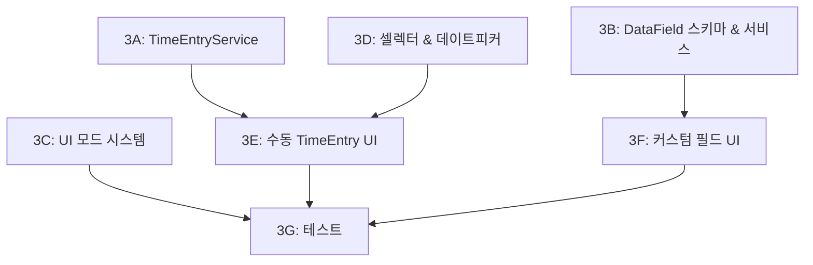

# Phase 3: UI 고도화 & 커스텀 필드

## 목표

툴바/풀화면/인페이지 UI 모드를 구현하고, 셀렉터/데이트피커 등 고급 컴포넌트를 추가하며, 수동 TimeEntry CRUD와 커스텀 필드(DataField) 시스템을 구현합니다.

---

## 선행 조건

- Phase 2 완료 — SQLite 영속화 + 전체 Job CRUD 동작

---

## 참조 설계 문서

| 문서                     | 섹션                    | 참조 내용                                                |
| ------------------------ | ----------------------- | -------------------------------------------------------- |
| `06-ui-ux.md`            | §Logseq 통합 UI 개요    | 툴바(Compact), 풀화면(Full), 인페이지(Inline) 3가지 모드 |
| `06-ui-ux.md`            | §Core UI 컴포넌트 분기  | 모드별 렌더링 전략                                       |
| `06-ui-ux.md`            | §셀렉터                 | CategorySelector, JobSelector 커스텀 select              |
| `06-ui-ux.md`            | §데이트피커             | DatePicker + TimeRangePicker                             |
| `06-ui-ux.md`            | §OverlapResolutionModal | TimeEntry 겹침 해결 UI                                   |
| `06-ui-ux.md`            | §수동 TimeEntry         | 사용자 직접 TimeEntry 생성/수정/삭제                     |
| `06-ui-ux.md`            | §반응형 레이아웃        | Compact / Full 모드 전환 기준                            |
| `04-state-management.md` | §TimeEntry overlap 정책 | 겹침 감지 + 사용자 선택 (조정/유지)                      |
| `03-data-model.md`       | §3~6 메타 레지스트리    | DataType, EntityType, DataField 정의                     |
| `02-architecture.md`     | §4.9 TimeEntryService   | 수동 TimeEntry CRUD, overlap 검사                        |
| `02-architecture.md`     | §4.3 DataFieldService   | 커스텀 필드 등록/조회/삭제                               |
| `08-test-usecases.md`    | §Phase 3 유즈케이스     | 수동 TimeEntry, overlap, 커스텀 필드                     |
| `09-user-flows.md`       | UF-14 ~ UF-17           | 수동 기록, 커스텀 필드, UI 모드 전환                     |

---

## 코드베이스 현황 (Phase 2 완료)

- **서비스**: TimerService, JobService, CategoryService, HistoryService, JobCategoryService, DataExportService
- **팩토리**: `createServices()` in `services/index.ts`
- **Repository**: IDataFieldRepository 정의됨 (`repositories.ts`)
- **스텁**: SqliteDataFieldRepository 스텁 상태
- **타입**: DataType/EntityType/DataField 정의 완료 (`types/meta.ts`)
- **마이그레이션**: 001_initial + 002_phase2
- **컴포넌트**: Timer, JobList, ReasonModal, Toast, EmptyState
- **UoW**: 9개 Repository 포함

---

## 서브페이즈 구조

| 서브페이즈 | 문서 | 영역 | 주요 산출물 |
| --- | --- | --- | --- |
| **3A** | [3a-time-entry-service.md](3a-time-entry-service.md) | 서비스 | TimeEntryService (CRUD + overlap) |
| **3B** | [3b-datafield-schema-service.md](3b-datafield-schema-service.md) | 스키마 + 서비스 | Migration 003, SqliteDataFieldRepository, DataFieldService |
| **3C** | [3c-ui-mode-system.md](3c-ui-mode-system.md) | UI | Toolbar, FullView, InlineView, LayoutSwitcher |
| **3D** | [3d-advanced-selectors.md](3d-advanced-selectors.md) | UI | CategorySelector, JobSelector, DatePicker, TimeRangePicker |
| **3E** | [3e-manual-time-entry-ui.md](3e-manual-time-entry-ui.md) | UI | ManualEntryForm, TimeEntryList, OverlapResolutionModal |
| **3F** | [3f-custom-field-ui.md](3f-custom-field-ui.md) | UI | FieldRenderer, CustomFieldEditor, CustomFieldManager |
| **3G** | [3g-tests.md](3g-tests.md) | 테스트 | 단위/통합/컴포넌트/성능/E2E 테스트 |

---

## 서브페이즈 간 의존성

- **병렬 가능**: 3A, 3B, 3C, 3D (상호 독립)
- **3E**: 3A + 3D 완료 후
- **3F**: 3B 완료 후
- **3G**: 전체 완료 후

---

## 서브 단계 요약

### 3A: TimeEntryService

수동 TimeEntry CRUD와 overlap 감지/해결 로직 구현. 상세: [3a-time-entry-service.md](3a-time-entry-service.md)

- `createManualEntry(params)`: 시간 범위 검증 + overlap 검사
- `detectOverlaps(job_id, started_at, ended_at)`: 동일 Job 내 겹침 감지
- `resolveOverlap(new_entry, existing[], strategy)`: new_first / existing_first 전략
- `updateEntry(id, updates)`: 수정 후 재검증
- `deleteEntry(id)`: 삭제

### 3B: DataField 스키마 & 서비스

Migration 003으로 data_type/entity_type/data_field 테이블 생성, DataFieldService 구현. 상세: [3b-datafield-schema-service.md](3b-datafield-schema-service.md)

- DDL: data_type, entity_type, data_field 테이블
- 시드: data_type 7종, entity_type 5종
- SqliteDataFieldRepository 활성화
- DataFieldService: createField, updateField, deleteField, getFieldsByEntity

### 3C: UI 모드 시스템

Toolbar/FullView/InlineView 3가지 UI 모드 구현. 상세: [3c-ui-mode-system.md](3c-ui-mode-system.md)

- Toolbar: 진행중 Job 요약, 빠른 제어
- FullView: Compact(< 600px) / Full(>= 600px) 반응형
- InlineView: 페이지 기반 인라인 UI
- LayoutSwitcher: ResizeObserver 기반 모드 전환

### 3D: 고급 셀렉터 & 데이트피커

CategorySelector, JobSelector, DatePicker, TimeRangePicker 구현. 상세: [3d-advanced-selectors.md](3d-advanced-selectors.md)

- CategorySelector: 트리 구조 탐색, 검색, 드롭다운
- JobSelector: 검색, 상태 필터, 드롭다운
- DatePicker: 캘린더, min/max 제약
- TimeRangePicker: 날짜+시간, 범위 검증

### 3E: 수동 TimeEntry UI

ManualEntryForm, TimeEntryList, OverlapResolutionModal 구현. 상세: [3e-manual-time-entry-ui.md](3e-manual-time-entry-ui.md)

- ManualEntryForm: 셀렉터/데이트피커 통합, overlap 감지 연동
- TimeEntryList: 목록 표시, 필터, 편집/삭제
- OverlapResolutionModal: 시각적 타임라인, 전략 선택

### 3F: 커스텀 필드 UI

FieldRenderer 시스템, CustomFieldEditor, CustomFieldManager 구현. 상세: [3f-custom-field-ui.md](3f-custom-field-ui.md)

- FieldRenderer: data_type/view_type → 컴포넌트 동적 매핑
- 7종 타입별 필드 컴포넌트 (string, decimal, date, datetime, boolean, enum, relation)
- CustomFieldEditor: 필드 값 편집
- CustomFieldManager: 필드 정의 관리

### 3G: 테스트

Phase 3 전체 기능 테스트. 상세: [3g-tests.md](3g-tests.md)

- 단위: UC-ENTRY-001~004, UC-DFIELD-001~003
- 컴포넌트: UC-UI-009~018
- 성능: UC-PERF-003~004
- E2E: UC-E2E-003
- 커버리지 80%+ 목표

---

## 완료 기준

- [ ] 툴바 / 풀화면 / 인페이지 3개 UI 모드 구현
- [ ] CategorySelector, JobSelector, DatePicker, TimeRangePicker
- [ ] TimeEntryService + 수동 TimeEntry CRUD
- [ ] Overlap 검사 + OverlapResolutionModal
- [ ] DataField 시스템 (정의 + 값 저장/조회)
- [ ] 전체 테스트 통과 + 커버리지 80%+
- [ ] a11y: 키보드 내비게이션, aria 속성

---

## 다음 단계

→ Phase 4: 잡 생성 & 템플릿 (`phase-4/plan.md`)
