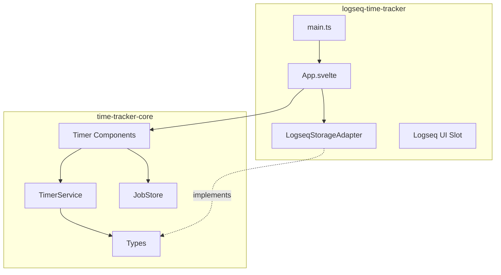
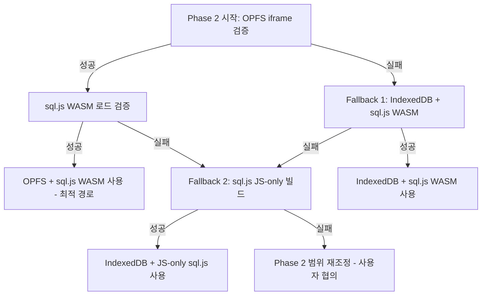

# Time Tracker 프로젝트 개요

**작성일**: 2026-03-15
**버전**: 1.0
**상태**: 설계 초안

---

## 1. 목적

Logseq 내에서 작업(Job) 단위의 **시간 추적(Time Tracking)** 과 **작업 관리**를 통합 제공하는 플러그인을 구축합니다. 현재 페이지 컨텍스트를 기반으로 원클릭으로 타임 트래킹을 시작하고, 대기/진행/보류 중인 작업을 전환하며, 잡 생성·템플릿·통계·외부 연동(eCount ERP 등)까지 지원하는 체계적인 시스템을 목표로 합니다.

---

## 2. 핵심 원칙

### 2.1 Logseq 독립성 (Core First)

- **상태 관리, 기본값, 설정 등은 Logseq API에 의존하지 않음**
- 코어 로직과 데이터 모델은 **Logseq API 무관**하게 설계 (Svelte 5 프레임워크 기반)
- Logseq는 **껍데기(진입점/어댑터)** 만 담당 → 코어를 분리하면 Svelte 기반의 다른 호스트(웹, 데스크톱 등)에 재사용 가능
- **주의**: 프레임워크 독립이 아님. 코어는 Svelte 5 Runes에 의존하며, React/Vue 등에서 직접 사용 불가

### 2.2 서비스 독립성 (Dependency Inversion)

- 각 서비스(저장소, 설정, 통계 등)는 **인터페이스 기반**으로 설계
- 구현체(OPFS+SQLite, Logseq Adapter 등)는 언제든 교체 가능
- 외부 시스템(eCount, Notion 등) 연동도 **어댑터**로 주입

### 2.3 사용자 주도 커스터마이징

- 카테고리, 셀렉터, 템플릿, 잡 생성 시 입력 필드 등 **모두 사용자가 정의 가능**
- "개념만 두고 버튼 노출하지 말자" → 실제로 사용하는 기능만 노출

---

## 3. 패키지 분리 구조

기존 `packages/time-tracker`(React 기반 스캐폴딩)를 **두 패키지**로 분리합니다.

> **디렉토리 구조 상세**: [02-architecture.md §3 프로젝트 구조](02-architecture.md) 참조

### 3.1 `time-tracker-core` 패키지

| 항목           | 내용                                                  |
| -------------- | ----------------------------------------------------- |
| **역할**       | 타임 트래킹 도메인 로직, 타입, 상태, UI 컴포넌트      |
| **프레임워크** | Svelte 5 (Runes), TypeScript                          |
| **의존성**     | `@vanilla-extract/css`, `svelte` (외부 의존성 최소화) |
| **출력**       | 타입, 서비스, 스토어, Svelte 컴포넌트                 |
| **테스트**     | Vitest + @testing-library/svelte, **Logseq 미의존**   |

### 3.2 `logseq-time-tracker` 패키지

| 항목           | 내용                                                                |
| -------------- | ------------------------------------------------------------------- |
| **역할**       | Logseq 플러그인 껍데기, `@logseq/libs` 연동                         |
| **프레임워크** | Svelte 5                                                            |
| **의존성**     | `@personal/time-tracker-core`, `@logseq/libs`, `vite-plugin-logseq` |
| **출력**       | Logseq 플러그인 번들 (dist/index.html)                              |
| **테스트**     | Logseq API 모킹 또는 통합 테스트                                    |

### 3.3 의존성 방향

- **Core** → Logseq 무의존
- **logseq-time-tracker** → Core + Logseq API

---

## 4. 문서 인덱스

| 문서                                             | 내용                                                         |
| ------------------------------------------------ | ------------------------------------------------------------ |
| [01-requirements.md](01-requirements.md)         | 기능/비기능 요구사항 (사용자 노트 기반)                      |
| [02-architecture.md](02-architecture.md)         | 아키텍처 설계 (레이어, 컴포넌트, 의존성)                     |
| [03-data-model.md](03-data-model.md)             | 데이터 모델 (Job, TimeEntry, Category, Status, History)      |
| [04-state-management.md](04-state-management.md) | 상태 관리 (Job 상태 FSM, "진행중 1개" 제약)                  |
| [05-storage.md](05-storage.md)                   | 영속화 (Storage Adapter, OPFS+SQLite, Logseq)                |
| [06-ui-ux.md](06-ui-ux.md)                       | UI/UX (툴바, 풀화면, 셀렉터, 데이트피커, 템플릿)             |
| [07-test-strategy.md](07-test-strategy.md)       | 테스트 전략 (워크플로우, 피라미드, Phase별 범위, 인프라)     |
| [08-test-usecases.md](08-test-usecases.md)       | 테스트 유즈케이스 Phase별 인덱스 (상세 BDD 명세는 각 패키지의 `__test_specs__/` 참조) |
| [09-user-flows.md](09-user-flows.md)             | 핵심 유저 플로우 (행위→결과, Mermaid, Phase별 19개 시나리오) |

---

## 5. 구현 단계 요약

| Phase       | 범위                     | 산출물                                                                                                                    |
| ----------- | ------------------------ | ------------------------------------------------------------------------------------------------------------------------- |
| **Phase 1** | 프로토타입               | 패키지 스캐폴딩, 핵심 타입, **최소 Job CRUD (생성, 목록 조회)**, TimerService/Store, MemoryStorageAdapter, 기본 Svelte UI |
| **Phase 2** | 영속화 & Job & 메타 시드 | OPFS+SQLite 어댑터, Job CRUD, History 기록, DataType/EntityType/DataField 시드, ExternalRef 테이블                        |
| **Phase 3** | UI 고도화 & 커스텀 필드  | 툴바, 풀화면, 셀렉터, 데이트피커, DataField + Job.custom_fields(JSON) 기반 커스텀 필드 UI                                 |
| **Phase 4** | 잡 생성 & 템플릿         | 잡 생성 플로우, 템플릿 엔진, 페이지 생성 연동                                                                             |
| **Phase 5** | 통계 & 정리              | 작업별/카테고리별 통계, eCount 연동 스켈레톤, 문서화                                                                      |

---

## 6. 기술 리스크

| 리스크                                                 | 심각도 | 검증 시점       | 대응                                                                   |
| ------------------------------------------------------ | ------ | --------------- | ---------------------------------------------------------------------- |
| vanilla-extract + Svelte 5 호환성 미검증               | High   | Phase 1 착수 전 | PoC 수행: Svelte 5 컴포넌트에서 vanilla-extract 스타일 적용 확인       |
| OPFS iframe 제약 (Logseq 플러그인 내 접근 불가 가능성) | High   | Phase 2 착수 전 | 05-storage.md 검증 체크리스트 수행, fallback: IndexedDB                |
| sql.js WASM 로드 실패 (CSP, 메모리 제한)               | Medium | Phase 2         | WASM 대신 js-only 빌드 사용, 또는 absurd-sql 대안                      |
| Logseq 플러그인 iframe CSP로 인한 스타일 주입 제한     | Medium | Phase 1 PoC     | vanilla-extract의 빌드 타임 CSS 생성 방식으로 CSP 우회 가능 여부 검증  |
| 멀티탭 동시 접근 시 DB 손상                            | Medium | Phase 2         | Web Locks API로 배타적 접근, Phase 3+ SharedWorker                     |
| SQLite WAL 모드 OPFS 환경 호환성                       | Medium | Phase 2 PoC     | Phase 2 PoC에서 WAL 모드 성능/호환성 검증, 실패 시 journal_mode=DELETE |
| Logseq API 버전 호환성 (메이저 업데이트 시 깨짐)       | Low    | 지속적          | @logseq/libs 버전 고정, 어댑터 패턴으로 격리                           |

### 6.1 Phase 1 착수 전 PoC (vanilla-extract + Svelte 5)

Phase 1 구현 시작 전에 핵심 기술 조합의 호환성을 검증합니다.

**검증 항목**:

- [ ] Svelte 5 컴포넌트에서 vanilla-extract `.css.ts` 스타일 import 및 적용
- [ ] Vite 빌드 파이프라인에서 vanilla-extract + Svelte 5 동시 처리
- [ ] Logseq 플러그인 iframe 내에서 빌드된 CSS 로드 정상 동작
- [ ] CSP 제한 하에서 빌드 타임 생성 CSS의 정상 적용 여부

**PoC 산출물**: 최소 Svelte 5 컴포넌트 1개 + vanilla-extract 스타일 + Logseq iframe 로드 확인

**실패 시 대안**: CSS Modules 또는 Svelte scoped style (`<style>` 블록)으로 전환

**예상 소요**: 2~4시간

### 6.2 리스크 대응 의사결정 트리

Phase 2 착수 전 검증 실패 시 아래 순서로 fallback을 시도합니다.

**판단 기준**:

| 단계         | 검증 방법                                                | 성공 조건           | 소요 시간 |
| ------------ | -------------------------------------------------------- | ------------------- | --------- |
| OPFS 검증    | `navigator.storage.getDirectory()` 호출 + 파일 쓰기/읽기 | 에러 없이 완료      | 1시간     |
| WASM 검증    | sql.js `initSqlJs({ locateFile })` 호출                  | DB 생성 + 쿼리 성공 | 1시간     |
| JS-only 검증 | sql.js JS-only 빌드 로드                                 | DB 생성 + 쿼리 성공 | 30분      |
| 범위 재조정  | -                                                        | 사용자와 대안 논의  | 별도      |

---

## 7. 버전 관리 및 배포 전략

### 7.1 시맨틱 버저닝

[Semantic Versioning 2.0.0](https://semver.org/) 규칙을 따릅니다.

| 버전 범위     | 의미                                              | 예시  |
| ------------- | ------------------------------------------------- | ----- |
| MAJOR (x.0.0) | 호환성 깨지는 변경 (데이터 모델 변경, 삭제된 API) | 2.0.0 |
| MINOR (0.x.0) | 새 기능 추가 (하위 호환)                          | 0.2.0 |
| PATCH (0.0.x) | 버그 수정                                         | 0.1.1 |

- Phase 1~2: `0.1.x` ~ `0.2.x` (기능 개발 중)
- Phase 3: `0.3.x` (UI 고도화)
- Phase 4~5: `0.4.x` ~ `0.5.x`
- 안정 릴리스: `1.0.0`

### 7.2 릴리스 채널

| 채널       | 대상        | 배포 방식                            |
| ---------- | ----------- | ------------------------------------ |
| **dev**    | 개발팀 내부 | 브랜치 빌드, 수동 설치               |
| **beta**   | 내부 테스터 | GitHub Releases (pre-release)        |
| **stable** | 일반 사용자 | GitHub Releases + Logseq Marketplace |

### 7.3 배포 방식

| Phase     | 방식            | 상세                                            |
| --------- | --------------- | ----------------------------------------------- |
| Phase 1~4 | **수동 배포**   | `pnpm build` → GitHub Releases에 zip 업로드     |
| Phase 5   | **자동화 검토** | GitHub Actions: tag push → build → release 생성 |

### 7.4 Logseq Marketplace 등록 (Phase 5)

- `logseq-marketplace` 저장소에 PR 제출
- `package.json`에 `logseq` 필드 포함 (아이콘, 제목, 설명)
- `README.md`에 설치/사용법 포함
- 릴리스마다 CHANGELOG.md 업데이트

### 7.5 릴리스 노트

각 릴리스에 포함할 내용:

- 새 기능 목록
- 버그 수정 목록
- 호환성 변경 사항 (있는 경우)
- 스키마 마이그레이션 정보 (있는 경우)
- 알려진 이슈

---

## 8. SSOT 정의 원본 매핑

각 핵심 개념이 **한 문서에만 정의**되고, 나머지 문서는 참조 링크로 연결됩니다.

| 개념                     | 정의 원본 (SSOT)         | 참조하는 문서                               |
| ------------------------ | ------------------------ | ------------------------------------------- |
| 서비스 목록 및 책임      | 02-architecture §4.3     | 00-overview, 05-storage                     |
| Repository 인터페이스    | 05-storage §Repository   | 02-architecture §4.2 (참조 링크)            |
| IUnitOfWork + 트랜잭션   | 05-storage §IUnitOfWork  | 02-architecture §4.2 (참조 링크)            |
| 데이터 모델/테이블       | 03-data-model §2         | 05-storage, 08-test                         |
| TypeScript 타입 정의     | 03-data-model §7         | 02-architecture §4.1 (참조 링크)            |
| Phase 범위               | 00-overview §5           | 01-requirements, 06-ui, 08-test             |
| FSM 상태 전환 규칙       | 04-state §상태 머신      | 03-data-model (참조 링크), 08-test          |
| Svelte 5 Runes 스토어    | 04-state §Svelte 5 Runes | 02-architecture §4.6 (참조 링크)            |
| 에러 계층                | 07-test / 04-state       | 02-architecture, 05-storage                 |
| 파일/디렉토리 구조       | 02-architecture §3       | 00-overview §3 (참조 링크)                  |
| 요구사항 ID (FR-x/NFR-x) | 01-requirements          | 06-ui, 08-test                              |
| 설정 스키마 (키/타입)    | 01-requirements §3.8     | 02-architecture §12 (참조 링크), 05-storage |
| 스키마 마이그레이션      | 05-storage §마이그레이션 | 02-architecture §15 (참조 링크)             |
| 서비스 초기화 (팩토리)   | 02-architecture §8       | 05-storage §의존성 주입 (참조 링크)         |
| dispose 패턴             | 02-architecture §14      | 05-storage §생명주기 (참조 링크)            |
| Cascade 삭제 전략        | 02-architecture §4.3     | 03-data-model (참조 링크)                   |
| Overlap 해소 정책 (UI)   | 06-ui-ux §OverlapModal   | 08-test §TimeEntryService                   |
| 패키지 역할/의존성       | 00-overview §3           | 02-architecture §7 (참조 링크)              |
| 핵심 유저 플로우         | 09-user-flows            | 08-test (테스트 ID 매핑), 04-state, 06-ui   |
| TimeEntry overlap 정책   | 04-state §overlap 정책   | 05-storage, 06-ui-ux                        |
| ToastStore               | 04-state §toast_store    | 06-ui-ux §에러 및 알림 UI                   |
| JobStore                 | 04-state §job_store      | 02-architecture §4.6 (참조 링크)            |
| 입력값 새니타이징        | 02-architecture §4.11    | 06-ui-ux §ReasonModal                       |

### 8.1 수정 시 검증 절차

1. **서비스 추가/제거 시**: 02-arch 서비스 테이블 + Mermaid + createServices() + 05-storage Repository
2. **Repository 변경 시**: 05-storage 인터페이스 (02-arch는 참조만 → 자동 반영)
3. **Phase 범위 변경 시**: 00-overview Phase 요약 + 06-ui Phase 1 UI 범위 + 08-test Phase별 요약
4. **데이터 모델 변경 시**: 03-data 테이블 + 05-storage Repository + 08-test 관련 UC
5. **FSM 전환 변경 시**: 04-state FSM (03-data는 참조만 → 자동 반영)
6. **파일명/확장자 변경 시**: 02-arch 디렉토리 구조 트리
