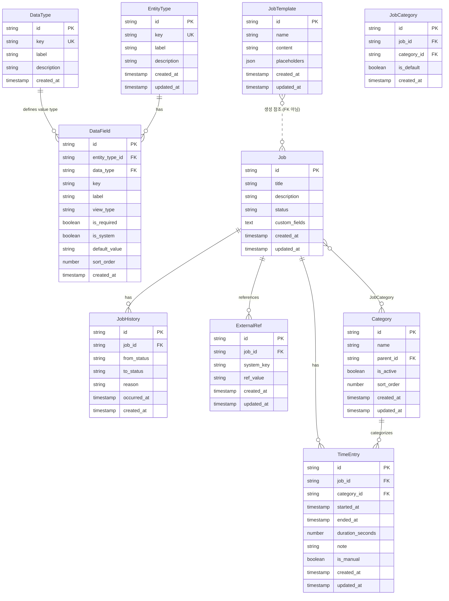

# 데이터 모델 설계

## 개요

타임 트래커의 데이터 모델은 **하이브리드 구조**를 채택합니다.

> **Phase 구현 범위**: 메타 레지스트리(DataType, EntityType, DataField)는 **Phase 3** 이후에 구현합니다. 커스텀 필드 값은 **시스템 테이블의 `custom_fields` JSON 컬럼**(예: Job)으로 저장합니다. Phase 1~2에서는 고정 스키마(Job, Category, TimeEntry, JobHistory)만 사용하여 복잡도를 억제합니다.

- **DataType**: 필드 값 타입 정의 (시스템 정의, 사용자 추가 불가) — Phase 3+
- **EntityType**: 엔티티/모델 정의 (시스템 정의, 코드로 확장) — Phase 3+
- **DataField**: 엔티티의 필드 정의 (사용자가 항목 추가 가능, 단 DataType에서만 선택) — Phase 3+
- **시스템 테이블**: 핵심 엔티티는 고정 스키마로 집계/통계 성능 보장 — Phase 1~
- **custom_fields JSON**: 커스텀 필드 값은 Job 등 시스템 테이블의 JSON 컬럼에 저장 (DataField.key → 키) — Phase 3+

```
DataType (필드 값 타입 - 시스템 정의, 사용자 추가 불가)
├── $$string, $$decimal, $$date, $$datetime
├── $$boolean, $$enum, $$relation
└── 사용자는 여기서 골라서 필드를 추가함

EntityType (엔티티 정의 - 시스템 정의만, 코드로 추가)
├── job → 고정 테이블 (시스템 필드만)
├── category → 고정 테이블
├── time_entry → 고정 테이블
├── job_history → 고정 테이블
└── job_template → 고정 테이블

커스텀 필드 값 (custom_fields JSON)
└── DataField.key → JSON 속성 (값 타입은 DataType에 맞게)
```

---

## 1. 메타 레지스트리

이 절의 표는 **설계 관점** 제약을 설명합니다. TypeScript에서 필드 필수 여부·정확한 타입은 **`types/meta.ts`** (`DataType`, `EntityType`, `DataField`)를 기준으로 합니다.

### 1.1 DataType (필드 값 타입 정의)

사용자가 필드를 추가할 때 선택할 수 있는 **값 타입**을 정의합니다. 시스템에서 미리 정의하며, **사용자는 새 DataType을 추가할 수 없습니다**.

| 필드          | 타입             | 제약     | 설명                   |
| ------------- | ---------------- | -------- | ---------------------- |
| `id`          | `string`         | PK, UUID | 고유 식별자            |
| `key`         | `string`         | unique   | 타입 키 (예: "string") |
| `label`       | `string`         | required | 표시명 (예: "텍스트")  |
| `description` | `string`         | optional | 설명                   |
| `created_at`  | `ISO8601 string` | required | 생성 시각              |

**시스템 정의 DataType** (전부 시스템 시드, 사용자 추가/삭제 불가):

| key        | label       | TS 타입   | DB 저장 형태          |
| ---------- | ----------- | --------- | --------------------- |
| `string`   | 텍스트      | `string`  | 그대로 저장           |
| `decimal`  | 소수        | `number`  | decimal 문자열로 저장 |
| `date`     | 날짜        | `string`  | ISO8601 string        |
| `datetime` | 날짜+시간   | `string`  | ISO8601 string        |
| `boolean`  | 참/거짓     | `boolean` | `'true'` / `'false'`  |
| `enum`     | 선택 목록   | `string`  | 선택된 옵션값 문자열  |
| `relation` | 엔티티 참조 | `string`  | 대상 레코드 id        |

**제약**:

- 사용자는 DataType 레코드를 추가/삭제/수정할 수 없음
- 앱 초기화 시 시드 데이터로 삽입

> **저장 전략**: DataType과 EntityType은 시스템 정의 전용이며 사용자 수정이 불가합니다. 따라서 **DB 테이블로 반드시 저장할 필요는 없으며**, 코드 내 하드코딩(TypeScript const 객체)으로도 충분합니다. 다만 DataField의 FK 무결성 검증과 향후 확장성(플러그인 기반 타입 추가 등)을 고려해 **Phase 3에서는 DB 시드 테이블로 구현**합니다. Phase 1~2에서는 `$$` 타입 패턴(§6)의 const 값만으로 동작하며, `IDataTypeRepository`/`IEntityTypeRepository`는 별도로 두지 않고 하드코딩된 시드 배열에서 조회하는 헬퍼 함수(`findDataType(key)`, `findEntityType(key)`)로 대체합니다.

---

### 1.2 EntityType (엔티티 타입 정의)

데이터를 담는 "모델/엔티티"를 정의합니다. 모든 엔티티는 코드에서 정의됩니다.

| 필드          | 타입             | 제약     | 설명                              |
| ------------- | ---------------- | -------- | --------------------------------- |
| `id`          | `string`         | PK, UUID | 고유 식별자                       |
| `key`         | `string`         | unique   | 엔티티 키 (예: "job", "category") |
| `label`       | `string`         | required | 표시명 (예: "잡", "카테고리")     |
| `description` | `string`         | optional | 설명                              |
| `created_at`  | `ISO8601 string` | required | 생성 시각                         |
| `updated_at`  | `ISO8601 string` | required | 수정 시각                         |

**시스템 정의 엔티티** (코드에서 정의, 사용자 추가/삭제 불가):

| key            | label       | 고정 테이블  |
| -------------- | ----------- | ------------ |
| `job`          | 잡          | job          |
| `category`     | 카테고리    | category     |
| `time_entry`   | 시간 기록   | time_entry   |
| `job_history`  | 잡 히스토리 | job_history  |
| `job_template` | 잡 템플릿   | job_template |

새 엔티티 타입이 필요한 경우 플러그인 코드로 추가합니다 (UI에서 생성 불가).

---

### 1.3 DataField (필드 정의)

각 EntityType이 가지는 필드를 정의합니다. 사용자는 필드를 추가할 수 있지만, **DataType(값 타입)은 시스템에서 정의된 것만 선택 가능**합니다.

| 필드                  | 타입             | 제약                           | 설명                                               |
| --------------------- | ---------------- | ------------------------------ | -------------------------------------------------- |
| `id`                  | `string`         | PK, UUID                       | 고유 식별자                                        |
| `entity_type_id`      | `string`         | FK → EntityType                | 소속 EntityType                                    |
| `data_type`           | `string`         | FK → DataType.key              | 값 타입 (시스템 정의에서 선택)                     |
| `key`                 | `string`         | required                       | 필드 키 (예: "title", "status")                    |
| `label`               | `string`         | required                       | 표시명                                             |
| `view_type`           | `string`         | required, default: `'default'` | UI 렌더링 컴포넌트                                 |
| `is_required`         | `boolean`        | required                       | 필수 여부                                          |
| `is_system`           | `boolean`        | required                       | 시스템 필드 (수정/삭제 불가)                       |
| `default_value`       | `string`         | optional                       | 기본값 (문자열로 직렬화)                           |
| `options`             | `TEXT (JSON)`    | optional                       | enum일 때 선택지 (DB: JSON 문자열, TS: `string[]`) |
| `relation_entity_key` | `string`         | optional                       | relation일 때 대상 EntityType key                  |
| `sort_order`          | `number`         | optional                       | 폼/UI 표시 순서                                    |
| `created_at`          | `ISO8601 string` | required                       | 생성 시각                                          |

**view_type 규칙**:

| DataType key | 선택 가능한 view_type                         |
| ------------ | --------------------------------------------- |
| `string`     | `default`, `text`, `textarea`, `url`, `email` |
| `decimal`    | `default`, `decimal`, `slider`, `currency`    |
| `date`       | `default`, `date_picker`, `calendar`          |
| `datetime`   | `default`, `datetime_picker`                  |
| `boolean`    | `default`, `toggle`, `checkbox`               |
| `enum`       | `default`, `select`, `radio`, `chip`          |
| `relation`   | `default`, `entity_selector`, `inline_card`   |

- `view_type`은 항상 저장되며, 값이 없으면 DB에서 `'default'`를 자동 설정
- `view_type === 'default'`이면 컴포넌트 레이어의 dispatcher가 DataType에 맞는 기본 컴포넌트를 반환
- 기본 컴포넌트 매핑은 DB가 아닌 **core UI 컴포넌트 코드에서 관리**

**제약**:

- (entity_type_id, key) 유일
- `data_type`은 반드시 DataType 테이블에 존재하는 key여야 함
- is_system === true인 필드는 사용자가 삭제/키 변경 불가 (label, sort_order, view_type은 변경 가능)

**사용자의 필드 추가 흐름**:

```
1. EntityType 선택 (예: "job")
2. DataType 선택 (예: $$enum → "선택 목록")
3. 필드 정보 입력 (key, label, options 등)
4. view_type 입력 (필수, 미입력 시 DB 기본값 `'default'`)
→ DataField 레코드 생성, 값은 해당 엔티티의 `custom_fields` JSON에 저장
```

---

## 2. 시스템 테이블 (고정 스키마)

시스템 EntityType은 전용 테이블에 데이터를 저장합니다. 집계/통계 쿼리 성능을 보장합니다.

시스템 필드(is_system: true)는 고정 컬럼, 커스텀 필드(is_system: false)는 해당 엔티티의 `custom_fields` JSON 컬럼에 저장됩니다.

**ID 생성**: 모든 엔티티의 `id`는 `crypto.randomUUID()` (UUID v4)로 생성합니다. 정렬은 `created_at` 기준입니다.

### 2.1 Job (잡)

작업 단위. `status` 필드로 현재 상태를 직접 관리합니다.

| 필드            | 타입             | 제약     | 설명                                        |
| --------------- | ---------------- | -------- | ------------------------------------------- |
| `id`            | `string`         | PK, UUID | 고유 식별자                                 |
| `title`         | `string`         | required | 잡명                                        |
| `description`   | `string`         | optional | 설명                                        |
| `status`        | `StatusKind`     | required | 현재 상태 (default: 'pending')              |
| `custom_fields` | `TEXT (JSON)`    | optional | DataField 기반 커스텀 필드 값 (JSON 직렬화) |
| `created_at`    | `ISO8601 string` | required | 생성 시각                                   |
| `updated_at`    | `ISO8601 string` | required | 수정 시각                                   |

**StatusKind**:

```typescript
type StatusKind = 'pending' | 'in_progress' | 'paused' | 'cancelled' | 'completed';
```

**제약**:

- `status === 'in_progress'`인 Job은 **시스템 전체에서 1개만** 존재
- **유일성 보장 전략 (Phase별)**:
    - Phase 1: `JobService`에서 서비스 레벨 검증 (단일 탭 보장)
    - Phase 2: 서비스 레벨 검증 + Web Locks API로 멀티탭 배타적 접근
    - Phase 2+ (SQLite): 추가 안전장치로 `CREATE UNIQUE INDEX idx_job_active ON job(status) WHERE status = 'in_progress'` partial unique index 적용
- 상태 전환 시 JobHistory에 이력 자동 기록
- `Job.title`은 유일성 제약 없음 (동일 이름 허용). UI에서 생성일(`created_at`)로 구분 표시

> **FSM 상태 전환 규칙 (전환 방향, reason 필수 조건 등)**: [04-state-management.md §상태 머신](04-state-management.md) 참조

**삭제 시 cascade 정책**:

- Job 삭제 시 관련 레코드를 **cascade 삭제**: TimeEntry, JobHistory, JobCategory, ExternalRef
- 삭제는 `pending` 또는 `cancelled` 상태인 Job에만 허용
- **completed 상태**: 먼저 `재오픈`(→ pending)한 뒤 삭제
- **in_progress/paused 상태**: 반드시 종료 후 삭제

> **Cascade 실행 경로 (서비스 레이어)**: [02-architecture.md §4.3 Cascade 삭제 전략](02-architecture.md) 참조

---

### 2.2 Category (카테고리)

작업 분류. 트리 구조(폴더 중첩)를 지원합니다.

| 필드         | 타입             | 제약                    | 설명                                     |
| ------------ | ---------------- | ----------------------- | ---------------------------------------- |
| `id`         | `string`         | PK, UUID                | 고유 식별자                              |
| `name`       | `string`         | required                | 카테고리명 (예: 개발, 분석, 회의)        |
| `parent_id`  | `string`         | optional, FK → Category | 부모 카테고리                            |
| `is_active`  | `boolean`        | default: true           | 활성 여부 (false면 셀렉터 목록에서 숨김) |
| `sort_order` | `number`         | optional                | 정렬 순서                                |
| `created_at` | `ISO8601 string` | required                | 생성 시각                                |
| `updated_at` | `ISO8601 string` | required                | 수정 시각                                |

> **is_active**: 사용하지 않는 카테고리를 삭제하지 않고 비활성화할 수 있습니다. 비활성 카테고리는 셀렉터 UI에서 숨겨지지만, 기존 TimeEntry/JobCategory 참조는 유지됩니다. 이를 통해 삭제 시 참조 검사 실패 없이 카테고리를 "숨김 처리"할 수 있습니다.

**삭제 시 cascade 정책**:

- Category 삭제 전 **참조 검사** 수행:
    - 해당 `category_id`를 참조하는 `TimeEntry`가 있으면 **삭제 거부** (데이터 유실 방지)
    - 해당 `category_id`를 참조하는 `JobCategory`가 있으면 **삭제 거부**
- `parent_id`로 연결된 하위 카테고리가 있으면 **삭제 거부** (하위 먼저 삭제/이동 필요)
- 참조 레코드가 없고, 하위 카테고리가 없는 경우에만 삭제 허용

**트리 깊이 제한**:

- `parent_id` 체인의 최대 깊이: **10**
- 깊이 초과 시 `ValidationError` 발생
- 루트 카테고리 (parent_id === null)의 깊이는 1

**이름 유일성 제약**:

- 같은 `parent_id` 아래에서 `Category.name`은 유일해야 합니다 (서비스 레벨 검증)
- `CategoryService.upsertCategory()` 시 동일 부모 내 동명 카테고리 존재 여부를 확인하고, 존재하면 `ValidationError` 발생
- 서로 다른 부모 아래에서는 동명 카테고리 허용 (예: `개발 > 프론트엔드`, `분석 > 프론트엔드`는 가능)

**시드 데이터** (앱 초기화 시 삽입, `seedDefaults()` 멱등 — 카테고리 1개 이상 존재 시 건너뜀):

| name | sort_order | parent_id | is_active |
| ---- | ---------- | --------- | --------- |
| 개발 | 1          | null      | true      |
| 분석 | 2          | null      | true      |
| 회의 | 3          | null      | true      |
| 기타 | 4          | null      | true      |

---

### 2.3 TimeEntry (시간 기록)

타이머 동작 구간. 집계/통계의 핵심 테이블.

| 필드               | 타입             | 제약           | 설명                                 |
| ------------------ | ---------------- | -------------- | ------------------------------------ |
| `id`               | `string`         | PK, UUID       | 고유 식별자                          |
| `job_id`           | `string`         | FK → Job       | 잡 참조                              |
| `category_id`      | `string`         | FK → Category  | 카테고리 참조                        |
| `started_at`       | `ISO8601 string` | required       | 시작 시각                            |
| `ended_at`         | `ISO8601 string` | required       | 종료 시각                            |
| `duration_seconds` | `number`         | required       | 경과 시간 (초)                       |
| `note`             | `string`         | optional       | 메모                                 |
| `is_manual`        | `boolean`        | default: false | 수동 입력 여부 (타이머 vs 수동 구분) |
| `created_at`       | `ISO8601 string` | required       | 생성 시각                            |
| `updated_at`       | `ISO8601 string` | required       | 수정 시각                            |

**제약**:

- `ended_at >= started_at`
- `duration_seconds = ended_at - started_at` (정합성 검증)
- `is_manual`: 타이머 종료로 생성된 경우 `false`, 수동 입력(TimeEntryService)으로 생성된 경우 `true`

---

### 2.4 JobHistory (잡 히스토리)

Job 상태 전환 이력. "잡 시작 ~ 마지막 상태까지" 추적합니다.

| 필드          | 타입                     | 제약     | 설명                          |
| ------------- | ------------------------ | -------- | ----------------------------- |
| `id`          | `string`                 | PK, UUID | 고유 식별자                   |
| `job_id`      | `string`                 | FK → Job | 잡 참조                       |
| `from_status` | `StatusKind` 또는 `null` | optional | 이전 상태 (최초 생성 시 null) |
| `to_status`   | `StatusKind`             | required | 전환 후 상태                  |
| `reason`      | `string`                 | required | 전환 사유                     |
| `occurred_at` | `ISO8601 string`         | required | 전환 시각                     |
| `created_at`  | `ISO8601 string`         | required | 레코드 생성 시각              |

**제약**:

- 상태 변경 시 **무조건** History 레코드 생성
- `reason` 필수 (빈 문자열 거부, 최소 1글자 이상 입력 필수)

---

### 2.5 JobCategory (Job-Category 관계)

동일 Job에 여러 Category가 연결되는 N:M 관계.

| 필드          | 타입             | 제약           | 설명                          |
| ------------- | ---------------- | -------------- | ----------------------------- |
| `id`          | `string`         | PK, UUID       | 고유 식별자                   |
| `job_id`      | `string`         | FK → Job       | 잡 참조                       |
| `category_id` | `string`         | FK → Category  | 카테고리 참조                 |
| `is_default`  | `boolean`        | default: false | 해당 Job의 기본 카테고리 여부 |
| `created_at`  | `ISO8601 string` | required       | 생성 시각                     |

**제약**:

- (job_id, category_id) 유일
- Job당 `is_default=true`는 0 또는 1개
- `is_default` 유일성은 **서비스 레벨에서 검증**: `JobCategoryService`가 `is_default=true` 설정 시 동일 Job의 기존 default를 `false`로 변경 후 새 default를 설정. DB 제약(partial unique index)은 모든 백엔드에서 지원되지 않으므로 사용하지 않음

---

### 2.6 JobTemplate (잡 템플릿)

페이지 생성 시 사용할 템플릿. 플레이스홀더로 값 치환 지원.

| 필드           | 타입             | 제약     | 설명                                                                                               |
| -------------- | ---------------- | -------- | -------------------------------------------------------------------------------------------------- |
| `id`           | `string`         | PK, UUID | 고유 식별자                                                                                        |
| `name`         | `string`         | required | 템플릿명                                                                                           |
| `content`      | `string`         | required | 템플릿 본문 (플레이스홀더 포함)                                                                    |
| `placeholders` | `JSON`           | optional | PlaceholderDef[] (직렬화). JSON 파싱 실패 시 `[]`로 폴백 + warn 로깅 (`custom_fields`와 동일 정책) |
| `created_at`   | `ISO8601 string` | required | 생성 시각                                                                                          |
| `updated_at`   | `ISO8601 string` | required | 수정 시각                                                                                          |

**PlaceholderDef** (JSON 내부 구조):

```typescript
interface PlaceholderDef {
    id: string;
    key: string; // 템플릿 내 사용 키, e.g. {{job_title}}
    label: string; // UI 표시명
    field_ref?: string; // DataField id 참조 (잡 생성 시 입력값 매핑)
}
```

---

### 2.7 ExternalRef (외부 시스템 참조)

Job과 외부 시스템(Logseq, eCount, Notion 등) 간의 참조를 관리합니다. 하나의 Job이 여러 외부 시스템에 연결될 수 있습니다.

| 필드         | 타입             | 제약     | 설명                                              |
| ------------ | ---------------- | -------- | ------------------------------------------------- |
| `id`         | `string`         | PK, UUID | 고유 식별자                                       |
| `job_id`     | `string`         | FK → Job | 잡 참조                                           |
| `system_key` | `string`         | required | 외부 시스템 키 (예: "logseq", "ecount", "notion") |
| `ref_value`  | `string`         | required | 참조 값 (UUID, 잡코드, URL 등)                    |
| `created_at` | `ISO8601 string` | required | 생성 시각                                         |
| `updated_at` | `ISO8601 string` | required | 수정 시각 (upsert 시 갱신)                        |

**제약**:

- (job_id, system_key) 유일 — 하나의 Job에 같은 외부 시스템 참조는 1개
- upsert 시 `ref_value` 변경과 함께 `updated_at` 갱신
- Job 삭제 시 cascade 삭제

---

## 3. 커스텀 필드 값 저장 (custom_fields JSON)

FieldValue 테이블 대신, 각 시스템 테이블(Job 등)에 `custom_fields` JSON 컬럼을 사용하여 커스텀 필드 값을 저장합니다.

### 저장 형식

```json
{
    "ecount_code": "EC-2026-001",
    "department": "Dev",
    "priority": 3,
    "is_urgent": true
}
```

- 키: DataField.key
- 값: DataField.data_type에 맞는 타입 (string, number, boolean)

### DataType → JSON 값 타입 매핑

| DataType key | JSON 값 타입         | 예시                     |
| ------------ | -------------------- | ------------------------ |
| `string`     | `string`             | `"hello"`                |
| `decimal`    | `number`             | `3.14`                   |
| `date`       | `string` (ISO8601)   | `"2026-03-15"`           |
| `datetime`   | `string` (ISO8601)   | `"2026-03-15T10:30:00Z"` |
| `boolean`    | `boolean`            | `true`                   |
| `enum`       | `string`             | `"Dev"`                  |
| `relation`   | `string` (record id) | `"job-001"`              |

### 쿼리 예시

```sql
-- "담당 부서 = Dev"인 Job 검색 (SQLite json_extract)
SELECT * FROM job
WHERE json_extract(custom_fields, '$.department') = 'Dev';

-- Job의 커스텀 필드 전체 조회
SELECT id, title, custom_fields FROM job WHERE id = 'job-001';
```

### 제약

- custom_fields는 유효한 JSON이어야 함 (파싱 실패 시 빈 객체로 fallback)
- DataField에 정의되지 않은 키는 무시 (저장은 허용, UI에 미표시)
- custom_fields가 NULL이면 빈 객체 `{}` 로 취급

> **FieldValue 테이블 대비 장점**: JOIN 없이 단건 조회 가능, 스키마 단순화. **단점**: 필드별 SQL 인덱스 불가 (json_extract 사용). 이 프로젝트의 데이터 규모(수백~수천 Job)에서는 JSON 방식이 충분합니다.

---

## 4. ER 다이어그램



**ER 다이어그램 관계 설명**:

- `JobTemplate → Job`: 선택적 참조. Job 생성 시 템플릿을 사용할 수 있으나, 사용하지 않을 수도 있음. Job 테이블에 `template_id` FK가 존재하지 않으며, 템플릿 기반 생성은 서비스 레이어에서 처리. 템플릿 삭제가 기존 Job에 영향을 주지 않음.

---

## 4.1 타임존 처리 규칙

| 규칙              | 상세                                                                                                                                              |
| ----------------- | ------------------------------------------------------------------------------------------------------------------------------------------------- |
| **저장 형식**     | 모든 타임스탬프(`created_at`, `updated_at`, `started_at`, `ended_at`, `occurred_at`)는 **UTC ISO8601** 형식으로 저장 (예: `2026-03-15T01:30:00Z`) |
| **duration 계산** | `duration_seconds`는 UTC 기준으로 계산하여 DST(서머타임) 전환 영향 없음                                                                           |
| **UI 변환**       | UI 레이어에서 `Intl.DateTimeFormat` 또는 유틸 함수를 사용하여 사용자 로컬 타임존으로 변환                                                         |
| **날짜 필터**     | 기간별 조회 시 UTC 기준 날짜 경계 사용                                                                                                            |

---

## 5. 커스텀 필드 사용 예시

사용자가 Job에 "eCount 잡코드", "담당 부서" 커스텀 필드를 추가하는 흐름:

**1단계: DataField 추가** (EntityType key="job", DataType에서 선택):

```json
[
    {
        "entity_type_id": "et-job",
        "data_type": "string",
        "key": "ecount_code",
        "label": "eCount 잡코드",
        "is_system": false
    },
    {
        "entity_type_id": "et-job",
        "data_type": "enum",
        "key": "department",
        "label": "담당 부서",
        "view_type": "radio",
        "is_system": false,
        "options": ["Dev", "Design", "PM"]
    }
]
```

**2단계: Job 레코드에 값 저장** (Job.custom_fields JSON에):

```json
{
    "ecount_code": "EC-2026-001",
    "department": "Dev"
}
```

**3단계: 조회** — 시스템 필드는 컬럼 직접 접근, 커스텀 필드는 json_extract:

```sql
-- 시스템 필드: 직접 컬럼 접근 (빠름)
SELECT job_id, SUM(duration_seconds) FROM time_entry
WHERE started_at >= '2026-03-01' GROUP BY job_id;

-- 커스텀 필드: json_extract (인덱스 없음, 소규모 데이터에 적합)
SELECT * FROM job
WHERE json_extract(custom_fields, '$.department') = 'Dev';
```

---

## 6. DataType 키와 `DataTypeKey` (`types/meta.ts`)

현재 구현에서는 별도의 `data_types.ts` 파일 없이 **`types/meta.ts`** 에서 필드 값 타입 키를 문자열 리터럴 유니온으로 정의합니다. DB에는 해당 키가 **문자열**로 저장됩니다.

```typescript
// types/meta.ts (발췌)
export type DataTypeKey = 'string' | 'decimal' | 'date' | 'datetime' | 'boolean' | 'enum' | 'relation';
```

### 향후 $$ const 패턴과의 관계

설계상 각 키에 대해 `export const $$string = 'string' as const` 형태의 **런타임 const + TS 타입 이중 export** 를 두면 `DataType.key` 와 런타임 비교가 명확해집니다. 현재 코드베이스는 위 `DataTypeKey` 유니온으로 동일 역할을 수행합니다.

### 사용 예시

```typescript
import type { DataTypeKey } from './types/meta';

function isEnumField(data_type: DataTypeKey): boolean {
    return data_type === 'enum';
}
```

### view_type 처리 (코드 레벨)

```typescript
// src/ui/field_renderer.ts
// default_view_type 사전 정의 없이, component dispatcher가 기본 컴포넌트를 결정
export function resolveFieldComponent(field: DataField): SvelteComponent {
    if (field.view_type === 'default') {
        return resolveDefaultComponentByDataType(field.data_type);
    }

    return resolveNamedComponent(field.view_type, field.data_type);
}
```

---

## 7. TypeScript 타입 정의

도메인 타입의 단일 출처는 `packages/time-tracker-core/src/types/` 입니다. 아래는 **현재 구현**(`*.ts`)과 동일한 형태의 발췌입니다.

### 앱 설정·저장소 상태 (`types/settings.ts`)

진행 중 타이머·UI 설정 키맵, SQLite/메모리 폴백 상태 등 **앱 내부 영속 설정**에 쓰입니다 (`ISettingsRepository` / `StorageStateMachine` 와 연계).

```typescript
export interface ActiveTimerState {
    version: number;
    job_id: string;
    category_id: string;
    started_at: string;
    is_paused: boolean;
    paused_at?: string;
    accumulated_ms: number;
}

export type SettingsMap = {
    active_timer: ActiveTimerState;
    last_selected_category: string;
};

export type AppInitState = 'loading' | 'ready' | 'error';

export interface StorageState {
    mode: 'sqlite' | 'memory_fallback';
    fallback_reason?: string;
    fallback_since?: string;
}
```

### 메타 레지스트리 (`types/meta.ts`)

```typescript
export type DataTypeKey = 'string' | 'decimal' | 'date' | 'datetime' | 'boolean' | 'enum' | 'relation';

export interface DataType {
    id: string;
    key: DataTypeKey;
    label: string;
    description: string;
    created_at: string;
}

export interface EntityType {
    id: string;
    key: string;
    label: string;
    description: string;
    created_at: string;
    updated_at: string;
}

export interface DataField {
    id: string;
    entity_type_id: string;
    data_type: DataTypeKey;
    key: string;
    label: string;
    view_type: string;
    is_required: boolean;
    is_system: boolean;
    default_value: string;
    options: string; // DB·직렬화 계층에서는 JSON 문자열
    relation_entity_key: string;
    sort_order: number;
    created_at: string;
}
```

### 시스템 엔티티

```typescript
export type StatusKind = 'pending' | 'in_progress' | 'paused' | 'cancelled' | 'completed';

export interface Job {
    id: string;
    title: string;
    description: string;
    status: StatusKind;
    custom_fields: string;
    created_at: string;
    updated_at: string;
}

/** custom_fields JSON을 파싱한 후의 타입 */
export type ParsedCustomFields = Record<string, string | number | boolean>;

/** `parseCustomFields` 는 types/job.ts 에 구현됨 — 파싱 실패 시 `{}` 반환 */

export interface ExternalRef {
    id: string;
    job_id: string;
    system_key: string;
    ref_value: string;
    created_at: string;
    updated_at: string;
}

export interface Category {
    id: string;
    name: string;
    parent_id: string | null;
    is_active: boolean;
    sort_order: number;
    created_at: string;
    updated_at: string;
}

export interface TimeEntry {
    id: string;
    job_id: string;
    category_id: string;
    started_at: string;
    ended_at: string;
    duration_seconds: number;
    note: string;
    is_manual: boolean;
    created_at: string;
    updated_at: string;
}

export interface JobHistory {
    id: string;
    job_id: string;
    from_status: StatusKind | null;
    to_status: StatusKind;
    reason: string;
    occurred_at: string;
    created_at: string;
}

export interface JobCategory {
    id: string;
    job_id: string;
    category_id: string;
    is_default: boolean;
    created_at: string;
}

export interface JobTemplate {
    id: string;
    name: string;
    content: string;
    placeholders: string; // PlaceholderDef[] JSON 문자열; 사용 시 JSON.parse
    created_at: string;
    updated_at: string;
}

export interface PlaceholderDef {
    id: string;
    key: string;
    label: string;
    field_ref?: string;
}
```

## 8. 사용자 권한 요약

| 대상            | 생성                | 수정                                  | 삭제          |
| --------------- | ------------------- | ------------------------------------- | ------------- |
| **DataType**    | X                   | X                                     | X             |
| **EntityType**  | X (코드에서만 추가) | X                                     | X             |
| **DataField**   | O (커스텀 필드)     | label, view_type, sort_order, options | 커스텀 필드만 |
| **시스템 필드** | X                   | label, view_type, sort_order만        | X             |

---

## 9. 기존 모델 대비 변경사항

| 변경     | 상세                                                                                                      |
| -------- | --------------------------------------------------------------------------------------------------------- |
| **추가** | DataType (필드 값 타입 - 시스템 정의, 사용자 선택 전용)                                                   |
| **추가** | EntityType (엔티티/모델 정의 - 기존 DataType에서 분리)                                                    |
| **추가** | `custom_fields` JSON 컬럼 (Job 등 — 커스텀 필드 값, DataField.key 기반)                                   |
| **추가** | `DataTypeKey` 문자열 유니온 (`types/meta.ts`); 향후 `$$` const + 타입 이중 export 패턴(§6)으로 정리 가능 |
| **추가** | DataField에 `view_type` + `data_type` (DataType 참조)                                                     |
| **변경** | Job에 `status` 직접 포함 (현재 상태)                                                                      |
| **제거** | EntityType의 `is_system` 필드 (사용자 정의 엔티티 전제 제거)                                              |
| **제거** | JobStatus 엔티티 (JobHistory가 이력 담당, Job.status가 현재 상태)                                         |
| **제거** | 기존 DataType 엔티티 (DataType + EntityType으로 분리 재설계)                                              |
| **변경** | PlaceholderDef → JobTemplate.placeholders JSON 내부로 이동                                                |
| **변경** | `Job.external_ref` 제거 → **ExternalRef** 별도 테이블 (Job↔외부 시스템 다중 참조, system_key + ref_value) |

---

## 10. internal 프리픽스 (Logseq 연동 시)

Logseq 페이지 property에 저장할 때 **내부 메타데이터**는 `_internal` prefix를 붙여 숨깁니다.

- `_internal_job_id`: Job.id
- `_internal_status`: Job.status
- `_internal_last_synced_at`: 마지막 동기화 시각

Logseq의 property 숨김 옵션과 연동하여 사용자에게 보이지 않게 합니다.
